# OpenCode in a Coder Workspace — Non-Interactive Auth to the AI Gateway

An architectural (non-sequence) diagram explaining, in detail, how OpenCode runs
inside a Coder workspace and talks to the AI gateway **without any interactive
login**. The diagram is split into three zones — **Identity**, **Control Plane**,
and **Workspace** — with the data structures that make it work called out.

## Architecture diagram

```mermaid
flowchart TB
    subgraph ID["ZONE 1 — IDENTITY (Keycloak IdP)"]
        KC["Keycloak<br/>realm: camer-digital<br/>auth.verif.fyi"]
        KC_ISSUE["Issues OIDC access token<br/>aud = coder<br/>scope: openid profile offline_access"]
    end

    subgraph CP["ZONE 2 — CODER CONTROL PLANE (Kubernetes ns: coder)"]
        direction TB
        DASH["Coder Dashboard<br/>OIDC client = coder"]
        subgraph CODERSVC["Coder Server (coderd)"]
            DB[("Coder DB — user_links<br/>stores owner OIDC <b>access token</b><br/>(never a secret / never a refresh token in pod)")]
            TASKAPI["Tasks API<br/>POST /api/v2/tasks/{user}<br/>{ input, template_version_id }"]
        end
        TF["Terraform Provisioner<br/>(opencode-task template)"]
        TASK_RES["terraform resource coder_ai_task<br/>app_id = module.opencode.task_app_id<br/>data.coder_task.me.prompt"]
    end

    subgraph WS["ZONE 3 — WORKSPACE (Kubernetes pod, ns: coder)"]
        direction TB
        subgraph POD["Workspace Pod — codercom/enterprise-base:ubuntu"]
            START["Startup script<br/>1) install Node.js<br/>2) write auth.json<br/>3) pre-seed oauth2 cache"]
            AUTH_FILE["auth.json<br/>~/.local/share/opencode/auth.json<br/>key = &quot;https://ai.camer.digital/opencode&quot;<br/>type = &quot;wellknown&quot;<br/>env key = OPENAI_API_KEY<br/>token = &lt;owner OIDC token&gt;"]
            CACHE["oauth2 plugin cache<br/>~/.cache/opencode-oauth2/<br/>opencode-oauth2-model-sync/<br/>camer-digital.json<br/>token = { accessToken, tokenType: Bearer }<br/>NO expiresAt field"]
            OPENCODE["OpenCode<br/>read remote config + BOOT"]
            PLUGIN["@vymalo/opencode-oauth2 plugin<br/>device_code authFlow configured<br/>BUT never triggers the device flow"]
            AGENTAPI["AgentAPI server<br/>report_tasks = true<br/>opens web app / receives task prompts"]
            OCML["OpenCode (running)<br/>models: camer-digital/*<br/>agents, MCP servers"]
        end
    end

    subgraph REMOTE["REMOTE CONFIG SERVER"]
        SRV["ai.camer.digital/opencode"]
        WELLKNOWN["/.well-known/opencode<br/>serves camer-digital provider,<br/>agents, MCP servers, models, oauth2 block"]
    end

    GW["AI Gateway — Envoy<br/>api.ai.camer.digital<br/>/v1/chat/completions<br/>awards ANY valid realm token (verified 200)"]

    USER["Developer / Orchestrator"]

    %% Zone 1 <-> Zone 2
    USER -->|"1. Login with SSO (OIDC)"| DASH
    DASH -->|"OIDC token stored in Coder DB"| DB

    %% Dashboard / tasks -> provisioner
    DASH -->|"2. Start workspace"| TF
    TASKAPI -->|"8. create task (no UI)"| TASK_RES

    %% Provisioner reads owner token + provisions pod
    TF -->|"3. read owner token<br/>data.coder_workspace_owner.me<br/>oidc_access_token"| DB
    TF -->|"4. terraform apply -> provision pod"| POD

    %% Env injected at pod creation
    TF -.->|"inject ONLY env:<br/>OPENCODE_OAUTH_ACCESS_TOKEN<br/>OPENCODE_OAUTH_AUTH_JSON<br/>OPENCODE_OAUTH_SERVER_ID = camer-digital"| POD

    %% Startup writes files
    START -->|"writes"| AUTH_FILE
    START -->|"writes"| CACHE

    %% OpenCode boot - reads auth, fetches remote config
    OPENCODE -->|"6a. reads wellknown entry -><br/>sets OPENAI_API_KEY = owner token"| AUTH_FILE
    OPENCODE -->|"6b. fetch remote config"| SRV
    SRV -->|"serves config"| WELLKNOWN
    WELLKNOWN -->|"camer-digital provider + models + agents + MCP"| OCML

    %% The no-interactive mechanism
    PLUGIN -->|"5. on init: isTokenValid?<br/>NO expiresAt -> device_code flow returns TRUE<br/>&#8658; stays silent, no device-code prompt"| CACHE

    %% User prompt -> gateway
    USER -->|"7. run a prompt in OpenCode<br/>(or orchestrator via tasks API)"| OCML
    OCML -->|"7. POST /v1/chat/completions<br/>Authorization: Bearer &lt;owner OIDC token&gt; (aud=coder)"| GW
    GW -->|"200 OK — any valid realm token"| OCML

    %% Security boundary
    SEC["KEY PROPERTY:<br/>No client secret and no refresh token<br/>ever enter the workspace pod.<br/>Only the user's own OIDC access token (aud=coder) does."]
    WS -.-> SEC
```

## Component breakdown

### Identity — Keycloak
- Realm `camer-digital` at `auth.verif.fyi` issues OIDC access tokens with
  `aud = coder` and scopes `openid profile offline_access`.
- The AI gateway accepts **any valid token from this realm** (verified: a token
  with `aud=coder` returns HTTP 200 on `/v1/chat/completions`). This is the
  property that lets the workspace reuse the owner's existing token instead of
  needing its own OAuth dance.

### Control Plane — Coder
- The owner logs into Coder once via OIDC. Coder stores that user's OIDC access
  token in its DB (`user_links`). Coder never persists the `coder` client secret
  into workspace material.
- Terraform reads the owner token **only on the control plane**
  (`data.coder_workspace_owner.me.oidc_access_token`) and passes it into the pod
  as environment variables.
- `coder_ai_task` makes the template "task-capable": the Tasks API
  (`POST /api/v2/tasks/{user}`) auto-provisions a workspace and feeds the prompt
  to the OpenCode agent — enabling headless/no-UI task execution.

### Workspace pod — the "no interactive login" secret sauce
Three things work together so OpenCode never asks to log in:

1. **`auth.json` wellknown entry** (`~/.local/share/opencode/auth.json`)
   - Keyed by the server URL, `type = "wellknown"`.
   - On boot, OpenCode sees it and automatically sets `OPENAI_API_KEY` to the
     owner token, **and** fetches the remote config from
     `<url>/.well-known/opencode` (mirrors what `opencode auth login <url>`
     would do — but written non-interactively by Terraform).
2. **Remote config is URL-driven** — agents, MCP servers, and the
   `camer-digital` provider/models all come from the well-known endpoint. The
   template does **not** hand-build a provider block.
3. **oauth2 plugin cache pre-seed** (`opencode-oauth2-model-sync/camer-digital.json`)
   - Contains `{ accessToken, tokenType: "Bearer" }` and deliberately **no
     `expiresAt`**.
   - The plugin's `isTokenValid()` logic returns `true` for a `device_code` flow
     when `expiresAt` is absent, so it **never** opens the device-code / browser
     prompt. It simply uses the injected token as the Bearer on every call.

### Data flow on a prompt
- User/orchestrator runs a prompt → OpenCode → `POST /v1/chat/completions` with
  `Authorization: Bearer <owner OIDC token>` → Envoy gateway returns 200
  (any valid realm token). No login popup, per-user identity, no pod secret.

### Task path (headless)
- Orchestrator calls the Tasks API → provisions a workspace → passes the prompt
  via the module's `ai_prompt` → OpenCode agent runs it → reports progress back
  via AgentAPI (`report_tasks = true`). No Coder UI required.

## Security property
- The pod receives **only** the user's own OIDC access token (`aud=coder`).
- No `coder` client secret and no refresh token are ever written to the pod.
- Per-user identity is preserved on every model call.
