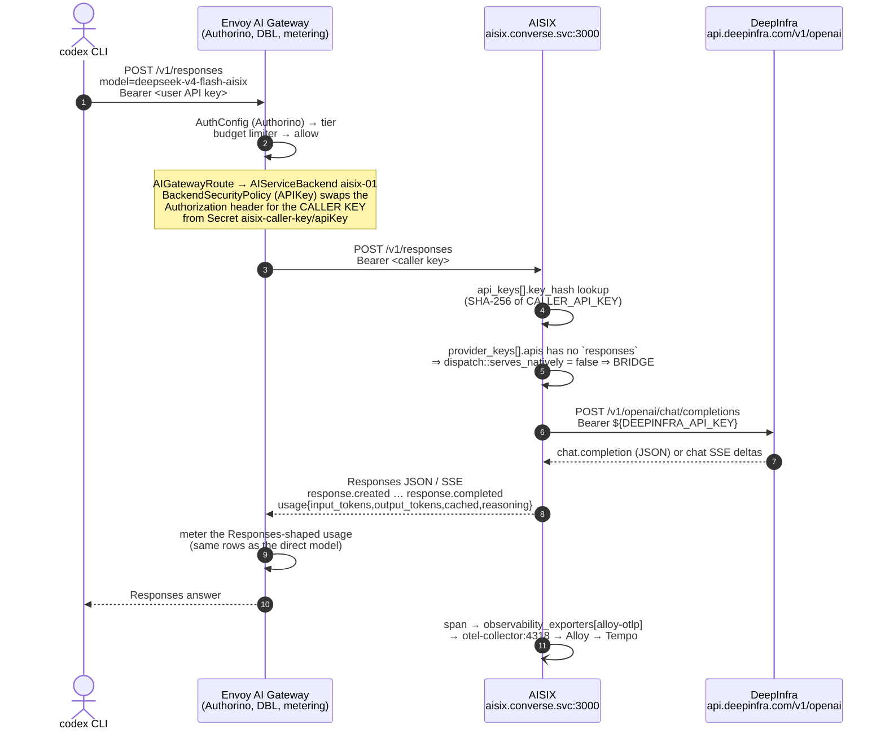
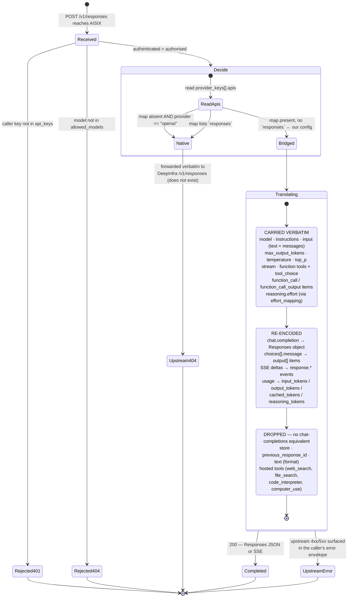

# `aisix` — the Responses→Chat bridge behind Envoy AI Gateway

[api7/aisix](https://github.com/api7/aisix) v1.0.0, deployed as an **upstream
protocol adapter**, not as a gateway. Everything that makes this platform a
platform — Authorino authz, the distributed budget limiter, routing, metering,
the public API plane — stays in Envoy AI Gateway (EAIG). AISIX sits *behind*
EAIG and does exactly one thing: it translates `POST /v1/responses` into
`POST /v1/chat/completions` for an upstream that has no Responses endpoint, and
re-encodes the answer (JSON and SSE) back into Responses shape.

Source of truth for the spike: **[ai-helm-values#380](https://github.com/ADORSYS-GIS/ai-helm-values/issues/380)**.

## Why this exists

Every backend in prod is `schema: OpenAI`, and none of DeepInfra, Fireworks or
the self-hosted vLLM fleet serves `/v1/responses`. So a Responses-API client —
the `codex` CLI, most importantly — gets a 404 from the upstream on every model
we have. Neither gateway in front of them translates:

- **EAIG v1.1** passes `/v1/responses` through to OpenAI/Azure only
  ([supported endpoints](https://aigateway.envoyproxy.io/docs/capabilities/llm-integrations/supported-endpoints/)).
- **Apache APISIX 3.17**'s converter registry holds only
  `anthropic-messages → openai-chat` and embeddings→vertex.
- **AISIX** does, per provider key, in `crates/aisix-proxy/src/responses_bridge.rs`.

## Spike scope

One model (`deepseek-v4-flash-aisix` → DeepInfra
`deepseek-ai/DeepSeek-V4-Flash-0731`), one provider key, one caller key. The
existing `deepseek-v4-flash-0731` model keeps its direct route and is the
**control** for the parity checks. Nothing is cut over; this chart is purely
additive, and rollback is deleting the app entry plus the two values entries.

Out of scope: migrating other backends, replacing EAIG, AISIX Cloud, budgets in
AISIX (our DBL stays), the Anthropic-Messages bridge (it exists; unused here).

## The request path



## What survives the bridge, and what does not



> **`Native` is one deleted line away.** `provider_keys[].apis` is
> *authoritative* for `/v1/responses`: once the map exists, the surface is
> native **only** if `responses` is listed. With the map absent, AISIX falls back
> to the vendor id — and `provider: openai` is then assumed to serve Responses,
> so the request is forwarded and DeepInfra 404s. `apis: {}` in the values file
> is therefore load-bearing, not decoration
> (`crates/aisix-proxy/src/dispatch.rs::serves_natively`).

## How values from `ai-helm-values` become `resources.yaml`

This chart is OCI-mode (`chart: aisix` in `charts/apps/values.yaml`), so ArgoCD
assembles it from two sources: the published chart and a `$values` ref to
`ai-helm-values` `environments/prod/values/aisix.yaml`. The chart owns only the
*frame* of AISIX's resource catalogue — `_format_version: "1"` and the four
collection keys, which AISIX validates as an exhaustive set — and passes the
content through verbatim, so adding a model never needs a chart change.

```
ai-helm-values environments/prod/values/aisix.yaml
  resources.providerKeys[] ──► resources.yaml  provider_keys:
  resources.models[]       ──► resources.yaml  models:
  resources.apiKeys[]      ──► resources.yaml  api_keys:
                               observability_exporters:  ◄── observability.otlp (chart)
```

The values schema, in full:

```yaml
resources:
  providerKeys:
    - display_name: deepinfra-01                       # identity → derived UUIDv5 id
      provider: openai
      adapter: openai
      api_base: https://api.deepinfra.com/v1/openai
      api_key: ${DEEPINFRA_API_KEY}                    # interpolated from the pod env
      apis: {}                                         # ← present, no `responses` ⇒ BRIDGED
  models:
    - display_name: deepseek-v4-flash-aisix            # what EAIG sends after modelNameOverride
      provider: openai
      provider_key: deepinfra-01                       # file-only sugar: name → provider_key_id
      model_name: deepseek-ai/DeepSeek-V4-Flash-0731   # what DeepInfra is asked for
  apiKeys:
    - display_name: eaig
      key_env: CALLER_API_KEY                          # file-only sugar: env var → SHA-256 key_hash
      allowed_models: [deepseek-v4-flash-aisix]
  observabilityExporters: []                           # extra exporters, appended after alloy-otlp
```

Everything under `providerKeys` / `models` / `apiKeys` is AISIX's own schema —
`schemas/resources/*.schema.json` in api7/aisix, plus the file-only sugar
documented in `crates/aisix-core/src/filesource/desugar.rs`. `${VAR}` references
are interpolated from the pod environment at load time, so the rendered
ConfigMap holds no credential.

Credentials arrive as env vars from Secrets that already exist in the namespace:

| env | Secret | data key | owner |
|---|---|---|---|
| `DEEPINFRA_API_KEY` | `deepinfra-api-key-01` | `apiKey` | `charts/ai-models-backends` ExternalSecret (ns `converse`) |
| `CALLER_API_KEY`    | `aisix-caller-key`     | `apiKey` | **this chart** (ESO `Password` generator) |

## The caller key, and how it is shared with the EAIG BackendSecurityPolicy

The credential between EAIG and AISIX exists nowhere else, so there is nothing
to store in AWS Secrets Manager. This chart mints it in-cluster:

```
generators.external-secrets.io/v1alpha1  Password   (length 48, digits 8, symbols 0,
  └─ secretKeys: [apiKey]                             secretKeys → data key `apiKey`)
external-secrets.io/v1  ExternalSecret  aisix-caller-key
  └─ dataFrom[0].sourceRef.generatorRef → that Password
  └─ refreshInterval: "0"
        ▼
Secret converse/aisix-caller-key   data: {apiKey: <48 chars>}
        ├─► this Deployment           env CALLER_API_KEY → api_keys[].key_env → key_hash
        └─► ai-helm-values models.yaml  backend aisix-01:
                securityType: APIKey, secretRef.name: aisix-caller-key
              (the ai-models-backends chart already reads the `apiKey` data key,
               and the backend carries NO `externalSecret:` block — this chart owns
               the Secret, so a second owner would fight it)
```

**`refreshInterval: "0"` — what was actually verified.** The `ExternalSecret`
CRD installed on this cluster (ESO **v2.10.0**) documents the field verbatim as:
*"RefreshInterval is the amount of time before the values are read again from
the SecretStore provider … May be set to `0s` to fetch and create it once.
Defaults to `1h0m0s`."* (`kubectl explain externalsecrets.spec.refreshInterval`).
For a **generator**-backed ExternalSecret this is not a tuning knob: every
refresh re-runs the generator, so a non-zero interval would mint a brand-new
password on a timer and silently invalidate the credential the EAIG
BackendSecurityPolicy is still presenting. `"0"` parses to the same zero
duration as `"0s"`.

**Rotation is therefore explicit** — this is the intended procedure, not a
workaround:

1. `kubectl -n converse delete secret aisix-caller-key`
2. ESO regenerates it on the next reconcile of the ExternalSecret.
3. Restart the AISIX pod (`kubectl -n converse rollout restart deploy/aisix`) —
   `key_env` is read at load time, so a running pod keeps the old hash.
4. EAIG's BackendSecurityPolicy re-reads the Secret; confirm with a request
   through the public plane before considering the rotation done.

`kubectl explain passwords.spec` on this cluster confirms the generator's field
set: `length` and `noUpper` and `allowRepeat` are **required**, with `digits`,
`symbols`, `symbolCharacters`, `encoding` and `secretKeys` optional;
`secretKeys` *"defines the keys that will be populated with generated passwords.
Defaults to `password` when not set"* — which is why it is set to `apiKey` here
instead of bolting a `rewrite` onto the ExternalSecret.

## Listeners and probes

| Port | Listener | Serves |
|---|---|---|
| `3000` | proxy | the OpenAI-compatible surface (`/v1/responses`, `/v1/chat/completions`, `/v1/models`) **and** `/livez`, `/readyz` |
| `9090` | metrics/status | `/metrics` (the only scrape surface), `/status/config`, `/status/ready`, `/status/models` |

The probes are deliberately split across both:

- **startupProbe → `:9090/status/ready`.** 503 until a resource snapshot has been
  applied. Without this gate a pod that has not yet loaded `resources.yaml` would
  pass `/readyz` and 404 every model.
- **readinessProbe → `:3000/readyz`.** Flips to 503 the instant SIGTERM lands
  (`shutdown.min_drain_secs: 30` keeps the listener accepting meanwhile), which
  is what empties the EndpointSlice before the socket closes.
- **livenessProbe → `:3000/livez`.** Answers a different question — *should this
  instance be restarted?* — and deliberately stays 200 through a drain, so it
  must not be the probe that withdraws traffic.

`terminationGracePeriodSeconds: 120` follows AISIX's own sizing note: the tail is
the stream still running at SIGTERM **plus** the one request its connection gets
reused for, because a streamed response commits its head at the first token and
can never carry `Connection: close`.

## Tracing: the `otel-collector` ExternalName alias

AISIX 1.0.0 constrains an `otlp_http` exporter's endpoint in its **canonical**
resource schema:

```
^https://.+|^http://(mock-otlp|otel-collector|127\.0\.0\.1|localhost)(:[0-9]+)?(/.*)?$
```

(`schemas/resources/observability_exporter.schema.json`, generated from the
`#[schemars(regex(...))]` on `OtlpHttpConfig::endpoint`; the file source runs the
same validators as the etcd path and never relaxes them.) Our Alloy OTLP
receiver is plain HTTP at `alloy.observability.svc.cluster.local:4318`, which the
pattern rejects — verified:

```
$ docker run --rm --entrypoint /usr/local/bin/aisix ghcr.io/api7/aisix:1.0.0 \
    validate --resources /r.yaml       # endpoint = http://alloy.observability.svc.cluster.local:4318/v1/traces
resources file /r.yaml: 1 error(s):
  - observability_exporters[0] ("alloy-otlp"): schema validation failed at ``:
    value is not valid under any of the schemas listed in the 'oneOf' keyword
```

So the chart renders an `ExternalName` Service literally named `otel-collector`
in this namespace, aliasing Alloy, and points the exporter at
`http://otel-collector:4318/v1/traces` — which satisfies the regex *and*
resolves. Delete the alias (`observability.otlp.alias.enabled: false`) and set
`observability.otlp.endpoint` directly once upstream relaxes the pattern or an
`https://` collector exists.

Metrics go the normal route: a `PodMonitor` on the `metrics` port, discovered
cluster-wide by Alloy's `prometheus.operator.podmonitors` — the same mechanism
`charts/core-gateway` uses for the Envoy proxies.

## Verification performed against the real binary

```bash
helm lint charts/aisix --strict
helm template aisix charts/aisix -n converse -f charts/aisix/ci/lint-values.yaml
# → extract the resources.yaml ConfigMap, then:
docker run --rm --entrypoint /usr/local/bin/aisix \
  -e DEEPINFRA_API_KEY=… -e CALLER_API_KEY=… -v $PWD/resources.yaml:/r.yaml:ro \
  ghcr.io/api7/aisix:1.0.0 validate --resources /r.yaml
# OK: /r.yaml loaded 4 resource(s)
```

and a full boot of the rendered `config.yaml` + `resources.yaml` under
`--read-only --user 10001:10001`, which reports
`admin.enabled = false — admin surface not bound`, binds both listeners, answers
`/livez` `/readyz` `/status/ready` with 200, and lists the model on
`/v1/models`. See the PR for the transcripts.

## Not verified here

The bridge's **behaviour** against a live DeepInfra key (streaming, tool loop,
metering parity, latency) is the values-side agent's job once both PRs are live
— see the acceptance criteria on
[ai-helm-values#380](https://github.com/ADORSYS-GIS/ai-helm-values/issues/380).
