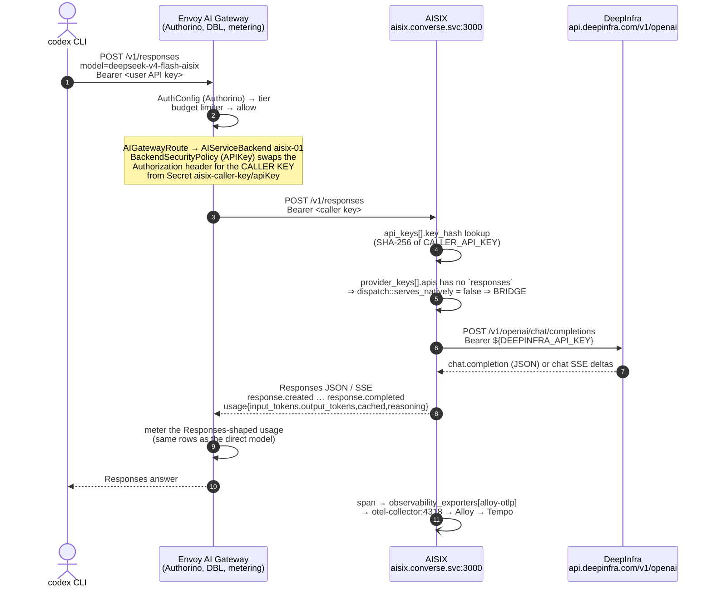
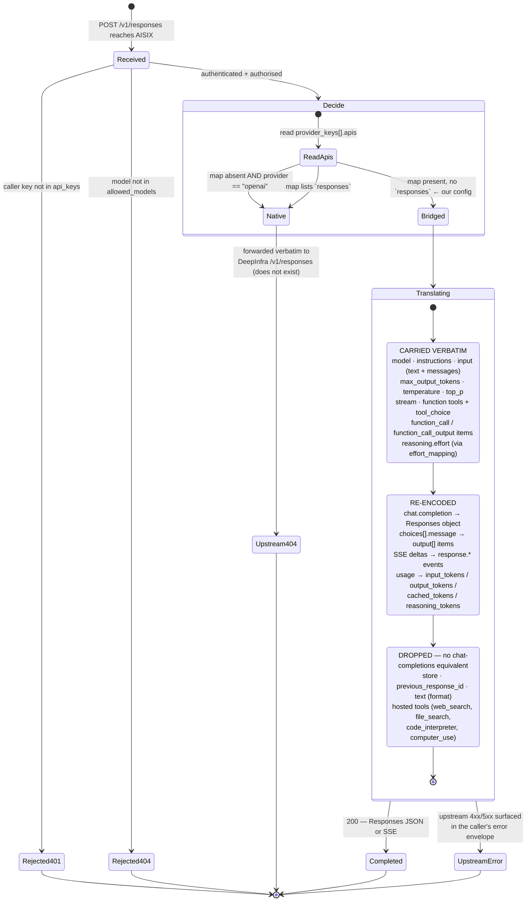
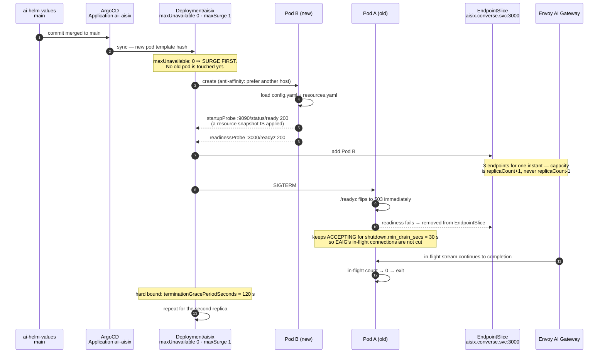
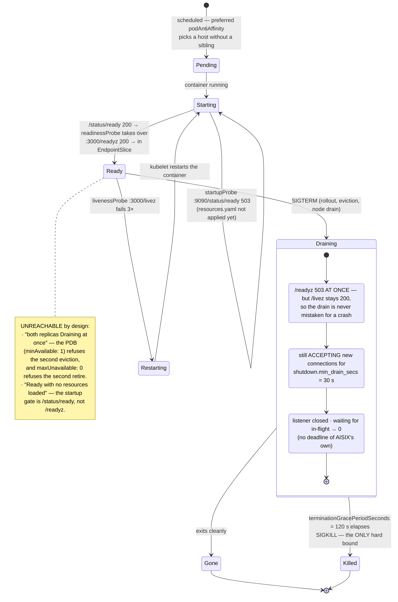

# `aisix` — the Responses→Chat bridge behind Envoy AI Gateway

[api7/aisix](https://github.com/api7/aisix) v1.0.0, deployed as an **upstream
protocol adapter**, not as a gateway. Everything that makes this platform a
platform — Authorino authz, the distributed budget limiter, routing, metering,
the public API plane — stays in Envoy AI Gateway (EAIG). AISIX sits *behind*
EAIG and does exactly one thing: it translates `POST /v1/responses` into
`POST /v1/chat/completions` for an upstream that has no Responses endpoint, and
re-encodes the answer (JSON and SSE) back into Responses shape.

Source of truth for the spike: **[ai-helm-values#380](https://github.com/ADORSYS-GIS/ai-helm-values/issues/380)**.

## Why this exists

Every backend in prod is `schema: OpenAI`, and none of DeepInfra, Fireworks or
the self-hosted vLLM fleet serves `/v1/responses`. So a Responses-API client —
the `codex` CLI, most importantly — gets a 404 from the upstream on every model
we have. Neither gateway in front of them translates:

- **EAIG v1.1** passes `/v1/responses` through to OpenAI/Azure only
  ([supported endpoints](https://aigateway.envoyproxy.io/docs/capabilities/llm-integrations/supported-endpoints/)).
- **Apache APISIX 3.17**'s converter registry holds only
  `anthropic-messages → openai-chat` and embeddings→vertex.
- **AISIX** does, per provider key, in `crates/aisix-proxy/src/responses_bridge.rs`.

## Spike scope

One model (`deepseek-v4-flash-aisix` → DeepInfra
`deepseek-ai/DeepSeek-V4-Flash-0731`), one provider key, one caller key. The
existing `deepseek-v4-flash-0731` model keeps its direct route and is the
**control** for the parity checks. Nothing is cut over; this chart is purely
additive, and rollback is deleting the app entry plus the two values entries.

Out of scope: migrating other backends, replacing EAIG, AISIX Cloud, budgets in
AISIX (our DBL stays), the Anthropic-Messages bridge (it exists; unused here).

## The request path



## What survives the bridge, and what does not



> **`Native` is one deleted line away.** `provider_keys[].apis` is
> *authoritative* for `/v1/responses`: once the map exists, the surface is
> native **only** if `responses` is listed. With the map absent, AISIX falls back
> to the vendor id — and `provider: openai` is then assumed to serve Responses,
> so the request is forwarded and DeepInfra 404s. `apis: {}` in the values file
> is therefore load-bearing, not decoration
> (`crates/aisix-proxy/src/dispatch.rs::serves_natively`).

## How values from `ai-helm-values` become `resources.yaml`

This chart is OCI-mode (`chart: aisix` in `charts/apps/values.yaml`), so ArgoCD
assembles it from two sources: the published chart and a `$values` ref to
`ai-helm-values` `environments/prod/values/aisix.yaml`. The chart owns only the
*frame* of AISIX's resource catalogue — `_format_version: "1"` and the four
collection keys, which AISIX validates as an exhaustive set — and passes the
content through verbatim, so adding a model never needs a chart change.

```
ai-helm-values environments/prod/values/aisix.yaml
  resources.providerKeys[] ──► resources.yaml  provider_keys:
  resources.models[]       ──► resources.yaml  models:
  resources.apiKeys[]      ──► resources.yaml  api_keys:
                               observability_exporters:  ◄── observability.otlp (chart)
```

The values schema, in full:

```yaml
resources:
  providerKeys:
    - display_name: deepinfra-01                       # identity → derived UUIDv5 id
      provider: openai
      adapter: openai
      api_base: https://api.deepinfra.com/v1/openai
      api_key: ${DEEPINFRA_API_KEY}                    # interpolated from the pod env
      apis: {}                                         # ← present, no `responses` ⇒ BRIDGED
  models:
    - display_name: deepseek-v4-flash-aisix            # what EAIG sends after modelNameOverride
      provider: openai
      provider_key: deepinfra-01                       # file-only sugar: name → provider_key_id
      model_name: deepseek-ai/DeepSeek-V4-Flash-0731   # what DeepInfra is asked for
  apiKeys:
    - display_name: eaig
      key_env: CALLER_API_KEY                          # file-only sugar: env var → SHA-256 key_hash
      allowed_models: [deepseek-v4-flash-aisix]
  observabilityExporters: []                           # extra exporters, appended after alloy-otlp
```

Everything under `providerKeys` / `models` / `apiKeys` is AISIX's own schema —
`schemas/resources/*.schema.json` in api7/aisix, plus the file-only sugar
documented in `crates/aisix-core/src/filesource/desugar.rs`. `${VAR}` references
are interpolated from the pod environment at load time, so the rendered
ConfigMap holds no credential.

### Credentials: `envFromSecrets`, and the one that is not in it

Every credential arrives as an environment variable sourced from a Secret that
**already exists** in the namespace. The chart creates no copy of anything, and
the rendered `resources.yaml` ConfigMap holds only `${VAR}` references.

```yaml
envFromSecrets:                       # Secret → env. One entry per UPSTREAM provider.
  - env: DEEPINFRA_API_KEY            #   the variable resources.yaml interpolates
    name: deepinfra-api-key-01        #   the Secret (ns converse, ai-models-backends' ESO)
    key: apiKey                       #   its data key — every backend key uses `apiKey`
env: []                               # literal name/value pairs. NOT for credentials.
```

| env | Secret | data key | owner | where it is configured |
|---|---|---|---|---|
| `DEEPINFRA_API_KEY` | `deepinfra-api-key-01` | `apiKey` | `charts/ai-models-backends` ExternalSecret (ns `converse`) | `envFromSecrets[]` |
| `CALLER_API_KEY`    | `aisix-caller-key`     | `apiKey` | **this chart** (ESO `Password` generator) | `callerKey` — **not** `envFromSecrets` |

**Why the caller key is deliberately outside the list.** `envFromSecrets` is the
list `ai-helm-values` overrides, and it grows to one entry per chat backend once
[ai-helm-values#393](https://github.com/ADORSYS-GIS/ai-helm-values/issues/393)
generates `provider_keys` from `models.yaml` — `<BACKEND>_API_KEY` from
`<backend>-api-key-NN`, ~14 of them. **Helm replaces lists, it never merges
them**, so any values file that sets `envFromSecrets` drops every default entry.
If the caller key lived there, one such file would deploy an AISIX that cannot
authenticate a single request — and it would render, lint and sync perfectly
green on the way. It is therefore wired from `callerKey.{secretName,secretKey,
envName}`, which this chart also owns because it mints that Secret: one owner,
one spelling, one list to override safely.

The Deployment **fails the render**, rather than producing something subtly
wrong, on each of:

| refused | why |
|---|---|
| an `envFromSecrets`/`env` entry named `CALLER_API_KEY` (i.e. `callerKey.envName`) | Kubernetes accepts duplicate env names and silently keeps the last — the failure would be a 401 at request time, not at deploy time |
| any name starting with `AISIX_` | AISIX layers **every** `AISIX_*` variable onto `config.yaml` as a deserialisation override; that is the same mechanism as the service-link trap below, so this would change (or refuse) the gateway's boot config rather than feed `resources.yaml` |
| an `envFromSecrets` entry missing `env`, `name` or `key` | a half-written entry renders a `secretKeyRef` to an empty name, which the API server accepts and the kubelet then fails to mount |

## The caller key, and how it is shared with the EAIG BackendSecurityPolicy

The credential between EAIG and AISIX exists nowhere else, so there is nothing
to store in AWS Secrets Manager. This chart mints it in-cluster:

```
generators.external-secrets.io/v1alpha1  Password   (length 48, digits 8, symbols 0,
  └─ secretKeys: [apiKey]                             secretKeys → data key `apiKey`)
external-secrets.io/v1  ExternalSecret  aisix-caller-key
  └─ dataFrom[0].sourceRef.generatorRef → that Password
  └─ refreshInterval: "0"
        ▼
Secret converse/aisix-caller-key   data: {apiKey: <48 chars>}
        ├─► this Deployment           env CALLER_API_KEY → api_keys[].key_env → key_hash
        └─► ai-helm-values models.yaml  backend aisix-01:
                securityType: APIKey, secretRef.name: aisix-caller-key
              (the ai-models-backends chart already reads the `apiKey` data key,
               and the backend carries NO `externalSecret:` block — this chart owns
               the Secret, so a second owner would fight it)
```

**`refreshInterval: "0"` — what was actually verified.** The `ExternalSecret`
CRD installed on this cluster (ESO **v2.10.0**) documents the field verbatim as:
*"RefreshInterval is the amount of time before the values are read again from
the SecretStore provider … May be set to `0s` to fetch and create it once.
Defaults to `1h0m0s`."* (`kubectl explain externalsecrets.spec.refreshInterval`).
For a **generator**-backed ExternalSecret this is not a tuning knob: every
refresh re-runs the generator, so a non-zero interval would mint a brand-new
password on a timer and silently invalidate the credential the EAIG
BackendSecurityPolicy is still presenting. `"0"` parses to the same zero
duration as `"0s"`.

**Rotation is therefore explicit** — this is the intended procedure, not a
workaround:

1. `kubectl -n converse delete secret aisix-caller-key`
2. ESO regenerates it on the next reconcile of the ExternalSecret.
3. Restart the AISIX pod (`kubectl -n converse rollout restart deploy/aisix`) —
   `key_env` is read at load time, so a running pod keeps the old hash.
4. EAIG's BackendSecurityPolicy re-reads the Secret; confirm with a request
   through the public plane before considering the rotation done.

`kubectl explain passwords.spec` on this cluster confirms the generator's field
set: `length` and `noUpper` and `allowRepeat` are **required**, with `digits`,
`symbols`, `symbolCharacters`, `encoding` and `secretKeys` optional;
`secretKeys` *"defines the keys that will be populated with generated passwords.
Defaults to `password` when not set"* — which is why it is set to `apiKey` here
instead of bolting a `rewrite` onto the ExternalSecret.

## Listeners and probes

| Port | Listener | Serves |
|---|---|---|
| `3000` | proxy | the OpenAI-compatible surface (`/v1/responses`, `/v1/chat/completions`, `/v1/models`) **and** `/livez`, `/readyz` |
| `9090` | metrics/status | `/metrics` (the only scrape surface), `/status/config`, `/status/ready`, `/status/models` |

The probes are deliberately split across both:

- **startupProbe → `:9090/status/ready`.** 503 until a resource snapshot has been
  applied. Without this gate a pod that has not yet loaded `resources.yaml` would
  pass `/readyz` and 404 every model.
- **readinessProbe → `:3000/readyz`.** Flips to 503 the instant SIGTERM lands
  (`shutdown.min_drain_secs: 30` keeps the listener accepting meanwhile), which
  is what empties the EndpointSlice before the socket closes.
- **livenessProbe → `:3000/livez`.** Answers a different question — *should this
  instance be restarted?* — and deliberately stays 200 through a drain, so it
  must not be the probe that withdraws traffic.

`terminationGracePeriodSeconds` and `shutdown.minDrainSecs` are two halves of one
decision and are both set explicitly — see **High availability** below for the
sizing and the render guard that keeps them in the right order.

## High availability

Source of truth: **[ai-helm-values#395](https://github.com/ADORSYS-GIS/ai-helm-values/issues/395)**
(HA + capacity), under epic
[#392](https://github.com/ADORSYS-GIS/ai-helm-values/issues/392).

AISIX is not a cache in front of a working route — for every model that goes
through it, **it is the route**. A Responses-API client has no fallback path to
the upstream. One replica therefore makes a node reboot, an eviction or an
OOM-kill a total outage for that whole surface, which is acceptable for a
one-model spike and not acceptable once ~30 models depend on it.

| knob | default | what it buys |
|---|---|---|
| `replicaCount` | **2** (`values.yaml:35`) | a second copy, so a single pod loss is a capacity event and not an outage |
| `affinity` (unset ⇒ chart default) | preferred `podAntiAffinity` on `kubernetes.io/hostname` (`templates/deployment.yaml:195-206`) | the two replicas land on different workers, so one node reboot cannot take both |
| `podDisruptionBudget` | `enabled: true`, `minAvailable: 1` (`values.yaml:63`) | a node drain / descheduler / autoscaler may evict **one** replica at a time |
| `strategy.rollingUpdate` | `maxUnavailable: 0`, `maxSurge: 1` (`values.yaml:46`) | a deploy surges a new pod to Ready **before** signalling an old one — served capacity never dips below `replicaCount` |
| `shutdown.minDrainSecs` | `30` → `config.yaml` (`templates/configmap-config.yaml:51`) | the retiring pod keeps accepting for 30 s while `/readyz` already 503s, so kubelet can empty the EndpointSlice first |
| `terminationGracePeriodSeconds` | `120` (`values.yaml:273`) | the hard bound: 30 s drain + the in-flight tail |

**Two replicas are a plain horizontal copy, not a consistency problem.** AISIX's
rate limiter, response cache and budget counters are per-process, and none of
them is enabled here — EAIG keeps Authorino authz, the distributed budget
limiter and the metering, deliberately, so there is no second enforcement point
whose counters could disagree with the invoice. The one shared thing is the
ESO-generated `aisix-caller-key` Secret, which both pods read at boot. If AISIX-
side rate limiting is ever switched on it needs `ratelimit.backend: redis`
first, or N replicas enforce N× the configured window (api7/AISIX-Cloud#798,
quoted verbatim in the image's own `/etc/aisix/config.managed.yaml`).

### Preferred, not required, anti-affinity

`requiredDuringSchedulingIgnoredDuringExecution` would look stricter and would
be worse. It makes the second replica permanently `Pending` as soon as the
cluster has fewer schedulable workers than replicas, and — the failure that
actually bites — it **deadlocks the surge step** of a `maxUnavailable: 0`
rollout on a small cluster: the new pod cannot be placed while both old pods
still hold their nodes, and no old pod may be retired until the new one is
Ready. Preferred spreads whenever it can and degrades to co-location rather than
to a stuck deploy.

### Sizing the two shutdown numbers

Both are set explicitly, next to each other in `values.yaml`, because reading
either alone tells you nothing. From api7/aisix's own `config.example.yaml`
(§ Shutdown), whose default for `min_drain_secs` is 30 and which we keep:

- **Floor.** `min_drain_secs` must sit above the detection latency of whatever
  load-balances the instance. Here that is the readiness probe:
  `periodSeconds × failureThreshold = 10 s × 3 = 30 s`. Below it the listener can
  close while kubelet still lists the pod in the EndpointSlice.
- **Bound.** `min_drain_secs` is a *minimum, not a deadline* — after it elapses
  AISIX still waits for the in-flight count to reach zero, with no deadline of
  its own. `terminationGracePeriodSeconds` is the only hard bound, and upstream
  sizes it for **two requests back to back**: the gateway retires a client
  connection with `Connection: close`, which rides on the response *head*, and a
  streamed response commits its head at the first token — so a stream already
  running at SIGTERM can never carry it. That connection returns to the caller's
  pool unmarked and is used once more; only *that* request's head carries the
  header and ends the chain. The tail is the running stream **plus** the one
  reuse.

`120 = 30 + ~90`. The Deployment **fails the render** if
`terminationGracePeriodSeconds <= shutdown.minDrainSecs`
(`templates/deployment.yaml:12-16`): inverted, SIGKILL lands while AISIX is
still deliberately accepting new connections.

### What a rollout actually does

A values change in `ai-helm-values` (a new model, a bumped image tag) or a chart
publish is what triggers this. `kubectl rollout restart` is **not** the intended
mechanism in prod — the GitOps sync is.





**What each guard does NOT cover.** The PDB bounds *voluntary* disruption only;
it cannot save a pod from an OOM-kill or a node that dies, and the eviction API
is not what a rolling update goes through — that is `maxUnavailable: 0`. The
anti-affinity is a scheduling preference, so on a cluster under pressure both
replicas may still share a host. Neither is a substitute for the other, and the
capacity numbers in
[ai-helm-values `docs/runbooks/aisix.md` § "Capacity and HA"](https://github.com/ADORSYS-GIS/ai-helm-values/blob/main/docs/runbooks/aisix.md)
are what say whether a single surviving replica can carry the traffic at all.

> **Token bill:** the AISIX bridge is stateless, so a Responses-API conversation
> bills exactly the same tokens as the equivalent chat-completions conversation
> (measured on the public plane: 32 vs 32 and 18 vs 18 input tokens for the same
> history, 10/3 vs 10/3 single turn). There is no server-side context and no
> prompt-cache discount from DeepInfra (`cached_tokens: 0` on every call).
> Moving to `/v1/responses` buys API compatibility for codex-style clients, not
> a cheaper bill.

## Tracing: the `otel-collector` ExternalName alias

AISIX 1.0.0 constrains an `otlp_http` exporter's endpoint in its **canonical**
resource schema:

```
^https://.+|^http://(mock-otlp|otel-collector|127\.0\.0\.1|localhost)(:[0-9]+)?(/.*)?$
```

(`schemas/resources/observability_exporter.schema.json`, generated from the
`#[schemars(regex(...))]` on `OtlpHttpConfig::endpoint`; the file source runs the
same validators as the etcd path and never relaxes them.) Our Alloy OTLP
receiver is plain HTTP at `alloy.observability.svc.cluster.local:4318`, which the
pattern rejects — verified:

```
$ docker run --rm --entrypoint /usr/local/bin/aisix ghcr.io/api7/aisix:1.0.0 \
    validate --resources /r.yaml       # endpoint = http://alloy.observability.svc.cluster.local:4318/v1/traces
resources file /r.yaml: 1 error(s):
  - observability_exporters[0] ("alloy-otlp"): schema validation failed at ``:
    value is not valid under any of the schemas listed in the 'oneOf' keyword
```

So the chart renders an `ExternalName` Service literally named `otel-collector`
in this namespace, aliasing Alloy, and points the exporter at
`http://otel-collector:4318/v1/traces` — which satisfies the regex *and*
resolves. Delete the alias (`observability.otlp.alias.enabled: false`) and set
`observability.otlp.endpoint` directly once upstream relaxes the pattern or an
`https://` collector exists.

### ⚠️ `svc/otel-collector` is LOAD-BEARING — do not tidy it away

It has no selector, no endpoints of its own, and a name that belongs to no
workload in `converse`. It looks exactly like leftovers. **Deleting it silently
stops AISIX's traces** — the proxy keeps answering 200 and only the sink logs
complain, so nothing pages. It exists solely to satisfy the regular expression
above.

Every alternative was probed against the pinned tag on 2026-09-04, and the
alias is the only one that both validates and works
([ai-helm-values#383](https://github.com/ADORSYS-GIS/ai-helm-values/issues/383)):

| Endpoint | `aisix validate` | Actually delivers? |
|---|---|---|
| `http://alloy.observability.svc.cluster.local:4318/v1/traces` | ❌ rejected at load — and a load error fails the WHOLE resources file, so AISIX would not boot | — |
| `http://alloy:4318/v1/traces` (short name) | ❌ rejected — the allow-list is four literal hosts, not "any short name" | — |
| `https://alloy.observability.svc.cluster.local:4318/v1/traces` | ✅ passes (the regex only looks at the scheme) | ❌ **no** — Alloy's OTLP receiver is plaintext, so every export dies in the TLS handshake |
| `http://localhost:4318/v1/traces` | ✅ passes | ❌ not without adding an OTLP sidecar to this pod — nothing listens on the AISIX pod's own loopback |
| `http://otel-collector:4318/v1/traces` (**this chart**) | ✅ passes | ✅ yes |

The `https://` row is the trap worth spelling out, because `aisix validate` is
green on it: pointed at the plaintext receiver, the sink retries four times and
drops the batch, while the request path is untouched.

```console
WARN aisix_obs::sink::pipeline: sink delivery failed; retrying sink=probe-otlp attempt=1
  delay_ms=200 error=transient sink error: POST https://localhost:4318/v1/traces:
  client error (Connect): received corrupt message of type InvalidContentType
…
WARN aisix_obs::sink::pipeline: sink delivery dropped after retries sink=probe-otlp dropped=1
```

Making that row honest is route 2 of #383 — TLS on Alloy's OTLP receiver — which
`converse-console`, `converse-lci`, the gateway's usage collector and
`authz-budget` all point at in plaintext today. The upstream ask (allow any
in-cluster `http://` endpoint, or gate the check on an "insecure exporters
permitted" flag) is tracked on
[ai-helm-values#399](https://github.com/ADORSYS-GIS/ai-helm-values/issues/399).

## What the telemetry is called

Both names disagree with the rest of the platform, and in both cases the wrong
query returns an empty result and no error — which reads as "tracing never
worked" ([ai-helm-values#389](https://github.com/ADORSYS-GIS/ai-helm-values/issues/389)).

**Traces: `service.name` is `aisix-dp`, and 1.0.0 gives you no way to change it.**
Not a misconfiguration, and not fixable from this chart:

- The `otlp_http` variant of `observability_exporter.schema.json` is
  `additionalProperties: false` and its property set is exactly
  `content_max_bytes`, `content_mode`, `enabled`, `endpoint`, `headers`, `kind`,
  `name`, `sample_rate`. **There is no per-exporter `service_name`.**
- `observability.service_name` in `config.yaml` (which this chart sets to
  `aisix`) names the *tracing/log subsystem*, not the exported resource
  attribute. Proved by running 1.0.0 against a local OTLP receiver with
  `service_name: "probe-svc-name"`: the boot log reads
  `INFO aisix_obs: tracing initialised service=probe-svc-name`, and the very
  next span body carries
  `"resource":{"attributes":[{"key":"service.name","value":{"stringValue":"aisix-dp"}}]}`.

So query Tempo as `{resource.service.name="aisix-dp"}`, and use the span
attribute `aisix.operation` (`responses` | `chat`) to tell bridged traffic from
direct — also verified on that capture. Do **not** "fix" the name by renaming
the Service or `observability.serviceName`: `aisix.converse.svc.cluster.local`
is what the `aisix-01` Backend in `models.yaml` dials.

**Metrics: the PodMonitor renames the port-derived label.** AISIX puts the
request path on almost every series as `endpoint="/v1/responses"` /
`endpoint="/v1/chat/completions"`, and the Prometheus operator sets a target
label of the same name whose value is the port name. The target label wins, so
before this chart's `metricRelabelings` every series in Mimir read
`endpoint="metrics"`. The scrape now keeps the port name as `scrape_endpoint`
and gives `endpoint` back to AISIX — see the long comment in
`templates/podmonitor.yaml` for why it is `metricRelabelings` and not
`relabelings` or `honorLabels`.

Metrics otherwise go the normal route: a `PodMonitor` on the `metrics` port,
discovered cluster-wide by Alloy's `prometheus.operator.podmonitors` — the same
mechanism `charts/core-gateway` uses for the Envoy proxies. The dashboard and
the alert rules that read them live in `charts/observability-dashboards`
(`files/aisix/aisix.json`, rule group `aisix-health`).

> **Token bill:** the AISIX bridge is stateless, so a Responses-API conversation
> bills exactly the same tokens as the equivalent chat-completions conversation
> (measured on the public plane: 32 vs 32 and 18 vs 18 input tokens for the same
> history, 10/3 vs 10/3 single turn). There is no server-side context and no
> prompt-cache discount from DeepInfra (`cached_tokens: 0` on every call).
> Moving to `/v1/responses` buys API compatibility for codex-style clients, not
> a cheaper bill.

## `enableServiceLinks: false` is not optional

AISIX's config loader layers **every** `AISIX_*` environment variable on top of
`config.yaml` as a deserialisation override — that is the documented mechanism,
and it is why the image's own entrypoint has to `unset AISIX_CONFIG_PATH` before
exec'ing the binary. Kubernetes' legacy docker-link service variables inject
exactly that shape for every Service in the namespace, and this chart's Service
is named `aisix`, so the pod would get `AISIX_PORT=tcp://10.x.x.x:3000`,
`AISIX_SERVICE_HOST`, `AISIX_PORT_3000_TCP`, … The loader reads `AISIX_PORT` as a
top-level field `port`, which does not exist, and the process refuses to boot:

```
Error: config load failed: failed to load configuration: deserialize:
unknown field `port`, expected one of `etcd`, `resources_file`, `proxy`, `admin`,
`observability`, `cache`, `ratelimit`, `upstream`, `downstream`, `shutdown`,
`managed`, `bedrock_endpoint_url`
```

(Observed live on the first ArgoCD sync — it does not reproduce under
`docker run`, which injects no service links.) The Deployment therefore sets
`enableServiceLinks: false`. Nothing here consumes those variables; every
upstream is addressed by DNS. Renaming the Service is not an alternative — the
EAIG Backend depends on `aisix.converse.svc.cluster.local`.

## Verification performed against the real binary

```bash
helm lint charts/aisix --strict
helm template aisix charts/aisix -n converse -f charts/aisix/ci/lint-values.yaml
# → extract the resources.yaml ConfigMap, then:
docker run --rm --entrypoint /usr/local/bin/aisix \
  -e DEEPINFRA_API_KEY=… -e CALLER_API_KEY=… -v $PWD/resources.yaml:/r.yaml:ro \
  ghcr.io/api7/aisix:1.0.0 validate --resources /r.yaml
# OK: /r.yaml loaded 4 resource(s)
```

and a full boot of the rendered `config.yaml` + `resources.yaml` under
`--read-only --user 10001:10001`, which reports
`admin.enabled = false — admin surface not bound`, binds both listeners, answers
`/livez` `/readyz` `/status/ready` with 200, and lists the model on
`/v1/models`. See the PR for the transcripts.

## Not verified here

The bridge's **behaviour** against a live DeepInfra key (streaming, tool loop,
metering parity, latency) is the values-side agent's job once both PRs are live
— see the acceptance criteria on
[ai-helm-values#380](https://github.com/ADORSYS-GIS/ai-helm-values/issues/380).
