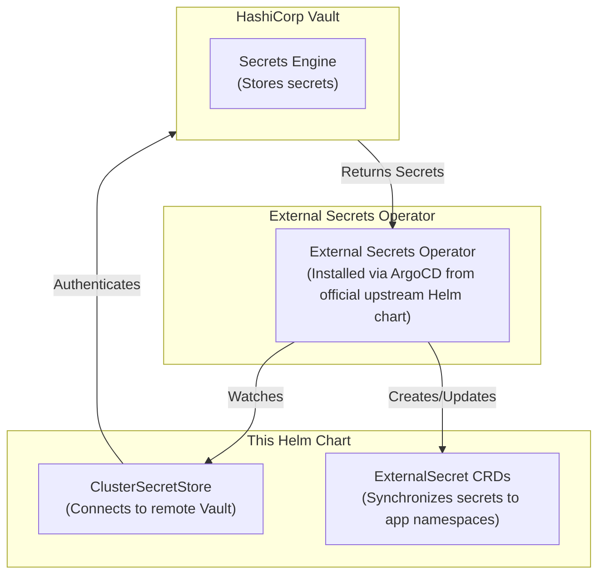
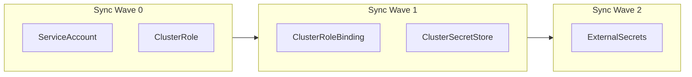

# External Secrets Configuration Chart

This Helm chart configures External Secrets Operator (ESO) for the AI platform. It provides:

- ClusterSecretStore for HashiCorp Vault integration
- ExternalSecret resources for application secret synchronization

**Note:** This chart does NOT install the ESO operator. The operator is installed separately from the official upstream Helm chart.

## Prerequisites

- External Secrets Operator must be installed (see `charts/apps/values.yaml`)
- Kubernetes cluster with ArgoCD
- Access to a HashiCorp Vault instance (remote or in-cluster)
- **Namespace `external-secrets-system` must be created manually before deploying this chart**

## Installation

This chart is deployed via ArgoCD as part of the apps umbrella chart. See `charts/apps/values.yaml` for the Application configuration.

### Manual Namespace Creation

```bash
kubectl create namespace external-secrets-system
```

## Configuration

### Values

| Parameter | Description | Default |
|-----------|-------------|---------|
| `namespace.name` | Namespace name | `external-secrets-system` |
| `clusterSecretStore.enabled` | Enable ClusterSecretStore | `true` |
| `clusterSecretStore.name` | ClusterSecretStore name | `bootstrap-secrets` |
| `clusterSecretStore.syncWave` | ArgoCD sync wave | `"1"` |
| `clusterSecretStore.vault.server` | Vault server URL (required) | `""` |
| `clusterSecretStore.vault.path` | Vault secrets engine path | `secret` |
| `clusterSecretStore.vault.version` | Vault secrets engine version | `v2` |
| `clusterSecretStore.vault.namespace` | Vault namespace (Enterprise) | `""` |
| `clusterSecretStore.vault.auth.kubernetes.mountPath` | Kubernetes auth mount path | `kubernetes` |
| `clusterSecretStore.vault.auth.kubernetes.role` | Kubernetes auth role (required) | `""` |
| `externalSecretsConfig.syncWave` | ArgoCD sync wave for ExternalSecrets | `"2"` |
| `externalSecrets` | ExternalSecret definitions | `{}` |

### Vault Configuration

This chart connects to a HashiCorp Vault instance for secret management. Configure the connection in your values:

```yaml
clusterSecretStore:
  enabled: true
  name: bootstrap-secrets
  vault:
    # Vault server URL (required)
    # For external Vault: https://vault.example.com:8200
    # For in-cluster Vault: https://vault.vault.svc.cluster.local:8200
    server: "https://vault.example.com:8200"
    
    # Secrets engine path
    path: secret
    
    # Secrets engine version (v1 or v2)
    version: v2
    
    # Authentication method
    auth:
      kubernetes:
        # Kubernetes auth mount path
        mountPath: kubernetes
        # Role configured in Vault (required)
        role: "external-secrets"
```

### Authentication Methods

#### Kubernetes Authentication (Recommended)

For in-cluster workloads, use Kubernetes authentication:

```yaml
clusterSecretStore:
  vault:
    server: "https://vault.vault.svc.cluster.local:8200"
    auth:
      kubernetes:
        mountPath: kubernetes
        role: "external-secrets"
```

#### Token Authentication

For external Vault or static token authentication:

```yaml
clusterSecretStore:
  vault:
    server: "https://vault.example.com:8200"
    auth:
      token:
        secretName: vault-token
        namespace: external-secrets-system
        key: token
```

### Adding ExternalSecrets

To add a new ExternalSecret, add it to the `externalSecrets` section in values.yaml:

```yaml
externalSecrets:
  my-api-key:
    namespace: my-app-namespace
    secretName: my-api-key
    refreshInterval: 1h
    data:
      - secretKey: api-key
        remoteRef:
          key: my-app/my-api-key
          property: api-key
```

## Vault Setup Requirements

Before using this chart, ensure your Vault instance is configured:

1. **Enable Kubernetes Auth Method** (if using Kubernetes auth):
   ```bash
   vault auth enable kubernetes
   ```

2. **Configure Kubernetes Auth Role**:
   ```bash
   vault write auth/kubernetes/role/external-secrets \
     bound_service_account_names=external-secrets-bootstrap \
     bound_service_account_namespaces=external-secrets-system \
     policies=external-secrets \
     ttl=1h
   ```

3. **Create Policy for Secrets Access**:
   ```bash
   vault policy write external-secrets - <<EOF
   path "secret/data/*" {
     capabilities = ["read"]
   }
   path "secret/metadata/*" {
     capabilities = ["list"]
   }
   EOF
   ```

## Architecture



### Deployment Order (ArgoCD Sync Waves)



## Related Documentation

- [Secret Management Documentation](../../docs/secret-management/README.md)
- [Bootstrap Secrets Inventory](../../docs/secret-management/bootstrap-secrets-inventory.md)
- [Reference Patterns](../../docs/secret-management/reference-patterns.md)