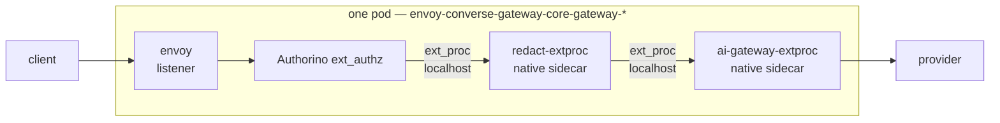

# ADR-0116: PII redaction as an Envoy `ext_proc` filter

**Status:** Accepted
**Date:** 2026-08-02
**Deciders:** @stephane-segning
**Supersedes:** [ADR-0113](0113-redaction-front-proxy-not-ext-proc.md)

## Context

[ADR-0113](0113-redaction-front-proxy-not-ext-proc.md) chose a front proxy
over an `ext_proc` filter. Its central argument was availability, stated
plainly in its own Context: `censgate/redact` "ships `redact-gateway`, a
standalone OpenAI-compatible proxy, **not just the traversal library the
original spec assumed**." A working proxy binary existed; an `ext_proc`
processor would have had to be written. The front proxy was the cheap option
and `ext_proc` the expensive one.

Hours later, [ADR-0115](0115-first-party-redaction-engine.md) rejected
`censgate/redact` outright — its only published image could not execute on
any host — and we wrote the engine ourselves. ADR-0113's alternatives
section had rejected exactly that ("**Writing a first-party redaction
engine** — rejected outright"), so by the time ADR-0115 landed, ADR-0113's
premise had already been reversed underneath it.

**Nobody re-examined the shape.** With `pii` as a library and
`crates/governance-redact` as our own code, an `ext_proc` server was never
harder to write than an axum proxy — it is the same engine behind a
different transport. The front proxy survived on the strength of an argument
that no longer applied to anything.

Operating the canary then surfaced the costs of the shape directly. A front
proxy sits **before** Authorino, so it must relay a credential it does not
own and cannot interpret. Two consequences showed up within an hour of real
use: a 401 from Authorino was indistinguishable, from the client's side,
from the proxy rejecting the request itself; and the proxy dropped the
upstream response headers, including the `WWW-Authenticate` challenge that
RFC 7235 requires on a 401 and the `x-ext-auth-reason` that explained the
failure. Neither is unfixable. Both are taxes paid for standing outside the
filter chain, and neither exists for a filter running inside it after
authentication.

The positioning risk ADR-0113 cited as its main counter-argument is real but
smaller than it looked, and is now measurable rather than hypothetical. On
the live cluster (verified 2026-08-02, EG **v1.8.2**, Envoy
**distroless-v1.38.3**):

- `envoyextensionpolicies.gateway.envoyproxy.io` is installed — `ext_proc` is
  a first-class, supported EG mechanism here, not a patch.
- `envoypatchpolicies.gateway.envoyproxy.io` is installed — the escape hatch
  if declarative ordering proves insufficient. This repo has used
  `EnvoyPatchPolicy` before (ADR-0039).
- The `EnvoyExtensionPolicy` CRD exposes `extProc[]` with `backendRefs`,
  `processingMode`, `messageTimeout`, `failOpen` and `backendSettings`, and
  **no ordering field** — position relative to AIEG's own processor is not
  declaratively expressible, and must be verified against Envoy's
  `config_dump` rather than assumed.

Nothing in production routes through the redaction canary, so the cost of
changing shape now is a deleted binary, not a migration.

## Decision

**Run redaction as an Envoy `ext_proc` filter inside the gateway's filter
chain, and delete the front proxy.**

- **The processor runs as a native sidecar in the Envoy pod, not as a
  separate Deployment.** This is not a novel topology — it is the one AIEG
  already uses. Verified live 2026-08-02: the gateway pod runs `envoy` +
  `shutdown-manager` as containers and **`ai-gateway-extproc:v1.0.0` as an
  `initContainer` with `restartPolicy: Always`** — a Kubernetes native
  sidecar, supported on this cluster (**v1.35.3+k3s1**). We add a second
  sidecar beside it and speak ext_proc over localhost.
- **Attachment point is a template this repo already owns**:
  `charts/core-gateway/templates/envoy-proxy.yaml`, whose
  `provider.kubernetes.envoyDeployment` block already configures `container`
  and `pod`. The CRD exposes `initContainers` and `patch` alongside them.
- **The engine is unchanged.** `crates/governance-redact` — profiles, the
  first-party secret pack, the payload walker, the streaming logic and its
  41 tests — is transport-agnostic and moves across untouched. Only the
  transport is replaced.
- **`app/redact-extproc`** implements
  `envoy.service.ext_proc.v3.ExternalProcessor` over gRPC, replacing
  `app/redact-gateway`.

⚠️ **Sidecar topology does not answer the ordering question.** Filter order
is filter-chain configuration, not pod layout; two sidecars in one pod say
nothing about which processor sees the body first.

**Ordering is now measured, and it constrains us** (this is spike
[#874](https://github.com/ADORSYS-GIS/ai-helm/issues/874), answered). EG
v1.8.2 assigns each filter type a fixed order in
`internal/xds/translator/httpfilters.go`:

| Filter | Order |
|---|---|
| ExtAuthz (Authorino) | `5` |
| JWT | `9` |
| Lua (ADR-0111's billing marker) | `12 + index` |
| **ExtProc (ours)** | **`100 + index`** |
| RateLimit | `303` |

The live `config_dump` shows `ext_proc/aigateway` at **position 0**, ahead of
`ext_authz` — AIEG's processor is not ordered by that table at all; the AI
Gateway inserts it at the front. So:

- ✅ Our filter runs **after** Authorino (`100 > 5`), so identity is
  established and the ADR-0011 `x-oidc-*` headers are present. This ADR's
  premise holds.
- ✅ Redaction still precedes the upstream call — the router sorts last, so
  no provider sees unredacted content.
- ❌ **A user-defined ExtProc cannot be ordered before AIEG's processor.**
  100 versus <5 is not configurable; only an `EnvoyPatchPolicy` could move
  it. ADR-0113 was right that positioning was unresolved, and wrong that a
  front proxy was the remedy.

**Why that is acceptable here, and the condition under which it stops being
acceptable.** AIEG's processor may rewrite the request body when it
translates between API schemas, and our payload walker only understands
OpenAI shapes. Verified on the live fleet 2026-08-02: **all 15
`AIServiceBackend`s declare `schema.name: OpenAI` and no `AIGatewayRoute`
declares an input schema — there is no non-OpenAI schema anywhere.** Even
`claude-sonnet-5` resolves to `deepinfra-backend-01/02-svc`, i.e. Claude via
an OpenAI-compatible API rather than Anthropic's native one. AIEG therefore
performs no cross-schema translation today, and the post-AIEG body is still
the shape `payload.rs` walks.

⚠️ **This is a live-state fact, not a guarantee.** The first backend added
with `schema.name: AWSBedrock`, `AzureOpenAI` or an Anthropic-native schema
makes AIEG rewrite the body before our filter sees it. The walker then finds
no recognised fields, `scanned_fields == 0`, and the request is forwarded
**uninspected** — no error, no crash, just unredacted traffic. That makes
`redact_uninspected_bodies_total` a load-bearing alert rather than a
diagnostic, and argues for a catalogue check (in the shape of
`tools/check-model-catalogs.sh`) that fails when a non-OpenAI schema
appears.

⚠️ **First implementation check — does declaring `initContainers` on our
`EnvoyProxy` displace AIEG's injected sidecar?** AIEG injects
`ai-gateway-extproc` into the same list we would be writing. Lists replace
wholesale in the merge semantics this platform keeps getting caught by (the
ARC runner `command` that silently vanished; the `mcps` valuesObject cases),
and losing AIEG's processor would take model routing, token counting and
cost attribution with it. Verify the rendered Deployment carries **both**
sidecars before anything else; if the list merges destructively, use
`envoyDeployment.patch` instead of `initContainers`.
- **`processingMode` is set explicitly** for request and response bodies. The
  CRD's documented default is that *neither headers nor body are sent to the
  processor* — a policy that omits it yields a filter that is attached,
  healthy, and inspecting nothing. This is a silent-no-op default and is
  called out here because it is exactly the failure this platform keeps
  hitting (ADR-0109's YAML-boolean trap; the `MAX_BODY_BYTES` float; the
  phone threshold set above its recognizer's fixed score).
- **`failOpen: false`**, matching decision 10 of the governance roadmap and
  the engine's own `fail_closed` profiles. Fail-closed at both layers.
- **Ordering is verified, not assumed** — the acceptance evidence for the
  implementation is our filter appearing before AIEG's processor in the live
  `config_dump`, not a passing render.

**Hard cutover.** `app/redact-gateway`, `charts/redact-gateway` and the
`redact-gateway` entry in `charts/apps/values.yaml` are deleted in the same
change that lands the filter. No dormant parallel path, no feature gate.

## Consequences

**Positive**
- No credential relayed and no hop before authentication. The filter runs
  after Authorino, so identity is already established and the ADR-0011
  `x-oidc-*` headers are available to the processor rather than being
  something it must avoid disturbing.
- No response-header rewriting, so no RFC 7235 violation and no lost
  `x-ext-auth-reason`.
- **The sidecar topology removes the network path entirely**, not just a
  hop: no ClusterIP Service, no `CiliumNetworkPolicy`, no cross-pod TLS and
  no internal-CA trust store to mount — every one of which the front proxy
  needed, and one of which (the Cilium post-DNAT port) already cost an
  outage window on this component. Localhost also buys back most of the
  200 ms `messageTimeout` for actual scanning.
- Lifecycle is coupled to the gateway: the processor scales with the data
  plane's HPA and cannot be independently absent while routes reference it.
- Per-route policy becomes expressible — `EnvoyExtensionPolicy` targets a
  route, so redaction can differ per model or per plane without a second
  deployment. The front proxy could only ever apply one profile to whatever
  was pointed at it.

**Negative**
- **Streaming is materially harder, and this is the real cost.** As a front
  proxy we buffer the entire SSE response and scan it whole, which is what
  guarantees an entity split across two chunks is still caught. In
  `ext_proc`, bodies arrive as chunks against a `messageTimeout` that
  defaults to **200 ms**, so full-response buffering fights the filter's
  design. Expect the streaming path to need a hold-back window sized above
  the longest entity we must catch, and expect that to weaken the
  completeness guarantee buffered mode gave us for free.
- `ext_proc` failures are now gateway failures. `failOpen: false` means a
  broken or overloaded processor breaks the routes it is attached to, and
  the blast radius is the route, not one proxy's clients.
- We own an `ext_proc` protocol implementation, including its version
  compatibility with EG/Envoy, where before we owned plain HTTP.
- The 200 ms `messageTimeout` is a hard per-message budget the front proxy
  never had. Regex and validator recognizers are comfortably inside it; an
  NER model would not be, which constrains the separate NER service
  (ADR-0115) to an out-of-band shape.

**Neutral / follow-ups**
- [ai-helm#874](https://github.com/ADORSYS-GIS/ai-helm/issues/874), the
  filter-ordering spike, stops being a decision gate and becomes the first
  implementation step: read `config_dump`, confirm position, use
  `EnvoyPatchPolicy` only if the declarative attachment is insufficient.
- Cutting real client traffic over remains separate, reviewed work. This ADR
  changes the shape of the mechanism, not its rollout.

## Alternatives considered

- **Keep the front proxy and fix its two defects** (forward upstream
  response headers; document that 401s originate at Authorino). Cheap, and
  it leaves a working canary alone. Rejected: it preserves an extra
  pre-authentication hop whose only remaining justification — that the
  binary already existed — is false, and keeps paying the per-hop cost
  indefinitely to avoid a one-time transport rewrite while nothing depends
  on it.
- **Both shapes behind a flag**, front proxy default, `ext_proc` opt-in.
  Rejected on standing house rule: no dormant code behind a default-off
  gate. If `ext_proc` is right, it is the live path.
- **Fork the AI Gateway controller** to guarantee ordering — ADR-0113's
  feared fallback. Not needed unless `config_dump` shows the declarative
  attachment lands in the wrong position *and* `EnvoyPatchPolicy` cannot
  correct it. Deliberately not pre-emptively adopted.

## Related

- Supersedes: [ADR-0113](0113-redaction-front-proxy-not-ext-proc.md)
- Engine decision (unaffected): [ADR-0115](0115-first-party-redaction-engine.md)
- Epic: [ADORSYS-GIS/ai-helm#873](https://github.com/ADORSYS-GIS/ai-helm/issues/873)
- Ordering, now an implementation step: [ADORSYS-GIS/ai-helm#874](https://github.com/ADORSYS-GIS/ai-helm/issues/874)
- Engine crate: `lightbridge-governance` `crates/governance-redact`
- Replaces: `app/redact-gateway`, `charts/redact-gateway`
