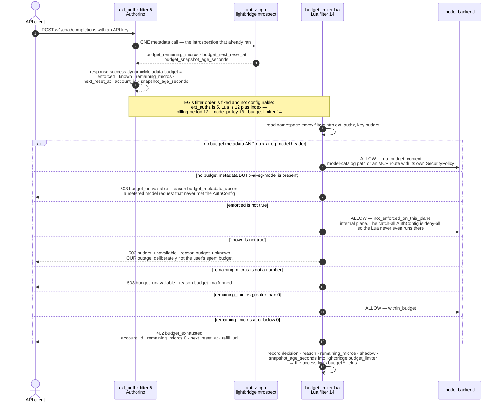

# ADR-0137: The budget limiter refuses in Lua, because Authorino's denial status is one constant per AuthConfig

- Status: **Accepted — enforcing in prod since 2026-09-04T19:41Z**
- Date: 2026-09-03 (amended 2026-09-03 — the gopher-lua control-plane runtime; amended
  2026-09-04 — the balance moved onto the existing introspection, one metadata call per request,
  and this filter did not have to change; amended again 2026-09-04 — **shadow 16:21Z, enforcing
  19:41Z; the decision this ADR proposed is now the deployed one**, see the last section)
- Deciders: @stephane-segning
- Source of truth: [lightbridge-authz#658](https://github.com/ADORSYS-GIS/lightbridge-authz/issues/658)
  (the decision memo) and **lightbridge-authz ADR-0034** (`docs/adr/0034-dynamic-budget-limiter.md`
  in that repo), which owns the design end to end. This ADR records only the gateway-side decision
  and the evidence behind it.
- Builds on: [ADR-0111](./0111-calendar-aligned-billing-period.md) (the billing-period Lua and the
  one-EnvoyExtensionPolicy-per-targetRef constraint), [ADR-0133](./0133-enforce-model-allowlist-in-a-gateway-lua-filter.md)
  (the same filter, the same `pcall` guard, the same harness shape), [ADR-0116](./0116-redaction-as-ext-proc.md)

## Context

A budget refill changes the ledger and nothing else: the gateway enforces two static Envoy
rate-limit rules whose limits come from Helm values, and no rule keys on anything a refill moves.
lightbridge-authz ADR-0034 fixes that by having Authorino ask `authz-budget` for the account's
**live** balance (an AuthConfig `metadata` step against a new mTLS-only
`GET /budget/v1/remaining`) and publish it as ext_authz **dynamic metadata**.

That leaves one gateway-side question: **who turns "remaining <= 0" into a 402?**

The obvious answer — and the one asked for explicitly — is Authorino itself: an `authorization`
rule on the metadata result, plus `response.unauthorized` returning 402 with a CEL-built JSON body.
It was evaluated against the **deployed** CRD, not upstream source.

## Evidence, from the running cluster (2026-09-03)

```console
$ kubectl -n authorino-system get deploy authorino-operator \
    -o jsonpath='{.spec.template.spec.containers[*].image}'
quay.io/kuadrant/authorino-operator:v0.23.1

$ kubectl -n converse-gateway get deploy kuadrant-policies-main \
    -o jsonpath='{.spec.template.spec.containers[*].image}'
quay.io/kuadrant/authorino:v0.24.0

$ kubectl explain authconfigs.spec.response.unauthorized \
    --api-version=authorino.kuadrant.io/v1beta3
FIELDS:
  body    <Object>     HTTP response body to override the default denial body.
  code    <integer>    HTTP status code to override the default denial status code.
  headers <map[string]Object>
  message <Object>

$ kubectl explain authconfigs.spec.response.unauthorized.body \
    --api-version=authorino.kuadrant.io/v1beta3
FIELDS:
  expression <string>   A Common Expression Language (CEL) expression ...
  selector   <string>   Simple path selector ...
```

So `body`, `message` and `headers` **are** per-request expressions — the 402 body the design wants
is natively expressible. `code` is a **plain `<integer>`**: not a `ValueOrSelector`, no
`expression`, no `selector`. It is one constant for the whole AuthConfig, and Authorino has exactly
one `response.unauthorized` per AuthConfig (no per-rule denial spec).

The prod `main` AuthConfig already denies for **four** unrelated reasons, all of which return 403
today and must keep doing so (`ai-helm-values/environments/prod/values/security-policies.yaml`):

| Rule | Denies when | Correct status |
|---|---|---|
| `repo-binding-allowed` | a GitHub token's repo is not bound | 403 |
| `keycloak-requires-email` | a `client_credentials` token reaches the human plane | 403 |
| `lightbridge-key-active` | the presented API key has been revoked | 403 |
| `lightbridge-model-allowed` | `model_policy: deny_all` / an unrecognised value | 403 |

Setting `code: 402` to make budget exhaustion a 402 turns *"your key was revoked"* and *"that model
is not allowed for this project"* into `402 Payment Required`. That is not cosmetic: 402 is the
status every client will be taught to read as "top up and retry", and it would then fire on
conditions no payment can fix. The AuthConfig is selected by Host and the hosts are fixed, so there
is no second AuthConfig to put the budget rule in.

While confirming the above, one more deployed-CRD fact settled a contradiction the values repo
carries in a comment:

```console
$ kubectl explain authconfigs.spec.metadata.http.timeout \
    --api-version=authorino.kuadrant.io/v1beta3
error: field "timeout" does not exist
```

`security-policies.yaml`'s note (*"authorino.kuadrant.io/v1beta3 has NO metadata.http.timeout
field"*) is **correct for v0.24.0**; upstream `main`'s Go types are ahead of the deployed release.
The budget metadata call therefore cannot bound its own latency, and must be bounded at the
`SecurityPolicy`'s `extAuth` instead.

## Decision

**The refusal is issued by a Lua filter on this Gateway, and Authorino adds no new `authorization`
rule.** Authorino does identity, the existing authorization rules, the `metadata` call and the
`dynamicMetadata` export; `charts/core-gateway/files/budget-limiter.lua` reads the metadata and owns
the status code.

Concretely:

- **A third `lua` entry** on the single `EnvoyExtensionPolicy` this Gateway may have (ADR-0111's
  header note; a second policy on the same targetRef is rejected `Conflicted` and silently never
  attaches). Filter order is `12 + index`, so: billing-period 12, model-policy 13, budget-limiter
  14 — all after ext_authz (5), which is what publishes the metadata.
- **Gated on `budgetLimiter.enabled`, default `false`.** With the default, the block renders
  nothing; prod's rendered manifests are unchanged except the chart-version label.
- **`budgetLimiter.shadowMode` defaults to `true`.** The filter computes and records its decision on
  every request and refuses nothing. Enforcement must be an explicit value in the values repo, never
  something a chart default can do on a promotion. The shipped `.lua` makes the same choice when its
  config table is missing entirely, and the harness proves it.
- **`extAuth.failOpen` becomes settable** on `SecurityPolicy` (rendered only when explicitly set, so
  the default output is unchanged). It has always been `false` by omission; the values repo now
  *asserts* it, because the value of this enforcement evaporates if a slow Authorino means "allow".

**Revisit this the day Authorino makes `code` a `ValueOrSelector`, or adds per-rule denial specs.**
The native path is strictly simpler and the Lua should be deleted for it. The exact YAML is kept in
lightbridge-authz ADR-0034 §14 so that change is a copy-paste, not a redesign.

## Consequences

- **Good.** The four existing denials keep their correct 403. The 402 carries a per-request JSON
  body (account id, `next_reset_at`, refill URL) built in the filter, which the native path could
  also have done. `pcall` converts Envoy's fail-**open** Lua-error default into a refusal, and
  `tests/budget-limiter/run.sh` proves the guard is load-bearing by running an unguarded copy on its
  own listener.
- **Bad.** Enforcement logic now lives in two places on this Gateway (model policy and budget), both
  in Lua, both dependent on Authorino having run first. That dependency is structural (EG's fixed
  filter order), not conventional, but it is still a coupling a reader has to know about.
- **Bad.** A Lua filter is harder to observe than an Authorino rule: decisions land in the
  `lightbridge.budget_limiter` dynamic-metadata namespace rather than in Authorino's own metrics.
  Shadow mode's whole output is that namespace, so it has to be scraped deliberately.

## Verification

`tests/budget-limiter/run.sh` replays the shipped `.lua` byte-for-byte through
`envoyproxy/envoy:distroless-v1.38.3` — the image the prod data plane runs — across five listeners
(enforce, shadow, no-config, fault-injected, fault-injected-with-the-guard-removed), with a fake
metadata source standing in for Authorino. 18/18 pass. See that script's header for what each
listener proves.

## Amendment, 2026-09-03: a Lua filter has to satisfy TWO runtimes, and only one of them is Envoy

Shadow mode was enabled (ai-helm-values#366) and the gateway answered `500` at ~20/min within a
minute, twice. Rolled back in ai-helm-values#367; recorded in ai-helm-values#368.

The access-log row said everything and named nothing:

```text
response_code                      500
response_code_details              direct_response      ← a ROUTE answered, not a filter
response_flags                     -
upstream_transport_failure_reason  -
budget_decision                    -                    ← record() never ran
```

`direct_response` is `StreamInfo::ResponseCodeDetails::DirectResponse` — the router serving a route
whose action is a direct response. No Lua filter produced it. `kubectl logs … -c envoy | grep -i
lua` was empty for the same reason: **Envoy never loaded the script at all.**

**Envoy Gateway executes an inline `lua` entry in its own controller before it ever reaches the data
plane.** `internal/gatewayapi/luavalidator` runs the script in gopher-lua against mock stream
handles, with `envoy_on_request(StreamHandle)` appended; `LuaValidation: Strict` is the default and
this chart does not set `EnvoyProxy.spec.luaValidation`. Its `security.lua` sandbox **nils**
`rawget`, `rawset`, `setmetatable`, `getmetatable`, `load`, `loadstring`, `require`, `dofile`,
`loadfile`, `package`, `debug` — and `_G`.

`budget-limiter.lua` opened with `local CONFIG = rawget(_G, "BUDGET_LIMITER_CONFIG") or {}`, a
defensive read against a metatable that Envoy's Lua filter does not put on the global table. Under
the sandbox it is `nil(nil, "…")`:

```text
Lua: validation failed for lua body in policy with name
  envoyextensionpolicy/envoy-gateway-system/core-gateway-billing-period/lua/2:
  failed to validate with envoy_on_request: <string>:71: attempt to call a non-function object
```

And the blast radius is the whole Gateway, not the one filter —
`internal/gatewayapi/envoyextensionpolicy.go`:

> *Lua extension doesn't have a fail open option, so fail the route if there is a lua error*

every route on the targeted Gateway gets `DirectResponse{StatusCode: 500}`. Public plane and
internal plane alike; the internal plane was simply the chattiest caller in the sample.

**The bisect that settled it** (`egctl x translate v1.8.2` over the chart rendered at the incident's
own prod values, one axis per landed PR):

| | access-log fields absent | access-log fields present (#1097) |
|---|---|---|
| **third `lua` entry absent** | `Accepted: True`, no 500 | `Accepted: True`, no 500 |
| **third `lua` entry present (#1095)** | `Accepted: False`, route → 500 | `Accepted: False`, route → 500 |

#1097's four `%DYNAMIC_METADATA(lightbridge.budget_limiter:…)%` operators are **not** implicated in
either direction. The two PRs shared one values gate (`budgetLimiter.enabled`), which is the only
reason they were ever confounded.

### What changed

- The line is a plain global read. Envoy's Lua filter puts no `__index` on the global table, so it
  is equivalent there, and it survives the controller too. It stays a plain read.
- **`tests/envoy-gateway-lua/run.sh`** runs EG's real translator over the rendered chart and fails on
  a non-`Accepted` policy or any route rewritten to a 500 — for every `lua` entry, in shadow *and*
  enforcing renders, so Stage 3's flip is proven today rather than on the night it ships.
  `tests/budget-limiter/run.sh` calls it first.

### The lesson worth keeping

Eighteen real-Envoy behaviour tests passed against a script that could not be admitted to a cluster.
`helm template` renders a Lua body as an opaque string; `helm lint` does not read it; a data-plane
harness starts *after* the only component that rejects it. **A test that exercises the data plane
cannot validate control-plane admission** — the same shape as the CEL defect six minutes earlier
(ai-helm-values#365), where only Authorino could type-check the expression. Both now have a gate
that runs the real validator.

---

## Amendment, 2026-09-04: the balance moved, and this filter did not have to

**What changed upstream.** lightbridge-authz ADR-0034 gained a §15 on the owner's directive
(*"ensure the call on the budget side is the fastest possible… over-consumption is fine, forgive
it… guarantee performance per request"*). The `budgetremaining` AuthConfig `metadata` step is
**deleted**. The account's balance now rides on the `lightbridgeintrospect` step that already runs,
as three new introspection fields — `budget_remaining_micros`, `budget_next_reset_at`,
`budget_snapshot_age_seconds` — which `authz-opa` reads from one precomputed row
(`budget_remaining_snapshots`, kept warm by a 15-second refresher in `authz-budget`).

Before, on the API-key plane, a metered request cost two metadata calls *in series* (ADR-0034
§3.1's `priority: 1` forced the serialisation), the second of which fanned out to a third service:

```
introspect(authz-opa)  →  remaining(authz-budget)  →  spend/query(authz-usage)
```

After, one call, whose added work is a single index probe:

```
introspect(authz-opa)  →  Index Scan on budget_remaining_snapshots_pkey   (3 buffer hits, ~20 µs)
```

**What changed in this chart: nothing structural, and that is the point.** The filter still reads
namespace `envoy.filters.http.ext_authz`, key `budget`, the same five fields, with the same decision
table. Only the AuthConfig's `response.success.dynamicMetadata.budget` expressions in ai-helm-values
source those values from `auth.metadata.lightbridgeintrospect` instead of
`auth.metadata.budgetremaining`.

That is the dividend of ADR-0137's original decision to publish a **shaped table** rather than pipe
an upstream response body through: the producer moved services and the consumer did not change a
line of logic. Had the Lua indexed the `budgetremaining` response directly, this would have been a
data-plane change on the enforcement path — and, per the two incidents this ADR records, a
data-plane change on the enforcement path is exactly the kind that takes a gateway down.

### One field added, and it is deliberately inert

`snapshot_age_seconds` is read, recorded into the `lightbridge.budget_limiter` namespace, surfaced
in the access log as `budget.snapshot_age_seconds` — and **never consulted by the decision**. A
balance is either known or it is not; a stale-but-known figure is still the ledger's answer, and
letting an age threshold refuse traffic would invent a second, undocumented refusal reason inside a
filter whose whole design principle is that every branch is explicit.

It exists so the shadow window can see the window each decision was made inside, and so an operator
can tell *"the refresher stopped"* apart from *"this account really is spent"* — two conditions that
look identical from a 402 count alone.

It is **absent, not zero**, when the AuthConfig does not publish it (an older render, or the two
repos mid-rollout). Writing a `0` would claim a freshness nobody measured — the same
unknown-is-never-zero rule the balance itself obeys, applied to its metadata.

### Verification

`tests/budget-limiter/run.sh` grew five cases proving exactly that inertness, and still runs the
`egctl` control-plane gate first:

```console
$ ./tests/budget-limiter/run.sh
── egctl control-plane gate ──
cases: 4   failed: 0
── the snapshot age is observability, never a decision input (ADR-0034 §15) ──
PASS  200 (want 200)  age present + remaining > 0 -> still allowed
PASS  200 (want 200)  a HUGE age does not turn a positive balance into a refusal
PASS  402 (want 402)  age present + remaining == 0 -> still 402, unchanged
PASS  402 (want 402)  a malformed age cannot break the decision path
PASS  200 (want 200)  age absent (older AuthConfig render) -> unchanged
…
passed: 23   failed: 0
```

And prod, where `budgetLimiter.enabled: false`, renders byte-for-byte as before:

```console
$ diff <(helm template cg charts/core-gateway -f …/prod/values/core-gateway.yaml @origin/main) \
       <(helm template cg charts/core-gateway -f …/prod/values/core-gateway.yaml @HEAD)
(no output)
```

### Sequencing, which is not optional

The backend ships first (lightbridge-authz#685). Until that image rolls, the introspection carries
no `budget_*` fields, so an AuthConfig sourcing from `lightbridgeintrospect` would publish
`known: false` — harmless today only because `budgetLimiter.enabled: false` means no filter is in
the chain to act on it. The ai-helm-values order is therefore: **backend rolled → AuthConfig
rewired → `budgetLimiter.enabled: true` with `shadowMode: true`**, and
`docs/runbooks/budget-limiter-rollout.md` is the step-by-step.

### The one thing this narrows, recorded here rather than only upstream

`lightbridgeintrospect` runs only for non-Keycloak credentials carrying `api_key_id` — self-signed
API keys and RFC 8693 exchange sessions. The GitHub-Actions plane (`repobinding`) and the legacy
Keycloak plane have no introspection step and therefore no budget fields. The AuthConfig must
publish `enforced: false` for them, which this filter already handles as
`not_enforced_on_this_plane` → allow.

That is a **fail-open narrowing on two minority planes**, taken deliberately for the one-call
guarantee. It cannot bite while the limiter is disabled, and it is a **blocker for Stage 3
(enforce), not for Stage 2 (shadow)** — see ADR-0034 §15.3.

---

## Amendment, 2026-09-04: Status — enforcing since 2026-09-04T19:41Z

This ADR stops being a proposal here. The filter it argued for is **live on the public API-key
plane in prod**, refusing spent accounts with a real `402`.

| | when (UTC) | what changed in `ai-helm-values` | result |
|---|---|---|---|
| Shadow | **2026-09-04 16:21Z** | [ai-helm-values#414](https://github.com/ADORSYS-GIS/ai-helm-values/pull/414) — `budgetLimiter.enabled: true`, `shadowMode: true` | every request carries a recorded decision; nothing refused. **0 5xx** across the window |
| Enforce | **2026-09-04 19:41Z** | [ai-helm-values#417](https://github.com/ADORSYS-GIS/ai-helm-values/pull/417), commit `991268b` — `shadowMode: false` | `402 budget_exhausted` is live. **0 5xx** across the window |

Both windows are clean, and that is the whole claim being made: the 2026-09-03 attempt
(ai-helm-values#366) took the Gateway to `directResponse: 500` on *every* route within a minute,
so "no 5xx" is the exact metric that incident taught us to read. The gate that now makes that
class of failure impossible to ship — `tests/envoy-gateway-lua/run.sh`, EG's own translator run
over the rendered chart — ran in CI on both promotions.

### The decision, as deployed



Two details in that diagram are deliberate and easy to misread as bugs:

- **`remaining_micros` in the 402 body is a hard-coded `0`**, not the computed (possibly negative)
  balance — `exhaustedBody()` in `charts/core-gateway/files/budget-limiter.lua`. The recorded
  decision and the access log carry the real signed figure; the *body* answers "how much is left",
  and the answer to that is zero. Overdraft is our accounting, not the caller's.
- **`next_reset_at` comes from the account's effective schedule**, published by the AuthConfig from
  the introspection (`budget_next_reset_at`). The filter does not compute it and does not fall back
  to the calendar markers `x-billing-period` / `x-billing-week` — those key the cost buckets below,
  which are a different mechanism with a different reset.

### The three states, with dates

```mermaid
stateDiagram-v2
    direction TB
    [*] --> Off

    Off: OFF — budgetLimiter.enabled false.<br/>The block renders NOTHING; there is no filter in the chain.

    Off --> ShadowAborted: 2026-09-03 — ai-helm-values PR 366
    ShadowAborted: ABORTED SHADOW — rawget of the global table is nilled by<br/>Envoy Gateway's gopher-lua validator, buildLuas fails, and EG<br/>rewrites EVERY route on the Gateway to directResponse 500.
    ShadowAborted --> Off: rolled back same day — ai-helm-values PR 367, recorded in 368

    Off --> Shadow: 2026-09-04 16:21Z — ai-helm-values PR 414<br/>enabled true · shadowMode true
    Shadow: SHADOW — the decision is computed and recorded on every<br/>request and NOTHING is refused. 0 5xx across the window.

    Shadow --> Enforcing: 2026-09-04 19:41Z — ai-helm-values PR 417, 991268b<br/>shadowMode false
    Enforcing: ENFORCING — 402 budget_exhausted is live on the API-key plane.<br/>0 5xx across the window. The monthly and weekly cost buckets<br/>still compose with it: effective cap = min of plan bucket and ledger.

    Enforcing --> Shadow: ROLLBACK is ONE value — shadowMode true.<br/>No chart release, no filter removal, no restart.

    Enforcing --> LedgerOnly: 2026-10-01 — owner ruling
    LedgerOnly: LEDGER ONLY — the BackendTrafficPolicy monthly/weekly rules<br/>are deleted and the ledger becomes the only cap.
    LedgerOnly --> [*]

    note right of Off
        States nothing can enter, by construction:
        · "enforcing on the internal plane" — its AuthConfig
          publishes enforced:false, so the filter allows.
        · "enforcing on the catch-all plane" — that AuthConfig
          is deny-all, so no request ever reaches the Lua.
        · "refusing while the script is broken" — the pcall
          guard answers 503, and in shadow it only logs.
    end note
```



### What is deliberately NOT finished

The **cost buckets stay until 2026-10-01** — the shared cross-model monthly and weekly
`BackendTrafficPolicy` rules of [ADR-0111](./0111-calendar-aligned-billing-period.md) /
[ADR-0119](./0119-weekly-sub-budget-anti-front-loading.md) (`charts/core-gateway/templates/backendtrafficpolicy.yaml`).
They are not superseded by this filter and were not deleted with it, per the owner's ruling. Until
that date the two mechanisms **compose**: a request is refused if *either* says stop, so the
effective cap on an account is `min(plan bucket, ledger)` — and a `429` from the bucket and a `402`
from this filter mean genuinely different things to a client. Deleting them is a one-commit change
against `backendtrafficpolicy.yaml` plus the `monthlyBudget` / `weeklyBudget` values in
`ai-helm-values`; `charts/core-gateway/README.md` § "The 2026-10-01 commit" lists exactly what it
touches.

### Where to look when it misbehaves

`charts/core-gateway/README.md` § "The budget limiter" is the operator-facing version of this
section — the flags, what each status means, the rollback, and the access-log fields to group by.
The rollout sequence itself lives in `ai-helm-values` `docs/runbooks/budget-limiter-rollout.md`.
