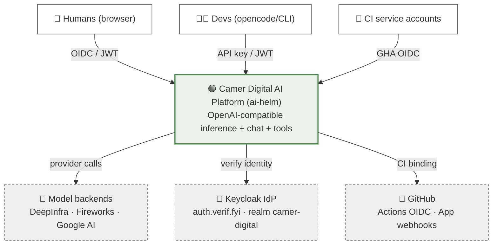
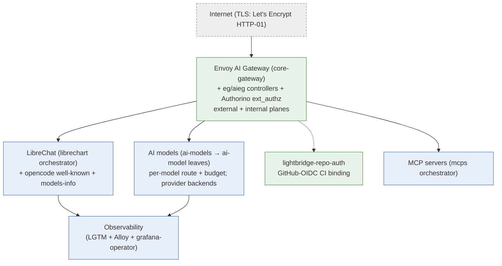
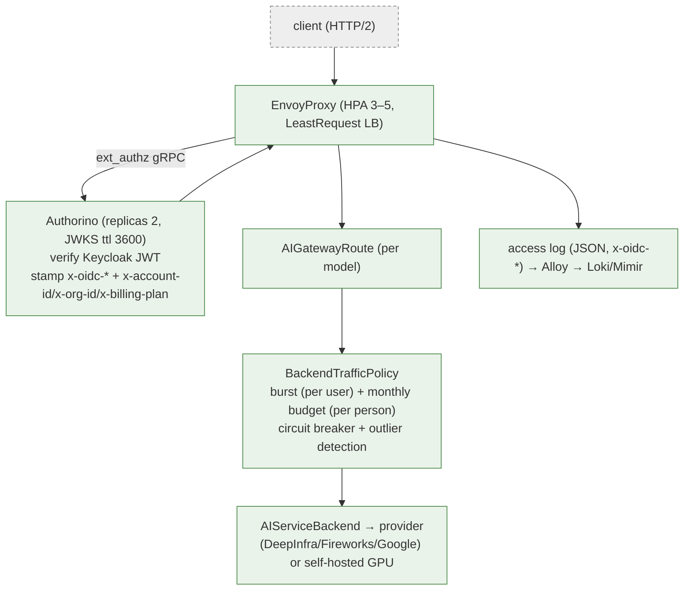
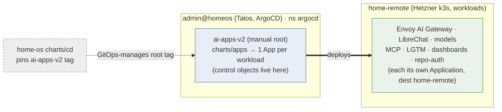
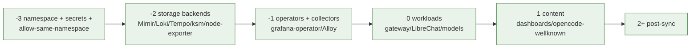

# arc42 — Camer Digital AI Platform (ai-helm)

> [arc42](https://arc42.org) architecture description for the AI platform
> deployed by this repository — the twelve sections applied to the steady state
> at `release-2026.06.14-v09`. Every diagram is mermaid.
>
> **Companion reading:** the single-page [architecture map](./architecture.md),
> the layered, mermaid-rich [architecture suite](./architecture/README.md)
> (C4 context → container → component + one page per subsystem), and the
> [ADR index](./adr/README.md) — the source of truth for every *why*.

**Maintainer:** @stephane-segning · **Updated:** 2026-06-14

---

## 1. Introduction and goals

The platform delivers a **multi-tenant, OpenAI-compatible inference service**
plus the tools around it (a chat UI, a CLI integration, MCP tool servers, dev
observability) for Camer Digital. It is delivered entirely as Helm charts
reconciled by ArgoCD; there is no application build in this repo.

### Core quality goals

| Priority | Quality | Concrete goal |
|---|---|---|
| 1 | **Scalability** | Serve ~2000 concurrent clients sustained, ~5000 at peak, on the OpenAI-compatible endpoint without latency collapse |
| 2 | **Observability / attribution** | Every request attributable to a user, plan, and model; usage/cost queryable in Grafana in near-real-time |
| 3 | **Security / multi-tenancy** | Keycloak JWT is the authorization boundary; per-plan burst + monthly budget enforced at the gateway; tenant isolation by claim |
| 4 | **Operability (GitOps)** | Every change is a reviewed Git diff; reproducible, declarative, env-overlayable |
| 5 | **Cost control** | Per-person monthly USD budget enforced; self-hosted object storage; no per-request Python hop |

### Stakeholders

| Role | Concern |
|---|---|
| Platform maintainer (@stephane-segning) | Operability, cost, deploys staying green |
| End users (humans via LibreChat, devs via opencode/CLI) | Latency, model availability, fair quota |
| Service accounts (CI runners) | Programmatic access without human auth or shared keys |
| Finance / billing | Per-person spend, charge-back data |
| Security | JWT boundary, tenant isolation, secret hygiene |

---

## 2. Constraints

| Constraint | Implication |
|---|---|
| **GitOps only** — no imperative deploys | Everything is a chart; `kubectl rollout restart` is reverted by ArgoCD selfHeal |
| **Two clusters** — ArgoCD on Talos `admin@homeos`, workloads on Hetzner k3s `home-remote` | Control objects in-cluster, workloads `home-remote` (ADR-0017) |
| **Cilium default-deny-egress** baseline | Every API-server / S3 reach needs an additive `CiliumNetworkPolicy`; a plain `NetworkPolicy` ipBlock does not match |
| **Infra owned externally** (`home-os`, `hetzner-k8s`) | cert-manager, ESO, Redis, Traefik, CNPG, OTel-operator referenced by name only |
| **k3s `baseline` Pod Security** cluster-wide | Observability collectors' namespace must be `privileged` |
| **OpenAI API compatibility** | Routes, `/v1/models`, `/v1/models/info` (OpenRouter shape) must match client expectations |
| **Verification = `helm template` + `helm lint`** | No app test loop; dashboards Python is the only runnable code |
| **Single env today (`prod`/Hetzner)** | A second env is a drop-in `environments/<env>/` sibling |

---

## 3. Context and scope

### Business context

### Technical context (external systems consumed, not owned)

| External system | Role | Owner repo |
|---|---|---|
| Keycloak (`auth.verif.fyi`) | OIDC IdP, JWT issuer, billing-plan claim source | (separate) |
| cert-manager + ClusterIssuers | TLS (ACME HTTP-01 + internal CA) | `home-os` |
| External Secrets Operator + `ssegning-aws` store | Secret sync | external |
| redis-ha (TLS-only) | LibreChat sessions, Envoy ratelimit counters | `home-os` |
| Traefik | Ingress controller (non-gateway ingresses) | external |
| CloudNativePG + Barman | Postgres for lightbridge-repo-auth, backups | external |
| Hetzner Object Storage (`nbg1.your-objectstorage.com`) | Mimir/Loki/Tempo/CNPG/Mongo/LibreChat S3 | Hetzner |
| Hetzner Cloud LB | Public data-plane LB (`46.225.38.138`) | Hetzner |
| GitHub | Chart source; GHA OIDC issuer; `camer-digital-ai` App webhooks | SaaS |
| Model providers (DeepInfra/Fireworks/Google AI) | Actual inference | SaaS |

### System scope (owned by ai-helm)

The Envoy AI Gateway, AuthConfigs/security policies, per-model routing + budget
policies, LibreChat, opencode well-known + models-info catalog, the GitHub-OIDC
CI binding (`lightbridge-repo-auth`), MCP servers, the observability stack,
dashboards, and all the GitOps glue.

> Detail: [architecture suite · 01 Context](./architecture/01-context.md).

---

## 4. Solution strategy

| Goal | Strategy | Realised by |
|---|---|---|
| Scale to 2000/5000 clients | HTTP/2 multiplexing + data-plane HPA + circuit breaking | `core-gateway` ClientTrafficPolicy / EnvoyProxy HPA / BackendTrafficPolicy (ADR-0021) |
| Attribution | JWT → Authorino `x-oidc-*` headers → Envoy access log → Alloy → Loki labels | ADR-0005/0011/0046, `per-user-observability.md` |
| Authorization | Keycloak JWT as the boundary; per-host AuthConfig differentiation | ADR-0021 |
| CI without shared keys | GitHub Actions OIDC → `lightbridge-repo-auth` org→account binding | ADR-0047/0049 |
| Quota & billing | Per-plan burst + per-person monthly budget in `BackendTrafficPolicy` | ADR-0021/0035 |
| Operability | GitOps + umbrella apps + env overlays + App-of-Apps | ADR-0016–0020 |
| Provider abstraction | Envoy AI Gateway `AIGatewayRoute` per model, fan-out via ApplicationSet | ADR-0012 |
| Dashboards reproducibility | Python (grafana-foundation-sdk) → `GrafanaDashboard` CRs, drift-checked | ADR-0004/0008/0045 |

---

## 5. Building block view

### Level 1 — system decomposition

### Level 2 — key building blocks

| Chart | Responsibility | Pattern |
|---|---|---|
| `core-gateway` | Envoy AI Gateway, listeners (external + internal), ClientTrafficPolicy, BackendTrafficPolicy, ACME issuer, OTel collector | Direct |
| `kuadrant-policies` | Authorino instance + per-host AuthConfigs + SecurityPolicy | Direct |
| `ai-models` → `ai-model` | Orchestrator ApplicationSet → one Application per model (route + budget) | Orchestrator + leaves (ADR-0012) |
| `ai-models-backends` | `AIServiceBackend`/`Backend`/`BackendSecurityPolicy`/`BackendTLSPolicy` + key ExternalSecrets | Direct |
| `model-serving-qwen3-5` | **🟢 LIVE** self-hosted Qwen3.5-4B Q4 on the home GPU via llama.cpp; bjw-template StatefulSet, native `--api-key` | Hybrid bjw, `homeCluster: true` (ADR-0022/0030/0032) |
| `model-serving-qwen3-4b` | Self-hosted Qwen3-4B via vLLM + Caddy auth-proxy sidecar; standby/rollback | Hybrid bjw, `homeCluster: true` (ADR-0029/0030) |
| `ai-models-info` | OpenRouter-shape `/v1/models/info` catalog (nginx static) | Direct (ADR-0015) |
| `librechart` → `librechat-app` / `librechat-search` / `librechat-opencode-wellknown` | Chat UI + Mongo + Meili + opencode discovery | Orchestrator + leaves (ADR-0014) |
| `mcps` → `mcp` | MCP tool servers (self-hosted + proxiedExternal) | Orchestrator + leaves (ADR-0038/0040/0041) |
| `lightbridge-repo-auth` | GitHub org→account binding for CI OIDC auth | Direct (ADR-0047/0049) |
| `observability` | LGTM + Alloy + grafana-operator + dashboards | App-of-Apps (ADR-0020) |
| `apps` | Root chart: emits one Application per workload (umbrella multi-source) | Root (ADR-0018) |
| `bjw-common` / `bjw-template` | Forked bjw-s common library | Library (ADR-0016) |

> Full container map (by namespace): [suite · 02 Containers](./architecture/02-containers.md).

### Level 3 — the gateway request path (the load-bearing block)

> Sequence diagrams per identity surface: [suite · 03 Gateway components](./architecture/03-gateway-components.md).

---

## 6. Runtime view

### Scenario A — human dev via opencode (external plane, full attribution)

1. `opencode auth login` → Keycloak code+PKCE → JWT (carries `sub`, `azp`, `billing_plan`).
2. Request to `api.ai.camer.digital` with the user's JWT.
3. Authorino verifies (JWKS cached), stamps `x-oidc-*` + `x-account-id` (=`sub`) + `x-billing-plan`.
4. `BackendTrafficPolicy` checks burst (per user) + monthly budget (per person); denies on any exhausted bucket.
5. Request proxied to provider; response token cost extracted (`llmRequestCosts`).
6. Access log → Alloy → Loki (labels `user_id`, `azp`) + Mimir counters.

### Scenario B — human via LibreChat (internal plane, per-user via forwarded sub)

1. User logs into LibreChat (Keycloak OIDC).
2. LibreChat calls `core-gateway-internal.…svc` with an apiKey/SA token **and** `X-LibreChat-User: <end-user sub>`.
3. Internal AuthConfig prefers that header → per-user `x-account-id`; `x-billing-plan: internal` (uncapped, burst-only).

### Scenario C — CI service account via GitHub OIDC (ADR-0047)

1. Workflow mints its GHA OIDC token (audience = the org's Source URL); keyless.
2. Authorino verifies (github issuer); `when github-actions` → calls `lightbridge-repo-auth /v1/resolve` with `repository_owner_id`.
3. Bound + not-blocked → `{account_id, billing_plan}` stamped; unbound/blocked → 403.

### Scenario D — rollout under load

EnvoyProxy rollout drains for 60 s (`minDrainDuration` 15 s) so long-lived
SSE/token streams aren't cut; HPA keeps ≥3 replicas; PDB `maxUnavailable: 1`.

---

## 7. Deployment view

### Two-cluster, two-tier GitOps

- **Workloads** target `home-remote`; a render guard hard-fails an in-cluster workload destination unless `allowInCluster`.
- **Control objects** (orchestrators emitting ApplicationSets) set `controlPlane: true` → `https://kubernetes.default.svc` / `argocd` ns.
- **`homeCluster: true`** is the one sanctioned exception — the self-hosted GPU models (ADR-0022).
- **Per-env knobs** live in `environments/prod/cluster.yaml`; umbrella apps fold in a kustomize dep overlay (`environments/prod/deps/<app>/`).

### Sync waves (infrastructure → storage → collection → visualisation)

Violating this order cost a day once — `MONITORING_FIX.md` is the postmortem.

### Networking realities

Cilium deny-egress: API-server reach needs `toEntities: [kube-apiserver]`; S3
needs `toFQDNs: "*.your-objectstorage.com"`. Hetzner LB targets workers only
(control-plane nodes excluded) and needs `use-private-ip: true`. Detail:
[suite · 06 Networking & TLS](./architecture/06-networking-tls.md).

---

## 8. Crosscutting concepts

| Concept | How it's realised | Detail |
|---|---|---|
| **Identity** | Keycloak JWT (RS256); 3 surfaces: human/browser, human/API, service account (CI via GHA OIDC). `x-oidc-*` contract (ADR-0011). | [05](./architecture/05-auth-identity.md) |
| **Authorization** | JWT validity = entry; per-host AuthConfig differentiates plane/plan; no OPA in path. | [05](./architecture/05-auth-identity.md) |
| **Multi-tenancy** | `x-account-id` (user), `x-org-id`, `x-billing-plan` (Keycloak claim) → rate-limit tiers. | [05](./architecture/05-auth-identity.md) |
| **Quota** | Burst + monthly USD budget (both per-person, ADR-0035) in `BackendTrafficPolicy`; Redis counters. | [09](./architecture/09-model-serving.md) |
| **Observability** | LGTM + Alloy; per-user Loki labels; dashboards-as-code; traces via Tempo. | [08](./architecture/08-observability.md) |
| **Secrets** | ESO + `ssegning-aws`; chart-owned ExternalSecrets; app vs platform split. | [07](./architecture/07-data-secrets.md) |
| **TLS** | External: ACME HTTP-01 via the Gateway. Internal: `self-signed-ca` (Home Root CA). | [06](./architecture/06-networking-tls.md) |
| **Config portability** | `environments/<env>/` overlays; `global.namespacePodSecurity`; per-cluster LB annotations. | [04](./architecture/04-gitops-deployment.md) |
| **Cost metadata** | Native Envoy `llmRequestCosts` extraction (no Lua/Python hop). | [03](./architecture/03-gateway-components.md) |

---

## 9. Architecture decisions

The complete set lives in [`docs/adr/`](./adr/). The load-bearing ones:

| ADR | Decision |
|---|---|
| 0002 | Phoenix → Tempo for LLM traces |
| 0004 | grafana-operator external mode + dashboards-as-code |
| 0005 | Per-user attribution via Authorino headers → Loki labels |
| 0008 | Python dashboard generation (grafana-foundation-sdk) |
| 0011 | Canonical `x-oidc-*` downstream header contract |
| 0012 | `ai-models` orchestrator ApplicationSet split |
| 0014 | `librechart` split + opencode well-known |
| 0015 | OpenRouter-shape `/v1/models/info` catalog |
| 0016 | Fork bjw-s app-template/common locally |
| 0017 | Two-tier destinations (control in-cluster, workloads home-remote) |
| 0018 | Umbrella apps + `environments/` overlays |
| 0020 | Observability App-of-Apps orchestrator |
| 0021 | Burst/budget/billing via dual-plane AuthConfigs (OPA removed) |
| 0022 | Self-hosted GPU model federated into the gateway (`homeCluster: true`) |
| 0027 | **Coder removed** (supersedes ADR-0019) |
| 0028 | Cost-recovery pricing for owned-hardware models |
| 0029/0030 | Self-hosted model as a plain/StatefulSet deployment (drop KServe) |
| 0031 | Tag-based deploys (`release-YYYY.MM.DD`), never `main` |
| 0032 | llama.cpp engine alongside vLLM — Qwen3.5-4B Q4 LIVE |
| 0035 | Per-person monthly budget (drop the shared org bucket) |
| 0038 | MCP OAuth discovery (RFC 9728) via native AIEG `MCPRoute.securityPolicy.oauth` |
| 0040 | External MCPs via per-MCP in-cluster Caddy normalizing proxies |
| 0041 | openresty request-body protocol-version rewrite for firecrawl |
| 0045 | Scrape-first dashboard sourcing |
| 0046 | Per-user attribution repair (flatten OTLP access-log attributes at Alloy) |
| 0047/0049 | GitHub-OIDC CI binding (`lightbridge-repo-auth`) + operator-only onboarding |
| 0048 | Global opencode-browser plugin + lean default primary agent |

ADRs are immutable once Accepted; supersede with a new ADR.

---

## 10. Quality requirements

| Quality | Scenario | Target | Status |
|---|---|---|---|
| **Performance** | 2000 sustained, 5000 peak, mixed streaming | p95 added gateway latency < 50 ms; no window stalls | Tuned (ADR-0021); load test pending |
| **Scalability** | Traffic doubles | HPA scales data plane 3→5 (right-sized to the 32-CPU worker pool; raise with workers); Authorino HA | Configured |
| **Availability** | A model backend starts erroring | Outlier detection ejects it in ≤30 s; clients reroute | Configured |
| **Resilience** | Proxy rollout under load | No stream cut (60 s drain) | Configured |
| **Observability** | "What did user X spend on model Y this month?" | Answerable in Grafana from Mimir counters | Partially shipped |
| **Security** | Forged/expired JWT | Rejected at Authorino; no backend reached | Enforced |
| **Cost** | User exceeds monthly budget | Budget bucket denies; alert at 80% | Designed (ADR-0021) |
| **Operability** | Add a model | List edit in `ai-models` values → new Application | Mechanical |

---

## 11. Risks and technical debt

| Risk / debt | Impact | Mitigation / status |
|---|---|---|
| **Load test for 2000/5000 not yet re-run on Hetzner** | Capacity claims unvalidated | Envelope in `docs/gateway-capacity.md`; HPA right-sized; run `plans/artillery/` |
| **Keycloak `billing_plan` / org mappers not landed** | Plan falls back to `free` | ADR-0021 external dependency |
| **Cilium deny-egress fragility** | New egress needs a CiliumNetworkPolicy or silent crashloop | Overlay pattern established ([06](./architecture/06-networking-tls.md)) |
| **`ai-gitops` referenced but never created** | Stale ADRs (0010/0013) mislead | CLAUDE.md flags it; env overrides in-repo |
| **Single env (`prod`) only** | No staging to validate before release | Second env is a drop-in `environments/<env>/` |
| **Tag-based deploys = manual two-repo step** | Forget the home-os repoint → root self-heals to old tag | Release runbook (CLAUDE.md, `docs/releasing.md`) |
| **Mimir ring wedges if memberlist blocked at startup** | Metrics silently dropped | Guarded: wave -3 `allow-same-namespace` + `rejoin_interval: 1m` |
| **External MCP proxy engines are interim** | openresty/Content-Type rewrites carried until AIEG #2218/#2219 land | Tracked in ADR-0040/0041 |
| **MCP `MCP_TOKEN` token-bind race** | Empty-token proxy rejects all requests | Guarded: `optional: false` (waits for ESO) |

---

## 12. Glossary

| Term | Meaning |
|---|---|
| **AIGatewayRoute** | Envoy AI Gateway CR: a model route + provider mapping |
| **BackendTrafficPolicy** | Envoy Gateway CR enforcing rate limits, budget, circuit breaking |
| **AuthConfig** | Authorino CR: per-host auth/identity/response rules |
| **Authorino** | Kuadrant ext_authz service verifying JWT and stamping headers |
| **App-of-Apps** | Orchestrator chart rendering child `Application` CRs directly |
| **Orchestrator + leaves** | Chart emitting an ApplicationSet that fans out to sibling leaf charts |
| **Umbrella Application** | Multi-source ArgoCD App: workload + app-scoped deps overlay |
| **home-remote** | Registered ArgoCD destination = the Hetzner workload cluster |
| **External / internal plane** | Public LB host vs in-cluster ClusterIP host on the same gateway |
| **`x-oidc-*`** | Canonical downstream identity headers (ADR-0011) |
| **LGTM** | Loki / Grafana / Tempo / Mimir observability stack |
| **Alloy** | Grafana's OTel-collector/agent (metrics scrape, log tail, OTLP) |
| **ssegning-aws** | The external `ClusterSecretStore` ESO reads from |
| **Plan / tier** | `free` / `pro` / `service` / `internal` rate-limit + budget tier |
