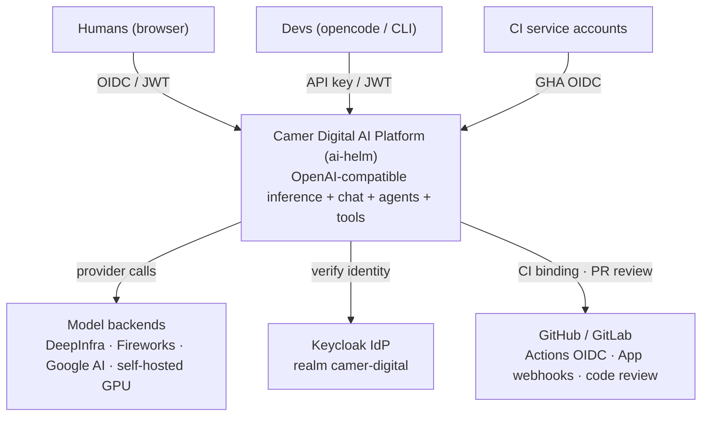
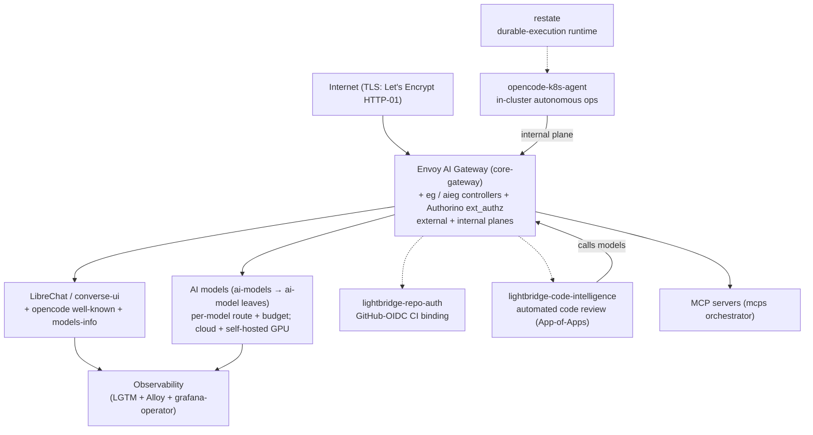
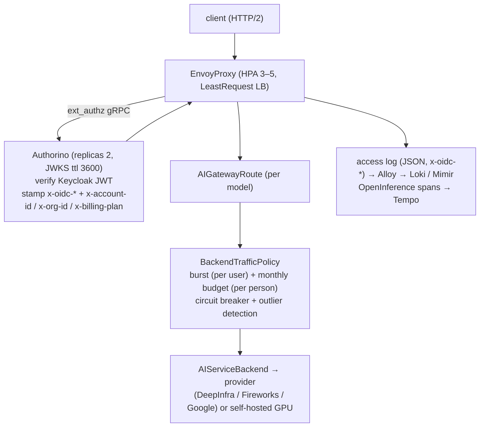
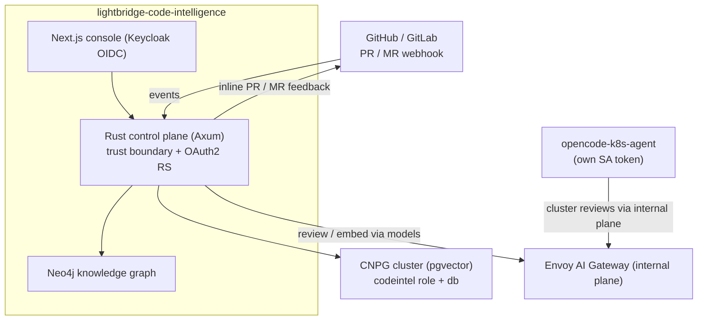
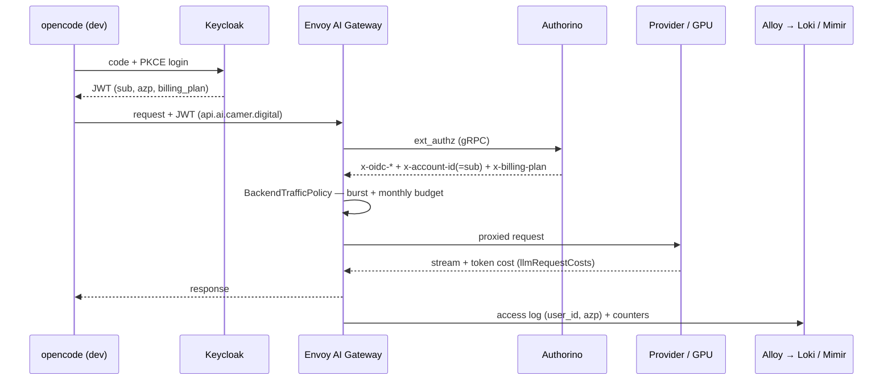
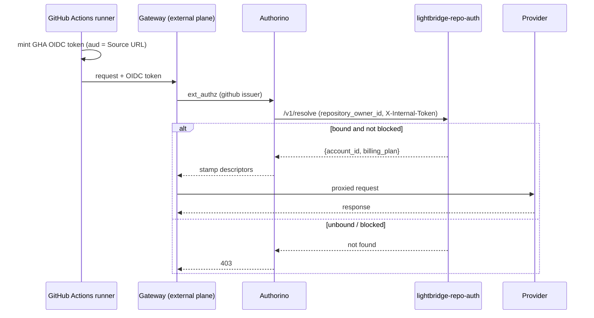
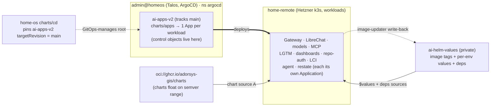
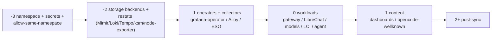
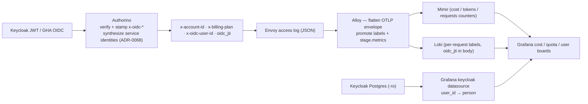

# arc42 — Camer Digital AI Platform (ai-helm)

> [arc42](https://arc42.org) architecture description for the AI platform
> deployed by this repository — the twelve sections applied to the steady state
> on `main` under **continuous delivery** (ADR-0055; charts float from OCI, no
> release tag). Every diagram is mermaid, deliberately uncolored.
>
> **Companion reading:** the single-page [architecture map](./architecture.md),
> the layered, mermaid-rich [architecture suite](./architecture/README.md)
> (C4 context → container → component + one page per subsystem), and the
> [ADR index](./adr/README.md) — the source of truth for every *why*.

**Maintainer:** @stephane-segning · **Updated:** 2026-07-14

---

## 1. Introduction and goals

The platform delivers a **multi-tenant, OpenAI-compatible inference service**
plus the tools around it — a chat UI, an org-wide opencode/CLI integration, MCP
tool servers, an automated code-review app, in-cluster autonomous agents, and
dev observability — for Camer Digital. It is delivered entirely as Helm charts
reconciled by ArgoCD; there is no application build in this repo. *How to render*
lives here in `ai-helm`; *what is deployed* (image tags + per-env values + deps
overlays) lives in the private `ai-helm-values` repo (ADR-0055/0056).

### Core quality goals

| Priority | Quality | Concrete goal |
|---|---|---|
| 1 | **Scalability** | Serve ~2000 concurrent clients sustained, ~5000 at peak, on the OpenAI-compatible endpoint without latency collapse |
| 2 | **Observability / attribution** | Every request attributable to a user, plan, and model; usage/cost queryable in Grafana in near-real-time |
| 3 | **Security / multi-tenancy** | Keycloak JWT is the authorization boundary; per-plan burst + monthly budget enforced at the gateway; tenant isolation by claim |
| 4 | **Operability (GitOps)** | Every change is a reviewed Git diff; reproducible, declarative, env-overlayable; merge to `main` is the deploy |
| 5 | **Cost control** | Per-person monthly USD budget enforced; self-hosted object storage; self-hosted GPU inference priced nominally so it is always the cheapest route (ADR-0128); no per-request Python hop |

### Stakeholders

| Role | Concern |
|---|---|
| Platform maintainer (@stephane-segning) | Operability, cost, deploys staying green |
| End users (humans via LibreChat, devs via opencode/CLI) | Latency, model availability, fair quota |
| Service accounts (CI runners) | Programmatic access without human auth or shared keys |
| Finance / billing | Per-person spend, charge-back data |
| Security | JWT boundary, tenant isolation, secret hygiene |

---

## 2. Constraints

| Constraint | Implication |
|---|---|
| **GitOps only** — no imperative deploys | Everything is a chart; `kubectl rollout restart` is reverted by ArgoCD selfHeal |
| **Config vs. state split** — chart logic here, deployed state in `ai-helm-values` | A workload config / image-tag / per-env CR change lands in the private values repo; cut over **values-repo-first** or `ignoreMissingValueFiles` silently falls back to chart defaults |
| **Two clusters** — ArgoCD on Talos `admin@homeos`, workloads on Hetzner k3s `home-remote` | Control objects in-cluster, workloads `home-remote` (ADR-0017) |
| **Cilium default-deny-egress** baseline | Every API-server / S3 reach needs an additive `CiliumNetworkPolicy`; a plain `NetworkPolicy` ipBlock does not match |
| **Infra owned externally** (`home-os`, `hetzner-k8s`) | cert-manager, ESO, Redis, Traefik, CNPG, OTel-operator, metrics-server referenced by name only |
| **k3s `baseline` Pod Security** cluster-wide | Observability collectors' namespace must be `privileged` |
| **OpenAI API compatibility** | Routes, `/v1/models`, `/v1/models/info` (OpenRouter shape) must match client expectations |
| **Verification = `helm template` + `helm lint`** | No app test loop; dashboards Python is the only runnable code |
| **Single env today (`prod`/Hetzner)** | Overlays live in `ai-helm-values` `environments/prod/`; a second env is a drop-in sibling |

---

## 3. Context and scope

### Business context

```mermaid
flowchart TB
    H["Humans (browser)"]
    D["Devs (opencode / CLI)"]
    C["CI service accounts"]

    P["Camer Digital AI Platform (ai-helm)<br/>OpenAI-compatible inference + chat + agents + tools"]

    M["Model backends<br/>DeepInfra · Fireworks · Google AI · self-hosted GPU"]
    K["Keycloak IdP<br/>realm camer-digital"]
    G["GitHub / GitLab<br/>Actions OIDC · App webhooks · code review"]

    H -->|OIDC / JWT| P
    D -->|API key / JWT| P
    C -->|GHA OIDC| P
    P -->|provider calls| M
    P -->|verify identity| K
    P -->|CI binding · PR review| G
```

### Technical context (external systems consumed, not owned)

| External system | Role | Owner repo |
|---|---|---|
| Keycloak | OIDC IdP, JWT issuer, billing-plan claim source; read-only DID datasource | `home-os` (`keycloak-ha`) |
| cert-manager + ClusterIssuers | TLS (ACME HTTP-01 + internal CA) | `home-os` |
| External Secrets Operator + `ssegning-aws` store | Secret sync | external |
| redis-ha (TLS-only) | LibreChat sessions, Envoy ratelimit counters | `home-os` |
| Traefik | Ingress controller (non-gateway ingresses) | external |
| CloudNativePG + Barman | Postgres for lightbridge-repo-auth / code-intelligence, backups | external |
| metrics-server | `kubectl top` / HPA metrics (k3s-bundled, ADR-0054) | k3s addon |
| Hetzner Object Storage (`nbg1.your-objectstorage.com`) | Mimir/Loki/Tempo/CNPG/Mongo/LibreChat S3 | Hetzner |
| Hetzner Cloud LB | Public data-plane LB (`46.225.38.138`) | Hetzner |
| GitHub / GitLab | Chart source; GHA OIDC issuer; App webhooks; code-review targets | SaaS |
| Model providers (DeepInfra/Fireworks/Google AI) | Actual inference | SaaS |
| `ai-helm-values` (private) | Image tags + per-env values + deps overlays | `adorsys-gis` |

### System scope (owned by ai-helm)

The Envoy AI Gateway, AuthConfigs/security policies, per-model routing + budget
policies, LibreChat (converse), opencode well-known + models-info catalog, the
GitHub-OIDC CI binding (`lightbridge-repo-auth`), the Lightbridge code-review app
(`lightbridge-code-intelligence`), the in-cluster opencode agent, MCP servers,
the Restate durable-execution runtime, the observability stack, dashboards, and
all the GitOps glue.

> Detail: [architecture suite · 01 Context](./architecture/01-context.md).

---

## 4. Solution strategy

| Goal | Strategy | Realised by |
|---|---|---|
| Scale to 2000/5000 clients | HTTP/2 multiplexing + data-plane HPA + circuit breaking | `core-gateway` ClientTrafficPolicy / EnvoyProxy HPA / BackendTrafficPolicy (ADR-0021) |
| Attribution | JWT → Authorino `x-oidc-*` headers → Envoy access log → Alloy → Loki labels + Mimir counters | ADR-0005/0011/0046/0058, `per-user-observability.md` |
| Identity resolution | Read-only Keycloak Postgres datasource resolves `user_id` (sub UUID) → person + offline grants × spend | ADR-0063/0064, `keycloak-identity-datasource.md` |
| Per-JWT / synthetic identity | Loki-backed `jwt-tokens` on `oidc_jti`; Authorino synthesizes named identities for known service callers | ADR-0067/0068 |
| Chat-content visibility | Reuse the gateway ext-proc's OpenInference spans (full request/response) in Tempo; per-request Loki metadata | ADR-0077 (per-user span attribution not viable — ADR-0079) |
| Rate-limit quota | Live per-account budget counters read from redis-ha: `prometheus-redis-exporter` → Mimir leaderboard + a `redis-datasource` census | ADR-0070, `ratelimit-quota-observability.md` |
| Authorization | Keycloak JWT as the boundary; per-host AuthConfig differentiation | ADR-0021 |
| CI without shared keys | GitHub Actions OIDC → `lightbridge-repo-auth` org→account binding (GitLab multi-forge in progress) | ADR-0047/0049 |
| Automated code review | `lightbridge-code-intelligence` GitHub/GitLab App: Rust control plane + Next.js console + Neo4j + pgvector, calls through the gateway | chart `lightbridge-code-intelligence` |
| Cluster autonomy | In-cluster opencode agent on the internal plane (own SA token) | ADR-0037 |
| Quota & billing | Per-plan burst + per-person monthly budget in `BackendTrafficPolicy` | ADR-0021/0035 |
| Operability / delivery | Continuous delivery: OCI charts (semver float) + image-updater write-back to `ai-helm-values`; umbrella apps + App-of-Apps | ADR-0016–0020, 0055/0056/0082 |
| Provider abstraction | Envoy AI Gateway `AIGatewayRoute` per model, fan-out via ApplicationSet | ADR-0012 |
| Dashboards reproducibility | Python (grafana-foundation-sdk) → `GrafanaDashboard` CRs, drift-checked | ADR-0004/0008/0045 |

---

## 5. Building block view

### Level 1 — system decomposition

```mermaid
flowchart TB
    NET["Internet (TLS: Let's Encrypt HTTP-01)"]
    GW["Envoy AI Gateway (core-gateway)<br/>+ eg / aieg controllers + Authorino ext_authz<br/>external + internal planes"]

    LC["LibreChat / converse-ui<br/>+ opencode well-known + models-info"]
    MODELS["AI models (ai-models → ai-model leaves)<br/>per-model route + budget; cloud + self-hosted GPU"]
    REPO["lightbridge-repo-auth<br/>GitHub-OIDC CI binding"]
    LCI["lightbridge-code-intelligence<br/>automated code review (App-of-Apps)"]
    AGENT["opencode-k8s-agent<br/>in-cluster autonomous ops"]
    MCP["MCP servers (mcps orchestrator)"]
    RST["restate<br/>durable-execution runtime"]
    OBS["Observability<br/>(LGTM + Alloy + grafana-operator)"]

    NET --> GW
    GW --> LC
    GW --> MODELS
    GW --> MCP
    GW -.-> REPO
    GW -.-> LCI
    AGENT -->|internal plane| GW
    LCI -->|calls models| GW
    LC --> OBS
    MODELS --> OBS
    RST -.-> AGENT
```

### Level 2 — key building blocks

| Chart | Responsibility | Pattern |
|---|---|---|
| `core-gateway` | Envoy AI Gateway, listeners (external + internal), ClientTrafficPolicy, BackendTrafficPolicy, ACME issuer, OTel collector, `gateway.redirectHosts` (vanity redirects, ADR-0053) | Direct |
| `kuadrant-policies` / `security-policies` | Authorino instance + per-host AuthConfigs + SecurityPolicy (values in `ai-helm-values`) | Direct |
| `ai-models` → `ai-model` | Orchestrator ApplicationSet → one Application per model (route + budget). The catalog itself lives in `ai-helm-values` (ADR-0126); chart defaults are an empty skeleton that refuses to render | Orchestrator + leaves (ADR-0012) |
| `ai-models-backends` | `AIServiceBackend`/`Backend`/`BackendSecurityPolicy`/`BackendTLSPolicy` + key ExternalSecrets | Direct |
| `inference` → `inference-server` | Orchestrator ApplicationSet → one Application per self-hosted model on the Hetzner GPU fleet (`inference` ns, `home-remote`). THREE engine profiles (llama.cpp / vLLM+LMCache / **LocalAI**, image generation) expand a ~15-line catalog entry into the workload. Cluster-local: no Ingress, cert, API key or proxy sidecar | Orchestrator + leaves (ADR-0094/0095/0100/0102) |
| `model-serving-*` (qwen3-5, qwen3-4b, deepseek-r1-1-5b, qwen25-3b-awq, qwen3-8b, ministral-3b, qwen2-vl-2b) | ⚠️ **LEGACY, ALL DISABLED since 2026-07-27 (ADR-0100)** — per-model charts targeting the *other* cluster (`admin@homeos`) over a public edge; `homeCluster: true`. `zimage-turbo` was the last live one, moved to the fleet, and its chart was **deleted** by ADR-0106; the rest are a rollback surface only | Hybrid bjw (ADR-0022/0029/0030/0032) |
| `ai-models-info` | OpenRouter-shape `/v1/models/info` catalog (nginx static) | Direct (ADR-0015) |
| `librechart` → `librechat-app` / `librechat-search` / `librechat-opencode-wellknown` | Chat UI (converse) + Mongo + Meili + opencode discovery/agents | Orchestrator + leaves (ADR-0014) |
| `mcps` → `mcp` | MCP tool servers (self-hosted + proxiedExternal); opt-in v1.0 tool-filter / CEL authz / header-forward | Orchestrator + leaves (ADR-0038/0040/0041/0069) |
| `lightbridge` → `lightbridge-secrets`/`-db`/`-app` | Lightbridge authz stack (repo-auth backend) | App-of-Apps (ADR-0026) |
| `lightbridge-repo-auth` | GitHub org→account binding for CI OIDC auth | Direct (ADR-0047/0049) |
| `lightbridge-code-intelligence` | GitHub/GitLab code-review App: Rust control plane + Next.js console + Neo4j; pgvector reused from the CNPG cluster | Direct (bjw-template) |
| `opencode-k8s-agent` | In-cluster opencode agent (external repo, pinned SHA) on the internal gateway plane | Direct (ADR-0037) |
| `restate` | Durable-execution runtime (OCI chart) — foundation for the A2A agent platform (ADR-0081) | Direct |
| `coder` → `coder-secrets`/`-app` | AI-agent dev-workspace platform, Keycloak OIDC | App-of-Apps (ADR-0083) |
| `lakefs` → `lakefs-secrets`/`-app`/`-proxy`/`-auth` | Data-lake version control; S3 blockstore (Hetzner Object Storage); Keycloak SSO via oauth2-proxy → the first-party `lakefs-proxy` session shim → LakeFS (OSS rejects `auth.oidc.*` and is single-user — shared `admin` identity) | App-of-Apps (ADR-0085, ADR-0090) |
| `lakefs-proxy` | The LakeFS SSO session shim — first-party Rust/axum service (`ghcr.io/adorsys-gis/lakefs-proxy`, private, distroless, non-root): turns oauth2-proxy's `X-Auth-Request-Email` into a real LakeFS session by logging in as the bootstrap admin and relaying LakeFS's own unmintable `securecookie`; loop-guarded, ClusterIP-only ([playbook](./playbooks/lakefs-sso.md)) | Leaf, bjw-template (ADR-0090) |
| `argo-workflows` → `argo-workflows-secrets`/`-app` | Pipeline orchestration; native Keycloak SSO (argo-server impersonates a delegate SA — RBAC + CRD stubs in the deps overlay); S3 artifact repository ([playbook](./playbooks/mlops-app-auth.md)) | App-of-Apps (ADR-0085) |
| `mlflow` → `mlflow-secrets`/`-app` | Experiment tracking + model registry; native Keycloak OIDC (bundled `mlflow-oidc-auth`, own `mlflow_oidc` DB); S3 artifact store ([playbook](./playbooks/mlops-app-auth.md)) | App-of-Apps (ADR-0085) |
| `homepage` → `homepage-secrets`/`-auth`/`-app` | Central-hub dashboard for every app on the platform; hybrid curated + k8s-auto-discovery content; dedicated oauth2-proxy gate (Homepage has no login of its own — contrast with `lakefs`, which needs a session shim behind the proxy, ADR-0090) | App-of-Apps (ADR-0089) |
| `observability` → children | LGTM + Alloy + grafana-operator + redis-exporter | App-of-Apps (ADR-0020) |
| `observability-dashboards` | Dashboards + folders + alerting as grafana-operator CRs (Python-generated) | Direct (ADR-0008/0059) |
| `same-origin-proxy` | Generic Caddy serving external resources same-origin to dodge browser CORS | Direct (ADR-0061) |
| `imageupdater` | argocd-image-updater — cosign-gated image-tag write-back to `ai-helm-values` | Direct (ADR-0055) |
| `reloader` | Stakater Reloader — restart on cert/secret rotation | Direct |
| `keycloak-baseline` / `keycloak-backup` / `mongodb-backup` | Realm config-as-code; scheduled backups to object storage | Direct |
| `apps` | Root chart: emits one Application per workload (umbrella multi-source) | Root (ADR-0018) |
| `bjw-common` / `bjw-template` | Forked bjw-s common library | Library (ADR-0016) |

> Full container map (by namespace): [suite · 02 Containers](./architecture/02-containers.md).

### Level 3 — the gateway request path (the load-bearing block)

```mermaid
flowchart TB
    C["client (HTTP/2)"]
    E["EnvoyProxy (HPA 3–5, LeastRequest LB)"]
    A["Authorino (replicas 2, JWKS ttl 3600)<br/>verify Keycloak JWT<br/>stamp x-oidc-* + x-account-id / x-org-id / x-billing-plan"]
    R["AIGatewayRoute (per model)"]
    B["BackendTrafficPolicy<br/>burst (per user) + monthly budget (per person)<br/>circuit breaker + outlier detection"]
    S["AIServiceBackend → provider<br/>(DeepInfra / Fireworks / Google) or self-hosted GPU"]
    O["access log (JSON, x-oidc-*) → Alloy → Loki / Mimir<br/>OpenInference spans → Tempo"]

    C --> E
    E -->|ext_authz gRPC| A
    A --> E
    E --> R --> B --> S
    E --> O
```

### Level 3 — code intelligence & autonomous agents

```mermaid
flowchart TB
    GH["GitHub / GitLab<br/>PR / MR webhook"]
    subgraph lci["lightbridge-code-intelligence"]
        CP["Rust control plane (Axum)<br/>trust boundary + OAuth2 RS"]
        WEB["Next.js console (Keycloak OIDC)"]
        NEO["Neo4j knowledge graph"]
    end
    PG["CNPG cluster (pgvector)<br/>codeintel role + db"]
    GWI["Envoy AI Gateway (internal plane)"]
    AG["opencode-k8s-agent<br/>(own SA token)"]

    GH -->|events| CP
    CP --> NEO
    CP --> PG
    WEB --> CP
    CP -->|review / embed via models| GWI
    AG -->|cluster reviews via internal plane| GWI
    CP -->|inline PR / MR feedback| GH
```

> Sequence diagrams per identity surface: [suite · 03 Gateway components](./architecture/03-gateway-components.md).

---

## 6. Runtime view

### Scenario A — human dev via opencode (external plane, full attribution)

```mermaid
sequenceDiagram
    participant C as opencode (dev)
    participant K as Keycloak
    participant G as Envoy AI Gateway
    participant A as Authorino
    participant P as Provider / GPU
    participant O as Alloy → Loki / Mimir
    C->>K: code + PKCE login
    K-->>C: JWT (sub, azp, billing_plan)
    C->>G: request + JWT (api.ai.camer.digital)
    G->>A: ext_authz (gRPC)
    A-->>G: x-oidc-* + x-account-id(=sub) + x-billing-plan
    G->>G: BackendTrafficPolicy — burst + monthly budget
    G->>P: proxied request
    P-->>G: stream + token cost (llmRequestCosts)
    G-->>C: response
    G->>O: access log (user_id, azp) + counters
```

### Scenario B — human via LibreChat (internal plane, per-user via forwarded sub)

```mermaid
sequenceDiagram
    participant U as End user (browser)
    participant L as LibreChat (converse)
    participant G as Gateway (internal plane)
    participant A as Authorino (internal AuthConfig)
    participant P as Provider
    U->>L: chat (Keycloak OIDC session)
    L->>G: request + apiKey/SA token + X-LibreChat-User: <sub>
    G->>A: ext_authz
    A-->>G: prefer forwarded sub → x-account-id; x-billing-plan: internal
    G->>P: proxied request
    P-->>G: response
    G-->>L: response
```

### Scenario C — CI service account via GitHub OIDC (ADR-0047)

```mermaid
sequenceDiagram
    participant W as GitHub Actions runner
    participant G as Gateway (external plane)
    participant A as Authorino
    participant R as lightbridge-repo-auth
    participant P as Provider
    W->>W: mint GHA OIDC token (aud = Source URL)
    W->>G: request + OIDC token
    G->>A: ext_authz (github issuer)
    A->>R: /v1/resolve (repository_owner_id, X-Internal-Token)
    alt bound and not blocked
        R-->>A: {account_id, billing_plan}
        A-->>G: stamp descriptors
        G->>P: proxied request
        P-->>G: response
    else unbound / blocked
        R-->>A: not found
        A-->>G: 403
    end
```

### Scenario D — rollout under load

EnvoyProxy rollout drains for 60 s (`minDrainDuration` 15 s) so long-lived
SSE/token streams aren't cut; HPA keeps ≥3 replicas; PDB `maxUnavailable: 1`.

---

## 7. Deployment view

### Two-cluster, two-tier GitOps + continuous delivery

```mermaid
flowchart LR
    subgraph cp["admin@homeos (Talos, ArgoCD) · ns argocd"]
        ROOT["ai-apps-v2 (tracks main)<br/>charts/apps → 1 App per workload<br/>(control objects live here)"]
    end
    subgraph wl["home-remote (Hetzner k3s, workloads)"]
        W["Gateway · LibreChat · models · MCP<br/>LGTM · dashboards · repo-auth · LCI<br/>agent · restate (each its own Application)"]
    end
    HO["home-os charts/cd<br/>pins ai-apps-v2 targetRevision = main"]
    OCI["oci://ghcr.io/adorsys-gis/charts<br/>(charts float on semver range)"]
    VAL["ai-helm-values (private)<br/>image tags + per-env values + deps"]

    HO -.->|GitOps-manages root| ROOT
    ROOT ==>|deploys| W
    OCI -->|chart source A| W
    VAL -->|$values + deps sources| W
    W -.->|image-updater write-back| VAL
```

- **Charts** publish to OCI on merge to `main`; every app sources its chart on a floating semver range. A merge is a **live deploy** (immutability deliberately abandoned, ADR-0055).
- **Image tags + values + deps** live in the private `ai-helm-values`; ArgoCD reads them via each app's `$values`/`depsOverlay` source; image-updater writes new cosign-gated tags back.
- **Workloads** target `home-remote`; a render guard hard-fails an in-cluster workload destination unless `allowInCluster`.
- **Control objects** (orchestrators emitting ApplicationSets) set `controlPlane: true` → `https://kubernetes.default.svc` / `argocd` ns.
- **`homeCluster: true`** is the one sanctioned exception — the self-hosted GPU models (ADR-0022).
- **Rollback** = `git revert` in `ai-helm-values` (tags/values) and/or pin an app's `chartVersionRange`.

### Sync waves (infrastructure → storage → collection → visualisation)

```mermaid
flowchart LR
    A["-3 namespace + secrets +<br/>allow-same-namespace"] --> B["-2 storage backends +<br/>restate (Mimir/Loki/Tempo/ksm/node-exporter)"]
    B --> C["-1 operators + collectors<br/>grafana-operator / Alloy / ESO"]
    C --> D["0 workloads<br/>gateway / LibreChat / models / LCI / agent"]
    D --> E["1 content<br/>dashboards / opencode-wellknown"]
    E --> F["2+ post-sync"]
```

Violating this order cost a day once — `MONITORING_FIX.md` is the postmortem.

### Networking realities

Cilium deny-egress: API-server reach needs `toEntities: [kube-apiserver]`; S3
needs `toFQDNs: "*.your-objectstorage.com"`. Hetzner LB targets workers only
(control-plane nodes excluded) and needs `use-private-ip: true`. Detail:
[suite · 06 Networking & TLS](./architecture/06-networking-tls.md).

---

## 8. Crosscutting concepts

### Identity & cost attribution flow

```mermaid
flowchart LR
    JWT["Keycloak JWT / GHA OIDC"] --> AZ["Authorino<br/>verify + stamp x-oidc-*<br/>synthesize service identities (ADR-0068)"]
    AZ --> HDR["x-account-id · x-billing-plan · x-oidc-user-id · oidc_jti"]
    HDR --> LOG["Envoy access log (JSON)"]
    LOG --> AL["Alloy — flatten OTLP envelope<br/>promote labels + stage.metrics"]
    AL --> LK["Loki (per-request labels, oidc_jti in body)"]
    AL --> MI["Mimir (cost / tokens / requests counters)"]
    KC["Keycloak Postgres (-ro)"] --> DIR["Grafana keycloak datasource<br/>user_id → person"]
    MI --> DASH["Grafana cost / quota / user boards"]
    LK --> DASH
    DIR --> DASH
```

| Concept | How it's realised | Detail |
|---|---|---|
| **Identity** | Keycloak JWT (RS256); 3 surfaces: human/browser, human/API, service account (CI via GHA OIDC). `x-oidc-*` contract (ADR-0011); synthetic named identities for known service callers (ADR-0068). | [05](./architecture/05-auth-identity.md) |
| **Authorization** | JWT validity = entry; per-host AuthConfig differentiates plane/plan; no OPA in path. | [05](./architecture/05-auth-identity.md) |
| **Multi-tenancy** | `x-account-id` (user), `x-org-id`, `x-billing-plan` (Keycloak claim) → rate-limit tiers. | [05](./architecture/05-auth-identity.md) |
| **Quota** | Burst + monthly USD budget (both per-person, ADR-0035) in `BackendTrafficPolicy`; Redis counters read live (ADR-0070). | [09](./architecture/09-inference.md) |
| **Observability** | LGTM + Alloy; per-user Loki labels; Mimir usage counters (ADR-0058); dashboards-as-code; traces + chat content via Tempo/OpenInference (ADR-0077). | [08](./architecture/08-observability.md) |
| **Alerting** | Grafana-native unified alerting → Discord as grafana-operator CRs (ADR-0059). | [08](./architecture/08-observability.md) |
| **Secrets** | ESO + `ssegning-aws`; chart-owned ExternalSecrets; app vs platform split. | [07](./architecture/07-data-secrets.md) |
| **TLS** | External: ACME HTTP-01 via the Gateway. Internal: `self-signed-ca` (Home Root CA). | [06](./architecture/06-networking-tls.md) |
| **Config portability** | `ai-helm-values` `environments/<env>/` overlays; `global.namespacePodSecurity`; per-cluster LB annotations. | [04](./architecture/04-gitops-deployment.md) |
| **Cost metadata** | Native Envoy `llmRequestCosts` extraction (no Lua/Python hop); unified `llm_custom_total_cost` key (ADR-0051). | [03](./architecture/03-gateway-components.md) |

---

## 9. Architecture decisions

The complete set lives in [`docs/adr/`](./adr/). The load-bearing ones:

| ADR | Decision |
|---|---|
| 0002 | Phoenix → Tempo for LLM traces |
| 0004 | grafana-operator external mode + dashboards-as-code |
| 0005 | Per-user attribution via Authorino headers → Loki labels |
| 0008 | Python dashboard generation (grafana-foundation-sdk) |
| 0011 | Canonical `x-oidc-*` downstream header contract |
| 0012 | `ai-models` orchestrator ApplicationSet split |
| 0014 | `librechart` split + opencode well-known |
| 0015 | OpenRouter-shape `/v1/models/info` catalog |
| 0016 | Fork bjw-s app-template/common locally |
| 0017 | Two-tier destinations (control in-cluster, workloads home-remote) |
| 0018 | Umbrella apps + `environments/` overlays |
| 0020 | Observability App-of-Apps orchestrator |
| 0021 | Burst/budget/billing via dual-plane AuthConfigs (OPA removed) |
| 0022 | Self-hosted GPU model federated into the gateway (`homeCluster: true`) |
| 0026 | Lightbridge App-of-Apps split (secrets/db/app) |
| 0027 | **Coder removed** (supersedes ADR-0019); returning is tracked (issue #651) |
| 0028 | Cost-recovery pricing for owned-hardware models |
| 0029/0030 | Self-hosted model as a plain/StatefulSet deployment (drop KServe) |
| 0031 | Tag-based deploys (`release-YYYY.MM.DD`) — **superseded by 0055** |
| 0032 | llama.cpp engine alongside vLLM — Qwen3.5-4B Q4 as the designated GPU model |
| 0035 | Per-person monthly budget (drop the shared org bucket) |
| 0037 | opencode-k8s-agent → internal plane via its own projected SA token |
| 0038 | MCP OAuth discovery (RFC 9728) via native AIEG `MCPRoute.securityPolicy.oauth` |
| 0040 | External MCPs via per-MCP in-cluster Caddy normalizing proxies |
| 0041 | openresty request-body protocol-version rewrite for firecrawl |
| 0045 | Scrape-first dashboard sourcing |
| 0046 | Per-user attribution repair (flatten OTLP access-log attributes at Alloy) |
| 0047/0049 | GitHub-OIDC CI binding (`lightbridge-repo-auth`) + operator-only onboarding |
| 0048 | Global opencode-browser plugin + lean default primary agent |
| 0051 | Unify cost metadata to `llm_custom_total_cost`; retire per-model keys |
| 0052 | Source-qualified `missing:*` / `unstamped:*` sentinels for absent identity claims |
| 0053 | Vanity-domain redirects (`kivoyo.com` → `camer.digital`, temporary) |
| 0054 | Adopt the k3s-bundled metrics-server; drop our GitOps copy |
| 0055 | Continuous delivery: OCI-published charts (float on a semver range) + argocd-image-updater write-back to the private `ai-helm-values` repo; retires tag-based deploys (supersedes 0013, 0031; amends 0018) |
| 0056 | Workload Helm values move out of `charts/apps` into `ai-helm-values` (read via a `$values` ref) |
| 0057 | Genericize a leaf chart's own `values.yaml`; deployment-specific literals move to `ai-helm-values` |
| 0058 | Precompute AI Gateway usage (cost/tokens/requests) as Mimir metrics via Alloy `stage.metrics` |
| 0059 | Grafana unified alerting → Discord, provisioned as grafana-operator CRs |
| 0060 | Gamified "App Scoreboard" dashboard on the ADR-0058 metrics |
| 0061 | Generic same-origin Caddy proxy (`same-origin-proxy`) to dodge browser CORS |
| 0062/0076 | Grafana LLM assistant on the internal plane — **removed** (no OSS chat UI); retain only the internal-CA cert (repurposed by 0070) |
| 0063 | Read-only Keycloak Postgres `GrafanaDatasource` resolves `user_id` (sub UUID) → person; least-privilege role |
| 0064 | Keycloak sessions & grants visibility (extends 0063): offline grants × spend; `offline_flag='1'` filter |
| 0065/0066 | SonarQube **rejected** (heavyweight); adopt **opengrep** CI-native SAST instead (Proposed) |
| 0067 | JWT-token-level consumption dashboard (`jwt-tokens`) on `oidc_jti`, email from the JWT claim only |
| 0068 | Structured synthetic identities for known non-human callers (Authorino `email=<resource>@<service>`, `jti=<kind>:<id>`) |
| 0069 | Adopt Envoy AI Gateway v1.0; migrate AIEG kinds `v1alpha1`→`v1beta1`; wire v1.0 MCP authz opt-in |
| 0070 | Rate-limit quota observability — read the limiter's LIVE per-account counters from redis-ha (exporter→Mimir + `redis-datasource` census) |
| 0071/0072/0073 | Local `npx` MCP servers + role subagents; no-key batch; issue-tracker MCPs (Atlassian local, GitHub via gateway phase 2) |
| 0074 | opencode well-known: every MCP server `enabled: false` (opt-in); `frontend` → a fleet of selectable primaries (default `assistant`) |
| 0075 | GLM-5.2 price drop — consolidate GLM-5/5.1 onto GLM-5.2 |
| 0077 | Personal `my-usage` dashboard (built-in `${__user.login}` var + folder RBAC) **and** Phoenix-style chat-content boards on the gateway's OpenInference traces |
| 0078/0079 | Per-user span attribution adopted then found **not viable** — the AIEG ext-proc runs before Authorino, so spans never see `x-oidc-*` (don't re-attempt) |
| 0080 | Mermaid MCP `enabled: true` + universal (every agent); global "explain via diagrams" directive appended to all agent prompts |
| 0081 | **A2A agent-hosting platform (Proposed)** — Rust axum protocol plane + Postgres registry + `rig-core`-on-Restate runtime, EAIG-fronted, A2A→MCP bridge |
| 0082 | release-please owns each chart's `MAJOR.MINOR` floor + `CHANGELOG.md` from Conventional Commits; publish (ADR-0055) still derives the deployed `PATCH` from commit-count |
| 0083 | Re-introduce Coder as an App-of-Apps orchestrator (supersedes 0019/0027); reuses `lightbridge-main-db`, no dedicated CNPG |
| 0085 | Self-hosted MLOps platform (LakeFS + Argo Workflows + MLflow): shared CNPG/S3 reuse, per-app auth (native SSO for Argo Workflows and MLflow's bundled `mlflow-oidc-auth`; dedicated oauth2-proxy for LakeFS, which has no functional OIDC in OSS) |
| 0089 | Homepage central-hub dashboard, gated by a dedicated oauth2-proxy (Homepage has no auth of its own — not the redundant-second-login mistake removed from LakeFS in 0085); hybrid curated + k8s-auto-discovery content; uptime widget reuses the existing Mimir/Grafana stack |
| 0090 | Keycloak SSO for LakeFS via the first-party `lakefs-proxy` session shim (amends 0085): oauth2-proxy → shim → LakeFS, the shim relaying LakeFS's own unmintable session cookie. LakeFS OSS rejects `auth.oidc.*` and is single-user, so authentication is per-user but in-LakeFS authorization/audit stay shared on `admin` |
| 0091 | MLflow bearer tokens gated on `aud`, plus a least-privileged programmatic path to Argo Workflows (amends 0085). `oidcAuth.audience: mlflow` — the realm JWKS is shared, so an unset `OIDC_AUDIENCE` accepted ANY realm token on the API; workflow pods get the `argo-workflow` SA **and** `controller.workflowDefaults.spec.serviceAccountName`; `server.authModes: [sso, client]` plus a dedicated `argo-workflows-ci` SA with no long-lived token Secret. LakeFS-from-workflows is documented, not templated — the one `lakefs-proxy-admin` key is shared with the 0090 shim |
| 0092 | Longhorn scoped to the Hetzner Robot GPU nodes only (they carry a foreign `providerID` so hcloud-csi ignores them, leaving no CSI at all); pinned by nodeSelector/toleration **and** Longhorn's own `systemManagedComponentsNodeSelector`, and deliberately not the cluster-default StorageClass |
| 0093 | Longhorn UI gated by a dedicated, role-restricted oauth2-proxy (`longhorn_roles` multivalued claim) |
| 0094 | Generic inference orchestrator + leaf replaces the eight copy-pasted per-model charts. Engine profiles (llama.cpp / vLLM+LMCache) live in the ORCHESTRATOR because a Helm parent cannot compute subchart values at render time — the constraint that made every old chart hardcode its seed repo/glob. Adding a model = one ~15-line catalog entry; GPU placement becomes an `nvidia.com/gpu: 1` request so extra models queue instead of needing a manual swap |
| 0095 | Self-hosted models federated over the CLUSTER NETWORK, not a public edge: no Ingress/cert/DNS/API key/Caddy sidecar, a `Backend` pointing at `<model>.inference.svc.cluster.local`, and a CiliumNetworkPolicy (incl. the `host`/`remote-node`/`health` entities kubelet probes need) as the control. Amends 0022; narrows the 0017 `homeCluster` exception to the legacy `admin@homeos` generation |
| 0096 | Cost-recovery pricing for the GEX44 GPU fleet derived from €/hour TCO ÷ MEASURED throughput, not from SaaS comparables |
| 0097 | Engine-agnostic serving hardening: no browser UI, no wildcard CORS, an engine-enforced Bearer — expressed as fleet POLICY, with the per-engine flag mapping in the orchestrator's helpers |
| 0098 | Model workload is a `Deployment` with `strategy: Recreate`, not a StatefulSet — `OrderedReady` let a crash-looping pod block its own fix |
| 0099 | Grafana branded within OSS limits (landing dashboard as `home_page`); white-labeling is Enterprise-only and the org preference is not durable on a stateless Grafana |
| 0100 | Image generation joins the GPU fleet as a THIRD engine profile (`zimage`), backed by a first-party Rust/Candle server (`images/z-image-turbo-server/`); Z-Image-Turbo moves off the home GPU's public edge and OpenMythos-27B is retired to free the card. Engine facts (`apiKey.mode`, `metrics`, `devShm`) become profile DATA rather than per-engine template branches. ⚠️ Build-first (no CI builds the image); the ADR-0097 CORS pin is unenforceable for this engine; the price is a placeholder until images/hour is measured |
| 0101 | The load gate has no migration exception: a model is federated only once measured on the hardware it runs on. Amends 0100's federation timing only — "it worked on the old hardware" is not evidence about the new hardware, and is the case that most deserves a gate |
| 0102 | Image generation served by **LocalAI** instead of a first-party Rust/Candle server, which is deleted. ADR-0100's survey missed OpenAI-compatible multi-backend servers entirely; LocalAI carries four Z-Image gallery entries and restores `/metrics`. Gives up the pinned-SHA guarantee |
| 0103 | Own LocalAI's model config instead of naming a gallery entry: the gallery ships `step: 25` for a model distilled for **8** and `offload_params_to_cpu: true`, which left 815 MiB of a 20 GiB card in use. Amends 0102 — same engine, we stop delegating its configuration |
| 0104 | The GPU cost basis was wrong by ~18% fleet-wide (€184 → €217/mo): supersedes 0096's BASIS, not its method. Three commitments — cite an invoice not a list price, re-derive from measured throughput rather than scaling, and keep the inherited 3.45× duty-cycle uplift flagged as unmeasured |
| 0105 | Pin and verify the LocalAI **backend**, and define the model entirely ourselves. Pinning the server does not pin what executes the model — the backend gallery floated at `@master`/`latest`, unsigned. Now gallery + image tag pinned to the server's own release, keyless-cosign policy, and `download_files` sha256 per file, which restores the pinned-bytes guarantee 0102 gave up |
| 0106 | Restore the LocalAI image tier and **delete** the chart that displaced it. A stale branch merged cleanly and silently reverted 0100–0105, resurrecting a chart whose image does not exist; three follow-up PRs treated symptoms. Takes issue #803's path (b) — restore the already-measured LocalAI config (32.4 s / 1024×1024, 7985 MiB) and delete `model-serving-zimage-turbo` outright, because a disabled chart is a resurrection surface |
| 0107 | `model-serving`/`model-server` charts renamed to **`inference`/`inference-server`** — the two differed by two characters, and the seven LEGACY `model-serving-<model>` charts read as variants of the first rather than a different generation. `inference` matches the workload namespace and the `inference-ops` repo. Legacy charts keep the old name (now the legacy marker); accepted ADRs keep their historical paths. ⚠️ Child Applications are recreated, so qwen3-vl's weights re-seed once |
| 0108 | **LocalAI's backend signature verification is unsatisfiable — drop it, and correct 0105's pinning claim.** Supersedes 0105's *verification* decision only. Upstream signs backend images with LEGACY cosign; LocalAI v4.7.1 verifies only the NEW Sigstore bundle format, so the policy could never succeed and crash-looped the pod on the first fresh volume — the identity regex was never reached. Also: the gallery index hardcodes `latest` in the entry `uri`, so `--backend-images-release-tag` never applied and the backend tag was never pinned. Weights (`download_files` sha256) and the gallery-index pin are unaffected |
| 0109 | **Ready means *served***: the image engine's startup probe performs a real generation, so a pod is endpointed only once it has actually inferred. At Ready the backend process IS running and `/readyz` 200s, but nvidia-smi shows 5 MiB — `LOAD_TO_MEMORY` works as documented; stable-diffusion.cpp defers its GPU tensor upload to first inference, below LocalAI's abstraction, so no upstream knob fixes it (32.03 s cold vs 29.23 s warm). Declared as engine-profile DATA (`warmup:`); llamacpp/vllm omit it and keep httpGet. We own the ~15 lines |
| 0126 | **The model catalog moves to `ai-helm-values`** — the last large body of deployment state left in this repo (~2,000 lines of backends, models, prices, plans) becomes `environments/prod/values/models.yaml`; the chart keeps an empty skeleton. Load-bearing consequence: with `ignoreMissingValueFiles`, empty defaults would have rendered VALIDLY and pruned every model route, so a `requireCatalog` guard hard-fails the render instead. Move verified byte-identical |
| 0127 | **Model prices synced from the providers' own APIs every 6h**, committed straight to `main`. Prices are the CEL coefficients behind the budget rate-limit, so drift mis-bills silently — measurement found 39 drifted fields across 16 models. DeepInfra only (Fireworks publishes no price source, verified against the live API); the write is line surgery on price scalars with a refuse-to-write assertion |
| 0128 | **Self-hosted models priced nominally, not at cost recovery** — the fleet bills the same idle or saturated, so ADR-0028 rates made our own GPUs dearer to the user than SaaS and pushed traffic onto invoices we pay twice. Token charge ~100× under the cheapest SaaS entry; non-zero so cost series stay distinguishable from missing data. Fleet cost becomes a platform cost, and price stops being a throttle on GPU contention |

ADRs are immutable once Accepted; supersede with a new ADR.

---

## 10. Quality requirements

| Quality | Scenario | Target | Status |
|---|---|---|---|
| **Performance** | 2000 sustained, 5000 peak, mixed streaming | p95 added gateway latency < 50 ms; no window stalls | Tuned (ADR-0021/0034); load test pending |
| **Scalability** | Traffic doubles | HPA scales data plane 3→5 (right-sized to the 32-CPU worker pool); Authorino HA | Configured |
| **Availability** | A model backend starts erroring | Outlier detection ejects it in ≤30 s; clients reroute | Configured |
| **Resilience** | Proxy rollout under load | No stream cut (60 s drain) | Configured |
| **Observability** | "What did user X spend on model Y this month?" | Answerable in Grafana from Mimir counters | Shipped (ADR-0058/0063) |
| **Security** | Forged/expired JWT | Rejected at Authorino; no backend reached | Enforced |
| **Cost** | User exceeds monthly budget | Budget bucket denies; alert at threshold | Enforced + alerted (ADR-0021/0059) |
| **Operability** | Add a model | Entry in `ai-helm-values` `values/models.yaml` → new Application; no chart change (ADR-0126) | Mechanical |
| **Cost** | A provider changes its price | Synced from its API within 6h and committed to `main`, instead of drifting until someone re-reads a price page (ADR-0127) | Automated |
| **Operability** | Add a *self-hosted* model | ~15-line entry in `inference` values → new Application; GPU assigned by the scheduler (ADR-0094) | Mechanical |

---

## 11. Risks and technical debt

| Risk / debt | Impact | Mitigation / status |
|---|---|---|
| **Load test for 2000/5000 not yet re-run on Hetzner** | Capacity claims unvalidated | Envelope in `docs/gateway-capacity.md`; HPA right-sized; run `plans/artillery/` |
| **Keycloak `billing_plan` / org mappers not landed** | Plan falls back to `free` | ADR-0021 external dependency |
| **Cilium deny-egress fragility** | New egress needs a CiliumNetworkPolicy or silent crashloop | Overlay pattern established ([06](./architecture/06-networking-tls.md)) |
| **CD: immutability abandoned (ADR-0055)** | A merge / in-range upstream tag is a live deploy; no frozen fleet snapshot | Accepted trade-off; cosign-gate first-party, keep `allow-tags` tight, rollback via `git revert` in `ai-helm-values` |
| **CD: private `ai-helm-values` needs TWO creds** | Miss the ArgoCD read repo-secret → mass `ComparisonError` | Documented #1 prereq in `docs/continuous-delivery.md` |
| **Cut-over-values-repo-first ordering** | An ai-helm chart change merged before its values file exists silently falls back to chart defaults | `render-check.yml` in `ai-helm-values`; sequence discipline |
| **Single env (`prod`) only** | No staging to validate before deploy | Second env is a drop-in `ai-helm-values` `environments/<env>/` |
| **Mimir ring wedges if memberlist blocked at startup** | Metrics silently dropped | Guarded: wave -3 `allow-same-namespace` + `rejoin_interval: 1m` |
| **External MCP proxy engines are interim** | openresty/Content-Type rewrites carried until AIEG #2218/#2219 land | Tracked in ADR-0040/0041 |
| **MCP `MCP_TOKEN` token-bind race** | Empty-token proxy rejects all requests | Guarded: `optional: false` (waits for ESO) |
| **Grafana has read access to the Keycloak auth DB** (ADR-0063/0064) | A leaked `grafana_ro` credential reads usernames/emails/sessions | Bounded: least-privilege role, column-level `client` grant, `-ro` replica; blast radius = identity data only |
| **KC 26 persistent-sessions: online sessions live in the `offline_*` tables** | Session/grant queries miscount online logins as offline grants | Filter `offline_flag='1'`; documented in `keycloak-identity-datasource.md` + ADR-0064 |
| **Per-user chat-content trace attribution is structurally impossible** (ADR-0079) | No per-user Tempo content panel | Accepted; ext-proc precedes Authorino by design — don't re-attempt |
| **A2A agent platform is Proposed, not built (ADR-0081)** | ~9–13+ wk of net-new Rust/Restate infra; several open questions | Restate runtime already deployed; crate-maturity + cost-model spikes pending |
| **GitLab multi-forge repo-auth in progress** (Epics #588/#591) | CI auth + code review limited to GitHub until landed | Tickets #586–#590 scoped; values-repo-first |
| **`charts/keycloak-baseline` is not reconciled by anything** | No ArgoCD app / keycloak-config-cli / `KeycloakRealmImport` — the `camer-digital` realm is manually managed, so the chart can drift silently from the live realm (live mlops clients are `argo_workflows` / `lakefs_proxy` / `mlflow`, underscores; the chart used hyphens) | Change Keycloak in the console, then mirror into the chart; documented in [`mlops-app-auth.md`](./playbooks/mlops-app-auth.md) |
| **LakeFS in-app authorization + audit are shared** (ADR-0090) | Every SSO user acts as the one `admin` LakeFS identity; all commits attributed to `admin` | Accepted — LakeFS OSS is single-user; per-person record via the oauth2-proxy/shim logs. Closing it needs Enterprise or another product |
| **Rust images scan empty under Trivy without `cargo-auditable`** | A green scan covers only the base OS — zero crates inspected | `lakefs-proxy` builds with `cargo-auditable` (Trivy then reports a `rustbinary` target); apply to any future Rust image — **including `z-image-turbo-server`, which does not yet** |
| **No CI builds our first-party container images** | `lakefs-proxy` is built and pushed by hand; a chart referencing a tag that was never pushed sits in `ImagePullBackOff`, and the running image cannot be traced to a commit | Build-first ordering discipline, documented per image. A path-filtered build workflow is the fix and is not written. ⚠️ Reduced in scope by ADR-0102: the image server this also covered is gone |
| **The LocalAI backend binary is unverified AND unpinned** (ADR-0108, reopening what 0105 believed closed) | The backend image is signed in LEGACY cosign format while LocalAI v4.7.1's verifier reads only the NEW Sigstore bundle format, so 0105's `verification:` policy was unsatisfiable and hard-failed the pod on its first fresh volume (`no Sigstore bundle referrer … signed with --new-bundle-format?`). Separately the gallery index hardcodes `uri: …:latest-…`, so the image tag was never pinned either. The bytes can move under us | `verification:` REMOVED so the engine boots; the model's own weights stay sha256-pinned via `download_files`, and the gallery index stays pinned. Durable fix is to verify upstream's legacy signature in CI, mirror by digest, re-sign with `--new-bundle-format` under our identity, and host our own gallery index — plus an upstream issue asking mudler to sign in the format their own verifier reads |
| **`deploy/<model>-main` does not exist for image models** (ADR-0102) | With no seed Job there is one controller, so bjw names the Deployment `<model>`; ADR-0098 standardised every runbook on `-main` | Nothing functional depends on it (Service/CNP select on labels); documented in the pattern doc and runbooks |
| **Image generation is federated only because its load gate passed** (ADR-0101, amending ADR-0100) | Z-Image-Turbo was once federated unmeasured on a "migration ≠ new offering" argument; two of three size estimates then failed on the first sync while users could still select it | Gate passed 2026-07-28 and **re-confirmed 2026-07-29 on the fresh volume**: 32.03 s / 1024×1024, HTTP 200, a valid PNG matching the prompt, generated and **looked at**; 7985 MiB resident, held across 190 s idle. Both the latency and the memory figures reproduce exactly. Note 7985 MiB is the RESIDENT footprint — a 1024×1024 generation transiently peaks at 14643 MiB, so size any co-tenant off the peak (~5.8 GiB real headroom), not the resident. ⚠️ VRAM was 5 MiB until the first successful request, so the weights appear to reach the card on first use rather than at start-up — `LOAD_TO_MEMORY` may not be preloading; worth confirming separately. **The load gate has no migration exception**: "it worked on the old hardware" is not evidence about the new hardware, and neither is a green ArgoCD tree |
| **A stale long-lived branch can revert merged work and pass every gate** (ADR-0106) | PR #790 merged a branch cut before ADR-0100, cleanly reverting 29 commits and 6 ADRs; lint, render and ArgoCD health were all green because reverting good config is not a syntax error. Three follow-up PRs then treated symptoms | Rebase before merging a long-lived branch, and read the diff against `main` rather than the branch's own history. The resurrected chart is now **deleted**, so this particular revert cannot recur through that route |
| **A shared realm JWKS is not an authorization boundary** (ADR-0091) | Signature verification alone accepts every token in `camer-digital`; MLflow's API did, until `OIDC_AUDIENCE` was set | `oidcAuth.audience: mlflow`. Audit any other app that verifies against the realm JWKS without pinning `aud` |
| **The single LakeFS credential is now also a workflow credential** (ADR-0091) | `lakefs-proxy-admin` is LakeFS root and is shared by the SSO shim and any Argo step touching LakeFS | Accepted — LakeFS OSS `rbac: none` can mint no second key (`501 Not Implemented`). Not duplicated, so there is one rotation target; mount only into steps that need it |
| **Argo Workflows accepts any cluster SA token on its API** (ADR-0091) | `--auth-mode=client` widens the surface: any valid SA token reaches the API (and is then authorized as that identity) | Accepted — `client` is the least-privileged mode (`server` mode shares argo-server's own SA). Security rests on namespaced RBAC; callers use short-lived `kubectl create token` |

---

## 12. Glossary

| Term | Meaning |
|---|---|
| **AIGatewayRoute** | Envoy AI Gateway CR: a model route + provider mapping |
| **BackendTrafficPolicy** | Envoy Gateway CR enforcing rate limits, budget, circuit breaking |
| **AuthConfig** | Authorino CR: per-host auth/identity/response rules |
| **Authorino** | Kuadrant ext_authz service verifying JWT and stamping headers |
| **App-of-Apps** | Orchestrator chart rendering child `Application` CRs directly |
| **Orchestrator + leaves** | Chart emitting an ApplicationSet that fans out to sibling leaf charts |
| **Umbrella Application** | Multi-source ArgoCD App: workload + app-scoped deps overlay + `$values` |
| **home-remote** | Registered ArgoCD destination = the Hetzner workload cluster |
| **External / internal plane** | Public LB host vs in-cluster ClusterIP host on the same gateway |
| **`x-oidc-*`** | Canonical downstream identity headers (ADR-0011) |
| **LGTM** | Loki / Grafana / Tempo / Mimir observability stack |
| **Alloy** | Grafana's OTel-collector/agent (metrics scrape, log tail, OTLP) |
| **ssegning-aws** | The external `ClusterSecretStore` ESO reads from |
| **ai-helm-values** | Private repo holding image tags + per-env values + deps overlays |
| **LCI** | `lightbridge-code-intelligence` — the automated code-review App |
| **A2A** | Agent2Agent — the proposed multi-tenant agent-hosting platform (ADR-0081) |
| **Plan / tier** | `free` / `pro` / `service` / `internal` rate-limit + budget tier |
