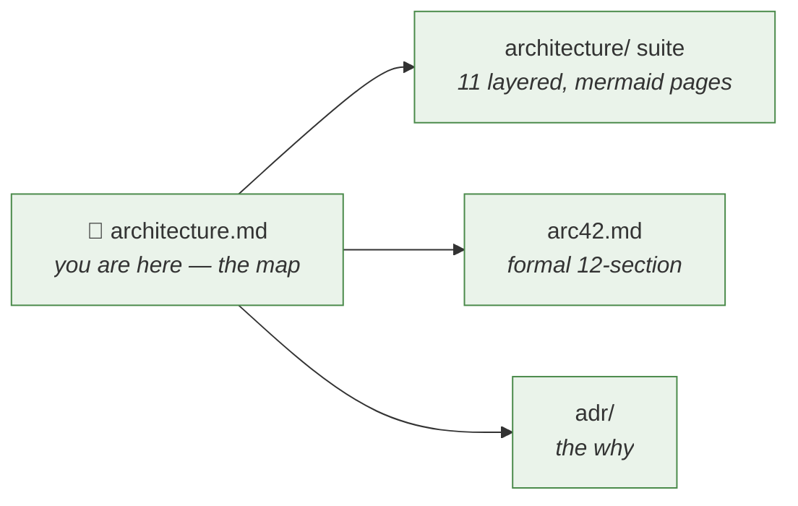
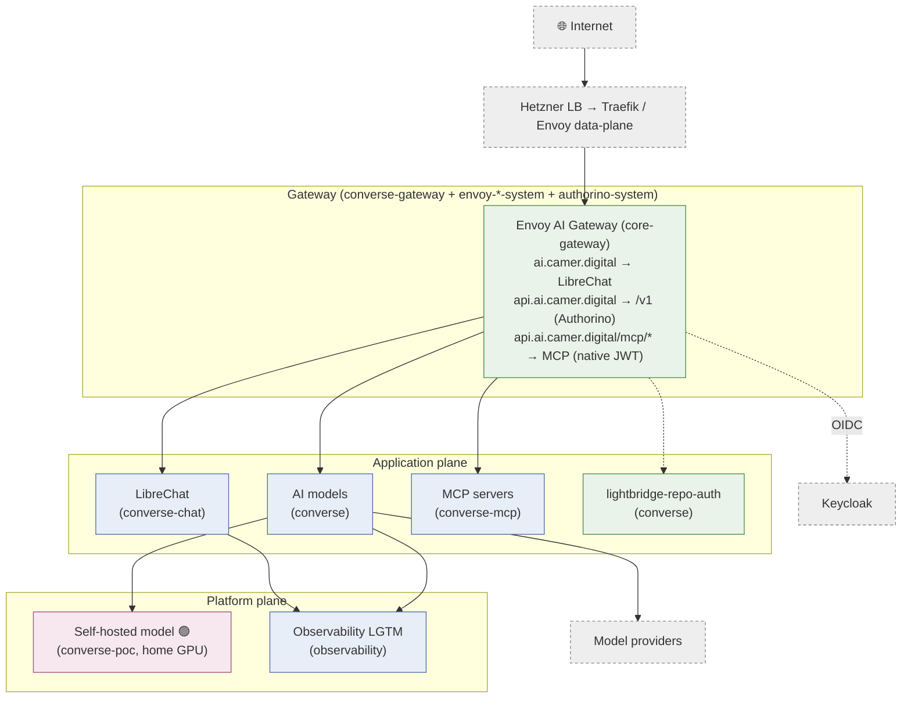
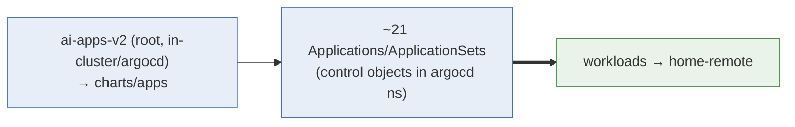
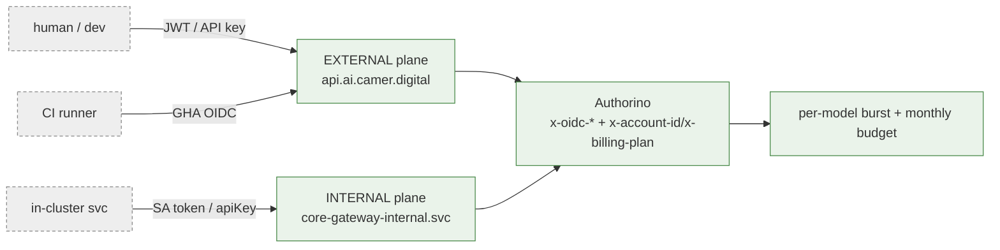
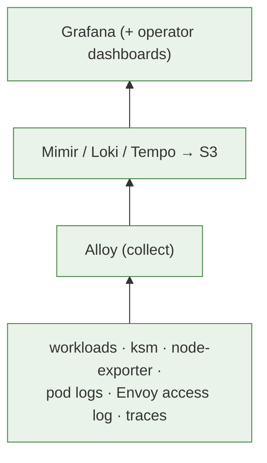

# Architecture overview

The single-page map of how this repo's charts compose into a running system.
Read after the top-level [README](../README.md). For depth, follow the
**[layered architecture suite](architecture/README.md)** (C4 context → container →
component, plus one page per subsystem) or the formal
**[arc42 description](arc42.md)**. Every *why* lives in the
[ADR index](adr/README.md).

> Reflects `release-2026.06.14-v03`. Coder was removed (ADR-0027) and is not shown.

## Where to go for what

| You want… | Go to |
|---|---|
| Who uses it & what it depends on | [suite · 01 Context](architecture/01-context.md) |
| What's deployed where | [suite · 02 Containers](architecture/02-containers.md) |
| How a request flows | [suite · 03 Gateway components](architecture/03-gateway-components.md) |
| How charts become workloads; releases | [suite · 04 GitOps](architecture/04-gitops-deployment.md) |
| Auth, identity, the `x-oidc-*` contract | [suite · 05 Auth](architecture/05-auth-identity.md) |
| Networking, Cilium, TLS | [suite · 06 Networking & TLS](architecture/06-networking-tls.md) |
| Data, secrets, object storage | [suite · 07 Data & secrets](architecture/07-data-secrets.md) |
| The observability pipeline | [suite · 08 Observability](architecture/08-observability.md) |
| Model fan-out + the GPU model | [suite · 09 Model serving](architecture/09-model-serving.md) |
| MCP routing + proxies | [suite · 10 MCP](architecture/10-mcp.md) |

## Cluster topology (the one-glance view)

## GitOps in one diagram

Two clusters: ArgoCD runs on `admin@homeos`; workloads run on Hetzner
`home-remote`. The root `ai-apps-v2` Application is **applied manually** and pins
an **immutable release tag** (never `main` — ADR-0031). Detail:
[suite · 04 GitOps](architecture/04-gitops-deployment.md).

## Auth in one diagram

Dual-plane, AuthConfig-per-Host (ADR-0021). A valid Keycloak JWT is the
authorization boundary; CI uses GitHub OIDC via `lightbridge-repo-auth`. OPA was
removed (2026-06-04). Detail: [suite · 05 Auth](architecture/05-auth-identity.md).

> ⚠️ `/mcp/*` is the one carve-out from Authorino — Envoy-native JWT verification
> + RFC 9728 discovery (ADR-0038), with external MCPs fronted by in-cluster
> normalizing proxies (ADR-0040/0041). See [suite · 10 MCP](architecture/10-mcp.md).

## Observability in one diagram

LGTM + Alloy, per-user attribution from JWT → Loki labels. Detail:
[suite · 08 Observability](architecture/08-observability.md).

## What is *not* in this repo

Shared cluster infrastructure is owned externally — this repo only *consumes* it
by name (no Application here): **Traefik**, **CloudNativePG** + Barman,
**cert-manager** + ClusterIssuers, **redis-ha**, the **External Secrets
Operator** + the `ssegning-aws` store, and the **OpenTelemetry Operator**. There
is also **no `ai-gitops` repo** — per-env config lives in `environments/` and the
root Application is applied manually with its tag pinned in `home-os`
`charts/cd`. Detail: [suite · 07 Data & secrets](architecture/07-data-secrets.md).

## Glossary

- **AI Gateway** — Envoy AI Gateway (`aieg`); the OpenAI-compatible reverse proxy fronting upstream LLM providers.
- **lightbridge-repo-auth** — the GitHub-OIDC → billing-account binding for CI (ADR-0047).
- **LGTM stack** — Loki + Grafana + Tempo + Mimir.
- **MCP** — Model Context Protocol; the tool-server protocol exposed at `/mcp/*`.
- **ESO** — External Secrets Operator. **CNPG** — CloudNativePG. **Authorino** — Kuadrant ext_authz enforcing our AuthConfig.
