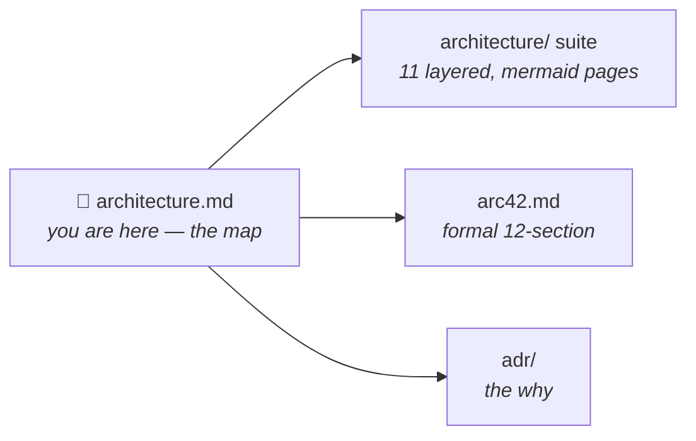
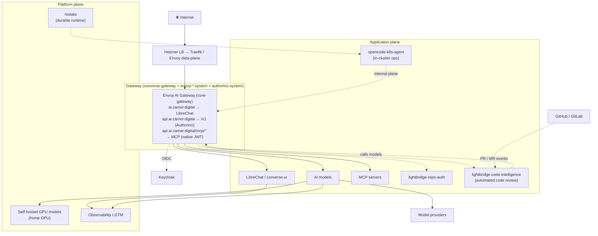
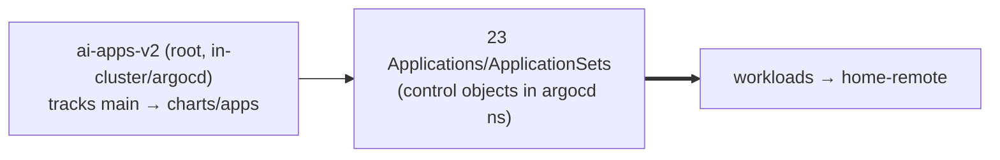
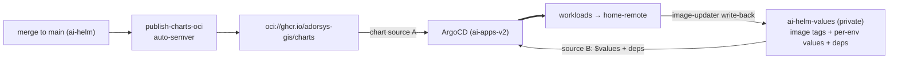
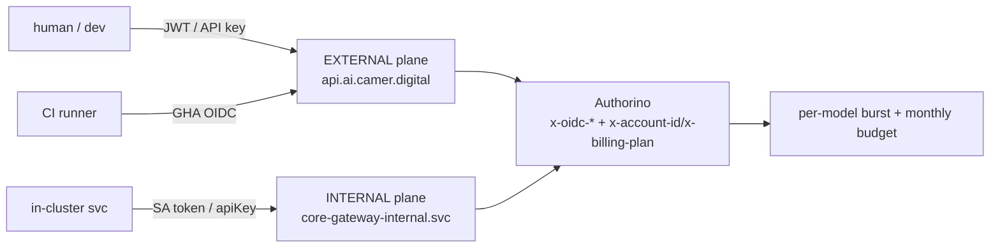
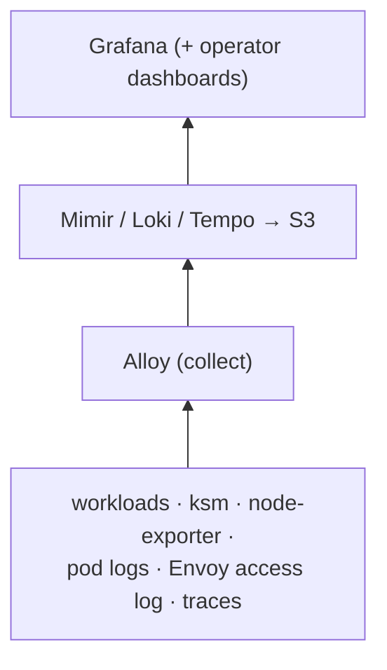
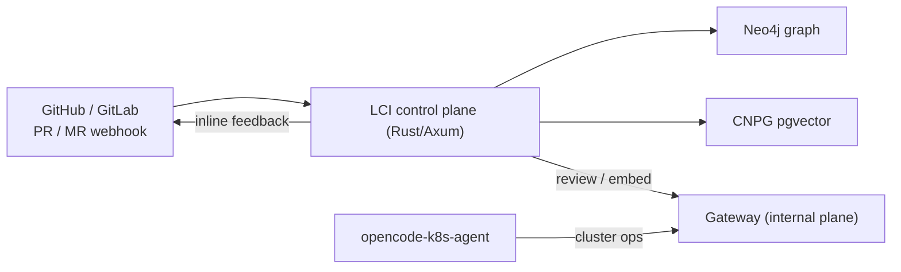

# Architecture overview

The single-page map of how this repo's charts compose into a running system.
Read after the top-level [README](../README.md). For depth, follow the
**[layered architecture suite](architecture/README.md)** (C4 context → container →
component, plus one page per subsystem) or the formal
**[arc42 description](arc42.md)**. Every *why* lives in the
[ADR index](adr/README.md).

> Reflects `main` under **continuous delivery** (ADR-0055; charts float from OCI,
> no release tag). Coder was removed (ADR-0027) and is returning (issue #651);
> the newer surfaces — code intelligence, the in-cluster agent, and Restate —
> are shown below.

## Where to go for what

```mermaid
flowchart LR
    HERE["📍 architecture.md<br/><i>you are here — the map</i>"]
    SUITE["architecture/ suite<br/><i>11 layered, mermaid pages</i>"]
    ARC["arc42.md<br/><i>formal 12-section</i>"]
    ADR["adr/<br/><i>the why</i>"]
    HERE --> SUITE & ARC & ADR
```

| You want… | Go to |
|---|---|
| Who uses it & what it depends on | [suite · 01 Context](architecture/01-context.md) |
| What's deployed where | [suite · 02 Containers](architecture/02-containers.md) |
| How a request flows | [suite · 03 Gateway components](architecture/03-gateway-components.md) |
| How charts become workloads; releases | [suite · 04 GitOps](architecture/04-gitops-deployment.md) |
| Auth, identity, the `x-oidc-*` contract | [suite · 05 Auth](architecture/05-auth-identity.md) |
| Networking, Cilium, TLS | [suite · 06 Networking & TLS](architecture/06-networking-tls.md) |
| Data, secrets, object storage | [suite · 07 Data & secrets](architecture/07-data-secrets.md) |
| The observability pipeline | [suite · 08 Observability](architecture/08-observability.md) |
| Model fan-out + the GPU model | [suite · 09 Model serving](architecture/09-model-serving.md) |
| MCP routing + proxies | [suite · 10 MCP](architecture/10-mcp.md) |

## Cluster topology (the one-glance view)

```mermaid
flowchart TB
    NET["🌐 Internet"]
    LB["Hetzner LB → Traefik / Envoy data-plane"]

    subgraph gw["Gateway (converse-gateway + envoy-*-system + authorino-system)"]
        CG["Envoy AI Gateway (core-gateway)<br/>ai.camer.digital → LibreChat<br/>api.ai.camer.digital → /v1 (Authorino)<br/>api.ai.camer.digital/mcp/* → MCP (native JWT)"]
    end

    subgraph app["Application plane"]
        LC["LibreChat / converse-ui"]
        MODELS["AI models"]
        MCP["MCP servers"]
        REPO["lightbridge-repo-auth"]
        LCI["lightbridge-code-intelligence<br/>(automated code review)"]
        AGENT["opencode-k8s-agent<br/>(in-cluster ops)"]
    end

    subgraph infra["Platform plane"]
        GPU["Self-hosted GPU models<br/>(home GPU)"]
        OBS["Observability LGTM"]
        RST["restate<br/>(durable runtime)"]
    end

    KC["Keycloak"]
    PROV["Model providers"]
    GIT["GitHub / GitLab"]

    NET --> LB --> CG
    CG --> LC & MODELS & MCP
    CG -.-> REPO & LCI
    AGENT -.internal plane.-> CG
    LCI -.calls models.-> CG
    GIT -.PR / MR events.-> LCI
    MODELS --> PROV & GPU
    CG -.OIDC.-> KC
    LC --> OBS
    MODELS --> OBS
    RST -.-> AGENT

```

> **Vanity-domain redirects (ADR-0053).** We own `kivoyo.com`; its DNS already
> points at these LBs. `api.ai.kivoyo.com` is `307`-redirected to
> `api.ai.camer.digital` at the Envoy Gateway (`charts/core-gateway`
> `gateway.redirectHosts`), and `ai.kivoyo.com` is `302`-redirected to
> `ai.camer.digital` at Traefik (a `redirectRegex` Middleware + Ingress in
> `charts/librechat-app`). Temporary + path-preserving; `camer.digital` stays
> canonical.

## GitOps in one diagram

Two clusters: ArgoCD runs on `admin@homeos`; workloads run on Hetzner
`home-remote`. The root `ai-apps-v2` Application is **applied from `home-os`** and
now **tracks `main`** — continuous delivery (ADR-0055) replaced the immutable-tag
model (ADR-0031). Detail: [suite · 04 GitOps](architecture/04-gitops-deployment.md).

```mermaid
flowchart LR
    ROOT["ai-apps-v2 (root, in-cluster/argocd)<br/>tracks main → charts/apps"]
    APPS["23 Applications/ApplicationSets<br/>(control objects in argocd ns)"]
    WL["workloads → home-remote"]
    ROOT --> APPS ==> WL
```

**Continuous delivery (ADR-0055/0056)** — a merge to `main` is a live deploy;
charts float from OCI on a semver range, image tags + per-env values live in the
private `ai-helm-values` repo, and argocd-image-updater writes new tags back.
Rollback is a `git revert` in `ai-helm-values` (or a chart-version pin). Runbook:
[`continuous-delivery.md`](continuous-delivery.md).

```mermaid
flowchart LR
    PR["merge to main (ai-helm)"] --> PUB["publish-charts-oci<br/>auto-semver"]
    PUB --> OCI["oci://ghcr.io/adorsys-gis/charts"]
    OCI -->|chart source A| ARGO["ArgoCD (ai-apps-v2)"]
    VAL["ai-helm-values (private)<br/>image tags + per-env values + deps"] -->|source B: $values + deps| ARGO
    ARGO ==> WL2["workloads → home-remote"]
    WL2 -->|image-updater write-back| VAL
```

## Auth in one diagram

Dual-plane, AuthConfig-per-Host (ADR-0021). A valid Keycloak JWT is the
authorization boundary; CI uses GitHub OIDC via `lightbridge-repo-auth`. OPA was
removed (2026-06-04). Detail: [suite · 05 Auth](architecture/05-auth-identity.md).

```mermaid
flowchart LR
    H["human / dev"] -->|JWT / API key| EXT["EXTERNAL plane<br/>api.ai.camer.digital"]
    CI["CI runner"] -->|GHA OIDC| EXT
    SVC["in-cluster svc"] -->|SA token / apiKey| INT["INTERNAL plane<br/>core-gateway-internal.svc"]
    EXT --> A["Authorino<br/>x-oidc-* + x-account-id/x-billing-plan"]
    INT --> A
    A --> RL["per-model burst + monthly budget"]
```

> ⚠️ `/mcp/*` is the one carve-out from Authorino — Envoy-native JWT verification
> + RFC 9728 discovery (ADR-0038), with external MCPs fronted by in-cluster
> normalizing proxies (ADR-0040/0041). See [suite · 10 MCP](architecture/10-mcp.md).

## Observability in one diagram

LGTM + Alloy, per-user attribution from JWT → Loki labels; opaque `user_id`
UUIDs + offline grants resolved via a read-only Keycloak datasource
([`keycloak-identity-datasource.md`](integrations/keycloak-identity-datasource.md),
ADR-0063/0064). Detail: [suite · 08 Observability](architecture/08-observability.md).

```mermaid
flowchart BT
    SRC["workloads · ksm · node-exporter ·<br/>pod logs · Envoy access log · traces"]
    ALLOY["Alloy (collect)"]
    STORE["Mimir / Loki / Tempo → S3"]
    GRAF["Grafana (+ operator dashboards)"]
    SRC --> ALLOY --> STORE --> GRAF
```

## Code intelligence & agents in one diagram

Automated code review (`lightbridge-code-intelligence`) and the in-cluster
`opencode-k8s-agent` both call models through the gateway; the agent uses the
**internal** plane with its own SA token (ADR-0037). Detail:
[arc42 · §5](arc42.md#5-building-block-view).

```mermaid
flowchart LR
    GH["GitHub / GitLab<br/>PR / MR webhook"] --> CP["LCI control plane (Rust/Axum)"]
    CP --> NEO["Neo4j graph"]
    CP --> PG["CNPG pgvector"]
    CP -->|review / embed| GWI["Gateway (internal plane)"]
    AG["opencode-k8s-agent"] -->|cluster ops| GWI
    CP -->|inline feedback| GH
```

## What is *not* in this repo

Shared cluster infrastructure is owned externally — this repo only *consumes* it
by name (no Application here): **Traefik**, **CloudNativePG** + Barman,
**cert-manager** + ClusterIssuers, **redis-ha**, the **External Secrets
Operator** + the `ssegning-aws` store, the **OpenTelemetry Operator**, and the
k3s-bundled **metrics-server** (ADR-0054). The old `ai-gitops` repo was never
built: under continuous delivery (ADR-0055/0056) the private **`ai-helm-values`**
repo holds the written-back image tags, the per-env `environments/` overlays, and
every workload `valuesObject` — values-only. The root `ai-apps-v2` Application is
applied from `home-os` (tracking `main`, pinned in `home-os` `charts/cd`). Detail:
[suite · 07 Data & secrets](architecture/07-data-secrets.md).

## Glossary

- **AI Gateway** — Envoy AI Gateway (`aieg`, **v1.0** on Envoy Gateway v1.8.1; ADR-0069); the OpenAI-compatible reverse proxy fronting upstream LLM providers. Our AIEG CRs are authored as `aigateway.envoyproxy.io/v1beta1`.
- **lightbridge-repo-auth** — the GitHub-OIDC → billing-account binding for CI (ADR-0047).
- **LGTM stack** — Loki + Grafana + Tempo + Mimir.
- **MCP** — Model Context Protocol; the tool-server protocol exposed at `/mcp/*`.
- **ESO** — External Secrets Operator. **CNPG** — CloudNativePG. **Authorino** — Kuadrant ext_authz enforcing our AuthConfig.
