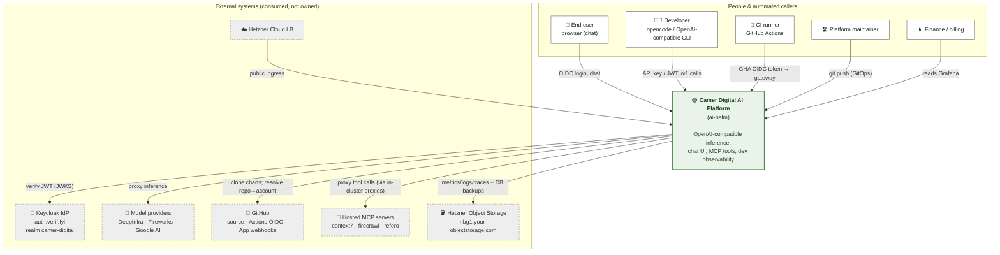

# 01 · System context (C4 Level 1)

The platform as a single box, with everyone who talks to it and everything it
depends on. No internals here — that's [02 Containers](02-containers.md).

## The one-box view

## Actors

| Actor | How they reach the platform | Identity |
|---|---|---|
| **End user** | LibreChat browser UI at `ai.camer.digital` | Keycloak OIDC (code + PKCE) |
| **Developer** | `opencode` / any OpenAI-compatible client at `api.ai.camer.digital/v1` | API key from the self-service portal, or a Keycloak JWT |
| **CI runner** | GitHub Actions calling the gateway | **GitHub Actions OIDC token** → resolved to a billing account by `lightbridge-repo-auth` (no shared key — see [05](05-auth-identity.md)) |
| **Platform maintainer** | `git push` → ArgoCD reconciles | Git + cluster RBAC |
| **Finance / billing** | Grafana dashboards | Read-only |

## External systems (the platform's hard dependencies)

These are **referenced by name only** — installed and owned by the companion
repos (`home-os`, `hetzner-k8s`) or by SaaS vendors. See
[07 Data & secrets](07-data-secrets.md) and
[06 Networking & TLS](06-networking-tls.md) for how each is wired in.

| System | Role | Owner |
|---|---|---|
| **Keycloak** (`auth.verif.fyi`) | The OIDC identity provider; issues every human/SA JWT; source of the `billing_plan` claim | external |
| **Model providers** | The actual inference (DeepInfra, Fireworks, Google AI Studio) | SaaS |
| **GitHub** | Chart source repo; **GHA OIDC** issuer for CI auth; **App webhooks** for `lightbridge-repo-auth` org→account binding | SaaS |
| **Hosted MCP servers** | Third-party tools (context7, firecrawl, refero) — fronted by in-cluster normalizing proxies | SaaS |
| **Hetzner Object Storage** | S3 for Mimir/Loki/Tempo blocks, CNPG/Mongo backups, LibreChat files | Hetzner |
| **Hetzner Cloud LB** | The public data-plane load balancer (`46.225.38.138`) | Hetzner |
| **cert-manager · ESO · Redis · CNPG · Traefik** | TLS, secret sync, sessions/counters, Postgres, ingress | `home-os` / `hetzner-k8s` |

## Scope boundary

**Inside** the box (this repo owns): the Envoy AI Gateway + auth policies,
per-model routing + budgets, LibreChat, the opencode discovery + model catalog,
MCP servers + proxies, the self-hosted GPU model, the observability stack +
dashboards, and all the GitOps glue.

**Outside** the box: every dashed node above, plus the ArgoCD control plane
itself (it runs on a *separate* cluster — see [04 GitOps](04-gitops-deployment.md)).

→ Next layer: [02 · Containers](02-containers.md)
