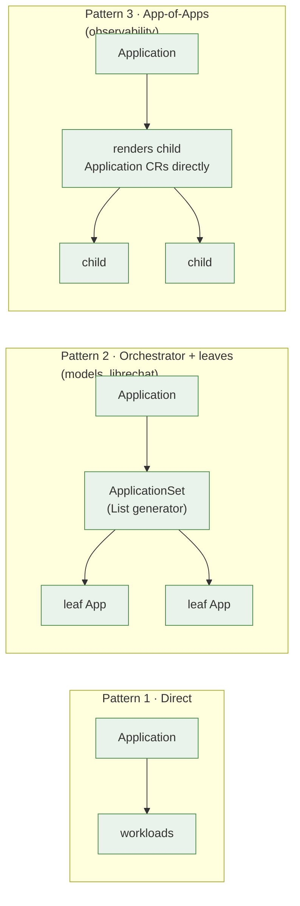

# 02 · Containers (C4 Level 2)

The platform broken into deployable units, **grouped by namespace** on the
Hetzner workload cluster (`home-remote`). Each box is roughly one ArgoCD
`Application` / one chart. The ArgoCD control plane that *deploys* all of this
lives on a different cluster — see [04 GitOps](04-gitops-deployment.md).

## Workload map (by namespace)

```mermaid
flowchart TB
    LB(["☁️ Hetzner LB → Traefik / Envoy data-plane"]):::ext

    subgraph eg_ns["ns: envoy-gateway-system"]
        EG["eg<br/><i>Envoy Gateway controller<br/>+ data-plane proxies</i>"]:::own
    end
    subgraph aieg_ns["ns: envoy-ai-gateway-system"]
        AIEG["aieg + aieg-crd<br/><i>AI Gateway controller</i>"]:::own
    end
    subgraph gw_ns["ns: converse-gateway"]
        CG["core-gateway<br/><i>Gateway, listeners, AIGatewayRoutes,<br/>BackendTrafficPolicies, ACME issuer,<br/>OTel traces collector</i>"]:::own
        SP["security-policies<br/><i>Authorino AuthConfigs + SecurityPolicy</i>"]:::own
    end
    subgraph authz_ns["ns: authorino-system"]
        AUTH["authorino-operator<br/><i>+ Authorino instance (ext_authz)</i>"]:::own
    end

    subgraph converse_ns["ns: converse"]
        MODELS["models<br/><i>ai-models orchestrator →<br/>1 route+budget App per model</i>"]:::ctrl
        LBACK["lightbridge-backend<br/><i>authz/usage service</i>"]:::own
        REPOAUTH["lightbridge-repo-auth<br/><i>GitHub org→account binding</i>"]:::own
        UI["converse-ui<br/><i>self-service frontend</i>"]:::own
    end
    subgraph chat_ns["ns: converse-chat"]
        LC["librechat<br/><i>app + MongoDB + Meili search<br/>+ opencode well-known</i>"]:::ctrl
        MB["mongodb-backup"]:::own
    end
    subgraph mcp_ns["ns: converse-mcp"]
        MCPS["mcps<br/><i>brave · terraform (self-hosted)<br/>context7 · firecrawl · refero (proxied)</i>"]:::ctrl
    end
    subgraph poc_ns["ns: converse-poc"]
        QWEN["model-serving-qwen3-5 🟢<br/><i>Qwen3.5-4B Q4 · llama.cpp · GPU</i>"]:::gpu
        QWEN4["model-serving-qwen3-4b<br/><i>vLLM · standby</i>"]:::gpu
    end

    subgraph obs_ns["ns: observability"]
        OBS["observability orchestrator →<br/>mimir · loki · tempo · alloy ·<br/>grafana · grafana-operator ·<br/>kube-state-metrics · node-exporter ·<br/>dashboards"]:::ctrl
    end
    subgraph mon_ns["ns: monitoring"]
        APPR["apprise-api · opencode-k8s-agent"]:::own
    end
    subgraph sys_ns["ns: kube-system"]
        MS["metrics-server"]:::own
    end

    subgraph external["External (consumed by name)"]
        KC["Keycloak"]:::ext
        REDIS["redis-ha<br/>redis-system"]:::ext
        CNPG["CNPG operator + lightbridge-db<br/>cnpg-system"]:::ext
        ESO["ESO + ssegning-aws store<br/>external-secrets"]:::ext
        S3["Hetzner Object Storage"]:::ext
        PROV["Model providers"]:::ext
    end

    LB --> CG
    CG -.->|ext_authz| AUTH
    SP -.->|configures| AUTH
    CG -->|routes| MODELS
    MODELS -->|provider backends| PROV
    MODELS -->|self-hosted| QWEN
    CG -->|"/mcp/*"| MCPS
    LC -->|/v1 internal plane| CG
    UI --> LBACK
    LC --> REDIS
    LC --> S3
    REPOAUTH --> CNPG
    OBS --> S3
    AUTH -.-> KC
    converse_ns -.->|secrets| ESO
    chat_ns -.->|secrets| ESO

    classDef own fill:#eaf3ea,stroke:#4a8a4a,color:#1a401a;
    classDef ctrl fill:#e8eef7,stroke:#4a6fa5,color:#1a2a40;
    classDef ext fill:#eee,stroke:#888,color:#333,stroke-dasharray:4 3;
    classDef gpu fill:#f7e8f0,stroke:#a54a81,color:#401a2e;
```

## Containers by responsibility

### Edge & gateway

| Container | Namespace | Chart | Role |
|---|---|---|---|
| `eg` | `envoy-gateway-system` | upstream gateway-helm | Envoy Gateway controller + the data-plane proxy fleet |
| `aieg` / `aieg-crd` | `envoy-ai-gateway-system` | upstream ai-gateway-helm | The AI Gateway controller (translates `AIGatewayRoute` → Envoy config) + its CRDs |
| `core-gateway` | `converse-gateway` | `charts/core-gateway` | The `Gateway`, its listeners (external + internal), traffic/client policies, the in-namespace ACME `Issuer`, the `-traces` OTel collector |
| `security-policies` | `converse-gateway` | `charts/kuadrant-policies` | The per-host `AuthConfig`s + the `SecurityPolicy` that attaches Authorino |
| `authorino-operator` | `authorino-system` | upstream kuadrant | Authorino (the ext_authz service that verifies JWTs + stamps headers) |

### Application plane

| Container | Namespace | Chart | Role |
|---|---|---|---|
| `models` | `converse` | `charts/ai-models` (orchestrator) | Fans out to one `Application` per model — each an `AIGatewayRoute` + `BackendTrafficPolicy`; plus the provider `AIServiceBackend`s |
| `lightbridge-backend` | `converse` | `charts/lightbridge` | First-party authz/usage service |
| `lightbridge-repo-auth` | `converse` | external repo | Binds GitHub orgs → billing accounts so CI authenticates via GHA OIDC ([05](05-auth-identity.md)) |
| `converse-ui` | `converse` | external repo | Self-service frontend |
| `librechat` | `converse-chat` | `charts/librechart` (orchestrator) | Chat UI + MongoDB + Meili search + the opencode `.well-known` discovery |
| `mongodb-backup` | `converse-chat` | `charts/mongodb-backup` | CronJob → object storage |
| `mcps` | `converse-mcp` | `charts/mcps` (orchestrator) | The MCP tool servers — see [10 MCP](10-mcp.md) |

### Self-hosted inference (home GPU)

| Container | Namespace | Chart | Role |
|---|---|---|---|
| `model-serving-qwen3-5` 🟢 | `converse-poc` | `charts/model-serving-qwen3-5` | **LIVE** Qwen3.5-4B Q4 via `llama-server`, `homeCluster: true` |
| `model-serving-qwen3-4b` | `converse-poc` | `charts/model-serving-qwen3-4b` | vLLM build, standby/rollback |

### Platform services

| Container | Namespace | Chart | Role |
|---|---|---|---|
| `observability` | `observability` | `charts/observability` (orchestrator) | The whole LGTM + collection + dashboards stack ([08](08-observability.md)) |
| `apprise-api` / `opencode-k8s-agent` | `monitoring` | external repo | Notification + the in-cluster opencode agent |
| `metrics-server` | `kube-system` | upstream | `kubectl top` / HPA metrics (ADR-0015 collision caveat) |

## Render patterns

Three of these containers are **orchestrators** that don't deploy workloads
directly — they emit child ArgoCD objects. The mechanics are in
[04 GitOps](04-gitops-deployment.md); the shape:

→ Next: [03 · Gateway components](03-gateway-components.md) · or jump to a subsystem [04](04-gitops-deployment.md)–[10](10-mcp.md)
