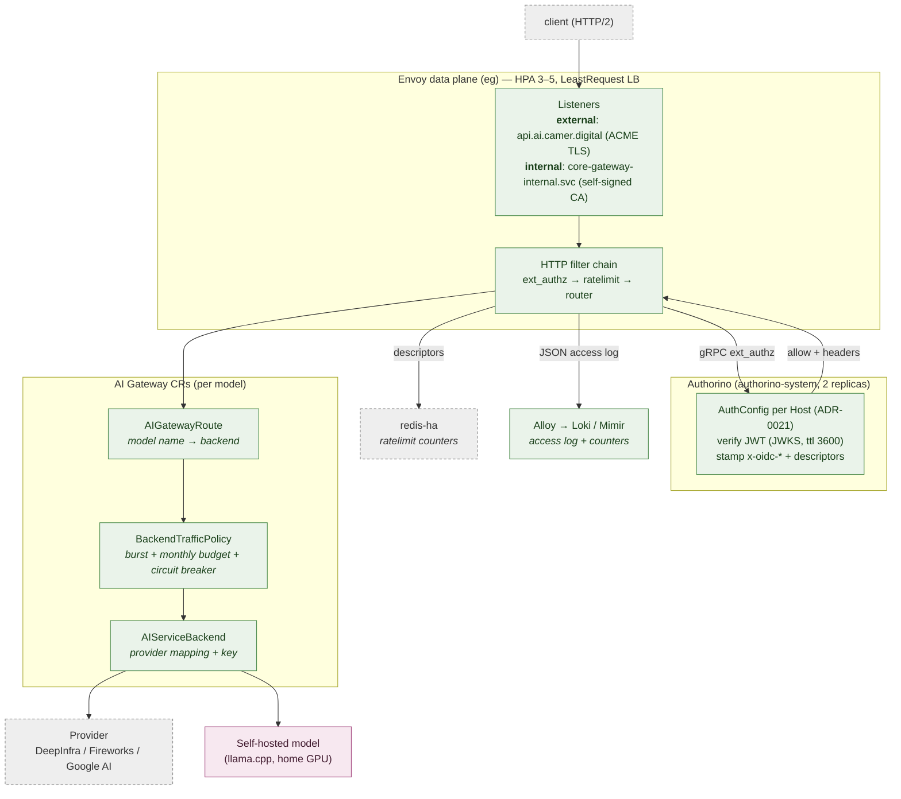
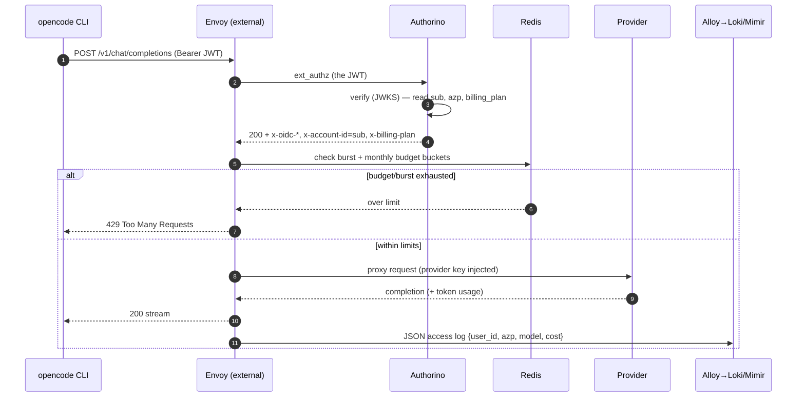
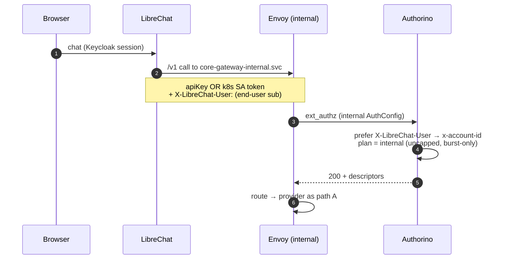
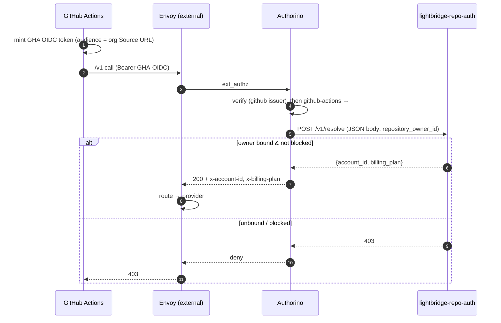
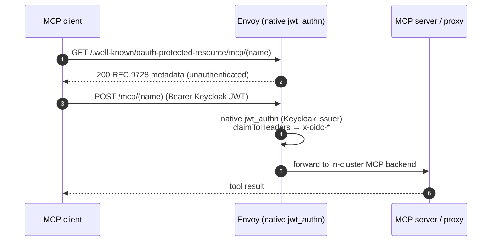

# 03 · Gateway components & the request path (C4 Level 3)

Zoom into the **load-bearing block**: how one inference request crosses the
Envoy AI Gateway, gets authenticated, rate-limited, routed to a provider, and
metered. This is the layer where latency and correctness live.

## Components inside the gateway

| Component | CR / chart | Responsibility |
|---|---|---|
| **Listeners** | `Gateway` (`core-gateway`) | Terminate TLS; split external (public, ACME) vs internal (ClusterIP, self-signed CA) planes |
| **ext_authz** | `SecurityPolicy` → Authorino | Call Authorino over gRPC before routing |
| **AuthConfig** | `kuadrant-policies` | Per-`Host` JWT verification; stamp `x-oidc-*` + `x-account-id`/`x-org-id`/`x-billing-plan` |
| **ratelimit** | `BackendTrafficPolicy` + Redis | Burst (req/min, tokens/min, per user) + monthly USD budget (per user, ADR-0035) |
| **AIGatewayRoute** | `ai-model` leaf | Map an OpenAI model id → an `AIServiceBackend` |
| **AIServiceBackend** | `ai-models-backends` | Provider endpoint + credential + token-cost metadata (`llmRequestCosts`) |
| **access log** | `core-gateway` | Emit per-request JSON (carrying `x-oidc-*`) to Alloy |

## Runtime view — the four canonical request paths

### A · Developer via opencode (external plane, full attribution)

### B · Human via LibreChat (internal plane, service-level attribution)

### C · CI runner via GitHub OIDC (the repo-auth binding)

### D · MCP tool call (`/mcp/*` — Authorino carve-out)

`/mcp/*` routes **displace** the gateway-attached Authorino policy with
Envoy-native JWT verification (same Keycloak issuer). Full detail in
[10 MCP](10-mcp.md).

## Why the gateway can scale

| Concern | Mechanism | Where |
|---|---|---|
| Throughput | HTTP/2 multiplexing + data-plane HPA `3→5` (right-sized to the 32-CPU worker pool), LeastRequest LB | `ClientTrafficPolicy` / `EnvoyProxy` |
| Fairness | Per-user burst + per-user monthly budget | `BackendTrafficPolicy` + Redis |
| Resilience | Circuit breaker + outlier detection (eject erroring backend ≤30 s) | `BackendTrafficPolicy` |
| Zero-cut rollout | 60 s drain (`minDrainDuration` 15 s); PDB `maxUnavailable: 1` | `EnvoyProxy` |
| Cost metering | Native `llmRequestCosts` token extraction (no Lua/Python hop) | `AIGatewayRoute` |

→ Subsystems: [05 Auth](05-auth-identity.md) · [09 Model serving](09-model-serving.md) · [08 Observability](08-observability.md)
