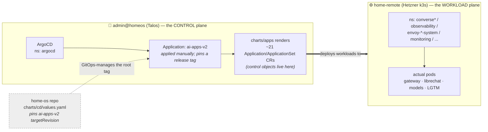
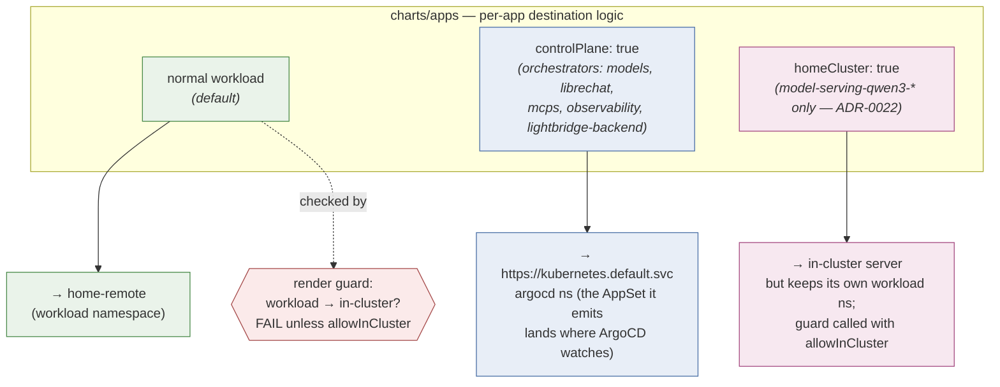
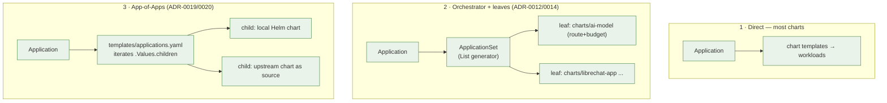
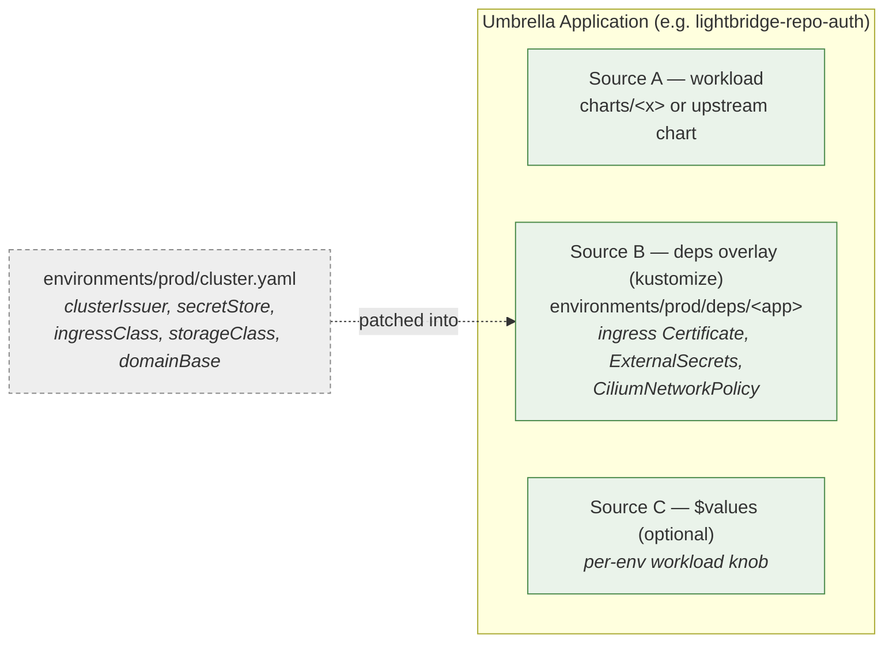
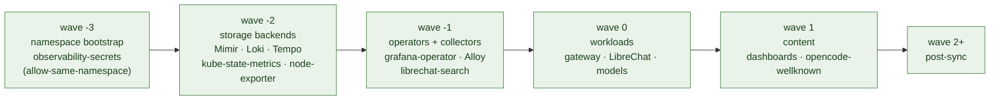
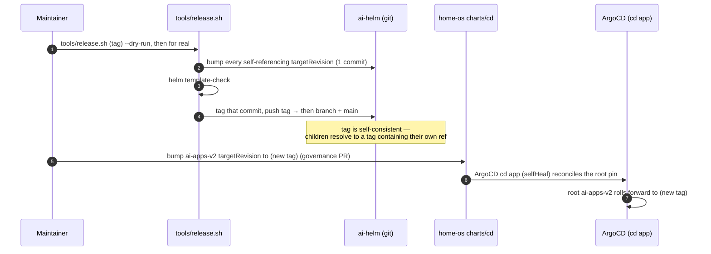

# 04 · GitOps & deployment topology

How charts in this repo become running workloads — the ArgoCD machinery, the
two-cluster split, the render patterns, the sync-wave ordering, and the
release flow. Source ADRs: **0017** (destinations), **0018** (umbrellas +
environments), **0031** (tag-based deploys).

## Two clusters, two roles

ArgoCD does **not** run on the cluster it deploys to.

- **Control objects** (`Application`, `ApplicationSet`) must live where ArgoCD's
  controllers watch → **in-cluster**, the `argocd` namespace on `admin@homeos`.
- **Workloads** target the registered destination **`home-remote`** (the Hetzner
  cluster). A render-time guard hard-fails any workload that resolves to the
  in-cluster handle unless it opts in (`controlPlane` or `homeCluster`).

## Two-tier destinations (ADR-0017)

> **Project invariant:** every Application/ApplicationSet from this repo is in the
> `ai` AppProject. `charts/apps` hardcodes `project: ai`; orchestrator children
> set `argocd.project` (= `ai`). There is intentionally **no per-app override**.

## Three render patterns

| Pattern | Used by | Why |
|---|---|---|
| **Direct** | `core-gateway`, `kuadrant-policies`, most | One chart, one lifecycle |
| **Orchestrator + leaves** | `ai-models` → `ai-model`, `librechart` → `librechat-*` | Per-component sync waves / rollback; adding a component is a list edit |
| **App-of-Apps** | `observability`, (formerly `coder`) | Fixed, heterogeneous children (local + upstream charts with big inline values) |

## Umbrella apps + `environments/` overlays (ADR-0018)

A flat app and its app-scoped prerequisites sync as **one** multi-source
Application:

- Attach deps with one field on the app entry: `depsOverlay: environments/prod/deps/<app>`.
- Kustomize is confined to plain CRs (certs, secrets, network policies) —
  **never** kustomize-over-Helm.
- Today only `environments/prod/` exists; a second env is a drop-in sibling.

## Sync waves (the ordering contract)

Lower waves sync first. The rule is **infrastructure → storage → collection →
visualisation** — violating it once cost a day (`MONITORING_FIX.md`).

> cert-manager and ESO are **not** synced here (external). The `allow-same-namespace`
> CiliumNetworkPolicy ships at wave -3 (before the Mimir stores) so the ring's
> memberlist gossip isn't blocked at startup — see [06 Networking](06-networking-tls.md).

## Release flow — tag-based, two repos (ADR-0031)

Deploys pin an **immutable release tag** (`release-YYYY.MM.DD-vNN`), never `main`.

> ⚠️ Skip the **home-os** step and the root self-heals back to the OLD tag — an
> effective rollback. The durable source of the root's pin is `home-os`
> `charts/cd`, not a live `kubectl patch`. Rollback = bump the root to any prior
> tag (immutable → exact prior state). See [`../releasing.md`](../releasing.md).

→ Related: [06 Networking & TLS](06-networking-tls.md) · [07 Data & secrets](07-data-secrets.md)
