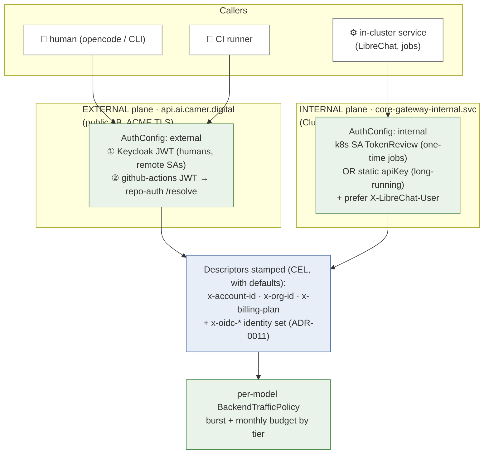
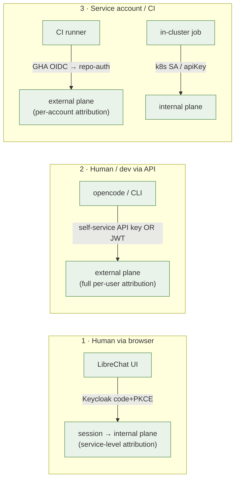
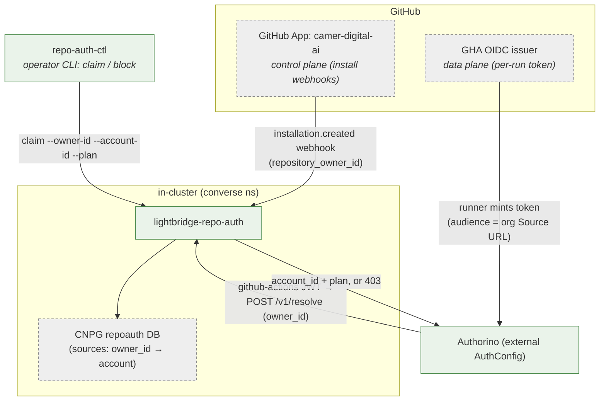

# 05 · Auth & identity

The authorization boundary, the three identity surfaces, the dual-plane
AuthConfig model, and the canonical downstream header contract. Source ADRs:
**0011** (`x-oidc-*`), **0021** (dual-plane + billing), **0035** (per-person
budgets), **0038** (MCP carve-out), **0047/0049** (GitHub OIDC binding).

> **The boundary in one line:** a valid **Keycloak JWT** = "you are in our
> system, you may use the gateway." OPA was removed (2026-06-04) — there is no
> per-request policy hop. Authorization differentiation is done by *which host*
> the request hits and *what claims* the token carries.

## Dual-plane, AuthConfig-per-Host (ADR-0021)

One `SecurityPolicy` + one Authorino, indexed by `Host`. Same gateway, two
planes with different trust assumptions.

| Plane | Host | TLS | Accepts | Trust basis |
|---|---|---|---|---|
| **External** | `api.ai.camer.digital` | ACME (Let's Encrypt) | Keycloak JWT **or** GitHub Actions OIDC | Full JWT verification; billing/org claims optional (CEL defaults `→ free`/`→ sub`) |
| **Internal** | `core-gateway-internal.…svc` | `self-signed-ca` | k8s SA token **or** static apiKey | First-party-only; Authorino overwrites descriptors |

## The three identity surfaces

**Per-user attribution for LibreChat:** LibreChat authenticates as *itself*
(apiKey) but forwards the end-user's Keycloak `sub` as `X-LibreChat-User`. The
internal AuthConfig's CEL *prefers* that header → the gateway attributes spend to
the real person. Trust is sound because the internal plane is first-party-only
and Authorino overwrites the descriptors.

## The GitHub OIDC binding (CI without a shared key — ADR-0047/0049)

CI runners authenticate with their **own** GitHub Actions OIDC token. No shared
secret, no per-runner registration, no distributed private key.

- **Binding key** = `repository_owner_id` (GitHub numeric, server-set, immutable —
  captured from the webhook payload, never user-typed).
- **Control plane** (the App) only handles install/uninstall webhooks; the
  **data plane** is the per-run OIDC token, rich with repo/context claims.
- Onboarding is **operator-driven** (`repo-auth-ctl claim`), not self-serve.
  `resolve` denies `blocked` first, then unclaimed.
- opencode CI in every ADORSYS-GIS repo authenticates this way via a reusable
  workflow. Full detail: the `lightbridge-repo-auth` memory + repo `docs/`.

## The `x-oidc-*` downstream contract (ADR-0011)

After JWT verification Authorino stamps a fixed header set. Use these names
downstream — don't invent new ones without an ADR.

| Header | Loki label? | Source |
|---|---|---|
| `x-oidc-user-id` | yes (`user_id`) | `auth.identity.sub` |
| `x-oidc-azp` | yes (`azp`) | `auth.identity.azp` |
| `x-oidc-user-name`, `-iss`, `-roles-realm`, `-resource-access`, `-scope`, `-jti`, `-email`, `-name` | no (body only) | JWT claims |

Alongside identity, Authorino stamps the **rate-limit descriptors**
`x-account-id` / `x-org-id` / `x-billing-plan` (ADR-0021).

## Rate-limit tiers (ADR-0021 / ADR-0035)

Keyed on `x-account-id` (burst **and** monthly µ$ budget — both **per-person**
since ADR-0035) + `x-billing-plan`. Static via Helm (`rateLimitBudgeting.plans`),
no dynamic OPA.

| Plan | Monthly budget | Req/min | Tokens/min |
|---|---|---|---|
| `free` | $50 | 200 | 1,000,000 |
| `pro` | $200 | 400 | 2,000,000 |
| `service` | uncapped | 600 | 2,000,000 |
| `internal` | uncapped | 600 | 2,000,000 |

## The `/mcp/*` carve-out (ADR-0038)

MCP routes are the **one** exception to Authorino. An Envoy route-level
`SecurityPolicy` *displaces* the gateway-attached Authorino policy whole, so JWT
verification on `/mcp/*` is Envoy's native `jwt_authn` filter (same Keycloak
issuer); the gateway serves the RFC 9728 discovery surface unauthenticated and
re-stamps `x-oidc-*` via `claimToHeaders`. Rate-limit descriptors are **not**
stamped on MCP routes. See [10 MCP](10-mcp.md).

> ⚠️ **Failure mode to remember:** a missing `sharedSecretRef` secret makes the
> whole AuthConfig `not-Ready` → the gateway returns **404 platform-wide** (this
> is what the OPA-removal/`lightbridge-opa-auth` prune caused). Provision the SM
> property *before* releasing anything that adds an AuthConfig dependency.

→ Related: [03 Gateway request paths](03-gateway-components.md) · [07 Secrets](07-data-secrets.md) · [10 MCP](10-mcp.md)
