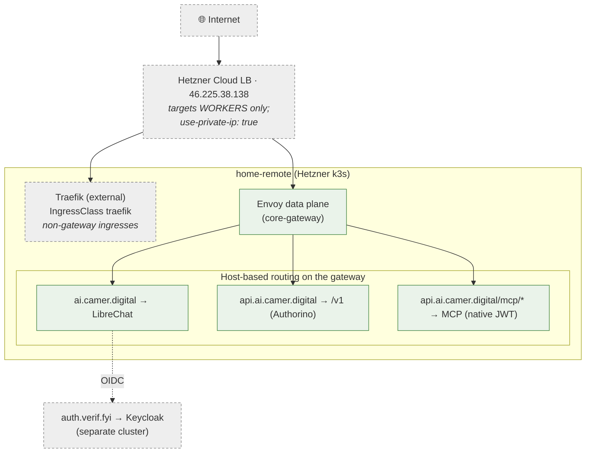
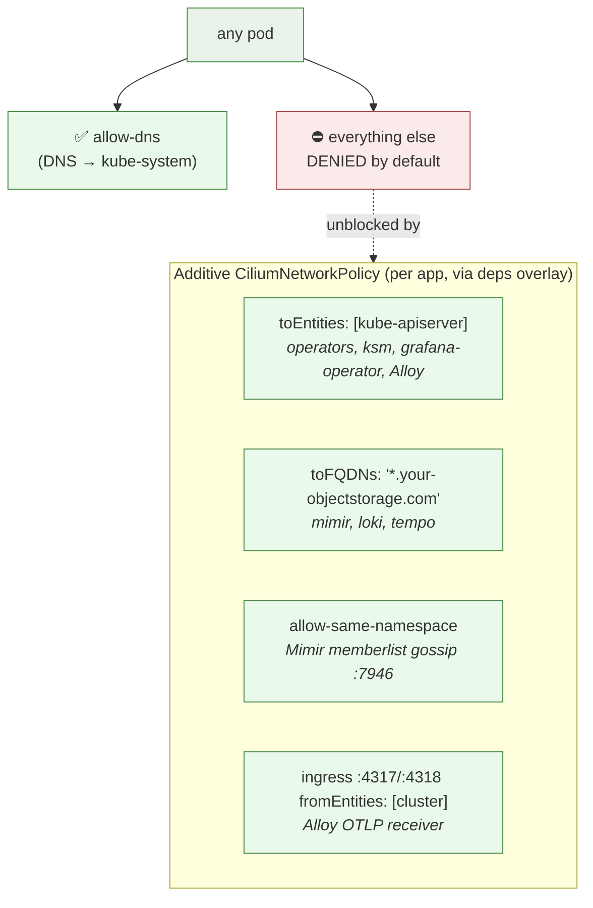
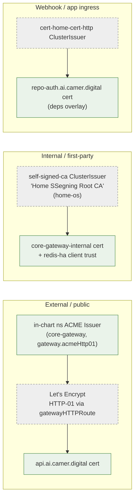
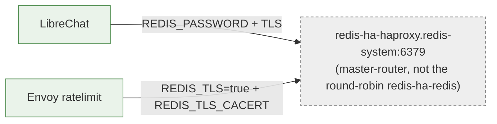

# 06 · Networking & TLS

How traffic enters, how pods are allowed (or denied) to talk, and how
certificates are issued. The Hetzner cluster runs **Cilium with a
default-deny-egress baseline** — the single most common source of "silent
crashloop" incidents — so it gets the most attention here.

## Ingress paths

> **LB gotcha:** the 3 control-plane nodes carry
> `node.kubernetes.io/exclude-from-external-load-balancers`, so the LB only
> targets workers. LB Services need
> `load-balancer.hetzner.cloud/use-private-ip: "true"` (cp-1 has a stale
> providerID and is an unusable target).

## The Cilium deny-egress model

Every app namespace (`apps`/`data`/`observability`/`platform` and the
`converse-*` set) carries a manual `allow-dns` policy — so **every pod is
egress-deny-by-default**. Anything reaching the API server or external object
storage crashloops until it gets an *additive* allow.

> ⚠️ **A plain k8s `NetworkPolicy` `ipBlock` does NOT match on Cilium** — node IPs
> carry `remote-node`/`host` identity. Always use a **`CiliumNetworkPolicy`** with
> `toEntities`/`toFQDNs`. Classic symptom: pod hangs ~32 s, then a 0-`initialDelay`
> liveness probe kills it → looks like a silent exit-2 CrashLoop.

### The Mimir ring trap (ordering-sensitive)

Mimir forms its ingester/store-gateway ring via memberlist gossip. If the pods
start *before* the `allow-same-namespace` policy exists, they exhaust join
retries → the distributor logs `InstancesCount <= 0` → **every remote-write
500s and Mimir silently stores nothing**.

Two-layer guard:
1. `allow-same-namespace` ships from **this repo** at sync wave **-3** (before the
   wave -2 stores) via the `observability-secrets` child.
2. Mimir `memberlist.rejoin_interval: 1m` self-heals the residual race.

## TLS issuance

Two issuers, two trust models — both via cert-manager (installed by `home-os`).

| Surface | Issuer | Mechanism |
|---|---|---|
| `api.ai.camer.digital` (gateway external) | in-chart ns ACME `Issuer` | HTTP-01 via `gatewayHTTPRoute` solver (no DNS token) |
| `core-gateway-internal` (internal plane) | `self-signed-ca` | Home Root CA — same trust model as redis-ha (TLS-only) |
| Ingress hosts (e.g. repo-auth webhook) | `cert-home-cert-http` | Per-app `Certificate` from the deps overlay |

> The retired `cert-home-cert-envoy` issuer and DNS-01/wildcard
> (`cert-cloudflare`, needs a missing `cloudflare-secret`) are **not** in the
> active path. The deps overlay owning a host's `Certificate` is why charts drop
> their `cert-manager.io/cluster-issuer` ingress annotation (ADR-0018).

## redis-ha: TLS-only consumption

redis-ha (deployed by `home-os`) is **TLS-only** (`port 0` / `tls-port 6379`,
`tls-auth-clients no`). Every consumer must connect over TLS *and* trust the
internal CA — a plaintext client gets `connection reset by peer`.

Each consumer namespace needs its own `redis-ha-redis-auth` Secret (via
ExternalSecret) plus a cert-manager `Certificate` from `self-signed-ca`
(`ca.crt` only) for the CA trust.

→ Related: [07 Data & secrets](07-data-secrets.md) · [08 Observability](08-observability.md)
