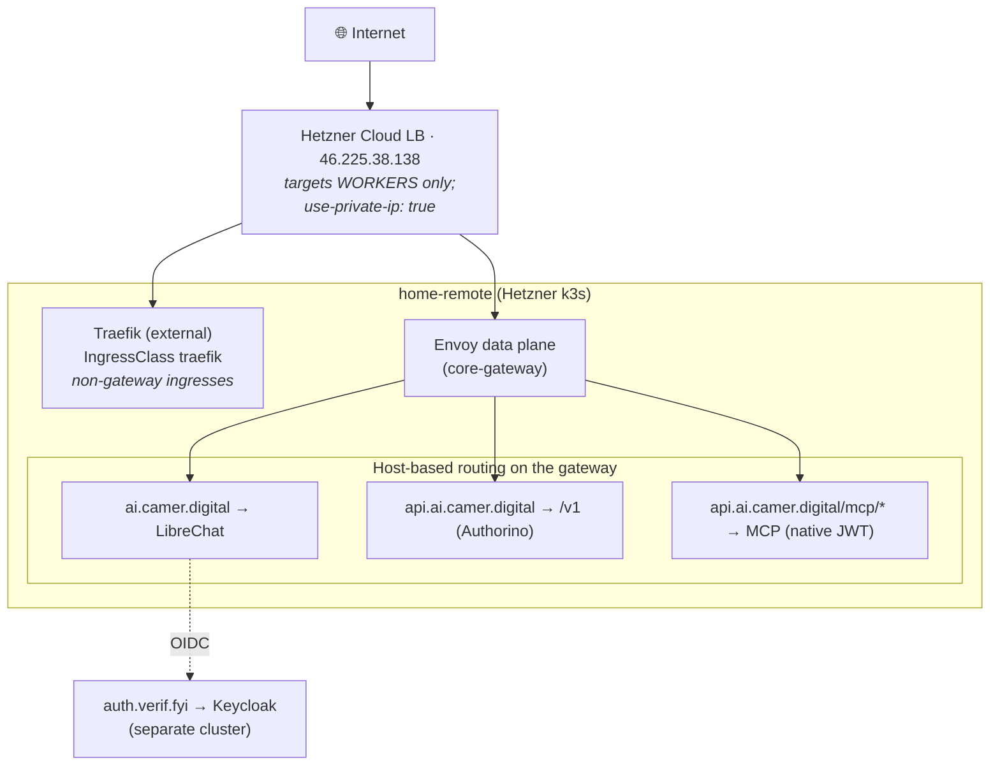
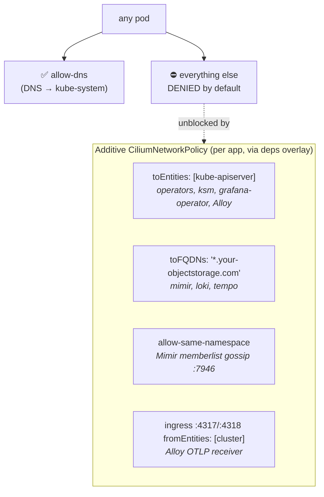
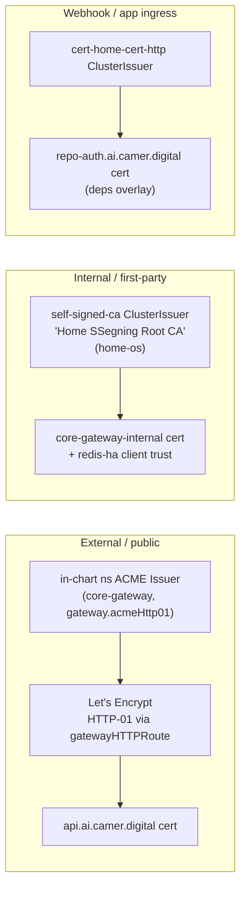
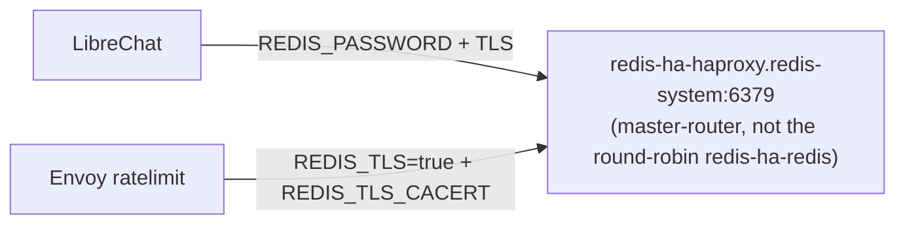
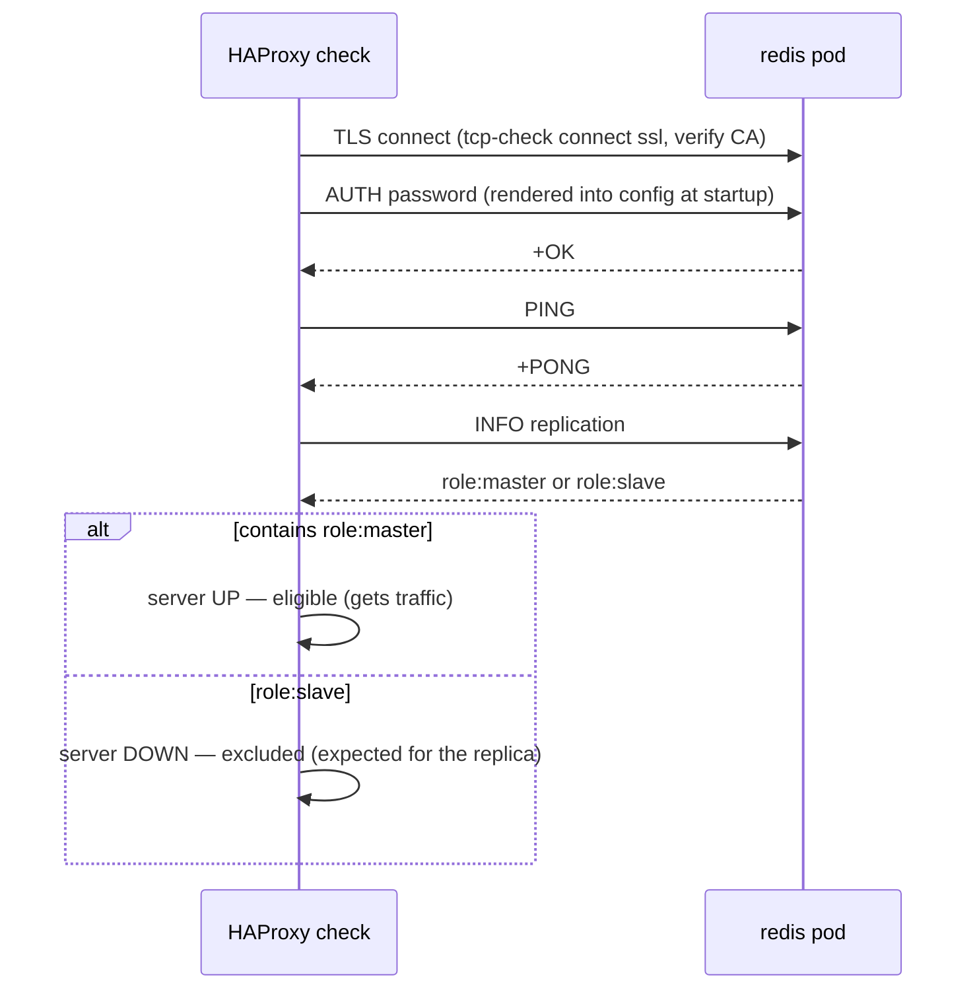
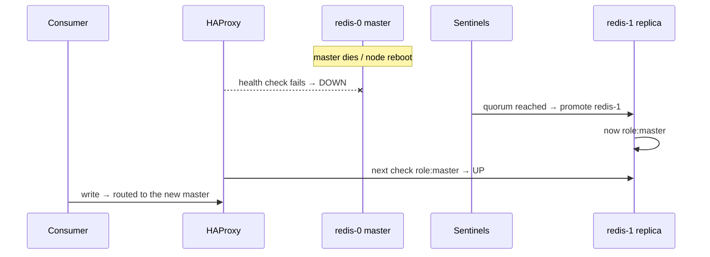

# 06 · Networking & TLS

How traffic enters, how pods are allowed (or denied) to talk, and how
certificates are issued. The Hetzner cluster runs **Cilium with a
default-deny-egress baseline** — the single most common source of "silent
crashloop" incidents — so it gets the most attention here.

## Ingress paths


```mermaid
flowchart TB
    NET["🌐 Internet"]
    LB["Hetzner Cloud LB · 46.225.38.138<br/><i>targets WORKERS only;<br/>use-private-ip: true</i>"]

    subgraph cluster["home-remote (Hetzner k3s)"]
        TRAEFIK["Traefik (external)<br/>IngressClass traefik<br/><i>non-gateway ingresses</i>"]
        EGW["Envoy data plane<br/>(core-gateway)"]

        subgraph hosts["Host-based routing on the gateway"]
            H1["ai.camer.digital → LibreChat"]
            H2["api.ai.camer.digital → /v1 (Authorino)"]
            H3["api.ai.camer.digital/mcp/* → MCP (native JWT)"]
        end
    end

    KC["auth.verif.fyi → Keycloak<br/>(separate cluster)"]

    NET --> LB
    LB --> TRAEFIK
    LB --> EGW
    EGW --> H1 & H2 & H3
    H1 -.OIDC.-> KC

```

> **LB gotcha:** the 3 control-plane nodes carry
> `node.kubernetes.io/exclude-from-external-load-balancers`, so the LB only
> targets workers. LB Services need
> `load-balancer.hetzner.cloud/use-private-ip: "true"` (cp-1 has a stale
> providerID and is an unusable target).

## The Cilium deny-egress model

Every app namespace (`apps`/`data`/`observability`/`platform` and the
`converse-*` set) carries a manual `allow-dns` policy — so **every pod is
egress-deny-by-default**. Anything reaching the API server or external object
storage crashloops until it gets an *additive* allow.


```mermaid
flowchart TB
    POD["any pod"]
    DNS["✅ allow-dns<br/>(DNS → kube-system)"]
    DENY["⛔ everything else<br/>DENIED by default"]

    POD --> DNS
    POD --> DENY

    subgraph additive["Additive CiliumNetworkPolicy (per app, via deps overlay)"]
        API["toEntities: [kube-apiserver]<br/><i>operators, ksm, grafana-operator, Alloy</i>"]
        S3A["toFQDNs: '*.your-objectstorage.com'<br/><i>mimir, loki, tempo</i>"]
        SAME["allow-same-namespace<br/><i>Mimir memberlist gossip :7946</i>"]
        OTLP["ingress :4317/:4318 fromEntities: [cluster]<br/><i>Alloy OTLP receiver</i>"]
    end

    DENY -.->|"unblocked by"| additive

```

> ⚠️ **A plain k8s `NetworkPolicy` `ipBlock` does NOT match on Cilium** — node IPs
> carry `remote-node`/`host` identity. Always use a **`CiliumNetworkPolicy`** with
> `toEntities`/`toFQDNs`. Classic symptom: pod hangs ~32 s, then a 0-`initialDelay`
> liveness probe kills it → looks like a silent exit-2 CrashLoop.

### The Mimir ring trap (ordering-sensitive)

Mimir forms its ingester/store-gateway ring via memberlist gossip. If the pods
start *before* the `allow-same-namespace` policy exists, they exhaust join
retries → the distributor logs `InstancesCount <= 0` → **every remote-write
500s and Mimir silently stores nothing**.

Two-layer guard:
1. `allow-same-namespace` ships from **this repo** at sync wave **-3** (before the
   wave -2 stores) via the `observability-secrets` child.
2. Mimir `memberlist.rejoin_interval: 1m` self-heals the residual race.

## TLS issuance

Two issuers, two trust models — both via cert-manager (installed by `home-os`).


```mermaid
flowchart LR
    subgraph external["External / public"]
        ACME["in-chart ns ACME Issuer<br/>(core-gateway, gateway.acmeHttp01)"]
        LE["Let's Encrypt<br/>HTTP-01 via gatewayHTTPRoute"]
        ACME --> LE --> PUBCERT["api.ai.camer.digital cert"]
    end
    subgraph internal["Internal / first-party"]
        CA["self-signed-ca ClusterIssuer<br/>'Home SSegning Root CA'<br/>(home-os)"]
        CA --> INTCERT["core-gateway-internal cert<br/>+ redis-ha client trust"]
    end
    subgraph ingress["Webhook / app ingress"]
        HTTP["cert-home-cert-http ClusterIssuer"]
        HTTP --> WHCERT["repo-auth.ai.camer.digital cert<br/>(deps overlay)"]
    end

```

| Surface | Issuer | Mechanism |
|---|---|---|
| `api.ai.camer.digital` (gateway external) | in-chart ns ACME `Issuer` | HTTP-01 via `gatewayHTTPRoute` solver (no DNS token) |
| `core-gateway-internal` (internal plane) | `self-signed-ca` | Home Root CA — same trust model as redis-ha (TLS-only) |
| Ingress hosts (e.g. repo-auth webhook) | `cert-home-cert-http` | Per-app `Certificate` from the deps overlay |

> The retired `cert-home-cert-envoy` issuer and DNS-01/wildcard
> (`cert-cloudflare`, needs a missing `cloudflare-secret`) are **not** in the
> active path. The deps overlay owning a host's `Certificate` is why charts drop
> their `cert-manager.io/cluster-issuer` ingress annotation (ADR-0018).

## redis-ha: TLS-only consumption

redis-ha (deployed by `home-os`) is **TLS-only** (`port 0` / `tls-port 6379`,
`tls-auth-clients no`). Every consumer must connect over TLS *and* trust the
internal CA — a plaintext client gets `connection reset by peer`.


```mermaid
flowchart LR
    LCC["LibreChat"] -->|"REDIS_PASSWORD + TLS"| R["redis-ha-haproxy.redis-system:6379<br/>(master-router, not the round-robin redis-ha-redis)"]
    RL["Envoy ratelimit"] -->|"REDIS_TLS=true + REDIS_TLS_CACERT"| R
```

Each consumer namespace needs its own `redis-ha-redis-auth` Secret (via
ExternalSecret) plus a cert-manager `Certificate` from `self-signed-ca`
(`ca.crt` only) for the CA trust.

### Why the master-router (not the round-robin Service)

redis-ha is a Sentinel cluster: one **master** (accepts writes) + one **replica**
(`replica-read-only` → rejects writes). The `redis-ha-redis` Service round-robins
**both**, so a write-consumer's connection lands on the read-only replica ~50 % of the
time → `READONLY You can't write against a read only replica` (hit LibreChat
cache/leader-election and the rate-limiter's counters). Neither consumer speaks
Sentinel, so **HAProxy (`redis-ha-haproxy`) does master discovery for them**: it
health-checks both pods over TLS and routes only to the one reporting `role:master`,
re-electing automatically on failover.

**Master election** — the HAProxy health check, every ~2 s, over TLS:


```mermaid
sequenceDiagram
    participant H as HAProxy check
    participant R as redis pod
    H->>R: TLS connect (tcp-check connect ssl, verify CA)
    H->>R: AUTH password (rendered into config at startup)
    R-->>H: +OK
    H->>R: PING
    R-->>H: +PONG
    H->>R: INFO replication
    R-->>H: role:master  or  role:slave
    alt contains role:master
        H->>H: server UP — eligible (gets traffic)
    else role:slave
        H->>H: server DOWN — excluded (expected for the replica)
    end
```

**Failover** — Sentinel promotes the replica; HAProxy re-points, no client change:


```mermaid
sequenceDiagram
    participant App as Consumer
    participant HAP as HAProxy
    participant M as redis-0 master
    participant S as Sentinels
    participant R as redis-1 replica
    Note over M: master dies / node reboot
    HAP--xM: health check fails → DOWN
    S->>R: quorum reached → promote redis-1
    R->>R: now role:master
    HAP->>R: next check role:master → UP
    App->>HAP: write → routed to the new master
```

**⚠️ HAProxy-for-TLS-Redis gotchas** (in `home-os charts/home-apps/redis-ha`):

| Gotcha | Fix |
|---|---|
| Checks are cleartext by default → hit the TLS-only port → `Layer7 timeout` | `tcp-check connect ssl` + `check-ssl` |
| Crashloops on boot-DNS / uses stale pod IPs after a pod cycles (`Layer4 timeout`) | `init-addr last,libc,none` + a `resolvers` (`parse-resolv-conf`) section + `resolve-prefer ipv4` |
| `${ENV}` is **not** expanded inside `tcp-check send` → literal password sent → `+OK` times out | render the password into the config at startup (an `awk` literal substitution into tmpfs — never in the ConfigMap) |
| `bind ssl crt` needs key+cert in one PEM | cert-manager `additionalOutputFormats: [{type: CombinedPEM}]` |
| The k8s `livenessProbe`/`readinessProbe` are a bare `tcpSocket` against `:6379` → never completes the TLS handshake `bind ssl` requires → every probe tick logs `Connection closed during SSL handshake` (measured: ~93% of the pod's log volume, 2026-07-25) | give the kubelet a **separate cleartext `healthz` frontend** (`monitor-uri`, its own port) and point the probes there instead — leaves `:6379`'s TLS posture untouched since that port carries no redis traffic. Fixed in `home-os` [PR #116](https://github.com/WhyThatFunction/home-os/pull/116) / [issue #117](https://github.com/WhyThatFunction/home-os/issues/117). |

**Verify** (`home-remote` kubeconfig): a replica showing `DOWN` is expected — only the
master is `UP`; `backend 'redis_master' has no server available!` means no master is
reachable (failover in progress, or a check regression — revisit the gotchas). Also
check for `Connection closed during SSL handshake` spam — see the probe gotcha above;
a healthy haproxy pod should log essentially none of these.

```bash
HP=$(kubectl -n redis-system get po -l app.kubernetes.io/controller=haproxy -o name | head -1)
kubectl -n redis-system logs "$HP" | grep -iE "is UP|is DOWN|no server available" | tail
kubectl -n converse logs -l app.kubernetes.io/name=librechat-app --since=10m | grep -ic READONLY   # 0 = healthy
```

→ Related: [07 Data & secrets](07-data-secrets.md) · [08 Observability](08-observability.md)
