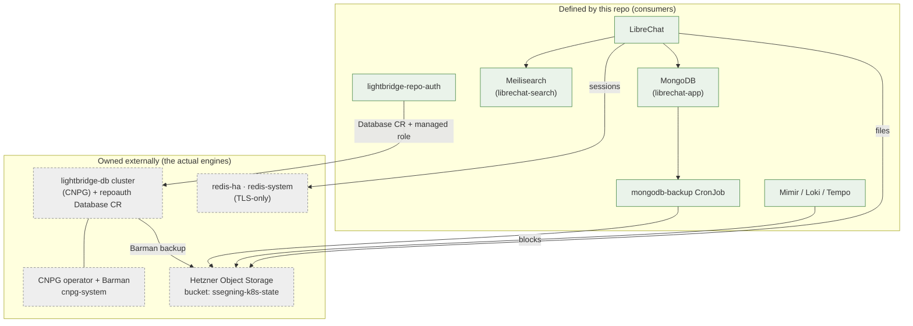
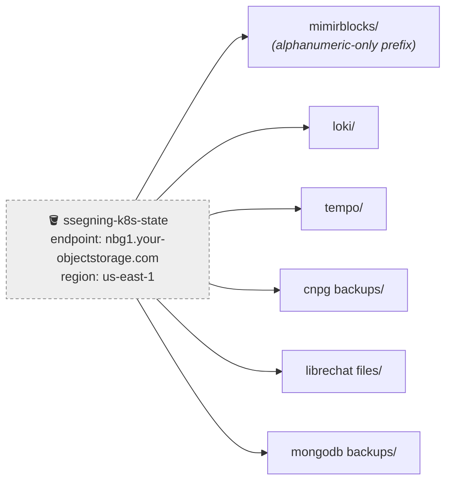
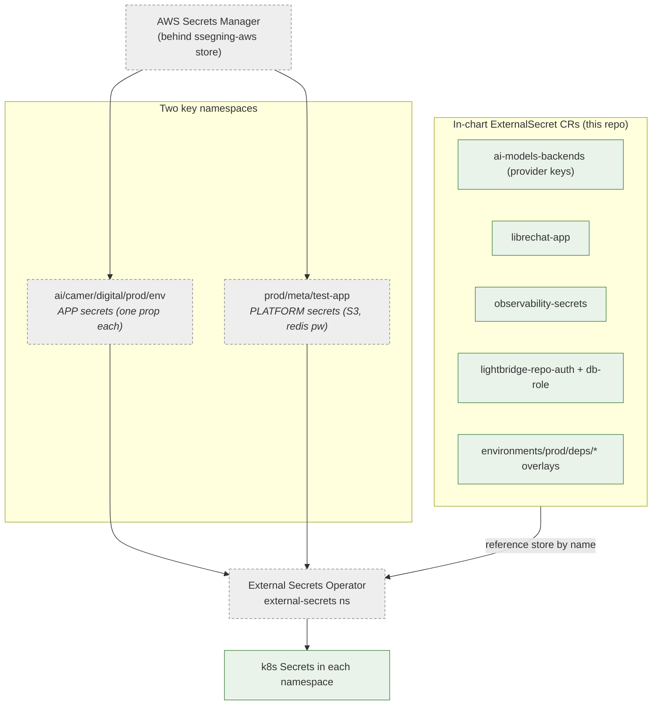
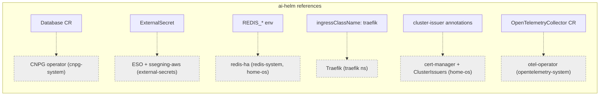

# 07 · Data & secrets

Where state lives and how secrets get into pods. Almost all the *storage*
infrastructure is owned externally — this repo defines the **consumers** (CRs,
ExternalSecrets, backup jobs) and references the platform by name.

## Stateful data map

| Store | Engine | Who owns it | This repo defines |
|---|---|---|---|
| Chat data | MongoDB | in-chart (`librechat-app`) | the StatefulSet + `mongodb-backup` |
| Chat search | Meilisearch | in-chart (`librechat-search`) | the deployment |
| Sessions / ratelimit counters | redis-ha | `home-os` | consumer config + auth Secret only |
| `lightbridge-repo-auth` DB | CNPG Postgres | external operator | a `Database` CR + managed role on the **existing** `lightbridge-db` cluster (not a new pod) |
| Metrics / logs / traces | Mimir / Loki / Tempo | in-chart (`observability`) | the charts (data → S3) |
| Object storage | Hetzner S3 (Ceph-RGW) | Hetzner | bucket prefixes + creds reference |

### Object storage layout (one bucket, prefixes per tenant)

> `mimir.storage_prefix` must be **alphanumeric-only** (no `/`) → `mimirblocks`.

## Secret flow (ESO + `ssegning-aws`)

The External Secrets Operator (installed externally) syncs from one
cluster-scoped `ClusterSecretStore` — `ssegning-aws`. This repo **owns the
`ExternalSecret` CRs in-chart**; the old wholesale `secrets` Application was
removed (2026-06-04).

### Ownership split (who owns which secret)

| Scope | Key | Examples | Owner CR |
|---|---|---|---|
| **App** | `ai/camer/digital/prod/env` | provider API keys, repo-auth webhook secret, internal token, GitHub App PEM | in-chart `ExternalSecret` |
| **Platform** | `prod/meta/test-app` | S3 backup creds, redis password | in-chart `ExternalSecret` |

> ⚠️ **Re-home a secret in-chart *before* retiring its provisioner.** Pruning the
> old `secrets` app cascade-deleted `lightbridge-opa-auth` → gateway outage. And
> an ESO `{{ }}` template inside a `tpl`'d string must be escaped
> (`{{ "{{ .password }}" }}`) so Helm passes it through to ESO untouched.

## What this repo does NOT own (consumed by name)

Don't re-add operators/stores/issuers for any of these — they're provisioned by
the companion repos. This repo only declares the CRs they reconcile.

→ Related: [04 GitOps (secret-bearing umbrellas)](04-gitops-deployment.md) · [06 Networking & TLS](06-networking-tls.md)
