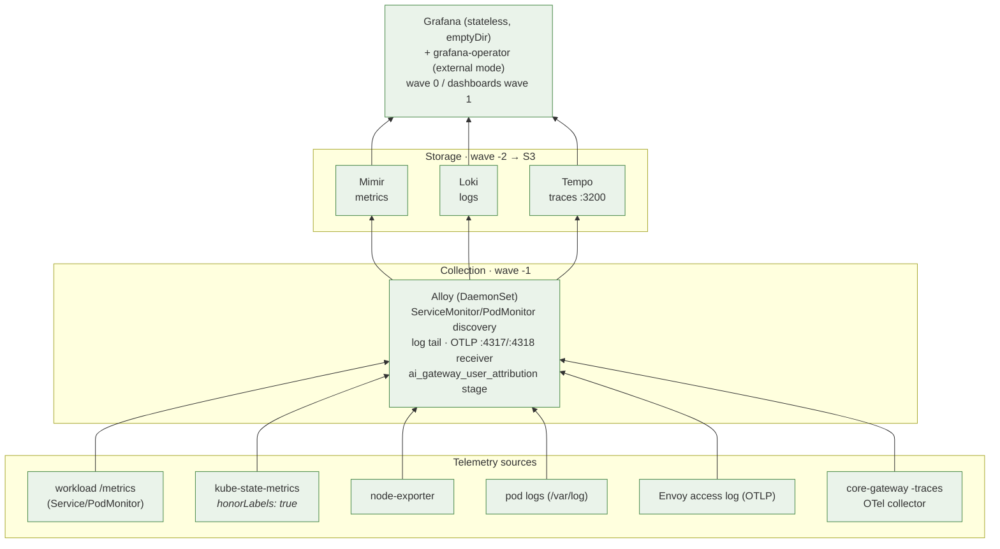
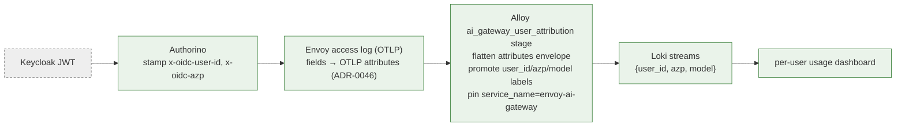
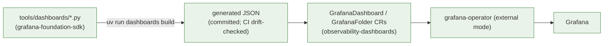
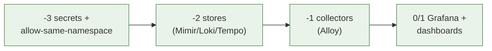

# 08 · Observability

The LGTM stack, how telemetry is collected, and how every request is attributed
back to a user. Deployed by the `observability` App-of-Apps orchestrator
(ADR-0020), namespace `observability`, enforced `privileged` Pod Security.
Source ADRs: **0004** (operator + dashboards-as-code), **0005/0046** (per-user
attribution), **0008** (Python dashboards), **0045** (scrape-first sourcing),
**0058** (cost metrics precomputed to Mimir), **0059** (unified alerting →
Discord), **0060** (gamified App Scoreboard). Cost observability — the metrics
backbone, dashboards, scoreboard, alerting + runbook — is its own guide:
[`cost-observability.md`](../cost-observability.md).

## The pipeline

| Layer | Components | Notes |
|---|---|---|
| **Collection** | Alloy (DaemonSet) | One agent: metrics scrape + log tail + OTLP receiver. Needs API-server egress *and* OTLP ingress allows ([06](06-networking-tls.md)) |
| **Storage** | Mimir, Loki, Tempo | All persist blocks to Hetzner S3; sync wave -2 |
| **Visualisation** | Grafana + grafana-operator | Grafana is **stateless** (ADR-0023); dashboards/folders pushed by the operator |

## Per-user attribution (ADR-0005 / ADR-0046)

The thread that ties an LLM request to a person: JWT → Authorino headers →
Envoy access log → Alloy → Loki labels.

> ⚠️ Two attribution traps, both fixed and worth remembering:
> - Envoy's OTel access-log sink emits `format.json` fields as **OTLP attributes,
>   not the log body** — a top-level `| json` finds nothing. Alloy must flatten the
>   `attributes` envelope and anchor on `service_name=envoy-ai-gateway`.
> - Alloy pod-log labels must come from **K8s service discovery**, never from
>   regex-on-the-line — any line mentioning a `/var/log/pods/...` path would
>   otherwise overwrite the stream's `namespace`/`pod` labels.

## Dashboards as code (ADR-0004 / ADR-0008 / ADR-0045)

- **Scrape-first (ADR-0045):** no board without verified metrics; API-verified
  gnetIds only; bespoke boards (per-user usage, ratelimit, Authorino) as code.
- Stateless Grafana means **every folder needs a `resyncPeriod`** or a pod roll
  wipes it → `folderRef` dashboards 400 until the operator restarts.
- The dashboard Python is the **only runnable code** in the repo; after editing
  `.py` you must `dashboards build` + commit the JSON (CI fails otherwise).

## In-Grafana AI assistant (ADR-0062)

The `grafana-llm-app` plugin gives operators AI help *inside* Grafana, but its
LLM backend is **our own Envoy AI Gateway** (OpenAI-compatible) — not an external
provider — so the same governance + per-account cost attribution apply. Because
the plugin sends a *static* bearer key it must use the gateway's **internal
plane** (`core-gateway-internal…svc`, ADR-0021); a dedicated `internal-key-grafana`
apiKey gives Grafana its own `x-account-id` spend bucket. Config is fully
declarative (it survives the stateless pod roll): plugin install + provisioning
ConfigMap live in `ai-helm-values` `environments/prod/values/grafana.yaml`, the
gateway-key ExternalSecret + a `self-signed-ca` CA-trust mount + Cilium egress to
`envoy-gateway-system:443` in the `deps/grafana` overlay.

## Why the sync-wave order is load-bearing

Collectors before stores = dropped data; visualisation before either = empty
boards. The postmortem of violating this is `MONITORING_FIX.md`.

→ Related: [06 Networking (egress allows)](06-networking-tls.md) · [05 Auth (attribution headers)](05-auth-identity.md)
