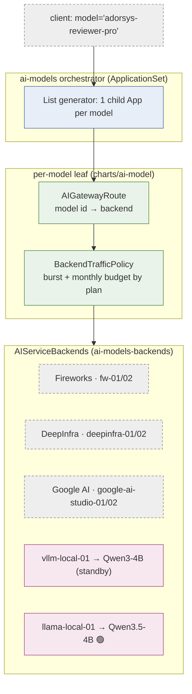
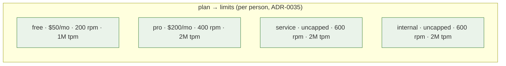
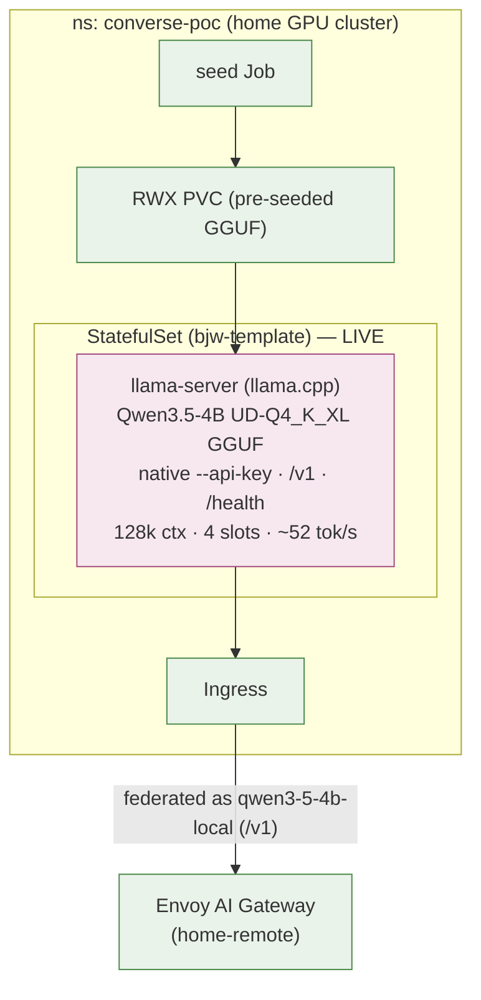
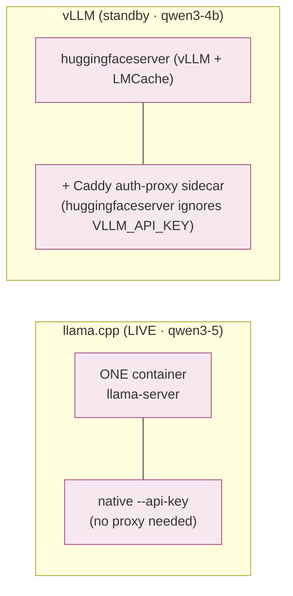

# 09 · Model serving

How an OpenAI-compatible model id resolves to actual inference — provider
fan-out for the cloud models, plus the one self-hosted model on the home GPU.
Source ADRs: **0012** (orchestrator split), **0022/0028/0029/0030/0032**
(self-hosted serving), **0035** (per-person budgets).

## Fan-out: one model id → one route → one backend

- **Adding a model is a list edit** in `charts/ai-models/values.yaml` → the
  ApplicationSet generates a new child Application (route + budget). No new chart.
- Models are **branded aliases** over provider backends — e.g. `adorsys-reviewer`
  → MiniMax M2.7, `adorsys-reviewer-pro` → GLM-5, `adorsys-coder-pro` → GLM-5.1.
  ~30 models are live across Fireworks / DeepInfra / Google AI + the 2 local ones.
- The catalog clients see is `ai-models-info` — an OpenRouter-shape
  `/v1/models/info` static endpoint (ADR-0015).

## Budget & burst, per model

Every leaf's `BackendTrafficPolicy` enforces the plan tiers from
`rateLimitBudgeting.plans`, keyed on `x-account-id` + `x-billing-plan`:

Cost is metered natively (`llmRequestCosts` token extraction) — no Python/Lua hop.

## The self-hosted model (home GPU)

The **one** sanctioned `homeCluster: true` workload (ADR-0022): it must run on the
cluster ArgoCD itself runs on because it needs the home GPU (A2000 12 GB).

### Two engines, two shapes

| | llama.cpp (`model-serving-qwen3-5`) 🟢 | vLLM (`model-serving-qwen3-4b`) |
|---|---|---|
| Model | Qwen3.5-4B Q4 (GGUF) | Qwen3-4B (BF16) |
| Containers | 1 (native `--api-key`) | 2 (vLLM + Caddy auth-proxy) |
| Status | **LIVE** since 2026-06-08 | standby / rollback |
| ADRs | 0030, 0032 | 0029, 0030 |

Pricing for owned hardware is **cost-recovery** (€/hour TCO → weighted per-token,
ADR-0028), not flat-zero. The model-agnostic "deploy the next one" checklist and
per-model capacity papers live in
[`../self-hosted-model-serving.md`](../self-hosted-model-serving.md) and
[`../models/`](../models/qwen3.5-4b-q4.md).

→ Related: [03 Gateway request path](03-gateway-components.md) · [05 Auth & tiers](05-auth-identity.md)
