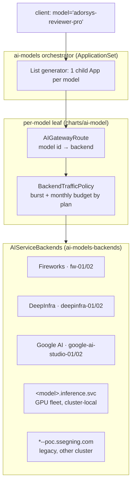
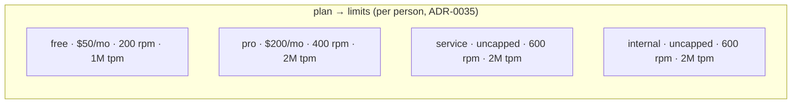
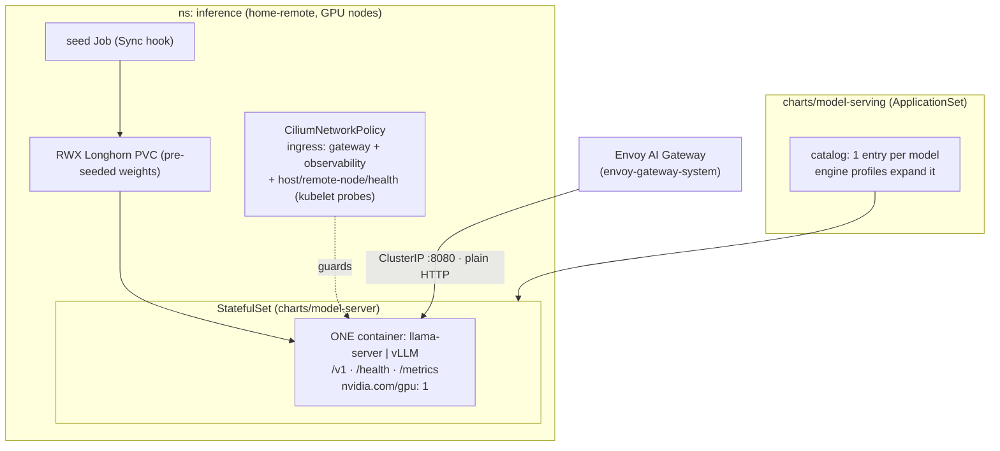

# 09 · Model serving

How an OpenAI-compatible model id resolves to actual inference — provider
fan-out for the cloud models, plus the self-hosted models on the Hetzner GPU fleet.
Source ADRs: **0012** (orchestrator split), **0094/0095** (GPU-fleet serving +
cluster-local federation), **0022/0028/0029/0030/0032** (the legacy home-GPU
generation, still running on the other cluster), **0035** (per-person budgets).

## Fan-out: one model id → one route → one backend

```mermaid
flowchart TB
    REQ["client: model='adorsys-reviewer-pro'"]
    subgraph orch["ai-models orchestrator (ApplicationSet)"]
        AS["List generator: 1 child App per model"]
    end
    subgraph leaf["per-model leaf (charts/ai-model)"]
        ROUTE["AIGatewayRoute<br/>model id → backend"]
        BUDGET["BackendTrafficPolicy<br/>burst + monthly budget by plan"]
    end
    subgraph backends["AIServiceBackends (ai-models-backends)"]
        FW["Fireworks · fw-01/02"]
        DI["DeepInfra · deepinfra-01/02"]
        GA["Google AI · google-ai-studio-01/02"]
        LOC["&lt;model&gt;.inference.svc<br/>GPU fleet, cluster-local"]
        OLD["*--poc.ssegning.com<br/>legacy, other cluster"]
    end

    REQ --> AS --> ROUTE --> BUDGET --> backends

```

- **Adding a model is a list edit** in `charts/ai-models/values.yaml` → the
  ApplicationSet generates a new child Application (route + budget). No new chart.
- Models are **branded aliases** over provider backends — e.g. `adorsys-reviewer`
  → MiniMax M2.7, `adorsys-reviewer-pro` / `adorsys-coder-pro` → GLM-5.2 (ADR-0075).
  ~30 models are live across Fireworks / DeepInfra / Google AI + the 2 local ones.
- The catalog clients see is `ai-models-info` — an OpenRouter-shape
  `/v1/models/info` static endpoint (ADR-0015).

## Budget & burst, per model

Every leaf's `BackendTrafficPolicy` enforces the plan tiers from
`rateLimitBudgeting.plans`, keyed on `x-account-id` + `x-billing-plan`:

```mermaid
flowchart LR
    subgraph tiers["plan → limits (per person, ADR-0035)"]
        FREE["free · $50/mo · 200 rpm · 1M tpm"]
        PRO["pro · $200/mo · 400 rpm · 2M tpm"]
        SVC["service · uncapped · 600 rpm · 2M tpm"]
        INT["internal · uncapped · 600 rpm · 2M tpm"]
    end
```

**Per-model overrides:** a model can override the plan defaults with its own
`rateLimitBudgeting:` block in `charts/ai-models/values.yaml` — e.g. the
`adorsys-*` brand models use a unified lower budget rather than the table above.
The plan tiers are the default; the per-model block wins where present.

Cost is metered natively (`llmRequestCosts` token extraction) — no Python/Lua hop.

## Self-hosted models — the GPU fleet (ADR-0094/0095)

Two Hetzner Robot GPU nodes (RTX 4000 SFF Ada, 20 GiB each) joined **`home-remote`**
— the same cluster as the gateway. So a self-hosted model is now an ordinary
workload reached over the pod network: **no Ingress, no DNS record, no TLS
certificate, no static API key, no auth-proxy sidecar**. A `CiliumNetworkPolicy` is
the access control.

```mermaid
flowchart TB
    subgraph orch2["charts/model-serving (ApplicationSet)"]
        CAT["catalog: 1 entry per model<br/>engine profiles expand it"]
    end
    subgraph inf["ns: inference (home-remote, GPU nodes)"]
        subgraph ss["StatefulSet (charts/model-server)"]
            ENG["ONE container: llama-server | vLLM<br/>/v1 · /health · /metrics<br/>nvidia.com/gpu: 1"]
        end
        PVC["RWX Longhorn PVC (pre-seeded weights)"]
        SEED["seed Job (Sync hook)"]
        CNP["CiliumNetworkPolicy<br/>ingress: gateway + observability<br/>+ host/remote-node/health (kubelet probes)"]
        SEED --> PVC --> ENG
        CNP -.guards.-> ENG
    end
    GW["Envoy AI Gateway<br/>(envoy-gateway-system)"]
    CAT --> ss
    GW -->|"ClusterIP :8080 · plain HTTP"| ENG
```

**Two GPUs ⇒ two concurrent models.** Placement is an `nvidia.com/gpu: 1` request,
so a third enabled model queues as `Pending` rather than requiring a human to
disable another. Adding a model is a ~15-line catalog entry — no new chart.

### Three engines, one container each

| | `llamacpp` | `vllm` | `zimage` |
|---|---|---|---|
| Serves | text | text | **images** (`/v1/images/generations`) |
| Image | `ghcr.io/ggml-org/llama.cpp:server-cuda` | `lmcache/vllm-openai` | `ghcr.io/adorsys-gis/z-image-turbo-server` (**first-party**) |
| Weights | GGUF | safetensors (AWQ/GPTQ/FP8/BF16) | diffusers repo |
| Containers | **1** | **1** | **1** |
| Optional key | native `--api-key-file` | native `VLLM_API_KEY` | native `API_KEY` |
| `/metrics` | `llamacpp:*` | `vllm:*` | **none** |
| Extras | — | opt-in LMCache + `/dev/shm` | — |

The weight format selects the engine (`inference-ops` ADR-0002 for text, ADR-0003
for images) — GGUF on vLLM is ~8× slower, and neither text engine can do
diffusion at all. **No engine has a Caddy sidecar**: that was only ever required
by `kserve/huggingfaceserver`, which ignores `VLLM_API_KEY` (ADR-0022), and that
wrapper is not an engine profile here.

`zimage` is the one engine we build ourselves (source: `images/z-image-turbo-server/`,
ADR-0100). Two consequences that do not apply to the upstream engines: the image
is **built out-of-band, so it must be pushed before the catalog entry merges**,
and it publishes no Prometheus metrics — liveness for image models comes from the
engine-independent `ms-model-unavailable` alert over kube-state-metrics, not from
`up{namespace="inference"}`.

### Legacy generation

Eight `charts/model-serving-*` charts targeted the **other** cluster
(`admin@homeos`) over a public edge with `homeCluster: true`. **All are
`enabled: false` since 2026-07-27** (ADR-0100): `zimage-turbo`, the last live
one, moved to the fleet. Retained as a rollback surface until that cluster is
decommissioned; not a template for anything new.

Pricing for owned hardware is **cost-recovery** (€/hour TCO → weighted per-token,
ADR-0028), not flat-zero.

The GitOps *how* is [`../patterns/self-hosted-model-serving.md`](../patterns/self-hosted-model-serving.md).
The inference knowledge — VRAM budgeting, quantization, engine choice, benchmarks,
runbooks — lives in the team's **`inference-ops`** repository. Legacy per-model
papers: [`../models/`](../models/qwen3.5-4b-q4.md).

→ Related: [03 Gateway request path](03-gateway-components.md) · [05 Auth & tiers](05-auth-identity.md)
