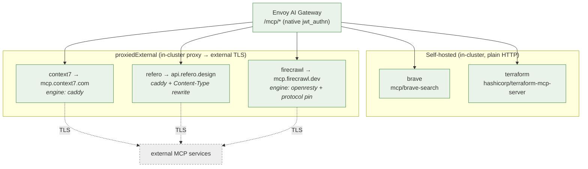
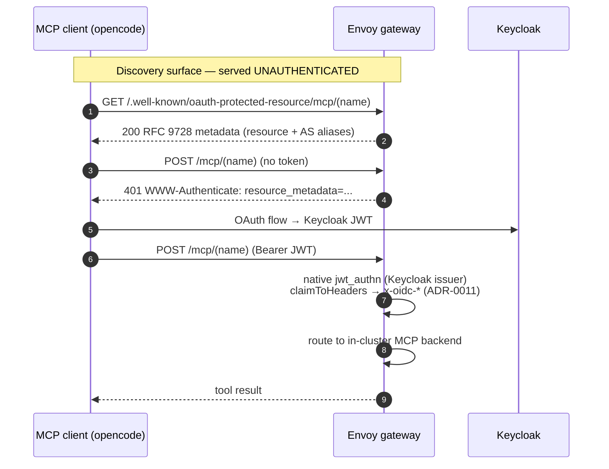
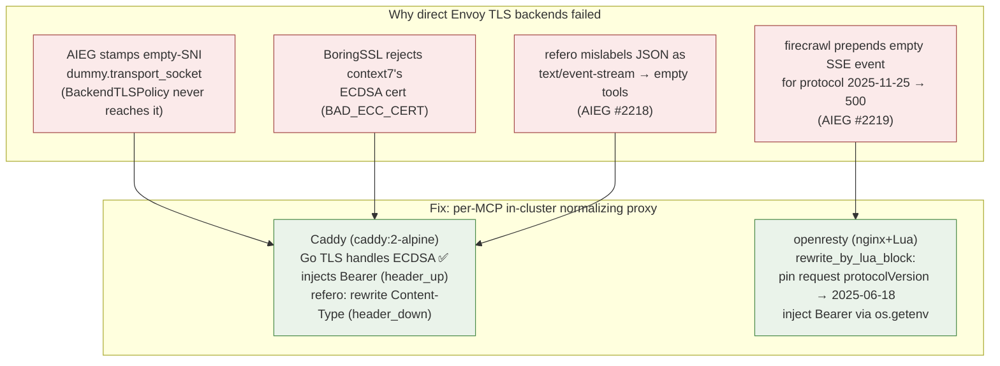
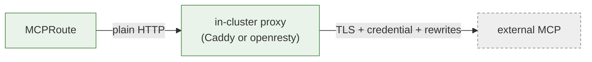

# 10 · MCP servers

How Model Context Protocol tool servers are exposed through the gateway — the
OAuth discovery carve-out, and the in-cluster proxy modes that make flaky
external MCPs behave. Source ADRs: **0038** (OAuth discovery), **0040**
(proxiedExternal Caddy), **0041** (openresty request rewrite). Namespace
`converse-mcp`, orchestrator `charts/mcps`, leaf `charts/mcp`.

## The MCP catalog

| MCP | Mode | Proxy engine | Upstream |
|---|---|---|---|
| `brave` | selfHosted | — | in-cluster image |
| `terraform` | selfHosted | — | in-cluster image |
| `context7` | proxiedExternal | caddy | `mcp.context7.com` |
| `refero` | proxiedExternal | caddy | `api.refero.design` |
| `firecrawl` | proxiedExternal | openresty | `mcp.firecrawl.dev` (`/v2/mcp`) |

## The OAuth carve-out (ADR-0038)

`/mcp/*` is the one place Authorino is bypassed. Each `MCPRoute` carries
`securityPolicy.oauth`, and an Envoy route-level `SecurityPolicy` **displaces**
the gateway-attached Authorino policy *whole* (no merge).

- JWT verification = Envoy's native `jwt_authn` (same Keycloak issuer as Authorino).
- The gateway serves discovery itself: the path-insertion form
  `/.well-known/oauth-protected-resource/mcp/(name)`, AS-metadata aliases, the 401
  `resource_metadata` challenge, plus a non-spec path-appended alias.
- `claimToHeaders` re-stamps the `x-oidc-*` set (caveat: object/array claims
  arrive base64url(JSON), not plain JSON).
- **No rate-limit descriptors** on `/mcp/*` — no MCP rate limiting today.

## Why external MCPs go through in-cluster proxies (ADR-0040)

Direct external-TLS MCP backends were unfixable at the Envoy layer. The three
distinct failures and their fix:

The proxy turns an unreliable external TLS backend into a **reliable in-cluster
plain-HTTP backend** — identical to brave/terraform from Envoy's view. The
ADR-0039 `EnvoyPatchPolicy` was removed.

> ⚠️ **Token-bind race (`MCP_TOKEN`):** env vars from `secretKeyRef` bind at pod
> start and never refresh. A proxy that beats ESO with `optional: true` captures
> an **empty** token forever (`Bearer `) → upstream rejects every request as
> "Invalid API key". Guard: `charts/mcp` renders `MCP_TOKEN` with `optional:
> false`, so a keyed proxy **waits** in `ContainerCreating` for ESO. A keyless
> MCP disables `externalSecret` and proxies anonymously.
>
> ⚠️ **The openresty/Caddy engine choices are INTERIM.** Drop the firecrawl
> openresty engine once AIEG's SSE parser skips non-response events (#2219); drop
> refero's `rewriteResponseContentType` once #2218 lands. Full diagnosis:
> [`../2026-06-10-mcp-external-server-proxy-debug.md`](../2026-06-10-mcp-external-server-proxy-debug.md).

→ Related: [05 Auth (carve-out)](05-auth-identity.md) · [06 Networking & TLS](06-networking-tls.md)
