# Budget flows: writers, readers, and gateway enforcement

Originally verified against `hetzner-prod` on **2026-09-15**; live process/image inventory and the usage-collector spot check were refreshed on **2026-09-29**. This is a map of the observed deployment and its source, not a proposed design.

## Reading this map

- **Granted ceiling**: money allocated to an account for a calendar month, recorded in `budget_grants`.
- **Spend**: recorded model usage, held in the separate usage database.
- **Remaining**: effective granted ceiling minus recorded spend. `budget_remaining_snapshots` makes this inexpensive to read at the gateway.
- **Acting account** (`account_id`) and **funded account** (`budget_account_id`) are separate fields. A grant does not debit the acting account. There is no account-to-account transfer transaction in the paths below.
- Sequence diagrams name the component doing each operation. State diagrams distinguish persisted statuses from derived conditions and show important missing or failing transitions.
- Every numbered section has source references. Each diagram also has a standalone `.mmd` file in [budget-diagrams](./budget-diagrams/), suitable for Mermaid import into draw.io.

### Live facts that override older documentation

| Question | Observed answer |
|---|---|
| Which binary? | `lightbridge-authz:sha-5cfad5ca39c5bae3b5e2d65dfbc107652a82356b` for API, budget, OPA, and IdP; `lightbridge-authz-usage:sha-5cfad5ca39c5bae3b5e2d65dfbc107652a82356b` for usage |
| Is ledger enforcement active? | Yes: `core-gateway-billing-period` has three Lua entries; the budget entry has `shadow = false` |
| Does Authorino call the remaining-budget endpoint? | No. Its main AuthConfig has `lightbridgeintrospect` and `repobinding` metadata steps; budget fields ride on introspection |
| Are old monthly/weekly Redis cost buckets still active? | No. Inspected all 32 BackendTrafficPolicies; no cost rules. The 26 model policies each have two per-minute request rules |
| Which credentials are ledger-enforced? | Main AuthConfig: nonempty `api_key_id`, issuer different from legacy Keycloak. Internal, GitHub-binding, and legacy Keycloak paths are excluded |
| Does the gateway ExtensionPolicy redact traffic? | Not in this snapshot: three Lua entries, zero `extProc` entries. The chart supports a redaction extension, but that block is not active here |
| Is usage ingestion healthy? | Current 15-minute collector sample showed export attempts and no HTTP 400/drop lines. A 2026-09-15 sample did show repeat HTTP 400 dropped batches; keep that as a documented failure mode until a broader log check closes it |
| Is usage retention enabled? | No retention override in the deployed config; this binary defaults it to disabled. The code and tables exist, but the retention loop is inactive by default |

Evidence details and reproducible commands are in [the verification record](./budget-diagrams/verification.md). Live image tags were checked from the cluster; source references below point to the local checkouts unless a GitHub commit link is explicitly used.

## 0. Component and data ownership

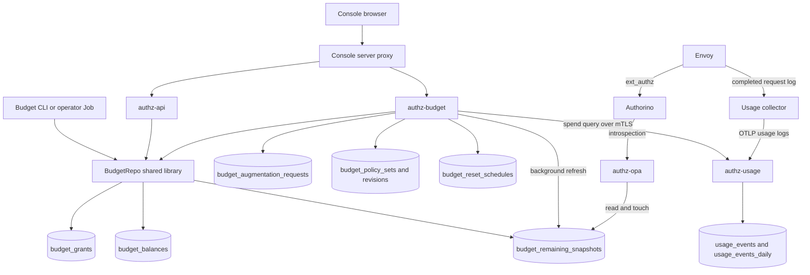

This is an ownership map; the following sequence diagrams carry ordering. `BudgetRepo` is a Rust library used inside the named processes, not another network service. The authz services share the main database; usage has its own database.

Sources: [shared service boundary][services], [console proxy][proxy], [grant writer][grant], [snapshot read][introspection], [collector exporter][collector].

### Table inventory

| Table or store | Writers in these flows | Readers and purpose |
|---|---|---|
| `users`, `accounts` | Account provisioning through `authz-api` and tenancy code | Ownership/existence checks, schedule population, budget target resolution |
| `projects`, `project_members`, `api_keys` | Account/project/key management through `authz-api` | Acting/project context; plan selection; introspection; API-key activity seeds snapshot coverage |
| `platform_role_grants` | Role administration | Budget RPC permission decisions; it is not a balance table |
| `budget_grants` | `BudgetRepo::grant`, called by API starting grants, budget RPCs, scheduler, and CLI | Immutable allocation ledger; expiry-aware ceiling calculation |
| `budget_balances` | Same grant transaction | Grant totals and refill counts per funded account/month; not a running spend debit |
| `budget_augmentation_requests` | `RefillService`, `ReviewService` inside `authz-budget` | User request history, decision audit, pending review queue |
| `budget_policy_sets` | Policy activation; initial creation by migrations | Active revision pointer |
| `budget_policy_revisions` | Policy authoring/activation; seed migrations | Validated rule JSON, historical revisions, simulation, rollback |
| `budget_reset_schedules` | Schedule-management RPCs; reset scheduler updates run timestamps | Scope, cadence, target/top-up amount, next reset selection |
| `budget_remaining_snapshots` | Budget refresher; grant delta transaction; starting-grant touch; OPA asynchronous activity touch | `authz-opa` gateway introspection; remaining-budget reads |
| `usage_events` — usage DB | `authz-usage` ingest; retention would delete aged raw rows if enabled | Spend and usage queries |
| `usage_events_daily` — usage DB | Optional usage retention/rollup worker | Older spend queries union raw and daily rows |
| `usage_retention_state` — usage DB | Optional retention worker | Last successful purge cutoff; accounting of retention progress |
| Redis rate-limit counters | Envoy rate-limit service | Per-key/model and per-account/model request throttling; currently not money balances |

`sessions` and `exchange_refresh_tokens` can participate in validating an exchanged credential, but are not budget allocation or spend ledgers. The token/key/introspection context determines which account's snapshot is read. The other standalone authentication tables in the original ER diagram do not receive budget writes from these flows.

### Flow-to-process table matrix

This is the quick operational index: binary image, live deployment/pod family, in-process component, and SQL tables touched for each flow. `lightbridge-authz` is one image with different server modes; the Kubernetes deployment name is the operational process boundary.

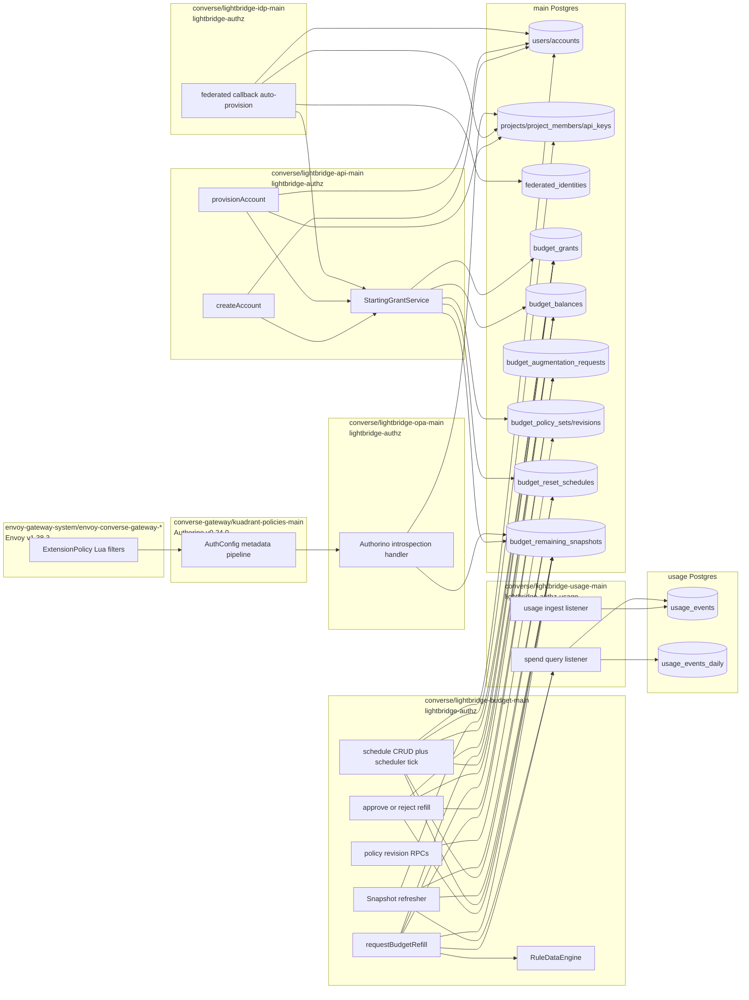

| Flow | Live binary and process | In-process component | Tables written | Tables read |
|---|---|---|---|---|
| Account creation, `createAccount` | `converse/lightbridge-api-main` pods, `ghcr.io/adorsys-gis/lightbridge-authz:sha-5cfad5...` | `AuthzStoreImpl::create_account`, then `StartingGrantService` | `accounts` plus trigger-backed `users`; then `budget_grants`, `budget_balances`, possibly `budget_remaining_snapshots` | `accounts` for owner lookup; `budget_reset_schedules`, `budget_policy_sets`, `budget_policy_revisions`, `projects`, `api_keys` to resolve starting amount |
| Automatic account provisioning at federated login | `converse/lightbridge-idp-main` pods, same `lightbridge-authz` image | relying-party callback calls `upsert_federated_identity_and_provision`, then IdP-local starting grant | `accounts`, trigger-backed `users`, `projects`, `federated_identities`; then `budget_grants`, `budget_balances`, possibly `budget_remaining_snapshots` | `federated_identities`, `accounts`; then the same schedule/policy/project/API-key reads for starting grant |
| Manual account provisioning, `provisionAccount` | `converse/lightbridge-api-main` pods, same `lightbridge-authz` image | `AuthzStoreImpl::provision_account`, then `StartingGrantService` | `accounts`, trigger-backed `users`, `projects`; then `budget_grants`, `budget_balances`, possibly `budget_remaining_snapshots` | `accounts`; `budget_reset_schedules`, `budget_policy_sets`, `budget_policy_revisions`, `projects`, `api_keys` for starting grant |
| Budget/lightbridge introspection | Envoy pods in `envoy-gateway-system` call Authorino pods in `converse-gateway`, which call `converse/lightbridge-opa-main` | Envoy ExtensionPolicy Lua, Authorino AuthConfig, `introspect_api_key` or exchange-token introspection, `BudgetIntrospection::read_and_touch` | `budget_remaining_snapshots` only by async touch bookkeeping; no grant/balance writes | `api_keys`, `projects`, account/session context depending on credential; `budget_remaining_snapshots`; Authorino may serve cached metadata for up to its configured TTL |
| Asking for a refill, `requestBudgetRefill` | `converse/lightbridge-budget-main`, same `lightbridge-authz` image | `RefillService`, `RuleDataEngine`, `BudgetRepo`; spend facts through `converse/lightbridge-usage-main` | Always starts with `budget_augmentation_requests`; auto-approval additionally writes `budget_grants`, `budget_balances`, and maybe `budget_remaining_snapshots` | Existing request by idempotency key; active in-memory policy loaded from `budget_policy_sets/revisions`; grant history/balance facts; `usage_events` and `usage_events_daily` through usage service spend query |
| Approving or rejecting a refill | `converse/lightbridge-budget-main` | `ReviewService`, `AugmentationRepo`, `BudgetRepo` | Approval writes `budget_grants`, `budget_balances`, maybe `budget_remaining_snapshots`, then updates `budget_augmentation_requests`; rejection only updates `budget_augmentation_requests` | `budget_augmentation_requests`; approval also reads idempotent grant state through `BudgetRepo` |
| Evaluating refill policies | `converse/lightbridge-budget-main` | `RuleDataEngine` inside `RefillService`; simulation builds a short-lived engine | None for pure evaluation or simulation | In-memory rules loaded from `budget_policy_sets` and `budget_policy_revisions`; runtime facts from `budget_grants`, `budget_balances`, `budget_augmentation_requests`, and usage spend query when needed |
| Creating/updating refill policies | `converse/lightbridge-budget-main` | `PolicyStore` through budget RPCs | `budget_policy_revisions`; activation also updates `budget_policy_sets.active_revision_id` | Existing revision rows for rollback/status; live serving status can read in-memory engine state |
| Creating/updating budget schedules | `converse/lightbridge-budget-main` HTTP/RPC task | `ResetScheduleRepo` via budget RPCs | `budget_reset_schedules` | Existing `budget_reset_schedules` for list/get/update validation |
| Distributing scheduled budgets | `converse/lightbridge-budget-main` background scheduler task | `ResetScheduler::tick` and `BudgetRepo` | `budget_reset_schedules` run timestamps; `budget_grants`, `budget_balances`, maybe `budget_remaining_snapshots` | `budget_reset_schedules`; `accounts`; `projects` and `api_keys` for plan scope; usage spend query for reset-mode schedules |
| Usage ingestion feeding spend | `converse-gateway/core-gateway-usage-collector` to `converse/lightbridge-usage-main` | OpenTelemetry collector exporter to usage ingest handler | `usage_events` when ingest succeeds; optional retention can write `usage_events_daily` and `usage_retention_state` | Envoy access-log stream; no main budget tables |

Sources: [account creation and starting grant][account], [account repository write][account-repo-create], [federated auto-provisioning][federated-provision], [IdP starting grant][idp-starting-grant], [manual provision write][account-repo-provision], [budget server process wiring][budget-server], [shared budget service graph][budget-services], [introspection handler][introspection-handler], [snapshot read and touch][introspection], [refill request][refill-rpc], [refill service][refill-service], [review service][review-service], [policy RPCs][policy-rpc], [PolicyStore][policy], [schedule RPCs][schedule-rpc], [schedule repo][schedule-repo], [scheduler claim and retry][scheduler], [scope precedence and plan inputs][effective].

## 1. Account creation and the starting grant

```mermaid
sequenceDiagram
    autonumber
    participant C as Console or admin
    participant A as authz-api
    participant T as Main DB tenancy tables
    participant S as StartingGrantService in API
    participant P as Schedules and policy tables
    participant G as BudgetRepo in API
    participant N as budget_remaining_snapshots
    C->>A: createAccount or provisionAccount
    A->>T: Create account and associated tenancy records
    T-->>A: Account committed
    A->>S: book(account_id, current month)
    S->>P: Resolve winning schedule; otherwise active policy default
    S->>G: automatic grant, budget-start-month-account key
    G-->>S: Grant committed or existing grant returned
    S->>N: UPSERT last_seen_at for background refresh
    S-->>A: Success or error
    Note over A,S: Failure is logged; the account is already committed
    A-->>C: Account response
```

```mermaid
stateDiagram-v2
    [*] --> NoAccount
    NoAccount --> AccountCommitted: tenancy commit
    AccountCommitted --> Funded: starting grant commits
    AccountCommitted --> Unfunded: starting grant fails; error logged
    Unfunded --> Funded: operator repair or matching reset
    Funded --> AwaitingReading: snapshot touch succeeds
    AwaitingReading --> GatewayKnown: background refresh succeeds
    note right of Funded
        Funding and snapshot readiness are distinct.
        Account creation is not rolled back on grant failure.
    end note
```

The starting amount follows the effective schedule; absent one, it uses `starting_amount_micros` from the active policy. Plan membership is derived from projects and their API keys, so a newly created account without those may not match a plan-specific schedule. A subsequent reset can correct the difference. Exact tenancy records depend on the provisioning operation.

Sources: [account handler and logged failure][account], [starting grant][starting], [schedule precedence and plan resolution][effective].

## 2. The common grant transaction, direct grants, and corrections

```mermaid
sequenceDiagram
    autonumber
    participant W as API, budget service, scheduler, or CLI
    participant R as BudgetRepo in caller process
    participant B as budget_balances
    participant G as budget_grants
    participant S as budget_remaining_snapshots
    W->>R: grant(target, actor account, month, amount, source, key)
    R->>R: Validate amount sign and source
    rect rgb(235,245,255)
        Note over R,S: ONE database transaction
        R->>B: INSERT if missing; SELECT FOR UPDATE
        R->>G: INSERT with idempotency handling
        alt New grant
            R->>B: Add amount, source totals and counts; advance version
            R->>S: Add amount to ceiling and remaining if reading eligible
        else Existing idempotency key
            G-->>R: Existing grant; do not credit again
        end
        R->>R: COMMIT
    end
    R-->>W: Grant result
```

```mermaid
stateDiagram-v2
    [*] --> Proposed
    Proposed --> Rejected: invalid amount or source
    Proposed --> Existing: idempotent replay
    Proposed --> Committed: new row and projections commit
    Committed --> Committed: audit reads; original row retained
    Committed --> Compensated: separate correction row committed
    Committed --> ExpiredForCeiling: expires_at passes
    note right of Compensated
        A derived condition, not an UPDATE to the original grant.
        Direct UPDATE and DELETE of ledger rows are blocked.
    end note
```

- `grantBudget` uses source `admin`. `revokeBudgetGrant` reads the original and appends its negative amount as `correction`, idempotent on `revoke:<grantId>`.
- CLI/Jobs use the same writer, with the source selected by the command. Refills use `self_service`; manual approvals use `manual_approval`; scheduled and starting grants normally use `automatic`.
- The snapshot delta requires an existing non-null reading in the same period and a grant that is not already expired. New accounts and new periods still need a refresher pass.
- `budget_balances` is the accumulated grant projection. The effective ceiling instead sums non-expired, non-revoked ledger entries. Time passing can change that ceiling without changing the stored grant projection.
- A database commit does **not** invalidate Authorino's cached introspection response. Its 30-second TTL can delay gateway visibility of a refill.

Sources: [transaction][grant], [snapshot delta guards][snapshot-store], [admin grant and revoke][admin-grant], [immutable ledger migration][ledger-migration], [Authorino cache][auth-cache].

## 3. Self-service refill and policy evaluation

```mermaid
sequenceDiagram
    autonumber
    participant C as Console via server proxy
    participant B as authz-budget / RefillService
    participant Q as budget_augmentation_requests
    participant L as budget_grants and budget_balances
    participant U as authz-usage spend API
    participant P as In-memory RuleDataEngine
    participant G as BudgetRepo
    C->>B: requestBudgetRefill(amount, target, period, idempotency key)
    B->>B: JWT permission gate; parse input
    B->>Q: Find existing idempotency key
    alt Existing request
        Q-->>C: Return existing outcome through service
    else New request
        B->>P: Is amount in offered amounts?
        B->>Q: INSERT created, including requested_by_user_id
        B->>L: Read effective ceiling and refill counts
        B->>U: Read current and previous period spend
        B->>P: evaluate(facts, requested amount)
        alt AutoApprove or AutoApproveCapped
            B->>G: grant(source=self_service)
            G-->>B: Committed grant ID
            B->>Q: UPDATE auto_approved or partially_approved, grant_id
        else ManualReview or engine invocation failure
            B->>Q: UPDATE pending_review and decision reasons
        else Deny or NoAction
            B->>Q: UPDATE denied and decision reasons
        end
        B-->>C: Recorded request outcome
    end
```

```mermaid
stateDiagram-v2
    [*] --> RejectedBeforeCreation: amount not offered
    [*] --> created: valid new request
    created --> auto_approved: AutoApprove and grant recorded
    created --> partially_approved: capped grant recorded
    created --> pending_review: ManualReview or engine unavailable
    created --> denied: Deny or NoAction
    created --> created: later operation fails; row can remain here
    pending_review --> approved: admin review
    pending_review --> denied: admin rejection
    state DeclaredButUnwritten {
        evaluating
        cancelled
        expired
        applied
    }
    note right of DeclaredButUnwritten
        Schema values with no writer in the current orchestration.
        No transition from created is implemented for these states.
    end note
```

The rule engine is a function of supplied facts; it does not edit tables. `authz-budget` performs the writes. Despite the service name `authz-opa`, the current refill evaluator is `RuleDataEngine`; do not draw an OPA server call for this decision.

The whole refill is **not one transaction**: request creation, grant booking, and decision recording are distinct writes. A failure after request creation can leave `created`; if a grant committed before final recording failed, that grant can exist without the request's final status. The current idempotency shortcut returns an existing request rather than resuming every unfinished step. Invalid offered amounts create no request row.

Sources: [refill orchestration][refill], [RPC request construction][refill-rpc], [budget service composition][budget-services], [schema statuses][augmentation].

## 4. Human review

```mermaid
sequenceDiagram
    autonumber
    participant C as Admin console
    participant B as authz-budget / ReviewService
    participant Q as budget_augmentation_requests
    participant G as BudgetRepo
    C->>B: approve or reject(request_id)
    B->>B: Check budget review permission
    B->>Q: Acquire advisory transaction lock for request_id
    B->>Q: Read request; require pending_review
    alt Approve
        B->>G: manual_approval grant, augmentation-approval:request_id
        G-->>B: Committed grant or idempotent existing grant
        B->>Q: UPDATE approved, grant_id and review audit
    else Reject
        B->>B: Require nonempty rejection reason
        B->>Q: UPDATE denied and review audit
    end
    B->>Q: Release advisory lock
    B-->>C: Review outcome
```

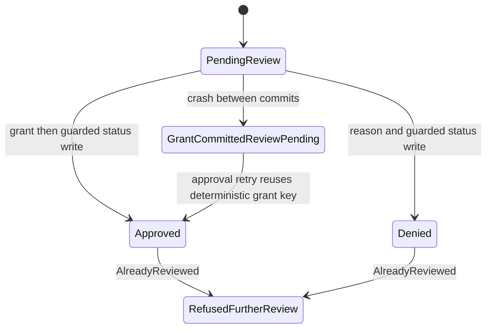

The advisory lock serializes concurrent reviewers, but does not make the grant and review-status commits atomic. An approval retry repairs the documented grant-first crash window without crediting twice. The lock is not policy re-evaluation: human approval is an override, and `ReviewService` does not call the rule engine.

Sources: [review lock, approve, reject and crash semantics][review], [permission map][permissions].

## 5. Policy authoring, simulation, activation, and rollback

```mermaid
sequenceDiagram
    autonumber
    participant C as Admin console
    participant B as authz-budget / PolicyStore
    participant R as budget_policy_revisions
    participant S as budget_policy_sets
    participant E as RuleDataEngine in this process
    C->>B: createBudgetPolicyRevision(rule JSON)
    B->>B: Validate JSON and rule constraints
    B->>R: INSERT revision; active pointer unchanged
    C->>B: simulateBudgetPolicy(candidate, facts)
    B->>E: Evaluate isolated candidate; no grant write
    E-->>C: Decision preview through service
    C->>B: activateBudgetPolicy(revision ID or new rule JSON)
    B->>R: Read existing revision, or insert a new one
    B->>S: UPDATE active_revision_id; commit
    B->>E: Hot-swap validated rules after DB commit
    Note over B,E: Rollback selects an older existing revision through the same activation path
```

```mermaid
stateDiagram-v2
    [*] --> Candidate
    Candidate --> Invalid: validation fails; no revision write
    Candidate --> StoredInactive: create revision
    StoredInactive --> StoredInactive: simulation only
    StoredInactive --> Active: activate pointer and engine
    Active --> InactiveHistory: another revision activated
    InactiveHistory --> Active: reactivate old revision
    StoredInactive --> DBActiveEngineOld: DB commit succeeds; engine swap fails
    note right of DBActiveEngineOld
        Error requires reconciliation.
        The database commit has already happened.
    end note
```

Changing policy controls future refill decisions and fallback starting amounts. It does not rewrite old grants or directly change the gateway limiter. Old decisions retain their policy revision and matched-rule audit fields. Engine replacement here is local to the serving process; the observed budget deployment has one replica. This map makes no claim of a cross-replica activation broadcast.

Sources: [PolicyStore][policy], [simulation and activation procedures][policy-rpc], [startup composition][budget-services].

## 6. Scheduled distribution: reset versus top-up

```mermaid
sequenceDiagram
    autonumber
    participant C as Admin console
    participant B as authz-budget scheduler
    participant S as budget_reset_schedules
    participant A as users, accounts, projects, api_keys
    participant U as authz-usage
    participant G as BudgetRepo
    C->>B: Create or update schedule, or run now / preview
    B->>S: Persist configuration when requested
    loop Scheduled tick
        B->>S: Claim due enabled schedules FOR UPDATE SKIP LOCKED
        B->>A: Enumerate matching accounts and billing plans
        B->>B: Choose account over plan over global scope
        loop Each account won by this schedule
            B->>G: Read expiry-aware effective ceiling
            B->>U: Read period spend
            B->>B: top_up delta=amount; reset delta=target-minus-remaining
            alt Nonzero delta and write run
                B->>G: automatic positive grant or negative correction
            else Preview or zero delta
                B->>B: No ledger write
            end
        end
        B->>S: Update last_run_at and advance next_run_at when eligible
    end
```

```mermaid
stateDiagram-v2
    [*] --> Disabled: default configuration
    Disabled --> Scheduled: enable
    Scheduled --> Due: next_run_at reached
    Due --> Claimed: scheduler acquires row lock
    Claimed --> Scheduled: complete and advance
    Claimed --> Due: reset spend unavailable within one-hour grace
    Claimed --> Due: schedule execution error
    Claimed --> Scheduled: grace expires; skip deferred accounts and advance
    Scheduled --> Disabled: disable
    Scheduled --> Scheduled: dry-run preview writes nothing
```

For an account with a $20 effective ceiling and $7 spend, remaining is $13:

| Operation | New ledger row | New remaining, assuming no concurrent spend |
|---|---:|---:|
| Top up $8 | +$8 `automatic` | $21 |
| Reset remaining to $8 | −$5 `correction` | $8 |

Schedules distribute allocations independently to matching accounts. They do not divide or drain a shared administrator pool. Only the most specific enabled schedule wins; equal specificity follows the repository's ordered schedule list. Deterministic schedule/window/account keys prevent duplicate credit on retries. A reset requires known spend; a top-up can proceed without it. Explicit `run_now` has its own timestamp-advance path; the grace/retry state diagram describes the scheduled tick.

Sources: [scheduler claim and retry][scheduler], [delta calculation][reset-delta], [scope precedence and plan inputs][effective], [schedule RPC permissions][permissions].

## 7. Recording consumption and retaining its history

```mermaid
sequenceDiagram
    autonumber
    participant M as Model backend
    participant E as Envoy and AI Gateway processing
    participant C as Usage OTEL collector
    participant U as authz-usage ingest
    participant R as usage_events
    participant D as usage_events_daily
    participant T as usage_retention_state
    M-->>E: Response and usage token counts
    E->>E: Expose computed cost and attribution in access log
    E-->>C: OTLP completed-request log
    C->>U: POST /v1/otel/logs
    alt Historical failure mode observed on 2026-09-15: no X-Source header
        U-->>C: 400; required source missing in deployed handler
        C->>C: Permanent export failure; drop batch
    else Required source supplied and record accepted
        U->>R: INSERT normalized usage events
    end
    opt Retention enabled by operator; disabled in observed config
        U->>R: DELETE aged rows RETURNING their values
        U->>D: UPSERT daily aggregates in same atomic statement
        U->>D: Purge aggregates beyond retention horizon
        U->>T: Record successful purge cutoff
    end
```

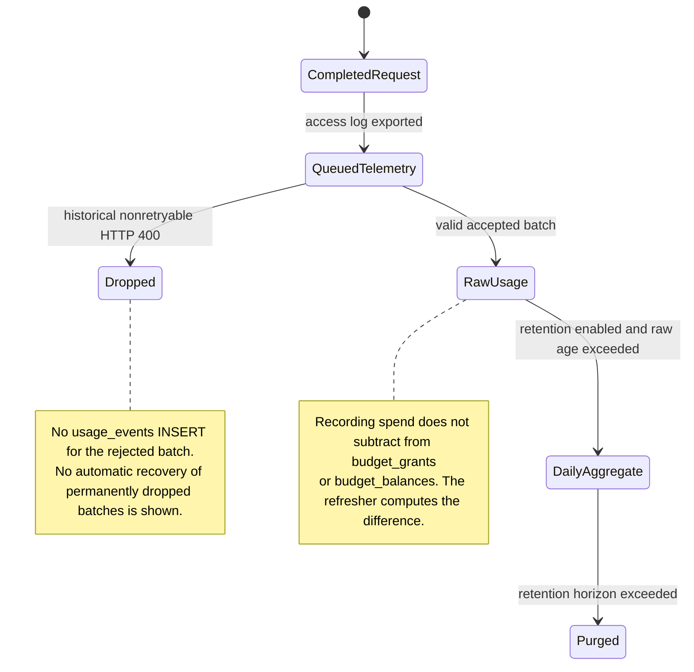

The deployed spend query sums **raw `usage_events` UNION ALL `usage_events_daily`**, scoped by account and time. Current-month data normally remains raw. Retention's `usage_retention_state` is operational bookkeeping, not another spend total. Envoy and Authorino do not write these SQL tables; the usage service does.

**Historical failure mode:** collector logs at `2026-09-15T14:06:09.775Z` and subsequent five-second batches showed `HTTP Status Code 400`, `Exporting failed. Dropping data.` The then-observed collector config had no exporter `X-Source`; the deployed handler rejected its absence before decoding and persistence. A 2026-09-29 15-minute collector tail showed export attempts to `lightbridge-usage` and no 400/drop lines, so this map keeps the edge as a known failure mode rather than a current outage claim.

**Additional source-level concern:** the deployed ingest normalization divides `cost_micros` by 1,000,000 before storing `total_cost`; the budget spend reader treats returned `total_cost` as already micro-USD and does not multiply it back. This is a concrete contract mismatch requiring an end-to-end unit check, not a claim that all historical rows have one unit or that actual undercharging has been measured. Supplying the missing header alone would not settle it.

Sources: [access-log cost fields][access-log], [collector][collector], [deployed source requirement][usage-source], [deployed normalization][usage-normalize], [deployed persistence][usage-insert], [deployed spend union][usage-spend], [retention writes][retention], [budget unit interpretation][spend-units].

## 8. Background remaining-budget snapshots

```mermaid
sequenceDiagram
    autonumber
    participant B as authz-budget refresher
    participant A as accounts, users, grants, api_keys
    participant N as budget_remaining_snapshots
    participant U as authz-usage spend API
    participant G as budget_grants
    participant S as budget_reset_schedules and plan context
    B->>B: Tick; acquire replica coordination lock
    B->>A: Find accounts with recent grants or used active keys
    B->>N: Seed missing rows or re-arm aged eligible rows
    B->>N: Select due fast-lane and slow-lane rows
    loop Each selected account, bounded concurrency
        B->>U: POST /usage/v1/spend/query over mTLS
        alt Usage answered, including a genuinely empty result
            B->>G: SUM effective grants for current month
            B->>S: Resolve next reset, else next UTC month
            B->>N: Store ceiling, spent, remaining, period and timestamps
        else Usage unreachable
            B->>N: Mark stale; keep previous reading
        end
    end
    B->>N: Read coverage census
```

```mermaid
stateDiagram-v2
    [*] --> NoRow
    NoRow --> Uncomputed: seed or activity touch
    Uncomputed --> Known: successful refresh
    Known --> Known: grant transaction applies eligible delta
    Known --> SlowLane: activity ages past fast-lane window
    SlowLane --> Known: activity touch and next refresh
    Known --> StaleKnown: usage service unreachable
    SlowLane --> StaleKnown: usage service unreachable
    StaleKnown --> Known: refresh succeeds
    Known --> WrongPeriod: UTC month changes
    StaleKnown --> WrongPeriod: UTC month changes
    WrongPeriod --> Known: new-period refresh succeeds
    SlowLane --> OutsideActiveWindow: idle too long
    OutsideActiveWindow --> SlowLane: eligible seed re-arms; existing reading retained
    note right of StaleKnown
        Existing current-period reading remains usable.
        Snapshot age alone does not cause a gateway refusal.
    end note
    note right of WrongPeriod
        Introspection omits budget fields until refreshed.
        Unknown is not a fabricated zero balance.
    end note
```

Default pacing, with no snapshot overrides found in the deployed config: fast tick **15 seconds**, slow lane **10 minutes**, active window **24 hours**, seed lookback **30 days**, batch **500**, concurrency **8**. These are scheduling settings, not guaranteed maximum end-to-end latency.

A successful spend query can still be incomplete if ingest dropped telemetry. That failure does not necessarily set `stale_since`: the query service can answer successfully with old or absent events. Accordingly, a snapshot can look freshly recomputed while understating actual consumption. The historical ingestion failure mode in section 7 matters directly here.

The separately retained `GET /budget/v1/remaining` listener uses a shared secret, not mTLS, and supports the operational fresh-read path. It is not on Authorino's current request path. Its bounded spend-cache grace is a different mechanism from keeping the snapshot's last known reading.

Sources: [refresher unit of work][refresh], [seed predicate][seed], [snapshot SQL][snapshot-store], [pacing defaults][snapshot-config], [remaining listener][remaining].

## 9. Request admission: Envoy, Authorino, and ExtensionPolicy

```mermaid
sequenceDiagram
    autonumber
    participant C as Model client
    participant E as Envoy data plane
    participant A as Authorino via SecurityPolicy
    participant O as authz-opa introspection
    participant D as Credential context and budget snapshot
    participant L as Envoy Lua filters from ExtensionPolicy
    participant R as Rate-limit service and Redis
    participant M as Model backend
    C->>E: Model request with credential
    E->>E: AI Gateway processing exposes model context
    E->>A: ext_authz
    A->>A: Verify identity; select credential-specific policy
    opt Introspection-eligible credential and cache miss
        A->>O: POST /v1/authorino/validate/introspect
        O->>D: Validate credential/context; SELECT account snapshot
        O-->>D: Throttled asynchronous last_seen_at touch
        O-->>A: active, context, optional budget fields
    end
    A-->>E: Allow plus trusted descriptors and budget dynamic metadata
    E->>L: Billing calendar Lua; model-policy Lua; budget Lua
    alt Ledger in scope, known remaining positive
        L-->>E: Continue
    else Ledger in scope, known remaining zero or negative
        L-->>C: 402 budget_exhausted
    else Ledger in scope, budget unknown or malformed
        L-->>C: 503 budget_unavailable
    else Explicitly outside ledger scope
        L-->>E: Continue without ledger threshold
    end
    Note over E,R: Independent RPM gate; positioned separately from the budget decision here
    opt Budget stage permitted continuation
        E->>R: Check per-key/model and per-account/model request buckets
        alt Request-rate gate permits
            R-->>E: Allow
            E->>M: Forward when all applicable gates allow
        else Request-rate gate refuses
            R-->>E: Rate-limit denial
            E-->>C: 429 request_rate_limited
        end
    end
```

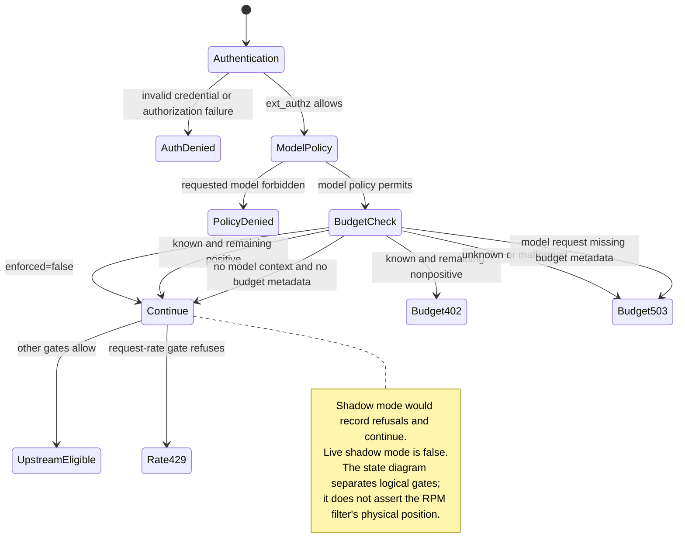

### What each policy actually owns

| Resource/component | Responsibility | Budget-table writes? |
|---|---|---|
| Gateway-attached `SecurityPolicy` | Connects Envoy `ext_authz` to Authorino; observed `failOpen: false` | None |
| Authorino `AuthConfig` | Identity verification, introspection metadata, authorization, trusted headers and `dynamicMetadata.budget` | None directly |
| `authz-opa` | Credential validation, account/project resolution, snapshot read; asynchronous snapshot activity touch | `last_seen_at` touch/upsert, not grant allocation |
| `EnvoyExtensionPolicy/core-gateway-billing-period` | Three Lua entries: billing calendar, model restrictions, budget decision | None |
| Budget Lua | Reads `envoy.filters.http.ext_authz.budget`; chooses allow / 402 / 503 | None |
| Per-model `BackendTrafficPolicy` | Request-count limits using key/account and model descriptors | Redis counters through rate-limit service, not SQL money balances |
| AI Gateway processing and Envoy access logging | Model selection, usage/cost metadata, telemetry export | None directly |

**Credential coverage is narrower than all model traffic.** In the observed main AuthConfig, ledger enforcement requires a nonempty `api_key_id` and a non-Keycloak issuer. Internal AuthConfig explicitly publishes `enforced=false`; GitHub binding and legacy Keycloak also fail the main enforcement predicate. Do not interpret bypassing this one ledger threshold as bypassing all authentication or request-rate limits.

**Budget is an admission check, not a reservation.** There is no SQL debit before forwarding each request and no per-token decrement in this Lua filter. Telemetry batching, snapshot cadence, Authorino's 30-second cache, concurrent requests, and in-flight streams can all separate admitted work from recorded spend. Existing stale-but-known snapshots are accepted on their numeric value; their age is observability, not a refusal criterion.

**The older double-cap design is gone.** Values record the cost-bucket deletion on September 5; the live policy inventory agrees. A current 429 can still be request throttling, but the observed policies do not enforce the former weekly/monthly monetary cap.

Sources: [ExtensionPolicy Lua order and configuration][extension], [Lua decision implementation][lua], [Authorino cache][auth-cache], [credential scope and dynamic metadata][auth-budget], [introspection reader][introspection], [key and exchange introspection][introspection-handler], [model request limits][rpm], [cost-bucket removal record][removed-buckets].

## What this map does not establish

- No database rows or balances were changed, no grants issued, and no production configuration changed for this investigation.
- Live configuration and image versions were checked. The collector failure was observed in logs. Every RPC branch was not exercised against production.
- No claim is made that all accounts have complete usage history or correct monetary units. The historical ingestion failure mode and unit-contract mismatch require follow-up before making that claim.
- Project/member quota fields and schema source enums are not evidence of implemented allocation flows. The observed limiter reads an account balance; it does not apportion it into independent per-project wallets.

[services]: /home/koufan/dev/lightbridge-authz/AGENTS.md:54
[proxy]: /home/koufan/dev/converse-frontends/apps/console/src/server/proxy-target.ts:42
[grant]: /home/koufan/dev/lightbridge-authz/crates/lightbridge-authz-budget/src/repo.rs:348
[account]: /home/koufan/dev/lightbridge-authz/crates/lightbridge-authz-rest/src/handlers/accounts.rs:30
[account-repo-create]: /home/koufan/dev/lightbridge-authz/crates/lightbridge-authz-api-key/src/repo.rs:437
[account-repo-provision]: /home/koufan/dev/lightbridge-authz/crates/lightbridge-authz-api-key/src/repo.rs:550
[federated-provision]: /home/koufan/dev/lightbridge-authz/crates/lightbridge-authz-api-key/src/federated_provisioning.rs:42
[idp-starting-grant]: /home/koufan/dev/lightbridge-authz/crates/lightbridge-authz-rest/src/relying_party.rs:729
[starting]: /home/koufan/dev/lightbridge-authz/crates/lightbridge-authz-budget/src/starting_grant.rs:113
[effective]: /home/koufan/dev/lightbridge-authz/crates/lightbridge-authz-budget/src/effective_schedule.rs:1
[snapshot-store]: /home/koufan/dev/lightbridge-authz/crates/lightbridge-authz-budget/src/snapshot_store.rs:39
[admin-grant]: /home/koufan/dev/lightbridge-authz/crates/lightbridge-authz-rest/src/lib.rs:2184
[ledger-migration]: /home/koufan/dev/lightbridge-authz/migrations/20260803000001_budget_grants.sql:1
[refill]: /home/koufan/dev/lightbridge-authz/crates/lightbridge-authz-budget/src/refill.rs:178
[refill-rpc]: /home/koufan/dev/lightbridge-authz/crates/lightbridge-authz-rest/src/lib.rs:1735
[refill-service]: /home/koufan/dev/lightbridge-authz/crates/lightbridge-authz-budget/src/refill.rs:178
[budget-server]: /home/koufan/dev/lightbridge-authz/crates/lightbridge-authz-rest/src/lib.rs:3882
[budget-services]: /home/koufan/dev/lightbridge-authz/crates/lightbridge-authz-rest/src/budget_services.rs:116
[augmentation]: /home/koufan/dev/lightbridge-authz/crates/lightbridge-authz-budget/src/augmentation.rs:1
[review]: /home/koufan/dev/lightbridge-authz/crates/lightbridge-authz-budget/src/review.rs:123
[review-service]: /home/koufan/dev/lightbridge-authz/crates/lightbridge-authz-budget/src/review.rs:186
[permissions]: /home/koufan/dev/lightbridge-authz/crates/lightbridge-authz-rest/src/rpc_permission_map.rs:111
[policy]: /home/koufan/dev/lightbridge-authz/crates/lightbridge-authz-budget/src/policy_store.rs:138
[policy-rpc]: /home/koufan/dev/lightbridge-authz/crates/lightbridge-authz-rest/src/lib.rs:1536
[schedule-rpc]: /home/koufan/dev/lightbridge-authz/crates/lightbridge-authz-rest/src/lib.rs:2364
[schedule-repo]: /home/koufan/dev/lightbridge-authz/crates/lightbridge-authz-budget/src/reset_schedule.rs:480
[scheduler]: /home/koufan/dev/lightbridge-authz/crates/lightbridge-authz-budget/src/reset_scheduler.rs:164
[reset-delta]: /home/koufan/dev/lightbridge-authz/crates/lightbridge-authz-budget/src/reset_scheduler.rs:343
[access-log]: /home/koufan/dev/ai-helm/charts/core-gateway/templates/envoy-proxy.yaml:186
[collector]: /home/koufan/dev/ai-helm/charts/core-gateway/templates/otel.yaml:248
[usage-source]: https://github.com/ADORSYS-GIS/lightbridge-authz/blob/7c7eea3ba1ef0bfa9a31cd9c76257f47a65631c8/crates/lightbridge-authz-usage/src/normalizer/mod.rs#L90
[usage-normalize]: https://github.com/ADORSYS-GIS/lightbridge-authz/blob/7c7eea3ba1ef0bfa9a31cd9c76257f47a65631c8/crates/lightbridge-authz-usage/src/handlers/ingest.rs#L492
[usage-insert]: https://github.com/ADORSYS-GIS/lightbridge-authz/blob/7c7eea3ba1ef0bfa9a31cd9c76257f47a65631c8/crates/lightbridge-authz-usage/src/repo.rs#L111
[usage-spend]: https://github.com/ADORSYS-GIS/lightbridge-authz/blob/7c7eea3ba1ef0bfa9a31cd9c76257f47a65631c8/crates/lightbridge-authz-usage/src/spend.rs#L42
[retention]: https://github.com/ADORSYS-GIS/lightbridge-authz/blob/7c7eea3ba1ef0bfa9a31cd9c76257f47a65631c8/crates/lightbridge-authz-usage/src/retention_loop.rs#L42
[spend-units]: /home/koufan/dev/lightbridge-authz/crates/lightbridge-authz-budget/src/spend_units.rs:13
[refresh]: /home/koufan/dev/lightbridge-authz/crates/lightbridge-authz-budget/src/snapshot_refresh_one.rs:26
[seed]: /home/koufan/dev/lightbridge-authz/crates/lightbridge-authz-budget/src/snapshot_seed.rs:54
[snapshot-config]: /home/koufan/dev/lightbridge-authz/crates/lightbridge-authz-budget/src/snapshot_config.rs:45
[remaining]: /home/koufan/dev/lightbridge-authz/crates/lightbridge-authz-rest/src/budget_remaining.rs:1
[extension]: /home/koufan/dev/ai-helm/charts/core-gateway/templates/envoyextensionpolicy-billing-period.yaml:51
[lua]: /home/koufan/dev/ai-helm/charts/core-gateway/files/budget-limiter.lua:185
[auth-cache]: /home/koufan/dev/ai-helm-values/environments/prod/values/security-policies.yaml:424
[auth-budget]: /home/koufan/dev/ai-helm-values/environments/prod/values/security-policies.yaml:1282
[introspection]: /home/koufan/dev/lightbridge-authz/crates/lightbridge-authz-rest/src/introspect_budget.rs:91
[introspection-handler]: /home/koufan/dev/lightbridge-authz/crates/lightbridge-authz-rest/src/handlers/introspect.rs:45
[rpm]: /home/koufan/dev/ai-helm/charts/ai-model/templates/backendtrafficpolicy.yaml:148
[removed-buckets]: /home/koufan/dev/ai-helm-values/environments/prod/values/core-gateway.yaml:58
