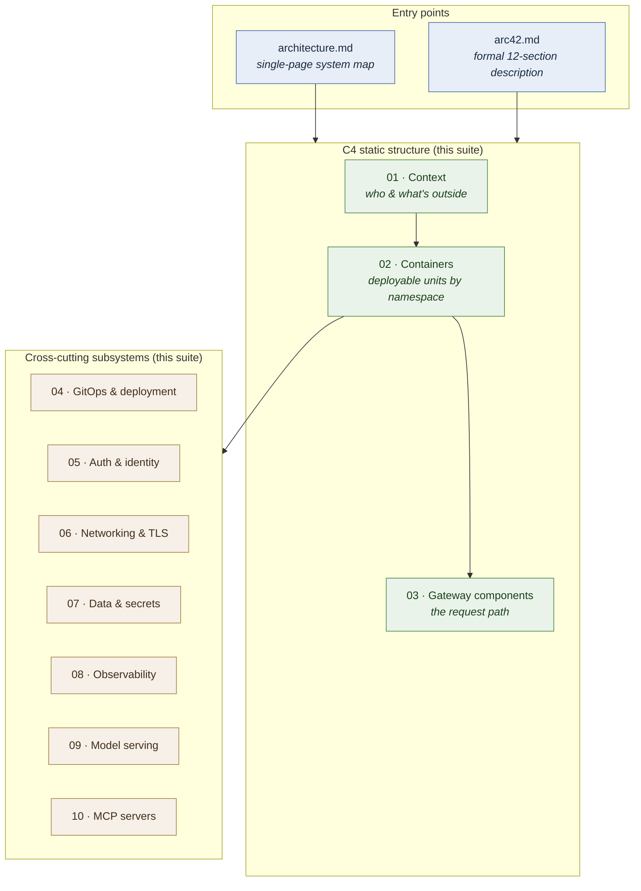
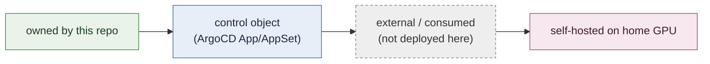

# Architecture documentation suite

A **layered**, mermaid-based map of the Camer Digital AI platform deployed by
this repository. Each layer zooms in one level — read top-down, stop when you
have the resolution you need.

> This is a *navigation hub*. The single-page system map lives at
> [`../architecture.md`](../architecture.md); the formal arc42 description at
> [`../arc42.md`](../arc42.md); the source-of-truth for every *why* is the
> [ADR index](../adr/README.md). This suite sits between them — enough depth to
> understand each subsystem, every diagram in mermaid so it renders inline.

## How the layers fit together

This suite follows the **C4 model** (Context → Container → Component) for the
static structure, then breaks out the cross-cutting subsystems each on its own
page. arc42 is the formal frame around all of it.

## The pages

| # | Page | Zoom level | Answers |
|---|---|---|---|
| 01 | [Context](01-context.md) | C4 L1 | Who uses the platform; what external systems it depends on |
| 02 | [Containers](02-containers.md) | C4 L2 | What's deployed, in which namespace, on which cluster |
| 03 | [Gateway components](03-gateway-components.md) | C4 L3 | How one request traverses the gateway |
| 04 | [GitOps & deployment](04-gitops-deployment.md) | infra | How charts become running workloads; sync waves; releases |
| 05 | [Auth & identity](05-auth-identity.md) | security | Dual-plane auth, the three identity surfaces, the `x-oidc-*` contract |
| 06 | [Networking & TLS](06-networking-tls.md) | infra | Ingress, the Hetzner LB, Cilium deny-egress, certificate issuance |
| 07 | [Data & secrets](07-data-secrets.md) | infra | Mongo, CNPG, Redis, object storage, the ESO secret flow |
| 08 | [Observability](08-observability.md) | platform | The LGTM pipeline, Alloy collection, per-user attribution |
| 09 | [Model serving](09-model-serving.md) | platform | Provider fan-out + the self-hosted GPU model; budget tiers |
| 10 | [MCP servers](10-mcp.md) | platform | MCP routing, the OAuth carve-out, the external-proxy modes |

## C4 ↔ arc42 ↔ this suite

The same system, described in three complementary frames:

| C4 level | arc42 section | This suite |
|---|---|---|
| L1 System Context | §3 Context & scope | [01 Context](01-context.md) |
| L2 Container | §5.1 Building blocks (level 1) | [02 Containers](02-containers.md) |
| L3 Component | §5.3 Building blocks (level 3), §6 Runtime | [03 Gateway components](03-gateway-components.md) |
| Deployment | §7 Deployment view | [04 GitOps](04-gitops-deployment.md) |
| (crosscutting) | §8 Crosscutting concepts | [05](05-auth-identity.md)–[10](10-mcp.md) |

## Conventions used in every diagram

A consistent visual language across the suite:

- **Solid green** — a chart/workload this repo owns and deploys.
- **Blue** — an ArgoCD control object (`Application` / `ApplicationSet`).
- **Dashed grey** — an external system this repo only *references* by name
  (Keycloak, Redis, cert-manager, ESO, CNPG operator, object storage, providers).
- **Pink** — runs on the home GPU cluster (the `homeCluster: true` exception).

> **Accuracy note.** Diagrams reflect `release-2026.06.14-v09`. Coder
> (old ADR-0019) was **removed** (ADR-0027) and does not appear here, despite
> lingering mentions in some older `docs/` files.
