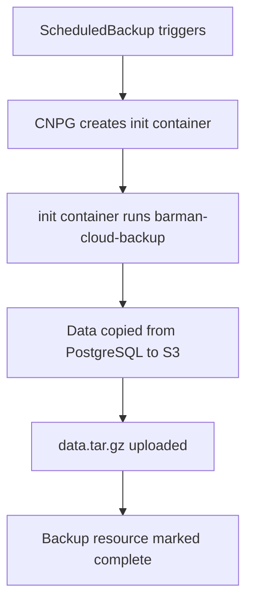
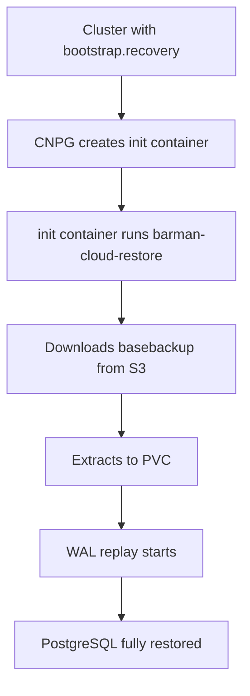
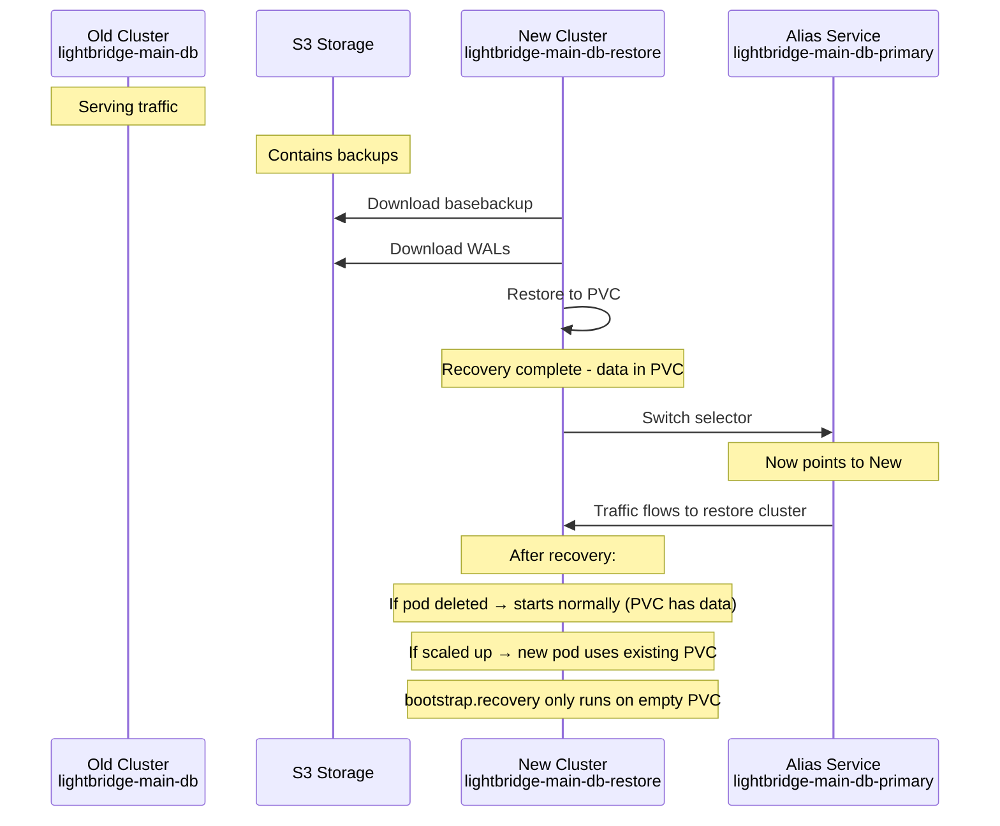

# CNPG Backup Architecture Guide

A comprehensive guide to understanding how CloudNativePG (CNPG) backups work with the Barman Cloud plugin, including the complete architecture and configuration.

## Table of Contents

1. [Core Concepts](#core-concepts)
2. [How Backups Work](#how-backups-work)
3. [WAL Files Explained](#wal-files-explained)
4. [Architecture Overview](#architecture-overview)
5. [Configuration Reference](#configuration-reference)
6. [Code-to-Concept Mapping](#code-to-concept-mapping)

---

## Core Concepts

### What is CloudNativePG (CNPG)?

CNPG is a Kubernetes operator that manages PostgreSQL clusters. It handles:
- Cluster lifecycle (create, update, delete)
- High availability (automatic failover)
- Backup and recovery
- Streaming replication

### What is the Barman Cloud Plugin?

The Barman Cloud plugin extends CNPG to store backups and WAL files in object storage (S3, MinIO, Azure Blob, etc.). It provides:
- Physical backups (copying raw PostgreSQL files)
- WAL archiving (continuous transaction log shipping)
- Point-in-time recovery (PITR)
- Retention policies

### Key Resources

| Resource | Purpose |
|----------|---------|
| `Cluster` | PostgreSQL cluster definition |
| `ObjectStore` | Configuration for backup storage |
| `Backup` | Single backup instance |
| `ScheduledBackup` | Cron-based backup scheduling |
| `Plugin` | Extension that provides backup functionality |

---

## How Backups Work

### The Two Types of Backups

#### 1. Base Backup (Full Backup)

A complete copy of all PostgreSQL data files at a point in time.

```
ObjectStore (s3://ai-ops-backups/lightbridge-main-db/)
├── data/
│   ├── basebackup-20260428T020000.tar.gz  ← Full backup
│   └── basebackup-20260429T020000.tar.gz
└── wal/                                    ← WAL files
    ├── 000000010000000000000001
    ├── 000000010000000000000002
    └── ...
```

#### 2. WAL Archive (Continuous)

Every transaction PostgreSQL makes is written to WAL files. These are uploaded continuously to object storage.

### How Base Backup is Created



### How Recovery Works



---

## WAL Files Explained

### What Are WAL Files?

WAL (Write-Ahead Log) files contain every change made to the database:

```sql
-- Every INSERT/UPDATE/DELETE is recorded in WAL
INSERT INTO users (id, name) VALUES (1, 'Alice');
-- WAL: Transaction #1234, INSERT into users, id=1, name='Alice'

UPDATE users SET name = 'Bob' WHERE id = 1;
-- WAL: Transaction #1235, UPDATE users, id=1, name='Bob'
```

### Why WAL Files Are Needed

1. **Crash Recovery**: If PostgreSQL crashes, WAL replay recovers to consistent state
2. **Point-in-Time Recovery**: Can replay WAL to any point in time
3. **Replication**: Replicas replay WAL to stay in sync

### WAL Segments

PostgreSQL uses 16MB WAL segments (configurable):

```
/pg_wal/
├── 000000010000000000000001  ← Segment 1 (16MB)
├── 000000010000000000000002  ← Segment 2
├── 000000010000000000000003  ← Segment 3
└── ...
```

### WAL Frequency Configuration

Control how often WAL segments are uploaded with `archive_timeout`:

```yaml
postgresql:
  parameters:
    archive_timeout: 30min  # Switch WAL every 30 minutes
```

**Trade-offs:**
- Shorter = More uploads, less potential data loss, more S3 requests
- Longer = Fewer uploads, more potential data loss, less S3 requests

### WAL Compression

WAL files are compressed before upload to save bandwidth:

```yaml
# In values.yaml (ObjectStore configuration)
configuration:
  wal:
    compression: gzip  # Compress WAL uploads
```

---

## Architecture Overview

### Complete Flow

```mermaid
flowchart TB
    subgraph S3[S3 / MinIO]
        OS1[ObjectStore: lightbridge-main-db]
        OS2[ObjectStore: lightbridge-usage-db]
    end
    
    subgraph K8s[Kubernetes Cluster]
        subgraph Backup[Backup Infrastructure]
            SB1[ScheduledBackup: main-db-daily]
            SB2[ScheduledBackup: usage-db-daily]
            B1[Backup CR]
            B2[Backup CR]
        end
        
        subgraph Database[Database Clusters]
            C1[Cluster: lightbridge-main-db]
            C2[Cluster: lightbridge-usage-db]
            P1[Pod: main-db-1]
            P2[Pod: main-db-2]
            P3[Pod: usage-db-1]
            P4[Pod: usage-db-2]
            PVC1[PVC: 5Gi]
            PVC2[PVC: 10Gi]
        end
        
        subgraph Services[Services]
            S1[Service: main-db-rw]
            S2[Service: main-db-ro]
            S3[Service: main-db-primary]  ← Alias
        end
    end
    
    P1 -->|WAL Archive| SB1
    SB1 -->|Creates| B1
    B1 -->|Uploads to| OS1
    OS1 -->|Stores in| S3
    C1 -->|References| OS1
```

### How Components Connect

```
┌─────────────────────────────────────────────────────────────────┐
│                        S3 / MinIO                               │
│  s3://ai-ops-backups/lightbridge-main-db/                       │
│  ├── data/basebackup-*.tar.gz                                   │
│  └── wal/0000000*.00000000.*                                    │
└─────────────────────────────────────────────────────────────────┘
                              ▲
                              │ S3 Credentials
                              │
┌─────────────────────────────────────────────────────────────────┐
│                     ObjectStore CR                              │
│  name: lightbridge-main-db                                      │
│  spec.configuration.destinationPath: s3://ai-ops-backups/...    │
│  spec.retentionPolicy: 6m                                       │
└─────────────────────────────────────────────────────────────────┘
           │                                    ▲
           │ barmanObjectName: lightbridge-main-db
           │                                    │
           ▼                                    │
┌─────────────────────────────────────────────────────────────────┐
│                      Cluster CR                                 │
│  name: lightbridge-main-db                                      │
│  spec.plugins[].parameters.barmanObjectName: lightbridge-main-db│
│  spec.plugins[].isWALArchiver: true                             │
└─────────────────────────────────────────────────────────────────┘
           │
           │ Creates
           ▼
┌─────────────────────────────────────────────────────────────────┐
│                     PostgreSQL Pod                              │
│  name: lightbridge-main-db-1                                    │
│  PVC: 5Gi (linode-block-storage)                                │
│  ├── /var/lib/postgresql/data (PGDATA)                          │
│  └── /var/lib/postgresql/wal (WAL)                              │
│                                                                 │
│  Sidecar: barman-cloud-plugin                                   │
│  └── Archives WAL to ObjectStore every 30min                    │
└─────────────────────────────────────────────────────────────────┘
           │
           │ Creates
           ▼
┌─────────────────────────────────────────────────────────────────┐
│                    ScheduledBackup CR                           │
│  name: lightbridge-main-db-daily                                │
│  spec.cluster.name: lightbridge-main-db                         │
│  spec.schedule: 0 0 2 * * * (2 AM daily)                        │
│  spec.method: plugin                                            │
│  spec.backupOwnerReference: self                                │
└─────────────────────────────────────────────────────────────────┘
           │
           │ Triggers
           ▼
┌─────────────────────────────────────────────────────────────────┐
│                      Backup CR                                  │
│  name: lightbridge-main-db-daily-20260428T020000                 │
│  status.phase: completed                                        │
│  status.startedAt: 2026-04-28T02:00:00Z                         │
└─────────────────────────────────────────────────────────────────┘
```

---

## Configuration Reference

### 1. Where to Configure PVCs

**File:** `charts/apps/values.yaml`

```yaml
apiVersion: postgresql.cnpg.io/v1
kind: Cluster
metadata:
  name: lightbridge-main-db
spec:
  instances: 2
  storage:
    storageClass: linode-block-storage  # Storage class
    size: 5Gi                           # PVC size
```

| Field | Description |
|-------|-------------|
| `spec.storage.storageClass` | Kubernetes StorageClass |
| `spec.storage.size` | PersistentVolumeClaim size |

### 2. Where to Configure WAL Frequency

**File:** `charts/apps/values.yaml`

```yaml
apiVersion: postgresql.cnpg.io/v1
kind: Cluster
metadata:
  name: lightbridge-main-db
spec:
  postgresql:
    parameters:
      archive_timeout: 30min  # WAL segment switch interval
```

| Value | Meaning |
|-------|---------|
| `5min` | Switch every 5 minutes (more uploads) |
| `30min` | Switch every 30 minutes (balanced) |
| `1h` | Switch every hour (fewer uploads) |
| `0` | Only switch when segment is full |

### 3. Where to Configure Backup Destination (S3)

**File:** `charts/apps/values.yaml`

```yaml
apiVersion: barmancloud.cnpg.io/v1
kind: ObjectStore
metadata:
  name: lightbridge-main-db
spec:
  retentionPolicy: 6m
  configuration:
    destinationPath: s3://ai-ops-backups/lightbridge-main-db/
    endpointURL: https://s3.ssegning.me
    s3Credentials:
      accessKeyId:
        name: lightbridge-cnpg-s3
        key: s3_access_key_id
      secretAccessKey:
        name: lightbridge-cnpg-s3
        key: s3_secret_access_key
    region:
      name: lightbridge-cnpg-s3
      key: s3_region_name
```

| Field | Description |
|-------|-------------|
| `spec.configuration.destinationPath` | S3 bucket and prefix |
| `spec.configuration.endpointURL` | S3-compatible endpoint |
| `spec.retentionPolicy` | Backup retention (6m = 6 months) |

### 4. Where to Configure WAL Compression

**File:** `charts/apps/values.yaml` (ObjectStore config)

```yaml
configuration:
  wal:
    compression: gzip  # Compress WAL uploads
```

### 5. Where to Link Cluster to ObjectStore

**File:** `charts/apps/values.yaml`

```yaml
apiVersion: postgresql.cnpg.io/v1
kind: Cluster
metadata:
  name: lightbridge-main-db
spec:
  plugins:
    - name: barman-cloud.cloudnative-pg.io
      isWALArchiver: true
      parameters:
        barmanObjectName: lightbridge-main-db  # Links to ObjectStore
        serverName: lightbridge-main-db        # Server name in S3
```

| Field | Purpose |
|-------|---------|
| `spec.plugins[].parameters.barmanObjectName` | Name of the ObjectStore CR |
| `spec.plugins[].parameters.serverName` | Directory name in S3 bucket |

### 6. Where to Configure Backup Schedule

**File:** `charts/apps/values.yaml`

```yaml
apiVersion: postgresql.cnpg.io/v1
kind: ScheduledBackup
metadata:
  name: lightbridge-main-db-daily
spec:
  schedule: 0 0 2 * * *  # Cron: 2 AM daily (6 fields: sec min hour day month weekday)
  immediate: true        # Run immediately on creation
  backupOwnerReference: self  # Cleanup when ScheduledBackup is deleted
  cluster:
    name: lightbridge-main-db
  method: plugin
  pluginConfiguration:
    name: barman-cloud.cloudnative-pg.io
```

| Field | Description |
|-------|-------------|
| `spec.schedule` | Cron expression (6 fields with seconds) |
| `spec.immediate` | Run backup on creation |
| `spec.backupOwnerReference` | Who owns Backup CRs |
| `spec.cluster.name` | Which cluster to backup |
| `spec.method` | Backup method (plugin or barmanObjectStore) |

---

## Code-to-Concept Mapping

### Configuration Table

| Concept | File | Location | Key Fields |
|---------|------|----------|------------|
| **PVC Storage** | `values.yaml` | Cluster.spec.storage | `storageClass`, `size` |
| **WAL Frequency** | `values.yaml` | Cluster.spec.postgresql.parameters | `archive_timeout` |
| **S3 Destination** | `values.yaml` | ObjectStore.spec.configuration | `destinationPath`, `endpointURL` |
| **S3 Credentials** | `values.yaml` | ObjectStore.spec.configuration.s3Credentials | `accessKeyId`, `secretAccessKey` |
| **WAL Compression** | `values.yaml` | ObjectStore.spec.configuration.wal | `compression` |
| **Retention Policy** | `values.yaml` | ObjectStore.spec | `retentionPolicy` |
| **Cluster→ObjectStore** | `values.yaml` | Cluster.spec.plugins[].parameters | `barmanObjectName` |
| **Server Name (S3)** | `values.yaml` | Cluster.spec.plugins[].parameters | `serverName` |
| **Backup Schedule** | `values.yaml` | ScheduledBackup.spec | `schedule`, `cluster.name` |
| **Plugin Method** | `values.yaml` | ScheduledBackup.spec | `method`, `pluginConfiguration.name` |

### Resource Relationship Diagram

```
┌─────────────────────────────────────────────────────────────────────────┐
│                          Kubernetes Namespace: converse                 │
├─────────────────────────────────────────────────────────────────────────┤
│                                                                         │
│  ┌─────────────────────┐         ┌──────────────────────────────────┐  │
│  │   Secret            │         │          ObjectStore             │  │
│  │   lightbridge-cnpg-s3   │──────▶│   lightbridge-main-db           │  │
│  │   ├── s3_access_key_id  │         │   spec.configuration:          │  │
│  │   ├── s3_secret_access_key │     │   ├── destinationPath          │  │
│  │   └── s3_region_name   │         │   ├── endpointURL              │  │
│  └─────────────────────┘         │   ├── s3Credentials              │  │
│                                  │   └── wal.compression            │  │
│                                  └──────────────────────────────────┘  │
│                                            ▲                           │
│                                            │                          │
│                                            │ barmanObjectName         │
│                                            │                          │
│  ┌──────────────────────────────────────────────────────────────────┐  │
│  │                          Cluster                                 │  │
│  │                          lightbridge-main-db                      │  │
│  │                                                                  │  │
│  │  spec:                                                           │  │
│  │  ├── instances: 2                                               │  │
│  │  ├── storage.size: 5Gi                                          │  │
│  │  ├── plugins[].name: barman-cloud.cloudnative-pg.io             │  │
│  │  │   ├── isWALArchiver: true                                    │  │
│  │  │   └── parameters.barmanObjectName: lightbridge-main-db      │  │
│  │  │   └── parameters.serverName: lightbridge-main-db            │  │
│  │  └── postgresql.parameters.archive_timeout: 30min               │  │
│  │                                                                  │  │
│  │  Creates Pods:                                                  │  │
│  │  ├── lightbridge-main-db-1 (Primary)                           │  │
│  │  │   └── PVC: 5Gi                                              │  │
│  │  └── lightbridge-main-db-2 (Replica)                           │  │
│  │      └── PVC: 5Gi                                              │  │
│  │                                                                  │  │
│  │  Creates Services:                                              │  │
│  │  ├── lightbridge-main-db-rw (Read/Write)                       │  │
│  │  ├── lightbridge-main-db-ro (Read-Only)                        │  │
│  │  └── lightbridge-main-db (All instances)                       │  │
│  └──────────────────────────────────────────────────────────────────┘  │
│                                            │                          │
│                                            │ ScheduledBackup         │
│                                            ▼                          │
│  ┌──────────────────────────────────────────────────────────────────┐  │
│  │                    ScheduledBackup                               │  │
│  │                    lightbridge-main-db-daily                     │  │
│  │                                                                  │  │
│  │  spec:                                                           │  │
│  │  ├── schedule: 0 0 2 * * * (2 AM daily)                         │  │
│  │  ├── backupOwnerReference: self                                 │  │
│  │  ├── cluster.name: lightbridge-main-db                          │  │
│  │  ├── method: plugin                                             │  │
│  │  └── pluginConfiguration.name: barman-cloud.cloudnative-pg.io  │  │
│  │                                                                  │  │
│  │  Creates Backup CRs:                                            │  │
│  │  └── lightbridge-main-db-daily-20260428T020000 (on schedule)    │  │
│  └──────────────────────────────────────────────────────────────────┘  │
│                                                                         │
└─────────────────────────────────────────────────────────────────────────┘
                                    │
                                    │ Uploads/Downloads
                                    ▼
┌─────────────────────────────────────────────────────────────────────────┐
│                           S3 / MinIO                                    │
│                           https://s3.ssegning.me                        │
├─────────────────────────────────────────────────────────────────────────┤
│                                                                         │
│  s3://ai-ops-backups/lightbridge-main-db/                              │
│  ├── server=lightbridge-main-db/                                       │
│  │   ├── base/                                                         │
│  │   │   └── 20260428T020000/  ← Base backup (tar.gz)                  │
│  │   └── wal/                                                          │
│  │       ├── 000000010000000000000001 (compressed)                     │
│  │       └── 000000010000000000000002 (compressed)                     │
│  └── server=lightbridge-usage-db/                                      │
│      ├── base/                                                         │
│      └── wal/                                                          │
│                                                                         │
└─────────────────────────────────────────────────────────────────────────┘
```

---

---

## Recovery Approaches Explained

### How Pod Recreation Works After Recovery

**The key insight:** `bootstrap.recovery` only runs when the PVC is **empty**. If the PVC already has data, CNPG starts PostgreSQL normally.

#### The PVC Detection Logic

When CNPG needs to create a new pod (on startup, restart, or scale), it checks:

```
Is the PVC empty?
├── YES → Run bootstrap.recovery (download data from backup)
└── NO → Start PostgreSQL normally (use existing data in PVC)
```

#### What Happens in Different Scenarios

**Scenario 1: Pod deleted after successful recovery**
```
1. Restore cluster created with bootstrap.recovery
2. Pods created, data restored to PVCs
3. You delete one pod
4. CNPG sees: PVC has existing PostgreSQL data
5. CNPG starts PostgreSQL normally using existing data
6. NO re-recovery from backup happens
7. Data between recovery and deletion is PRESERVED
```

**Scenario 2: Pod deleted from original cluster (before recovery)**
```
1. Original cluster running with no bootstrap.recovery
2. PVC has existing PostgreSQL data
3. Pod deleted
4. CNPG starts PostgreSQL normally
5. No recovery happens - uses existing data
```

**Scenario 3: New pod created after fresh PVC**
```
1. Cluster with bootstrap.recovery
2. PVC is empty (newly created)
3. Pod created
4. CNPG sees: PVC is empty
5. CNPG runs bootstrap.recovery
6. Data downloaded from backup to PVC
7. PostgreSQL starts with restored data
```

### The Important Implication

**Your architecture goal IS achievable:**

| Requirement | How It Works |
|-------------|--------------|
| Restore pods write recovered data to PVCs | ✅ bootstrap.recovery downloads to PVC |
| Normal pods use those same PVCs | ✅ CNPG detects existing data and starts normally |
| No data loss on pod restart | ✅ Data is in PVC, not pod |
| Works after recovery without special config | ✅ PVC detection is automatic |

### Understanding `bootstrap.recovery`

This setting is a **one-time bootstrap trigger**:

| PVC State | What Happens |
|-----------|--------------|
| Empty | `bootstrap.recovery` runs, data restored |
| Has data | PostgreSQL starts normally, `bootstrap.recovery` ignored |

**This means:** After successful recovery, you can safely:
- Keep the restore cluster running indefinitely
- Delete and recreate pods (they will use existing PVC data)
- Add more replicas (they will join with existing PVC data)
- Continue using `bootstrap.recovery` in the spec (it's harmless)

### Recovery Flow Diagram



### Why Rename is NOT Needed

After successful recovery using Alias Services:
1. **Restore cluster** (`lightbridge-main-db-restore`) is healthy
2. **Alias service** (`lightbridge-main-db-primary`) points to it
3. **Traffic flows** to the restored cluster
4. **The restored pods** already have recovered data in their PVCs

**The `-restore` suffix naming is fine** - it's just a name. The data and functionality work correctly either way. Keep the restore cluster as your new production cluster.

**Final state after recovery:**
| Component | Value |
|-----------|-------|
| Cluster Name | `lightbridge-main-db-restore` (keep this) |
| Pod Names | `lightbridge-main-db-restore-1`, `-2` (keep these) |
| Alias Service Selector | `cnpg.io/cluster: lightbridge-main-db-restore` (permanent) |
| Old Cluster | Delete after validation |
| Applications | Continue using `lightbridge-main-db-primary:5432` |

---

## Common Configuration Scenarios

### Scenario 1: Configure Daily Backup at 2 AM

```yaml
apiVersion: postgresql.cnpg.io/v1
kind: ScheduledBackup
metadata:
  name: lightbridge-main-db-daily
spec:
  schedule: 0 0 2 * * *  # Second=0, Minute=0, Hour=2, every day
  backupOwnerReference: self
  cluster:
    name: lightbridge-main-db
  method: plugin
  pluginConfiguration:
    name: barman-cloud.cloudnative-pg.io
```

### Scenario 2: Configure 30-Minute WAL Upload

```yaml
apiVersion: postgresql.cnpg.io/v1
kind: Cluster
metadata:
  name: lightbridge-main-db
spec:
  postgresql:
    parameters:
      archive_timeout: 30min
```

### Scenario 3: Configure 6-Month Retention

```yaml
apiVersion: barmancloud.cnpg.io/v1
kind: ObjectStore
metadata:
  name: lightbridge-main-db
spec:
  retentionPolicy: 6m
  configuration:
    destinationPath: s3://ai-ops-backups/lightbridge-main-db/
```

### Scenario 4: Configure Compressed WAL

```yaml
apiVersion: barmancloud.cnpg.io/v1
kind: ObjectStore
metadata:
  name: lightbridge-main-db
spec:
  configuration:
    wal:
      compression: gzip
```

---

## Quick Reference Commands

```bash
# Check cluster status
kubectl get clusters.postgresql.cnpg.io -n converse

# List backups
kubectl get backups -n converse -l postgresql.cnpg.io/cluster=lightbridge-main-db

# Check ObjectStore
kubectl get objectstores.barmancloud.cnpg.io -n converse

# List S3 backups
mc ls myminio/ai-ops-backups/lightbridge-main-db/data/

# Trigger manual backup
kubectl cnpg backup -n converse lightbridge-main-db --method=plugin --plugin-name=barman-cloud.cloudnative-pg.io

# Check WAL archiving status
kubectl get cluster lightbridge-main-db -n converse -o jsonpath='{.status.conditions[?(@.type==\"ContinuousArchiving\")]}'

# Watch pod recovery
kubectl get pods -n converse -l cnpg.io/cluster=lightbridge-main-db -w

# Check backup resource
kubectl describe backup lightbridge-main-db-daily-20260428T020000 -n converse
