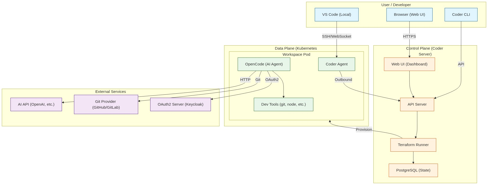
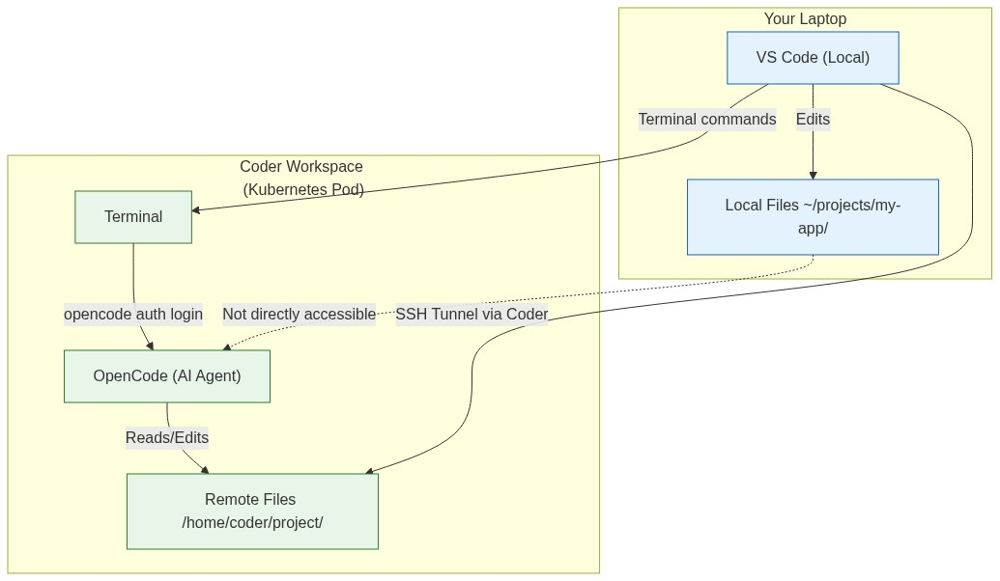
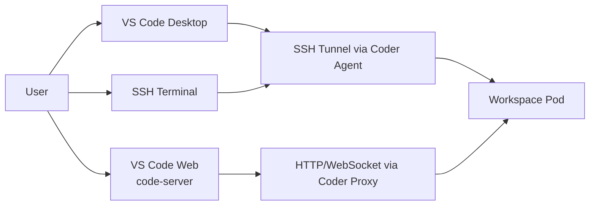
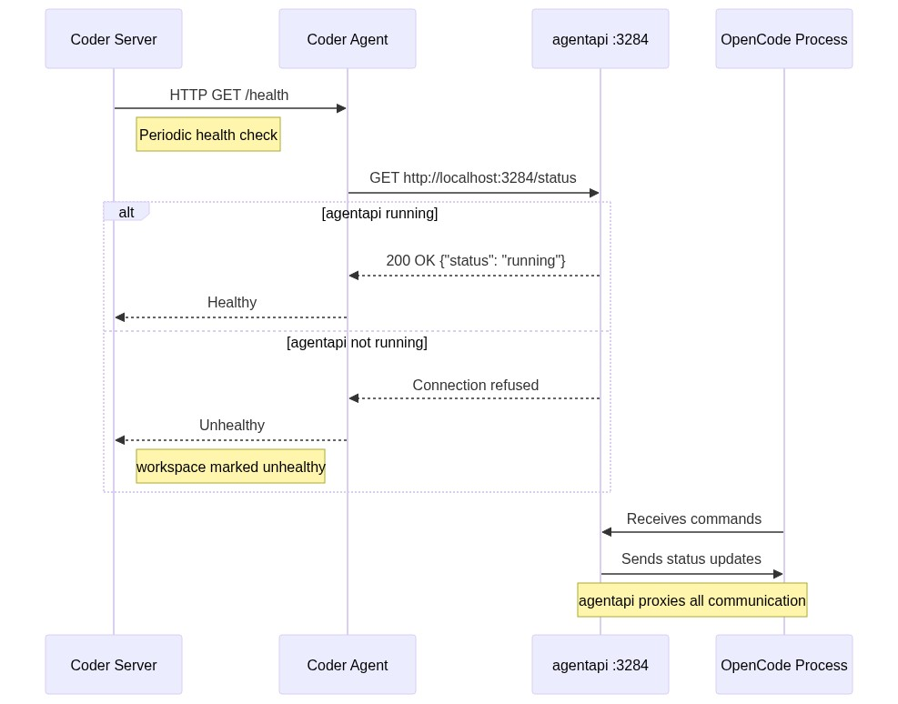

# Coder Capability & Architecture Analysis

**Date:** June 12, 2026
**Author:** @benie-joy-possi
**Status:** Draft for Review
**Ticket:** #339 (Spike: Understand Coder capabilities and architecture)
**Context:** Evaluation of Coder for integration into the **Converse** AI platform (LibreChat, Envoy Gateway ecosystem).

---

## Table of Contents

### Full Document Structure

1. [Executive Summary](#1-executive-summary)

2. [Architecture Deep Dive](#2-architecture-deep-dive)

3. [VS Code Remote Integration](#3-vs-code-remote-integration)

4. [Coder Platform Authentication & Authorization](#4-coder-platform-authentication--authorization)

5. [OpenCode Integration in Coder](#5-opencode-integration-in-coder)

6. [Workspace Persistence Strategies](#6-workspace-persistence-strategies)

7. [Capabilities & Use Cases](#7-capabilities--use-cases)

8. [Security & Isolation Strategy](#8-security--isolation-strategy)

9. [Limitations & Gotchas](#9-limitations--gotchas)

10. [Comparison with Alternatives](#10-comparison-with-alternatives)

11. [Cost & Operational Analysis](#11-cost--operational-analysis)

12. [Conclusion & Recommendations](#12-conclusion--recommendations)

13. [References & Further Reading](#13-references--further-reading)


---

## 1. Executive Summary

**Recommendation:** **InCase Proceed with Production Deployment.**  

Coder provides a robust platform for standardizing development environments, accelerating onboarding, and enabling secure, isolated AI agent workflows. Its architecture enables **self-service** infrastructure provisioning via Terraform templates, decoupling the "control plane" (Coder Server) from the "data plane" (Workspaces).

### Key Findings from Investigation

| Finding | Status | Details |
|---------|--------|---------|
| OpenCode Integration | ✅ Working | OpenCode runs successfully inside Coder workspaces via the `coder-labs/opencode` module |
| Health Check Issues | ✅ Resolved | Fixed invalid `small_model: null` configuration and model name format |
| Authentication | ✅ Working | OAuth2 authentication via `opencode auth login` command works in workspace terminal |
| VS Code Remote | ✅ Supported | Works seamlessly with OpenCode inside workspaces |
| Permission System | ✅ Configurable | `ask` for interactive approval, `allow` for autonomous |

### Key Value Propositions

*   **Instant Onboarding:** Reduces environment setup from days to minutes.
*   **AI Agent Orchestration:** Provides ephemeral, GPU enabled or not  sandboxes for AI agents (like OpenCode) to run code, test, and self-heal.
*   **Security:** Network-isolated workspaces prevent lateral movement from compromised environments to internal AI platforms.
*   **Cost Efficiency:** Ephemeral workspaces (stop/start) reduce cloud spend compared to always-on VMs.

### Primary Risk

The learning curve for **Terraform** (Template authoring) requires a dedicated Platform Engineer or DevOps resource. It is not a "zero-config" solution for end-users.

---

## 2. Architecture Deep Dive

Coder operates on a **Control Plane / Data Plane** architecture.

### 2.1 Core Components

| Component | Role | Deployment Location |
| :--- | :--- | :--- |
| **Coder Server** | The "Brain." Hosts UI, API, Auth, and runs Terraform. | **Kubernetes Cluster** (as a Pod). |
| **Template** | The "Blueprint." Terraform code defining OS, resources, and startup scripts. | Git Repository (pushed to Server). |
| **Workspace** | The "Worker." The actual compute resource (Pod, VM, or Container). | **Kubernetes Cluster** (as a Pod) or External Cloud (AWS/GCP). |
| **Coder Agent** | The "Bridge." Runs *inside* the workspace, connects outbound to Server. | Inside the Workspace. |
| **OpenCode** | The "AI Agent." Runs inside workspace, processes tasks via agentapi. | Inside the Workspace. |

### 2.2 Architecture Diagram



*The diagram above illustrates the complete Coder architecture:*

- **User Layer:** VS Code, Browser, and CLI clients connecting to Coder
- **Control Plane:** Coder Server with Web UI, API, Terraform Runner, and PostgreSQL database
- **Data Plane:** Kubernetes cluster running workspace pods containing Coder Agent, OpenCode, and Dev Tools
- **External Services:** AI APIs, Git providers, and OAuth2 servers for authentication

**Key Data Flows:**
- VS Code connects to Coder Agent via SSH/WebSocket tunnel
- Browser connects to Web UI via HTTPS
- Coder Agent makes outbound connections to API (no inbound firewall needed)
- OpenCode communicates with external AI APIs, Git providers, and OAuth2 servers

### 2.3 Integration with Converse Stack

*   **Envoy Gateway:** Coder workspaces can be configured with specific egress policies. If the workspace needs to talk to internal services, a `NetworkPolicy` must explicitly allow traffic.
*   **LibreChat:** AI agents running inside workspaces can access the LibreChat API via internal K8s service DNS (e.g., `http://librechat-service:3080`), provided network policies allow it.
*   **Security:** The Coder Agent uses **outbound-only** connections, meaning no firewall ports need to be opened on the cluster for incoming workspace traffic.

---

## 3. VS Code Remote Integration

### 3.1 How VS Code Remote Works with Coder

VS Code Remote is **essential** for interactive development. When you connect via VS Code Remote, you're editing files **inside** the workspace, not on your local machine.



*The diagram above illustrates:*
- *Your laptop runs VS Code (Editor Window)*
- *VS Code Extension connects to Coder workspace via SSH tunnel*
- *Files exist only in the workspace (/home/coder/project)*
- *OpenCode runs inside workspace, sees same files as VS Code*
- *Both edit the same remote filesystem*

### 3.2 Workspace Access Methods

There are **three primary ways** to access a Coder workspace:

#### Method 1: VS Code Desktop (Remote SSH)

Connect to Coder workspaces using a local VS Code instance. The experience is **full-desktop**, where files are mounted directly from the remote server (no syncing), and code executes on the remote machine while utilizing your local screen and GPU(optional).

**The Architecture:**

1. **Coder Extension (`coder.coder`):** The **Manager**. Handles authentication, workspace browsing, and lifecycle (start/stop).
2. **Remote - SSH (Microsoft):** The **Transport**. The underlying engine that creates the secure tunnel and mounts the file system.
   - *Note:* The Coder Extension automatically triggers Remote - SSH when you connect. You cannot use the Coder Extension without it.

---

##### Option A: Coder VS Code Extension (Recommended)

*Best for daily development. It integrates directly with your Coder deployment.*

**Key Features:**

- **One-Click Connect:** Browse and connect to workspaces from the sidebar; no manual SSH config.
- **Workspace Management:** Start, stop, and delete workspaces directly from VS Code.
- **Smart Auth:** Uses your Coder session (OIDC/Token); no manual SSH keys needed.
- **Auto-Reconnect:** Handles workspace sleep/wake cycles automatically.

**Setup:**

1. Install the **Coder** extension from the Marketplace.
2. Set your Coder URL in settings.
3. Authenticate via sidebar.
4. Select a workspace and click **Connect**.

---

##### Option B: VS Code Remote - SSH (Manual)

*Best for advanced SSH configurations or connecting to custom servers.*

**Key Features:**

- Full control over SSH configuration files.
- Requires manual setup of connection details.

**Setup:**

1. Install **Remote - SSH** from the Marketplace.
2. Generate config: Run `coder ssh-config` in your terminal and append it to `~/.ssh/config`.
3. Connect via VS Code **Remote Explorer**.

---

##### Comparison

| Feature | Coder Extension (Option A) | Remote - SSH (Option B) |
| :--- | :--- | :--- |
| **Setup** | Zero config (One-click) | Manual config required |
| **Auth** | Integrated Session | Manual SSH Keys |
| **Management** | Full UI (Start/Stop) | CLI only |
| **Workflow** | Daily Development | Advanced/Custom |

---

##### Supported Workflows

- **Interactive Coding:** Edit files and run terminals directly in the workspace.
- **Debugging:** Full support for breakpoints and variable inspection.
- **AI Agents:** Run tools like `opencode` in the remote terminal.
- **Extensions:** Most extensions (Python, Docker, etc.) run natively in the remote environment.

#### Method 2: VS Code Web (code-server)

| Aspect | Details |
|--------|---------|
| **Experience** | VS Code running in browser (code-server) |
| **Access** | Directly from Coder dashboard (no local install required) |
| **Files** | Edited directly in workspace |
| **Extensions** | Installed in workspace |
| **Best for** | Quick edits, machines without VS Code, tablet access |

**How to Access VS Code Web from Coder Dashboard:**

1. **Navigate to your workspace** in the Coder Web UI 
2. **Click the "VS Code Web" button** (or "Open in code-server") on the workspace card
3. **A new browser tab opens** with the full VS Code interface running inside your workspace
4. **Authenticate** if prompted (uses your Coder session, so usually seamless)

> **Note:** VS Code Web runs inside the workspace pod, consuming workspace resources (CPU, RAM). It's ideal for quick edits or when you don't have VS Code installed locally. The experience is nearly identical to desktop VS Code, with some limitations around terminal access and certain extensions.

**Key Features of VS Code Web (code-server):**

- **Full IDE in Browser:** Complete VS Code experience with syntax highlighting, IntelliSense, debugging
- **Integrated Terminal:** Terminal runs inside the workspace, allowing you to run `opencode` commands directly
- **Extension Marketplace:** Browse and install extensions (stored in workspace, persist across sessions if using PVC)
- **Git Integration:** Clone, commit, and push directly from the browser
- **No Local Setup:** Works on any device with a browser - perfect for tablets, Chromebooks, or shared computers

#### Method 3: SSH Terminal

| Aspect | Details |
|--------|---------|
| **Experience** | Terminal-only access |
| **Access** | `coder ssh <workspace-name>` or web terminal from dashboard |
| **Files** | Edited directly in workspace using terminal editors (vim, nano) |
| **Best for** | Quick commands, CI/CD automation, headless tasks |

#### Access Method Comparison



| Criteria | VS Code Desktop | VS Code Web | SSH Terminal |
|----------|-----------------|-------------|--------------|
| **Local install required** | Yes | No | No (CLI tool optional) |
| **Full IDE features** | Yes | Most | No |
| **Works on tablets** | No | Yes | Yes (web terminal) |
| **Resource usage** | Local | Workspace | Workspace |
| **Extension installs** | Local | Workspace | N/A |

### 3.3 VS Code Remote vs. Coder Tasks

> **Note:** Coder Tasks entered Extended Support Release (ESR) on **June 2, 2026** and will be removed starting with Coder v2.37 (September 2026). New AI automation work should use **[Coder Agents](https://coder.com/docs/ai-coder/agents)** instead.

| Feature | VS Code Remote (Human) | Coder Task (AI Agent) |
|---------|----------------------|----------------------|
| **Who uses it?** | Humans | Automated AI agents |
| **When used?** | During development | For autonomous tasks |
| **Persistence?** | Yes, workspace stays | Ephemeral, destroyed after |
| **Interaction?** | Real-time editing | Pre-defined tasks |
| **Purpose?** | "I want to code" | "Run this task automatically" |

### 3.4 Can OpenCode Access Local Files?

**No, OpenCode in the Coder workspace cannot directly access files on your host machine.** The workspace is completely isolated - it runs as a Kubernetes Pod.

Files get into the workspace through:
1. **Git Clone** - Clone repository inside workspace
2. **VS Code Remote** - Open folder in VS Code, files sync to workspace
3. **PVC** - Persistent storage attached to workspace

---

## 4. Coder Platform Authentication & Authorization

Before users can access workspaces or run AI agents, they must authenticate with the Coder platform itself. This section covers Coder's built-in authentication and its integration with external identity providers.

### 4.1 Authentication Methods

| Method | Use Case | Configuration |
|--------|----------|---------------|
| **Built-in (Password)** | Development/Testing | Default, no configuration needed |
| **OIDC/SSO** | Production | Enterprise SSO (Okta, Azure AD, Keycloak, etc.) |
| **GitHub** | Developer Teams | OAuth via GitHub |
| **GitLab** | Developer Teams | OAuth via GitLab |

### 4.2 Authorization Model

Coder uses a role-based access control (RBAC) model:

| Role | Permissions |
|------|-------------|
| **Owner** | Full platform administration, manage templates, users, and settings |
| **Template Admin** | Create and manage templates, but not platform-level settings |
| **User** | Create workspaces from templates, manage own workspaces |
| **Organization Member** | Access to organization-specific resources and templates |

### 4.3 Group-Based Template Access

Templates can restrict which groups can use them:

```hcl
# In Terraform template
resource "coder_workspace" "main" {
# ... workspace configuration ...
}

# Template metadata for group restrictions
variable "groups" {
  default = ["developers", "ai-team"]
}
```

### 4.4 SSO Configuration Example (Keycloak/OIDC)

For production deployments, configure OIDC authentication in your Coder Helm values:

```yaml
# values.yaml for Coder Helm chart
coder:
  env:
    - name: CODER_OIDC_ISSUER_URL
      value: "https://auth.example.com/realms/myrealm"
    - name: CODER_OIDC_CLIENT_ID
      value: "coder"
    - name: CODER_OIDC_CLIENT_SECRET
      valueFrom:
        secretKeyRef:
          name: coder-oidc-secret
          key: client-secret
    # Optional: Group claims for RBAC
    - name: CODER_OIDC_GROUPS_FIELD
      value: "groups"
    - name: CODER_OIDC_SCOPES
      value: "openid,profile,email,groups"
```

### 4.5 User Management

| Operation | Command/Action |
|-----------|---------------|
| **Create user** | `coder users create --email=user@example.com --username=user` |
| **List users** | `coder users list` |
| **Promote to admin** | `coder users promote <user-id>` |
| **Reset password** | `coder users reset-password <user-id>` (built-in auth only) |


---

## 5. OpenCode Integration in Coder

### 5.1 Running OpenCode Inside Coder Workspaces

OpenCode runs inside the workspace pod, providing AI assistance for coding tasks. The integration uses the `coder-labs/opencode` Terraform module.

**Key Configuration Findings:**

| Issue | Resolution |
|-------|------------|
| `small_model: null` causes crash | Remove from config or set to valid model name |
| Model name format `provider/model` | Use correct format in `models` block (e.g., `qwen-3-5-4b-local` not `camer-digital/qwen-3-5-4b-local`) |
| API Key vs OAuth2 | OAuth2 preferred for production; API key works for testing |

### 5.2 Authentication Setup

For production use with OAuth2:

1. **In VS Code Remote terminal** (or Coder shell), run:
   ```bash
   opencode auth login https://ai.camer.digital/opencode/

   ```

2. **Follow the device code flow**:
   - A browser URL will be displayed
   - Visit the URL and enter the device code
   - Authenticate with your credentials
   - Token is stored automatically

3. **Token refresh** happens automatically (configured via OAuth2 issuer)

The authentication configuration in your Terraform template should point to your OAuth2 issuer:

```hcl
provider = {
  camer-digital = {
    options = {
      oauth2 = {
        authFlow = "device_code"
        clientId = "opencode-cli"
        issuer   = "https://auth.verif.fyi/realms/camer-digital"
        scopes   = ["openid", "profile", "offline_access"]
      }
    }
  }
}
```

### 5.3 OpenCode Permission System

OpenCode has a configurable permission system for controlling actions:

```hcl
permission = {
  edit = "ask"    # Ask before editing files (interactive)
  bash = "allow"  # Allow bash commands without prompting (autonomous)
}
```

| Setting | Use Case |
|----------|----------|
| `edit = "ask"` | Interactive development - user approves each file change |
| `edit = "allow"` | AI tasks - allow autonomous file modifications |
| `bash = "ask"` | Security-sensitive environments |
| `bash = "allow"` | Trusted CI/CD or autonomous agents |

### 5.4 OpenCode Health Check Architecture



*The diagram above shows the health check flow:*
- *Coder Server initiates health check via Coder Agent*
- *Coder Agent queries agentapi on port 3284*
- *agentapi proxies to opencode process*
- *Response: status "running" if healthy*

**Common Health Check Issues:**

1. **Port 3284 not listening** - agentapi server not started
2. **OpenCode crashes** - Invalid configuration (e.g., `small_model: null`)
3. **Authentication failed** - API key invalid or OAuth2 token expired

### 5.5 When to Use Coder + OpenCode vs Direct OpenCode

| Criteria | Use Coder + OpenCode | Use Direct OpenCode |
|----------|---------------------|---------------------|
| Team size | > 1 developer | Solo |
| Environment complexity | Complex (multi-tool, GPU) | Simple (single language) |
| Infrastructure access | Need remote resources | Everything local |
| Data sensitivity | High (PII, production) | Low (personal) |
| Internet availability | Always connected | Intermittent/offline |
| Security requirements | Strict audit trail | Relaxed |
| GPU requirements | High (need cloud GPUs) | Standard |

---

## 6. Workspace Persistence Strategies

### 6.1 The Persistence Problem

Each Coder Task creates a **fresh workspace**, losing changes from previous sessions.

### 6.2 Solutions

#### Solution 1: Persistent Volume Claims (PVC)

```hcl
resource "kubernetes_persistent_volume_claim_v1" "workspace" {
  metadata {
    name      = "coder-${data.coder_workspace.me.id}-pvc"
    namespace = "coder"
  }
  spec {
    access_modes = ["ReadWriteOnce"]
    resources {
      requests = { storage = "10Gi" }
    }
  }
}

# Mount in container
volume_mount {
  name       = "project-storage"
  mount_path = "/home/coder/project"
}
```

**Best for:** Long-running development workspaces

#### Solution 2: Git as Source of Truth (Recommended for AI Tasks)

```hcl
startup_script = <<-EOT
  mkdir -p /home/coder/project
  cd /home/coder/project
  if [ ! -d ".git" ]; then
    git clone ${var.repo_url} .
  fi
  git config user.email "opencode@coder.local"
  git config user.name "OpenCode Agent"
EOT
```

**Best for:** AI agent tasks - each task clones latest, commits changes

#### Solution 3: Shared Storage (NFS/S3)

```hcl
volume {
  name = "shared-storage"
  nfs {
    server = "nfs-server.internal"
    path   = "/shared-projects"
  }
}
```

**Best for:** Team shared projects

---

## 7. Capabilities & Use Cases

### 7.1 Workspace Types

| Type | Description | Best For |
| :--- | :--- | :--- |
| **Standard Pod** | Lightweight container (Ubuntu/Alpine). | Web dev, scripting, API testing. |
| **GPU Workspace** | Pod with NVIDIA GPU passthrough. | Local LLM inference, AI model training. |
| **Multi-Container** | Pod with sidecars (e.g., DB, Redis). | Full-stack testing. |
| **Ephemeral Test** | Pod that self-destructs after task completion. | CI/CD, security scanning, one-off AI tasks. |
| **(Optional) VM** | Full VM via KubeVirt (if enabled). | Kernel modules, Windows, strict isolation. |

### 7.2 Good Use Cases for VS Code Remote + Coder

| Use Case | Why Coder Wins |
|----------|----------------|
| **Team Collaboration** | All developers use identical environments - no "works on my machine" issues |
| **AI Agent Scale** | Teams can deploy 500+ parallel AI agents across the cluster to analyze the entire codebase simultaneously, a feat impossible on local laptops which bottleneck on a single machine's CPU/RAM.|
| **Secure API Key Management** | API keys stored in K8s secrets, never on developer machines; rotated centrally |
| **Audit & Compliance** | All OpenCode sessions logged, tracked, and auditable via Coder's task reporting |
| **CI/CD Integration** | Workspace can be spun up as part of pipeline, run opencode tasks, and self-destruct |
| **GPU-on-Demand** | Same template can request GPU only when needed for heavy tasks |
| **Air-Gapped Security** | OpenCode runs in isolated namespace; can't exfiltrate code without explicit network policy |
| **Onboarding Speed** | New developer gets fully configured opencode workspace in ~2 minutes |
| **Resource Limits** | Prevent runaway opencode sessions from consuming all local CPU/RAM |

### 7.3 Bad Use Cases for VS Code Remote + Coder

| Use Case | Why NOT Use Coder |
|----------|-------------------|
| **Simple Script Editing** | Overhead of remote connection; VS Code local is faster |
| **Learning/Tutorial Work** | Need instant feedback; local environment simpler |
| **Offline Work Required** | Coder requires network connection |
| **Hardware-Specific Development** | iOS (requires Xcode/Mac), embedded systems (needs USB device access) |
| **Quick Prototyping** | Workspace startup time (even if 30 seconds); overkill for "just testing something" |
| **Large Media Files** | File sync latency is painful; better to work locally with cloud storage |

### 7.4 Key Features

*   **IDE Integrations:** Native support for **VS Code** (Extension), **JetBrains**, and **Browser-based** (code-server).
*   **Resource Management:** CPU/RAM limits enforced via K8s `ResourceQuota`.
*   **Persistent Storage:** `PersistentVolumeClaims` (PVC) ensure code survives workspace restarts.
*   **Parameters:** Users can customize workspaces (e.g., "Select Region," "Choose RAM") via a UI form without editing code.
*   **AI Agentic Workflow:** Coder can be triggered via API to spin up workspaces for AI agents to execute tasks, debug, and report back.

---

## 8. Security & Isolation Strategy

### 8.1 Namespace Isolation

Every workspace should be configured to run in its own K8s namespace (`workspace-<username>`) or isolated namaspace dedicated to all coder worspaces.
*   **Network Policies:** Default deny all ingress/egress. Only allow traffic to explicitly whitelisted services.
*   **Prevention:** A compromised workspace cannot scan or attack other namespaces.

### 8.2 Resource Quotas

```yaml
# Example Quota per User
limits:
  cpu: "4"
  memory: "8Gi"
  pods: "10"
```

### 8.3 Pod Security Standards (PSS)

Enforce `restricted` mode:
*   No root users.
*   No host network/filesystem access.
*   No privileged containers.

### 8.4 Secrets Management

*   Secrets are injected at runtime via K8s Secrets or Vault.
*   Never baked into container images.
*   Scoped to the user's namespace.

---

## 9. Limitations & Gotchas

| Limitation | Impact | Mitigation |
| :--- | :--- | :--- |
| **Terraform Complexity** | Requires DevOps skills to create/maintain templates. | Dedicate 1 engineer to maintain templates; use pre-built community templates. |
| **No Native Windows** | Cannot run Windows workspaces without VMs (KubeVirt) or external cloud. | Use external cloud (AWS/Azure) templates for Windows needs. |
| **Nested Virtualization** | Running K8s *inside* a workspace requires KubeVirt and nested VM support. | Use K8s-in-K8s (K3s) inside Pod if full VM is not strictly required. |
| **Startup Latency** | First start of a new image takes time (pulling layers). | Use "Golden Images" (pre-built) and cache layers. |
| **Kernel Access** | Containers share the host kernel. | Use KubeVirt (VMs) if kernel modules are required. |

---

## 10. Comparison with Alternatives

### 10.1 Coder vs. ONa (GitPod)

| Feature | **Coder (Self-Hosted)** | **ONa / GitPod (SaaS)** |
| :--- | :--- | :--- |
| **Hosting** | Self-hosted (Your K8s) | SaaS (Their cloud) |
| **Data Sovereignty** | 100% Your Control | Third-Party |
| **Cost Model** | Pay for infra only | Per-user/month |
| **AI Agent Integration** | Native API | Limited |
| **Setup Complexity** | High (Terraform, K8s) | Low (Instant) |

### 10.2 Coder vs. Local Development

| Feature | Coder | Local |
|----------|------|-------|
| Environment consistency | Enforced via templates | Manual |
| GPU access | On-demand cloud GPUs | Limited to local hardware |
| Security | Network-isolated, audited | Depends on local security |
| Setup time | Immediate (self-service) | Manual per developer |
| Offline work | Requires connectivity | Works offline |

---

## 11. Cost & Operational Analysis

### 11.1 Infrastructure Costs

*   **Server:** Low overhead (1-2 nodes).
*   **Workspaces:** Pay only for active time.
    *   *Example:* 4 vCPU / 8GB RAM @ ~€0.05/hr.
    *   *Savings:* If developers stop workspaces at 6 PM, savings are >60% compared to always-on VMs.
*   **Storage:** PVCs (Block storage) are charged per GB/month. Keep them small (10-20GB).

### 11.2 Operational Overhead

*   **Maintenance:** Coder Server updates (monthly). Template maintenance (as tools change).
*   **Monitoring:** Use K8s native monitoring (Prometheus/Grafana).
*   **Backup:** PVCs need backup strategy (Velero or native snapshots).

---

## 12. Conclusion & Recommendations

### 12.1 Final Recommendation

**Use Coder if:**
*   You need **secure, ephemeral, GPU-rich environments** that developers cannot replicate locally.
*   You want **AI agents to have direct, low-latency, secure access** to code and cluster resources.
*   You have the **K8s expertise** to harden the cluster (NetworkPolicies, RBAC, Quotas).

**Do NOT use Coder if:**
*   You just want "VS Code in the browser" for convenience (use GitHub Codespaces instead).
*   Your team is small and trusts their local environments.
*   You don't have a dedicated DevOps/SRE person.

### 12.2 Specific Recommendations for OpenCode

1.  **Use OAuth2 authentication** - Run `opencode auth login` in workspace terminal for production
2.  **Configure permissions** (`edit = "ask"`, `bash = "allow"`) for appropriate security
3.  **Use Git as source of truth** for AI tasks to persist changes
4.  **Combine with VS Code Remote** for interactive development

### 12.3 Key Lessons from Investigation

1.  **OpenCode configuration must be valid JSON** - `null` values cause crashes
2.  **Model names must match provider format** - `provider/model` in top-level, `model` in models block
3.  **Health checks require agentapi running** - port 3284 must be listening
4.  **VS Code Remote and Coder Tasks are complementary** - not mutually exclusive

---

## 13. References 

### Official Coder Documentation

| Topic | Link |
|-------|------|
| **VS Code Desktop Access** | [coder.com/docs/user-guides/workspace-access/vscode](https://coder.com/docs/@v2.34.2/user-guides/workspace-access/vscode#vs-code-desktop) |
| **VS Code Web (code-server)** | [coder.com/docs/user-guides/workspace-access/vscode-web](https://coder.com/docs/@v2.34.2/user-guides/workspace-access/vscode-web) |
| **Web Terminal** | [coder.com/docs/user-guides/workspace-access/web-terminal](https://coder.com/docs/@v2.34.2/user-guides/workspace-access/web-terminal) |
| **Audit Logs** | [coder.com/docs/admin/security/audit-logs](https://coder.com/docs/admin/security/audit-logs) |
| **User Management** | [coder.com/docs/admin/users](https://coder.com/docs/admin/users) |
| **Authentication (OIDC/SSO)** | [coder.com/docs/admin/auth](https://coder.com/docs/admin/auth) |
| **Templates & Workspaces** | [coder.com/docs/templates](https://coder.com/docs/templates) |
| **Coder Agents** | [coder.com/docs/ai-coder/agents](https://coder.com/docs/ai-coder/agents) |
