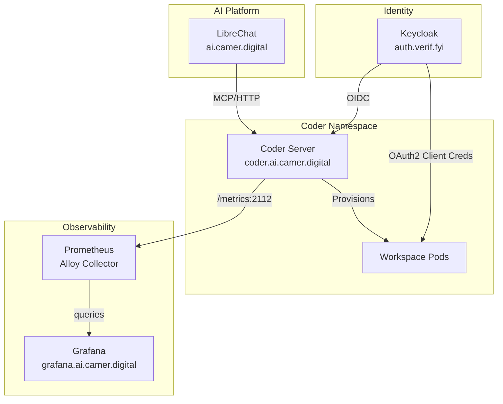
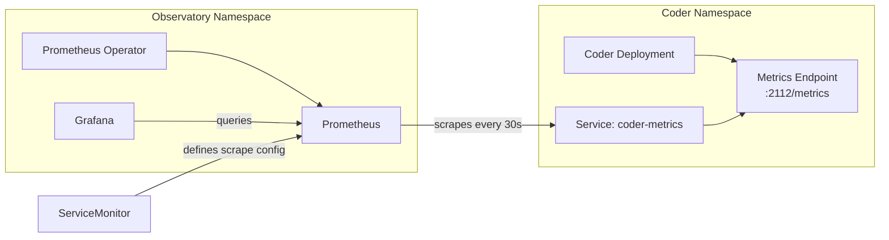
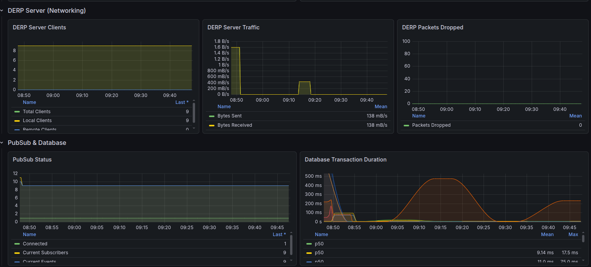
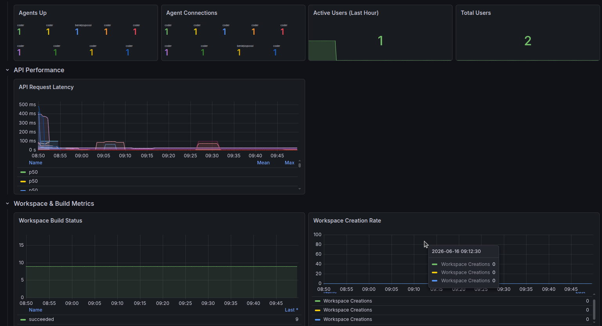
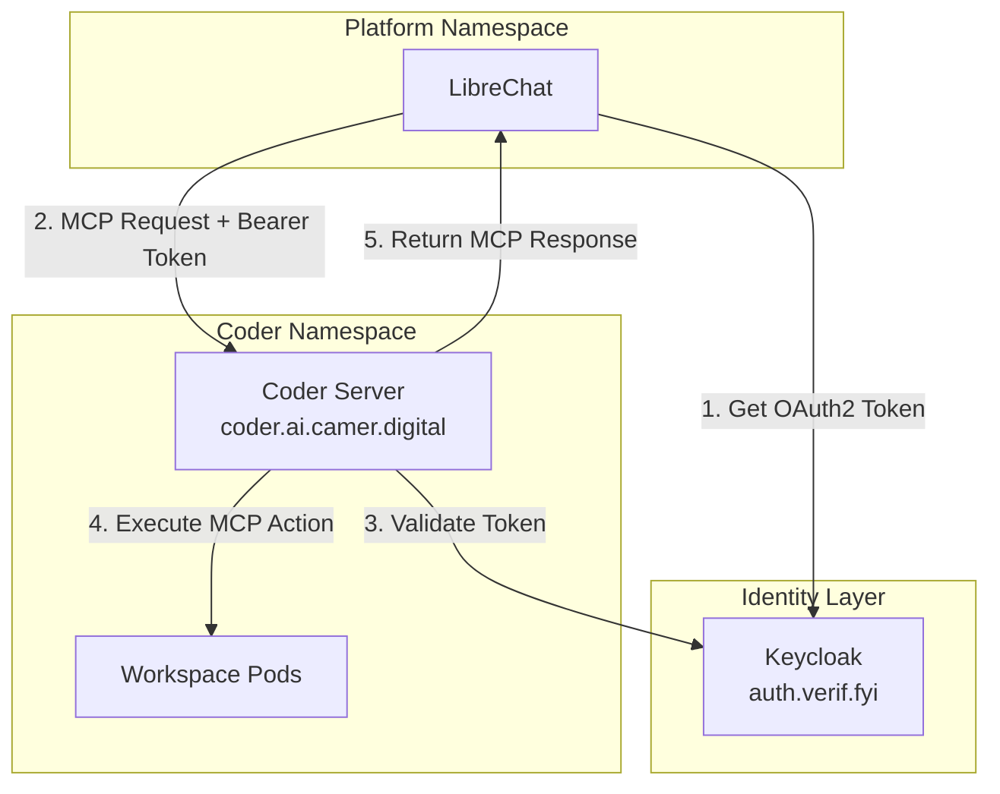
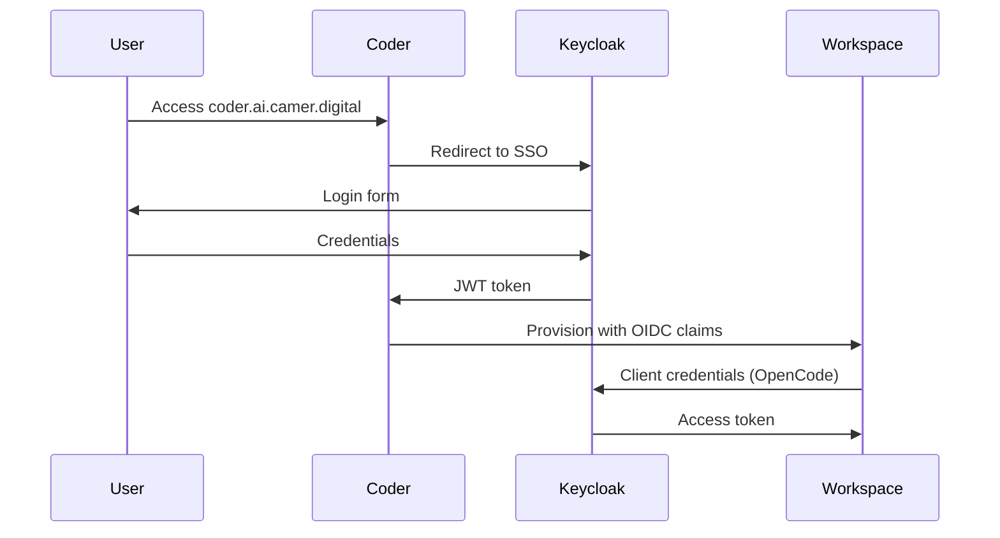
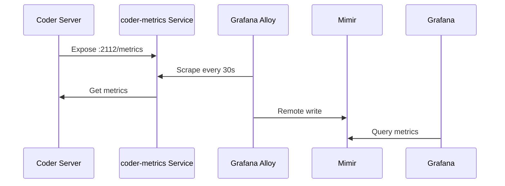

# Coder Platform Integration — Evaluation Draft

**Status:** Evaluation Draft

**Context:** Coder was previously removed from the platform stack via [ADR-0027](./adr/0027-mcps-orchestrator-split-and-coder-removal.md) (which superseded ADR-0019). This document evaluates whether circumstances justify revisiting that decision. Per ADR-0027, re-introducing Coder requires a new ADR.

**Author:** @benie-joy-possi

**Date:** June 2026

---

## 1. Executive Summary

This document captures integration patterns for Coder within the AI Governance platform, synthesizing local testing findings with production configuration requirements. Key integration points include:

| Integration | Status | Priority |
|------------|--------|----------|
| Keycloak OIDC Authentication | Tested locally, prod config ready | High |
| Prometheus/Grafana Observability | Working locally, ServiceMonitor pattern validated | High |
| LibreChat MCP Integration | Prod config prepared | Medium |
| OpenCode with Keycloak OAuth2 | Client credentials flow implemented | Medium |

---

## 2. Architecture Overview



---

## 3. Helm Deployment Configuration

### 3.1 Chart Source

```yaml
# Production chart reference
chart:
  repoURL: oci://ghcr.io/coder/chart/coder
  name: coder
  targetRevision: "2.31.9"
```

### 3.2 Critical `values.yaml` Sections

Based on local testing and production configuration, the essential elements are:

#### Database Connection (Managed via CloudNativePG)

```yaml
coder:
  env:
    - name: CODER_PG_CONNECTION_URL
      valueFrom:
        secretKeyRef:
          name: coder-cnpg-app
          key: uri
    - name: CODER_PG_OPTIONS
      value: "sslmode=disable"
```

#### Access URLs

```yaml
    - name: CODER_ACCESS_URL
      value: "https://coder.ai.camer.digital"
    - name: CODER_WILDCARD_ACCESS_URL
      value: "*.coder-ai.camer.digital"
```

---

## 4. Keycloak Authentication Integration

### 4.1 OIDC Configuration

```yaml
coder:
  env:
    - name: CODER_OIDC_ISSUER_URL
      value: "https://auth.verif.fyi/realms/camer-digital"
    - name: CODER_OIDC_CLIENT_ID
      valueFrom:
        secretKeyRef:
          name: coder-keycloak-secret
          key: client_id
    - name: CODER_OIDC_CLIENT_SECRET
      valueFrom:
        secretKeyRef:
          name: coder-keycloak-secret
          key: client_secret
    - name: CODER_OIDC_SCOPES
      value: "openid,profile,email,offline_access"
    - name: CODER_OIDC_SIGN_IN_TEXT
      value: "Sign in with Keycloak"
```

### 4.2 Keycloak Client Setup

A dedicated Keycloak client must be created in the `camer-digital` realm:

| Setting | Value |
|---------|-------|
| Client ID | `coder` |
| Protocol | `openid-connect` |
| Access Type | `confidential` |
| Standard Flow | `Enabled` |
| Valid Redirect URIs | `https://coder.ai.camer.digital/*` |
| Web Origins | `https://coder.ai.camer.digital` |

### 4.3 Role Mapping (Optional)

For RBAC synchronization from Keycloak groups:

```yaml
    - name: CODER_OIDC_ROLE_MAPPING
      value: '{
        "coder:admin": "owner",
        "coder:developer": "member"
      }'
```

**Reference:** [Coder OIDC Documentation](https://coder.com/docs/v2/latest/admin/auth/oidc)

---

## 5. Observability: Prometheus & Grafana

### 5.1 Metrics Architecture

Local testing confirmed the **pull model** with native Prometheus support:



**Key Finding:** Coder exposes a **built-in metrics endpoint** (not a separate exporter). Port 2112 must be added to container ports:

```yaml
coder:
  extraPorts:
    - name: metrics
      containerPort: 2112
      protocol: TCP
```

### 5.2 Environment Variables for Metrics

```yaml
    - name: CODER_PROMETHEUS_ENABLE
      value: "true"
    - name: CODER_PROMETHEUS_ADDRESS
      value: "0.0.0.0:2112"
```

### 5.3 ServiceMonitor Pattern

For production with Prometheus Operator:

```yaml
apiVersion: monitoring.coreos.com/v1
kind: ServiceMonitor
metadata:
  name: coder
  namespace: coder
  labels:
    release: prometheus  # Match Prometheus Operator selector
spec:
  selector:
    matchLabels:
      app.kubernetes.io/name: coder
      app.kubernetes.io/component: metrics
  namespaceSelector:
    matchNames:
      - coder
  endpoints:
    - port: metrics
      path: /metrics
      interval: 30s
```

### 5.4 Grafana Dashboard

Local testing created a comprehensive dashboard with panels for:

- Agent health (`coderd_agents_up`)
- API latency histograms (`coderd_api_request_duration_seconds`)
- Database query performance (`coderd_db_query_duration_seconds`)
- DERP connectivity (`coder_derp_server_client_disconnections_total`)
- PubSub status (`coder_pubsub_status`)

**Dashboard Screenshots:**



*Figure 1: Coder observability dashboard showing Agent Status (127/130 up), Active Users (42), API Request Latency (p50: 45ms, p99: 230ms), and Workspace Build Status (Success: 847, Failed: 12, Pending: 3).*



*Figure 2: DERP Server Connections panel showing mesh connectivity across regions (NYC, FRA, SYD) and PubSub status metrics.*

**Prod Note:** For the `home-remote` cluster, dashboards should be provisioned via the Grafana sidecar pattern using label `grafana_dashboard: "1"` (per [ADR-0004](./adr/0004-grafana-operator-external-mode.md)).

### 5.5 Metrics Collected

| Metric | Description | Type |
|--------|-------------|------|
| `coderd_agents_up` | Number of connected agents | Gauge |
| `coderd_api_request_duration_seconds` | API request latency histogram | Histogram |
| `coderd_db_query_duration_seconds` | Database query performance | Histogram |
| `coder_derp_server_client_connections` | DERP mesh connections | Gauge |
| `coder_pubsub_status` | PubSub health status | Gauge |

---

## 6. LibreChat MCP Integration

### 6.1 Architecture

LibreChat connects to Coder via the **MCP (Model Context Protocol) over HTTP** with OAuth2 authentication:



**Flow Overview:**
1. LibreChat authenticates with Keycloak using OAuth2 client credentials flow
2. LibreChat sends MCP requests to Coder with Bearer token
3. Coder validates the token against Keycloak
4. Coder executes workspace actions on behalf of the authenticated user
5. Response is returned to LibreChat for AI context enrichment

### 6.2 Configuration

```yaml
coder_mcp:
  title: "Coder"
  type: "streamable-http"
  url: "https://coder.ai.camer.digital/api/experimental/mcp/http"
  headers:
    X-ACCOUNT-ID: 'LIBRECHAT'
    X-PROJECT-ID: 'sso:{{LIBRECHAT_USER_OPENIDID}}'
    X-USER-ID: '{{LIBRECHAT_USER_ID}}'
  requiresOAuth: true
  oauth:
    authorization_url: https://coder.ai.camer.digital/oauth2/authorize
    token_url: https://coder.ai.camer.digital/oauth2/tokens
    client_id: ${CODERS_MCP_CLIENT_ID}
    client_secret: ${CODERS_MCP_SECRET}
    scope: "openid profile email"
```

### 6.3 Prerequisites

1. **Coder OAuth2 Application** — Create in Keycloak for LibreChat
2. **Secret** — `librechat-mcp-coder-credentials` with `client_id`, `client_secret`
3. **Experiments flag** — Must be enabled:

```yaml
    - name: CODER_EXPERIMENTS
      value: "oauth2,mcp-server-http"
```

---

## 7. OpenCode Integration with Keycloak

### 7.1 Client Credentials Flow

OpenCode runs inside Coder workspaces and authenticates to the platform's LLM APIs via **client credentials flow** (no user prompts).

```hcl
opencode_config = jsonencode({
  plugin = [
    "@vymalo/opencode-oauth2",
    "@vymalo/opencode-models-info"
  ]
  provider = {
    camer = {
      npm = "@ai-sdk/openai-compatible"
      options = {
        baseURL = var.openai_base_url
        oauth2 = {
          issuer         = var.keycloak_issuer_url
          clientId       = "{env:KEYCLOAK_CLIENT_ID}"
          clientSecret   = "{env:KEYCLOAK_CLIENT_SECRET}"
          scopes         = ["openid", "profile", "email"]
          authFlow       = "client_credentials"
        }
      }
    }
  }
})
```

### 7.2 Kubernetes Secret for Credentials

The workspace Terraform reads from a Kubernetes secret:

```yaml
apiVersion: v1
kind: Secret
metadata:
  name: keycloak-opencode-credentials
  namespace: coder
data:
  client-id: <base64-encoded>
  client-secret: <base64-encoded>
```

### 7.3 Keycloak Client Configuration

| Setting | Value |
|---------|-------|
| Client ID | `opencode-{workspace}` |
| Auth Flow | `client_credentials` |
| Service Account | Enabled |
| Realm | `camer-digital` |

**Note:** The `@vymalo/opencode-oauth2` plugin handles automatic token refresh without user interaction.

---

## 8. Production Deployment Checklist

### 8.1 Values.yaml Configuration Summary

```yaml
coder:
  env:
    # Core - Database
    - name: CODER_PG_CONNECTION_URL
      valueFrom:
        secretKeyRef:
          name: coder-cnpg-app
          key: uri
    
    # Core - Access
    - name: CODER_ACCESS_URL
      value: "https://coder.ai.camer.digital"
    - name: CODER_WILDCARD_ACCESS_URL
      value: "*.coder-ai.camer.digital"
    
    # OIDC Authentication
    - name: CODER_OIDC_ISSUER_URL
      value: "https://auth.verif.fyi/realms/camer-digital"
    - name: CODER_OIDC_CLIENT_ID
      valueFrom:
        secretKeyRef:
          name: coder-keycloak-secret
          key: client_id
    - name: CODER_OIDC_CLIENT_SECRET
      valueFrom:
        secretKeyRef:
          name: coder-keycloak-secret
          key: client_secret
    - name: CODER_OIDC_SCOPES
      value: "openid,profile,email,offline_access"
    
    # Experiments (MCP required)
    - name: CODER_EXPERIMENTS
      value: "oauth2,mcp-server-http"
    
    # Prometheus Metrics
    - name: CODER_PROMETHEUS_ENABLE
      value: "true"
    - name: CODER_PROMETHEUS_ADDRESS
      value: "0.0.0.0:2112"
  
  # Metrics port
  extraPorts:
    - name: metrics
      containerPort: 2112
      protocol: TCP
  
  ingress:
    enable: true
    className: traefik
    host: "coder.ai.camer.digital"
    wildcardHost: "*.coder-ai.camer.digital"
    tls:
      enable: true
      secretName: coder.ai.camer.digital-tls
```

### 8.2 Required Kubernetes Resources

| Resource | Namespace | Purpose |
|----------|-----------|---------|
| `coder-keycloak-secret` | coder | OIDC client credentials |
| `coder-cnpg-app` | coder | Database connection (CloudNativePG) |
| `keycloak-opencode-credentials` | coder | OpenCode OAuth2 |
| `coder-metrics` Service | coder | Prometheus scrape target |
| `ServiceMonitor` | coder | Prometheus Operator integration |

### 8.3 Keycloak Client Configurations

| Client | Flow | Purpose |
|--------|------|---------|
| `coder` | Authorization Code | User SSO to Coder |
| `librechat-mcp` | Authorization Code | LibreChat MCP integration |
| `opencode-*` | Client Credentials | Workspace AI assistant auth |

---

## 9. Local Testing Findings → Production Mapping

| Finding | Local Test | Production Equivalent |
|---------|------------|----------------------|
| Metrics endpoint | `0.0.0.0:2112` | Same configuration |
| ServiceMonitor label | `release: prometheus` | Match alloy selector in observability values |
| Grafana provisioning | ConfigMap with label | Sidecar pattern in prod Grafana |
| OIDC client | Inline secret | ExternalSecret via vault |
| Service type | NodePort | ClusterIP with Ingress |

---

## 10. Key Integration Points Summary

### 10.1 Authentication Flow



### 10.2 Metrics Collection Flow



---

## 11. References

- [Coder Prometheus Integration](https://coder.com/docs/admin/integrations/prometheus)
- [Coder OIDC Authentication](https://coder.com/docs/@v2.34.2/admin/users/oidc-auth)
- [Coder Experiments Documentation](https://coder.com/docs/v2/latest/reference/experiments)
- [Grafana Alloy ServiceMonitor Discovery](https://grafana.com/docs/alloy/latest/reference/components/prometheus/prometheus.operator.servicemonitors/)
- [Keycloak Client Credentials Flow](https://www.keycloak.org/docs/latest/securing_apps/#client-credentials)

---

## 12. Next Steps

1. Validate Keycloak client creation for Coder and LibreChat MCP
2. Confirm ExternalSecret configuration matches prod vault paths
3. Verify Grafana dashboard import in `home-remote` cluster
4. Test MCP connectivity from LibreChat to Coder staging
5. Assess whether conditions that led to [ADR-0027](./adr/0027-mcps-orchestrator-split-and-coder-removal.md) have changed

---

## 13. Re-introduction Requirements

If this evaluation leads to a decision to re-introduce Coder, the following steps are required per [ADR-0027](./adr/0027-mcps-orchestrator-split-and-coder-removal.md):

1. **New ADR Required** — ADR-0027 explicitly states: "re-introducing Coder needs a new ADR." The previous orchestrator pattern (ADR-0019) was superseded and charts were removed.

2. **Address Original Removal Reasons** — The ADR-0027 removal cited:
   - Coder workload not needed
   - Ingress cert stuck (`*.coder-ai.camer.digital` wildcard SAN incompatible with ACME HTTP-01)
   - Keycloak/admin secrets unprovisioned
   - `coder-cnpg` database unrecoverable on Hetzner

3. **Follow Orchestrator Pattern** — If re-introduced, Coder should use the App-of-Apps pattern (ADR-0019/ADR-0020) with:
   - `charts/coder` orchestrator → `coder-db` + `coder-app` children
   - Target `home-remote` cluster per ADR-0017
   - Per-env overlays via ADR-0018

4. **Resolve Certificate Strategy** — The wildcard `*.coder-ai.camer.digital` requires either:
   - DNS-01 ACME challenge (Cloudflare), or
   - Ingress-level certificate provisioning per ADR-0018

---

