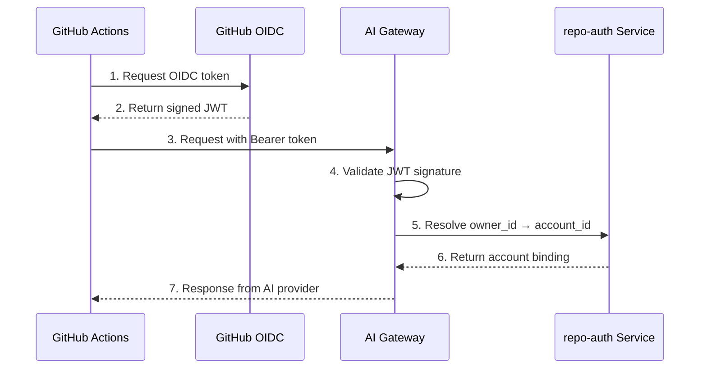

# GitHub Actions Integration

This guide covers the foundational setup for using the CAMER DIGITAL AI platform in GitHub Actions. It explains how to authenticate your workflows with the AI gateway and interact with GitHub.

## Overview

GitHub Actions can use the CAMER DIGITAL AI platform for various tasks: automated code reviews, issue triage, code generation, documentation updates, and more. The integration uses GitHub's OIDC for authentication — no shared secrets required.

## Prerequisites

### 1. Install the CAMER DIGITAL GitHub App

Install the **[camer-digital-ai](https://github.com/apps/camer-digital-ai)** GitHub App on your repository or organization.

1. Navigate to the [camer-digital-ai app](https://github.com/apps/camer-digital-ai)
2. Click **Configure**
3. Choose **All repositories** or select specific repositories
4. Grant the required permissions

### 2. Request Organization Approval

After installing the GitHub App, contact the CAMER DIGITAL platform administrator to approve your organization. The administrator will:

1. Verify your organization identity
2. Create a Source resource in the AI gateway
3. Provide you with the Source audience URL

> **Note:** The GitHub App installation alone does not grant access. Your organization must be explicitly approved and configured in the AI gateway.

### 3. Configure the Gateway Audience

Once approved, create an organization or repository variable:

| Variable | Value |
|----------|-------|
| `OPENCODE_GATEWAY_AUDIENCE` | Your Source URL, e.g., `https://api.ai.camer.digital/sources/src-XXXXXXXXXXXX` |

**To create the variable:**

1. Go to your repository or organization **Settings**
2. Navigate to **Secrets and variables** → **Actions**
3. Click **Variables** tab
4. Click **New repository variable** or **New organization variable**
5. Name: `OPENCODE_GATEWAY_AUDIENCE`
6. Value: Your Source URL provided by the platform admin

## Authentication Flow

The authentication flow uses GitHub Actions' built-in OIDC token:



### Key Points

- **Keyless auth**: No secrets stored in your repository
- **Binding verification**: Your GitHub organization must be bound to a billing account
- **Server-set identity**: Uses `repository_owner_id` (immutable, cannot be forged)

### JWT Claims

| Claim | Purpose |
|-------|---------|
| `aud` | Your Source URL (provided by platform admin) |
| `repository_owner_id` | GitHub organization ID (used for binding lookup) |
| `iss` | `https://token.actions.githubusercontent.com` |

## Using AI in Your Workflows

To use the CAMER DIGITAL AI platform in GitHub Actions, you need two tokens:

| Token | Source | Purpose |
|-------|--------|---------|
| **OIDC Token** | GitHub OIDC issuer | Authenticate to the AI gateway |
| **GITHUB_TOKEN** | GitHub Actions (automatic) | Interact with GitHub API (PRs, issues, commits) |

> **Important:** The OIDC token authenticates your workflow to the AI gateway. The `GITHUB_TOKEN` authenticates your workflow to GitHub. Both are required for AI workflows that interact with your repository.

### Obtaining the OIDC Token

GitHub Actions can mint OIDC tokens that authenticate to external services. The token is short-lived and expires when the workflow completes.

**Prerequisites:**

| Requirement | Description |
|-------------|-------------|
| `permissions: id-token: write` | Required in your workflow to mint OIDC tokens |
| `OPENCODE_GATEWAY_AUDIENCE` | Your Source URL (set as a repository or organization variable) |

**Example workflow:**

```yaml
jobs:
  ai-task:
    permissions:
      id-token: write        # Mint OIDC token for AI gateway
      contents: write        # Push changes to repository
      pull-requests: write   # Create/update PRs
    
    runs-on: ubuntu-latest
    steps:
      - uses: actions/checkout@v4
      
      - name: Get OIDC token
        uses: actions/github-script@v7
        with:
          script: |
            const token = await core.getIDToken(process.env.AUDIENCE);
            core.setSecret(token);
            core.exportVariable('CAMER_DIGITAL_API_KEY', token);
        env:
          AUDIENCE: ${{ vars.OPENCODE_GATEWAY_AUDIENCE }}
      
      - name: Run AI task
        env:
          CAMER_DIGITAL_API_KEY: ${{ env.CAMER_DIGITAL_API_KEY }}
          GITHUB_TOKEN: ${{ github.token }}
        run: |
          # Call AI gateway with OIDC token
          response=$(curl -s -H "Authorization: Bearer $CAMER_DIGITAL_API_KEY" \
            https://api.ai.camer.digital/v1/chat/completions \
            -d '{"model": "camer-digital/model", "messages": [...]}')
          
          # Use GITHUB_TOKEN to interact with GitHub
          gh pr create --title "AI-generated changes" --body "$response"
```

### How It Works

1. **OIDC Token**: GitHub Actions generates a signed JWT from `https://token.actions.githubusercontent.com`
2. **Claims**: The token includes `aud`, `repository_owner_id`, `repository`
3. **AI Gateway**: Your workflow passes the token as Bearer token to the AI gateway
4. **Validation**: The gateway validates the signature and resolves your organization's binding
5. **GITHUB_TOKEN**: Available automatically via `${{ github.token }}` — use for GitHub API operations (`gh` CLI, REST API)

### Permissions Required

| Permission | Purpose |
|------------|---------|
| `id-token: write` | Mint OIDC tokens for AI gateway authentication |
| `contents: write` | Push AI-generated changes to repository |
| `pull-requests: write` | Create/update pull requests |
| `issues: write` | Comment on issues, manage labels |

## Security Model

| Aspect | Implementation |
|--------|----------------|
| **Authentication** | Keyless — uses GitHub Actions OIDC token |
| **Token lifetime** | Short-lived (job duration only) |
| **Binding verification** | `repository_owner_id` is server-set (cannot be forged) |
| **Auditing** | All requests logged with OIDC headers |

### Failure Modes

| Failure | Behavior |
|---------|----------|
| Organization not approved | 403 Forbidden |
| Invalid audience | Token rejected at gateway |
| Missing `OPENCODE_GATEWAY_AUDIENCE` | Workflow silently skips (no-op) |

## Troubleshooting

### Token generation fails with "Permission denied"

Ensure your workflow has `permissions: id-token: write` in the job or workflow definition.

### Authentication fails at gateway

1. Verify `OPENCODE_GATEWAY_AUDIENCE` is set correctly
2. Confirm your organization is approved by the platform admin
3. Check that the GitHub App is installed on the repository

### GitHub App not found

Ensure you're using the correct GitHub App: **[camer-digital-ai](https://github.com/apps/camer-digital-ai)**

## Related

- [GitHub PR Reviews](../opencode-integration/04-github-pr-reviews.md) — Automated PR review workflows