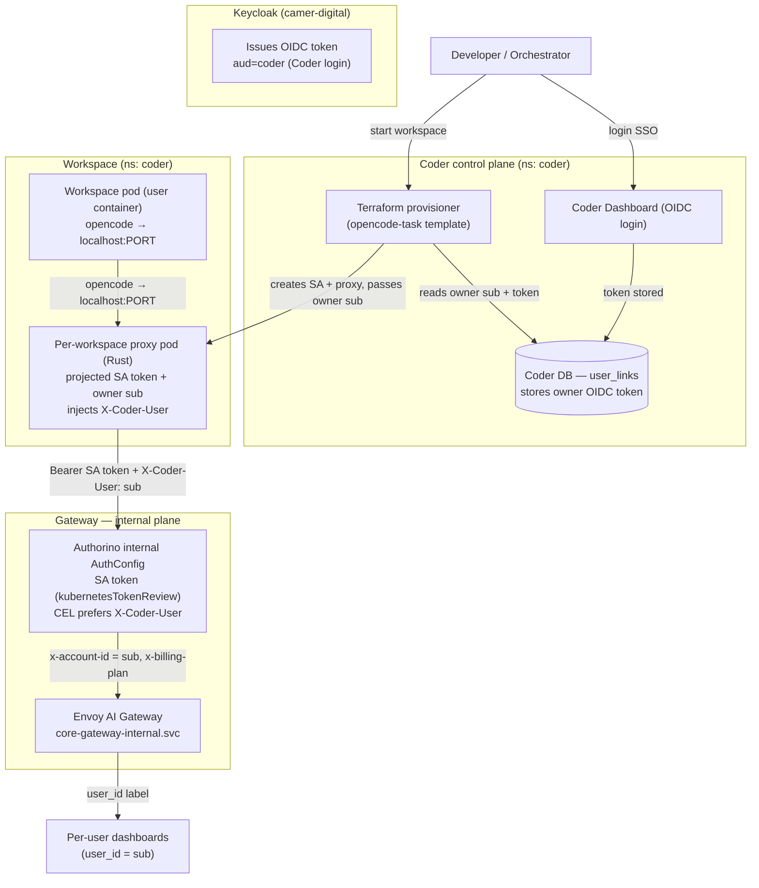

# Coder Workspace → OpenCode → Internal AI Gateway Auth (Design)

**Status:** Design Proposal (Draft — not an ADR)
**Author:** @benie-joy-possi
**Date:** 2026-08-06

**Scope.** How OpenCode running inside a Coder workspace authenticates to the
Camer Digital AI gateway, and how the gateway attributes that traffic to the
**user who logged into Coder and started the workspace**. This supersedes the
client-credentials approach in
[`coder-platform-integration.md`](./coder-platform-integration.md) §7 and the
"owner OIDC token injected into the pod" approach in
[`.coder/templates/opencode-task/`](../../.coder/templates/opencode-task/).

**Out of scope (deliberately dropped).** Keycloak token exchange (RFC 8693) and
"keep the external plane, just pin the audience". Both are recorded as
considered-and-rejected in §7.

> **✅ Final decided design (as built — see [ADR-0130](../adr/0130-coder-workspace-opencode-internal-sa-auth.md)).**
> The earlier Options A/B (Rust proxy / Caddy proxy) below are **superseded** by
> the converged architecture, refined by live testing against a real Authorino:
>
> - **Credential + identity carrier** = a per-workspace ServiceAccount named
>   **`coder-<sub>.<plan>`** (owner's Keycloak `sub` + billing plan in the name,
>   `.`-delimited; robust to any `sub` length).
> - **Sidecar** = **openresty** (not Caddy), reading the projected SA token
>   **per request** in Lua (`io.open(...)`) and injecting `Bearer <token>`.
>   Caddy was rejected in testing: `{file.read}` does not resolve in `header_up`,
>   so it cannot inject the rotating (1h) SA token.
> - **Authorino** validates via `kubernetesTokenReview`, then derives **both**
>   values by pure CEL from the SA name — split the last `:`-segment on `.` for
>   `sub` and `plan` (no length assumption) — with **no SA-label read and no
>   Kubernetes-API metadata call** (that path was verified fragile: needs
>   Authorino to trust the cluster CA + a K8s token with SA-read RBAC + a
>   per-request API call, and returned `kind: Status` in testing).
> - **Envoy** enforces per-user budget on `x-account-id`.
>
> Live proof: with a real Authorino, a workspace SA token yielded
> `x-account-id = <sub>` and `x-billing-plan = pro` from the name alone.

---

## 1. Why the current design is fragile

The current `opencode-task` template
([`.coder/templates/opencode-task/main.tf`](../../.coder/templates/opencode-task/main.tf))
works like this:

1. Terraform reads the owner's **Coder OIDC access token**
   (`data.coder_workspace_owner.me.oidc_access_token`, `main.tf:105`) and injects
   it into the pod as `OPENCODE_OAUTH_ACCESS_TOKEN` (`main.tf:259-262`).
2. The startup script writes a `wellknown` entry into `auth.json` and
   **pre-seeds the `@vymalo/opencode-oauth2` plugin cache with
   `{accessToken, tokenType}` and deliberately no `expiresAt`** (`main.tf:199`)
   so the plugin's `isTokenValid()` returns true and never opens the device-code
   prompt.
3. OpenCode sends that token as `Bearer` to `api.ai.camer.digital` (the
   **external** plane), and the gateway "awards ANY valid realm token (verified
   200)" (`ARCHITECTURE.md:46`).

Three fragilities make this the wrong shape:

- **"Any valid realm token" is a known anti-pattern in this repo.** The gateway
  accepting any realm token with no audience pin is exactly the trap ADR-0091
  documents: *"A shared realm JWKS is NOT an authorization boundary… a token
  minted for ANY other realm client got HTTP 200"* (`CLAUDE.md:222`). The
  template leans on that loose acceptance as a feature — a security smell.
- **The `no expiresAt` hack papers over token lifecycle.** The plugin treats the
  injected token as always-valid (`main.tf:192-198`). The token is a real
  Keycloak access token with a TTL; when it expires mid-workspace, OpenCode
  silently breaks (or keeps sending an expired token).
- **The user's Coder token is a live credential in a user-controlled pod.** A
  workspace is an interactive shell — the user can read `auth.json`/the cache
  and exfiltrate their own `aud=coder` token, and the traffic hairpins through
  the public LB.

---

## 2. The architect's direction maps onto machinery this platform already has

The requirement — **everything internal, Authorino for auth, get the JWT from
the Coder login, and track the workspace's OpenCode to the user who started
it** — is exactly the **ADR-0021 internal plane + forwarded-user attribution**
pattern that LibreChat already uses:

- The **internal plane** (`core-gateway-internal.svc`, ClusterIP-only,
  self-signed CA) accepts first-party credentials — a k8s SA token via
  `kubernetesTokenReview` (one-time jobs, ADR-0037) or a static apiKey
  (long-running services) (`ADR-0021:44-55`).
- A first-party service authenticates **as itself** but **forwards the
  end-user's Keycloak `sub`** in a header (`X-LibreChat-User`); the internal
  AuthConfig's CEL *prefers* that header → `x-account-id` = the real user's sub
  → per-user budget + per-user dashboards (`ADR-0021:78-89`,
  `architecture/05-auth-identity.md:66-70`).
- `opencode-k8s-agent` already moved onto this exact internal plane with its own
  projected SA token (`ADR-0037`).

So the workspace pod should be a **first-party internal-plane client that
authenticates as itself and forwards the Coder user's identity** — not a pod
that reuses a loose "any token" external-plane credential.

---

## 3. The crux: a workspace pod is *user-controlled*

The one thing that makes this non-trivial: the LibreChat forwarded-user pattern
is safe because LibreChat is a **trusted server** — a user can't forge
`X-LibreChat-User` from inside it. But a workspace pod is an **interactive
shell**: the user can run arbitrary code. If the pod authenticates as a
first-party service and forwards a user header, the user can simply forge
`X-Coder-User: <victim-sub>` and burn someone else's monthly budget (ADR-0035
keys budgets on `x-account-id` = the sub).

The forwarded identity must therefore be **non-forgeable**, which forces one of
two things:

- **Network isolation** — only a trusted proxy can reach the gateway; the user
  container can't. ⚠️ A *sidecar* does **not** give you this: containers in a
  pod share the network namespace, so the user container can reach the gateway
  too. The proxy must be a **separate pod**, with a CiliumNetworkPolicy allowing
  only the proxy → gateway.
- **Cryptographic binding** — the Bearer itself is the user's own token (can't
  be forged) and Authorino verifies it. (This is the token-exchange path, which
  we dropped — see §7.)

Both options below use **network isolation** as the forgeability control.

---

## 4. Option A (recommended): internal plane + per-workspace SA + Rust proxy

A small first-party **Rust proxy** — the repo already has this exact shape
(`lakefs-proxy`, `lightbridge-repo-auth`: Rust/axum, distroless, non-root,
`cargo-auditable` for Trivy) — is provisioned **per workspace** by the Coder
template.

### 4.1 Topology



### 4.2 How OpenCode authenticates

OpenCode's config becomes trivial — it never sees a real credential:

```jsonc
// opencode.json (local override; remote config still supplies agents/MCP/models)
{
  "provider": {
    "camer-digital": {
      "options": {
        "baseURL": "http://localhost:8080/v1",   // the proxy
        "apiKey": "local-proxy"                   // dummy — proxy ignores it
      }
    }
  }
}
```

- OpenCode sends `Authorization: Bearer local-proxy` to the proxy.
- The proxy **strips** that, injects `Bearer <projected SA token>` +
  `X-Coder-User: <owner sub>`, and forwards to `core-gateway-internal.svc`.
- Authorino validates the SA token (`kubernetesTokenReview`) and CEL-prefers
  `X-Coder-User` → `x-account-id` = the user's sub.

**What this removes from the template:** the `auth.json` wellknown entry, the
plugin-cache pre-seed, and the `no expiresAt` hack entirely. OpenCode's auth is
a dummy key. The proxy owns the SA token (short-lived, auto-rotating — it
re-reads the projected volume).

> ⚠️ **Remote-config wrinkle.** The remote `.well-known/opencode` config serves
> the provider with `baseURL: https://api.ai.camer.digital/v1` (external).
> OpenCode merges your local `opencode.json` *under* the remote config, so a
> local provider override pointing at `localhost` wins — but you must ship that
> override, or OpenCode would hit the external gateway with the dummy key and
> 401.

### 4.3 The proxy (per-workspace)

- **Identity binding.** The proxy is created by the Coder template and bound to
  the workspace **owner at creation time** — Terraform passes the owner's
  Keycloak `sub` (decoded from the Coder login JWT, or read from the owner data
  source) as an env/arg. The proxy cannot be re-bound by the user.
- **Credential.** A projected `serviceAccountToken` volume (audience
  `core-gateway-internal`, exactly like ADR-0037) mounted into the proxy. The
  proxy re-reads it on each request (or on a timer) so rotation is free.
- **Request injection.** For each upstream call the proxy sets
  `Authorization: Bearer <SA token>` and `X-Coder-User: <owner sub>`, then
  forwards to `https://core-gateway-internal.envoy-gateway-system.svc/v1` with
  the internal CA trusted (same `self-signed-ca` trust as LibreChat/ADR-0037).
- **Isolation (load-bearing).** The proxy is a **separate pod**, not a sidecar.
  A CiliumNetworkPolicy allows **only the proxy pod → gateway**; the user
  container cannot reach the gateway directly, so it cannot forge the header.

### 4.4 Trade-offs

| Pro | Con |
|---|---|
| Fully internal — no public LB hairpin | New first-party service to build/maintain |
| Proper Authorino auth (SA token, no "any token") | Per-workspace proxy lifecycle to manage |
| No `expiresAt` hack; SA token auto-rotates | Network isolation is load-bearing and must be verified |
| Per-user tracking via the existing `user_id` dashboards | Rust image needs `cargo-auditable` + a build pipeline (none exists for first-party images today — `arc42.md:538`) |
| OpenCode auth is a dummy key — simplest possible | Remote-config baseURL must be overridden locally |

---

## 5. Option B: internal plane + apiKey + forwarded user

Identical to Option A from OpenCode's perspective (dummy key → localhost
proxy). The only difference is the proxy authenticates with a **static apiKey**
(like LibreChat) instead of an SA token.

| Aspect | Option A (SA token) | Option B (apiKey) |
|---|---|---|
| Credential | projected SA token, auto-rotating | static apiKey Secret |
| Rotation | free (re-read volume) | manual / ESO-managed |
| Secret surface | none (cluster-issued) | one apiKey Secret per workspace (or shared) |
| Forgeability control | same network isolation | same network isolation |
| OpenCode config | dummy key → localhost | dummy key → localhost |

Option B is simpler to stand up (no SA-token projection) but adds a static
secret to manage and rotate. Prefer A unless SA-token projection is a blocker.

---

## 6. How OpenCode authenticates — summary

OpenCode only ever needs a **Bearer token to attach to each request**. The
difference between the options is *who holds the real credential* and *where
OpenCode points*:

| Option | What OpenCode holds | Where OpenCode points | Who holds the real credential | Template complexity |
|---|---|---|---|---|
| **A** (SA + proxy) | dummy key | `localhost:8080` (proxy) | proxy: SA token + forwards `sub` | **lowest** — no auth.json, no plugin-cache, no expiresAt hack |
| **B** (apiKey + proxy) | dummy key | `localhost:8080` (proxy) | proxy: static apiKey + forwards `sub` | lowest, but you manage/rotate an apiKey |

Both options make OpenCode stop being an auth problem entirely — it points at a
localhost endpoint with a dummy key, and the proxy owns the real credential and
the user identity.

---

## 7. Considered and rejected

- **Keycloak token exchange (RFC 8693) → audience-correct, user-bound token.**
  The pod would hold a short-lived, audience-pinned token bound to the user's
  `sub` (the ADR-0009 CI pattern). Cryptographically non-forgeable and no
  network-isolation requirement, but it needs Keycloak token-exchange enabled
  for the `coder` client + claim policy, a refresh strategy for long-lived
  workspaces, and the pod still holds a credential. **Rejected** for this design
  — the proxy options reuse existing platform machinery with less new surface.
- **Keep the external plane, just pin the audience + fix lifecycle.** Smallest
  change (closes the ADR-0091 trap, manages refresh), but it does **not**
  satisfy the "everything internal" requirement and keeps the public-LB
  hairpin. **Rejected.**

---

## 8. Open questions / validation before committing

1. **Internal AuthConfig forwarded header.** Confirm the internal AuthConfig can
   add a `X-Coder-User`-style forwarded header alongside `X-LibreChat-User` —
   a values-only change to the internal AuthConfig (`ai-helm-values`
   `security-policies.yaml`). Verify the CEL precedence and that Authorino
   *overwrites* the descriptor (it does — `ADR-0021:88-89`).
2. **Sidecar vs separate pod.** This is the whole forgeability story. A separate
   proxy pod + CiliumNetworkPolicy (only proxy → gateway) is the sound choice; a
   sidecar does not isolate.
3. **Token lifecycle for interactive workspaces.** Task-style (short-lived)
   workspaces are fine with a token valid for the workspace lifetime; long-lived
   interactive ones need the proxy to re-read the SA token (free) — no Keycloak
   refresh needed since the SA token is the credential.
4. **Rust image hygiene.** Build with `cargo-auditable` or Trivy scans zero
   crates (`CLAUDE.md:219`). There is currently **no CI that builds first-party
   images** (`arc42.md:538`) — `lakefs-proxy` is hand-built; a path-filtered
   build workflow is the fix.
5. **Remote-config baseURL override.** Confirm the local `opencode.json`
   provider override wins over the remote `.well-known/opencode` provider block
   (it should — opencode merges local under remote).

---

## 9. Related

- [`coder-platform-integration.md`](./coder-platform-integration.md) — the
  evaluation draft whose §7 (client-credentials) this design supersedes
- [`.coder/templates/opencode-task/`](../../.coder/templates/opencode-task/) —
  the current template this design replaces
- [`ADR-0021`](../adr/0021-burst-budget-billing-and-dual-plane-authconfigs.md) —
  internal plane + forwarded-user attribution
- [`ADR-0037`](../adr/0037-opencode-agent-internal-sa-token.md) — the SA-token
  internal-plane pattern this reuses
- [`ADR-0035`](../adr/0035-per-person-monthly-budget-and-free-50.md) — per-person
  budgets keyed on `x-account-id`
- [`architecture/05-auth-identity.md`](../architecture/05-auth-identity.md) —
  dual-plane auth + the `x-oidc-*` contract
- [`patterns/per-user-observability.md`](../patterns/per-user-observability.md) —
  how `user_id` becomes a Loki label for per-user dashboards
