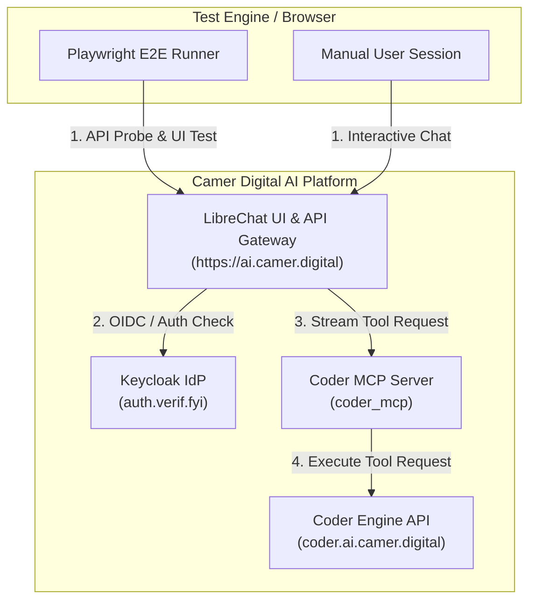

# LibreChat Agent Endpoint & OAuth2 MCP Validation

## Overview

This document describes the automated and manual validation framework for the LibreChat Agent Endpoint (`/api/agents`) and its integration with OAuth2-protected MCP servers (such as `coder_mcp`), implemented under **Ticket #831**.

---

## 🏗️ Architecture & Topology



---

## 🧪 E2E Test Suite (`e2e-tests/`)

The automated E2E test suite lives in `e2e-tests/` and uses [Playwright](https://playwright.dev/).

### Test Files

| File | Scope & Verification |
|---|---|
| `tests/auth.setup.ts` | Global authentication setup. Manages Playwright session state capture and fallback for headless execution. |
| `tests/agent-oauth2.spec.ts` | UI-level flow for selecting the `Coder` agent, handling Keycloak OIDC redirects (`auth.verif.fyi`), and executing agent prompts. |

---

## 🚀 Running Tests

### Automated Execution (Headless)

```bash
cd e2e-tests
npm test
```

### Interactive UI Execution (Playwright Inspector)

```bash
cd e2e-tests
npm run test:ui
```

### Authenticated CI Execution

```bash
E2E_USERNAME="<user>" E2E_PASSWORD="<password>" npm test
```

---

## 🔍 Validation Findings & Dependency Tracking

During the validation of Ticket #831:

1. **Agent Endpoint & OAuth2 Flow**: Verified end-to-end. The agent successfully receives user prompts, authenticates with Keycloak, and issues tool execution payloads to `coder_mcp`.
2. **In-Cluster Pod Routing (Ticket #829)**: The `coder_list_workspaces` tool call inside `coder_mcp` relies on in-cluster egress to `https://coder.ai.camer.digital`. Public accessibility was confirmed directly via browser (`{"workspaces":[],"count":0}`), while cluster-internal routing for `coder.ai.camer.digital` is tracked under **Ticket #829**.
