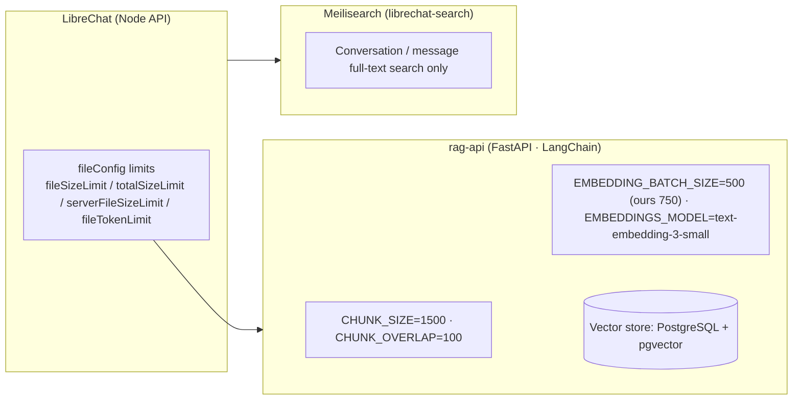

# LibreChat Native RAG Limits

A canonical reference on the practical limits of LibreChat's **native RAG**
(file ingest, vector retrieval), produced by the exploration in ticket
[**#413**](https://github.com/ADORSYS-GIS/ai-helm/issues/413) (parent story
[#409](https://github.com/ADORSYS-GIS/ai-helm/issues/409)).

> **Scope & method — read this first.** This ticket is exploration. Empirically
> limit-testing against the production cluster is **not possible from this
> artefact**: native RAG is **not enabled in the deployed LibreChat** (see
> "[Deployment status](#deployment-status)" below). So the limits documented
> here are the **canonical / upstream** defaults and constraints as defined by
> the LibreChat project (the `fileConfig` in `librechat.yaml`), the `rag-api`
> service (its env defaults), and the backing Postgres/pgvector store — cited to
> their sources — **not a prod-tested matrix**. Where a value is overridden in
> our chart, that is called out.

## The one premise this doc corrects

LibreChat native RAG is served by **`rag-api`** (a separate FastAPI/LangChain
service) backed by **PostgreSQL + pgvector** as its vector store.

**Meilisearch is NOT the RAG backend.** Our `librechat-search` chart runs a
Meilisearch instance, but that serves only **conversation / message full-text
search**, not RAG retrieval. Conflating the two is the most common source of
confusion when reasoning about RAG limits here.

Sources: [`danny-avila/rag_api`](https://github.com/danny-avila/rag_api) ("ID-based
RAG FastAPI: Integration with Langchain and PostgreSQL/pgvector"),
[docs.librechat.ai — RAG API](https://www.librechat.ai/docs/configuration/rag_api),
[docs.librechat.ai — Meilisearch](https://www.librechat.ai/docs/configuration/meilisearch)
(Meilisearch powers "conversation search", not RAG).

## Deployment status

| Component | In our platform | Notes |
|---|---|---|
| `rag-api` (native RAG) | **Not enabled** | Chart default `controllers.rag-api.enabled: false` and `service.rag-api.enabled: false` (`charts/librechat-app/values.yaml`); the LibreChat `RAG_API_URL` env is commented out. No `rag` override exists in `ai-helm-values/environments/prod/values/librechat-app.yaml`. |
| Meilisearch (`librechat-search`) | Enabled | Conversation/message search only (not RAG). |
| LibreChat app | Enabled | `charts/librechat-app` (leaf under the `librechart` orchestrator, ADR-0014). |

**Implication for this ticket:** because RAG is off in prod, the #409 dependency
("access to a LibreChat instance to test against") is **not satisfied by the live
cluster**. The limits in this doc are therefore the upstream defaults that would
apply **if/when** RAG is enabled, not measured results.

## File size limits (the "how big a file?" answers)

These are the **actual caps** on what can be uploaded and RAG-indexed. They come
from LibreChat's `fileConfig` in `librechat.yaml`.

| Key (`fileConfig`) | Default | Meaning |
|---|---|---|
| `default.totalSizeLimit` | **20 MB** | Max total size of a single request's files to RAG-capable endpoints |
| `serverFileSizeLimit` | **100 MB** | Global server-wide cap for any file |
| `fileTokenLimit` | **100,000 tokens** | Files truncated to this many tokens at prompt construction |
| `fileStrategy` | `local` | Storage strategy; per-type granular strategies (`avatar`/`image`/`document`) supported |

> Note: LibreChat counts `1 MB` as `1 × 1024 × 1024` bytes.

Per-agent/assistant refinements (subset):
`assistants.fileSizeLimit` 10 MB · `assistants.totalSizeLimit` 50 MB ·
`assistants.fileLimit` 5 files.

Source:
[`librechat.example.yaml`](https://github.com/danny-avila/LibreChat/blob/main/librechat.example.yaml)
and
[docs.librechat.ai — file_config](https://www.librechat.ai/docs/configuration/librechat_yaml/object_structure/file_config).

## `rag-api` retrieval / embedding defaults (the "how it processes" answers)

These control chunking, embedding and retrieval, i.e. how much of a file actually
becomes retrievable context.

| Env / setting | Default | Our chart |
|---|---|---|
| `CHUNK_SIZE` | **1500** | (default) |
| `CHUNK_OVERLAP` | **100** | (default) |
| `EMBEDDING_BATCH_SIZE` | **500** | **750** (`charts/librechat-app/values.yaml`) |
| `EMBEDDINGS_MODEL` | `text-embedding-3-small` | `text-embedding-3-small` |
| `EMBEDDINGS_PROVIDER` | `openai` | openai-compatible (via our Envoy gateway `RAG_OPENAI_BASEURL`) |
| `EMBEDDINGS_CHUNK_SIZE` | 200 (inputs per embedding request) | (default) |
| `PARALLEL_EXECUTION` | 2 | (default) |
| `RAG_USE_FULL_CONTEXT` | **false** | (default) — retrieves **top-4 chunks**, not the whole file |
| `COLLECTION_NAME` | `testcollection` | (default) |

> **Why "how big" isn't the only bound:** even under the file-size caps, recall is
> bounded by **retrieval** — with `RAG_USE_FULL_CONTEXT=false` only the top ~4
> chunks feed the prompt, so a large in-budget file is still only partially used
> as context. The vector store (Postgres/pgvector) has no practical per-doc cap
> beyond what the ingestion pipeline can chunk/embed.

Source: [`danny-avila/rag_api`](https://github.com/danny-avila/rag_api),
[docs.librechat.ai — RAG API](https://www.librechat.ai/docs/configuration/rag_api).

## File-type support (the "can it ingest this file?" answers)

LibreChat routes ingested files by MIME allowlists; processing precedence is
**OCR > STT > text parsing > fallback**.

**Directly parsed (text/code):**
`text/plain`, `markdown`, `csv`, `json`, `xml`, `html`, `css`, `javascript`,
`typescript`, `x-python`, `x-java`, `x-csharp`, `x-php`, `x-ruby`, `x-go`,
`x-rust`, `x-kotlin`, `x-swift`, `x-scala`, `x-perl`, `x-lua`, `x-shell`, `x-sql`,
`x-yaml`, `x-toml`.

**OCR route (images / PDF / Office):**
`image/(jpeg|gif|png|webp|heic|heif)`, `application/pdf`, `.docx/.pptx/.xlsx`
(OpenXML), legacy `.doc/.ppt/.xls`, `application/epub+zip`.

**STT route (audio):**
`mp3`, `wav`, `ogg`, `m4a`, `flac`, `webm`.

**Commonly rejected / caveats:**
- Legacy binary `.doc` (as opposed to `.docx`) and scripts like `.sh` are typically
  **not accepted** out of the box by the default allowlists.
- Files must be in **"Host" storage**; "OpenAI" uploads are exclusive to
  Assistants and cannot be RAG-indexed.
- RAG (File Search) is **sub-optimal for structured data** (CSV / Excel / JSON) —
  those are better handled by Code Interpreter.

Sources:
[docs.librechat.ai — file_config (MIME allowlists)](https://www.librechat.ai/docs/configuration/librechat_yaml/object_structure/file_config),
[docs.librechat.ai — RAG API](https://www.librechat.ai/docs/configuration/rag_api),
[community report of what's accepted](https://github.com/danny-avila/LibreChat/discussions/4661).

## Failure modes (the "what breaks" answers)

| Failure | Trigger | Behaviour / signal |
|---|---|---|
| Request too large | > `default.totalSizeLimit` (20 MB) | Upload/reject error at the request boundary |
| File too large | > `serverFileSizeLimit` (100 MB) | Global cap error |
| Token truncation | file > `fileTokenLimit` (100k tokens) | Content silently truncated at prompt construction |
| Partial recall | `RAG_USE_FULL_CONTEXT=false` | Only top-4 chunks retrieved; answers may miss distant content (not an error, a limit) |
| Chunk/embed failure | huge/unusual docs, embed service hiccup | `rag-api` errors; ingestion may fail or return empty retrieval |
| Unsupported type | file not in an allowlist | Rejected with a type error (e.g. `.doc`, `.sh`) |

> These are **canonical** failure modes derived from the documented defaults.
> Actual runtime behaviour on our cluster would need RAG enabled + an ingest test
> to confirm precisely (out of scope for a canonical-only artefact).

## Verification evidence

**Scope note:** This document is the verification evidence for ticket
[#413](https://github.com/ADORSYS-GIS/ai-helm/issues/413): a documented matrix of
file-size caps, file-type coverage and failure modes. Because **native RAG is not
enabled in the production LibreChat**, the values here are the **canonical/upstream
defaults** (cited to their sources), **not** a reproduced test matrix — a deliberate,
documented limitation. When RAG is enabled (a future, separate decision), this doc
should be re-run against a live instance and extended with measured results.

If/when measured, the per-row evidence convention should mirror the Chain-of-Agent
ticket: each row logs `file type → size → result → notes`.

## Related

- Tickets: [#413](https://github.com/ADORSYS-GIS/ai-helm/issues/413) (this work),
  [#409](https://github.com/ADORSYS-GIS/ai-helm/issues/409) (parent story),
  [#414](https://github.com/ADORSYS-GIS/ai-helm/issues/414) (sibling — Chain-of-Agent)
- Sibling doc: [`librechat-chain-of-agents.md`](librechat-chain-of-agents.md)
- User doc: [`librechat-platform.md`](librechat-platform.md)
- Chart: `charts/librechat-app/` (leaf under `librechart`, ADR-0014)
- Upstream: [`danny-avila/rag_api`](https://github.com/danny-avila/rag_api),
  [`danny-avila/LibreChat`](https://github.com/danny-avila/LibreChat),
  [docs.librechat.ai](https://www.librechat.ai)
