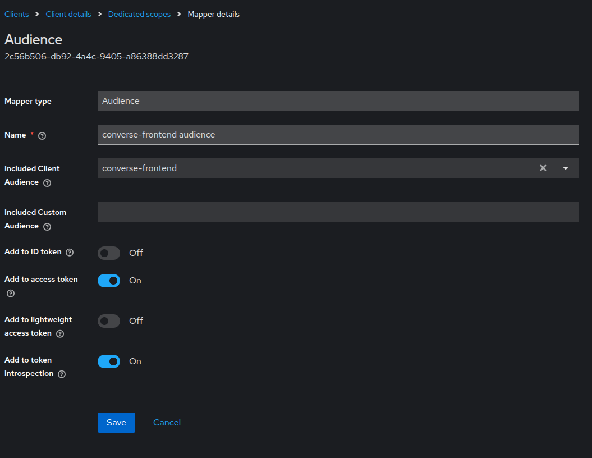
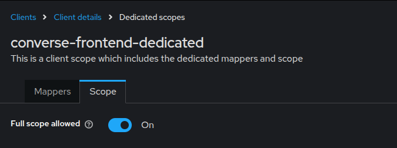
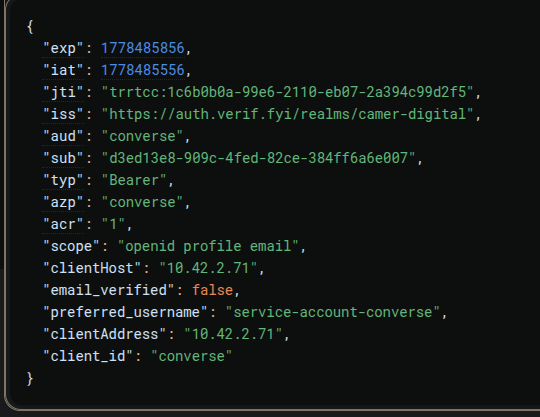
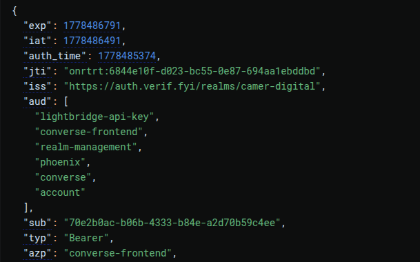

# Keycloak Audience (aud) Claims Operations Guide

## 1. Overview
This document outlines the standard operating procedures for configuring and managing JWT Audience (`aud`) claims within the `camer-digital` environment. Proper audience configuration ensures that access tokens are scoped correctly, minimizing the risk of token misuse and keeping JWT payloads lean for production performance.

## 2. Keycloak Environment
| Component | Value |
| :--- | :--- |
| **Base URL** | `https://auth.verif.fyi` |
| **Admin Console** | [Admin URL](https://auth.verif.fyi/admin/camer-digital/console/#/camer-digital/clients) |
| **Realm** | `camer-digital` |

### Authorized Clients
The following clients are managed within this environment:
*   `coder`
*   `converse`
*   `converse-frontend` 
*   `phoenix` 
*   `lightbridge-api-key` 

## 3. Understanding the Audience Claim
The `aud` (Audience) claim identifies the intended recipients of the JWT. An OAuth 2.0 Resource Server (API) SHOULD verify that the `aud` claim matches its own identifier before accepting a token.


## 4. Why Extra Audiences Appear
By default, Keycloak may inject multiple unintended audiences into a token. This occurs because Keycloak automatically includes the client ID of any client for which the user has associated roles. 

For example, if a user has the `user` role from the `converse` client, but is logging in via `converse-frontend`, Keycloak may inject `converse` into the `aud` claim automatically to facilitate cross-client access.

## 5. Configuring an Audience Mapper
To enforce a strict audience list and prevent "audience bloat," use a dedicated **Audience Protocol Mapper**.

### Configuration Steps:
1.  Navigate to **Clients** -> Select your client (e.g., `converse-frontend`).
2.  Select the **Client Scopes** tab.
3.  Click on the designated `<client-id>-dedicated` scope.
4.  Click **Add Mapper** -> **By Configuration**.
5.  Select **Audience** from the list.
6.  Configure the following:
    *   **Name**: `audience-mapper`
    *   **Included Client Audience**: Select the target API (e.g., `lightbridge-api-key`).
    *   **Add to ID Token**: `OFF`
    *   **Add to Access Token**: `ON`



## 6. Full Scope Allowed Explained
The **Full Scope Allowed** setting is a critical switch that determines how client roles propagate into the token.

### Full Scope Allowed: ON (Default)
When enabled, the client is allowed to request any role defined in the realm. Because Keycloak links audiences to roles, this often results in a massive `aud` array containing every client in the realm that has roles assigned to that user.

**Risk:** Bloated tokens and violation of the Principle of Least Privilege.

### Full Scope Allowed: OFF (Recommended)
When disabled, the client is only granted the roles explicitly mapped to it via "Service Account Roles" or "Scope Mappings." This restricts the audience claim to only the clients intentionally associated with the current session.

| State | Resulting Audience (Example) |
| :--- | :--- |
| **ON** | `["lightbridge-api-key", "converse-frontend", "realm-management", "phoenix", "converse", "account"]` |
| **OFF** | `["lightbridge-api-key", "converse-frontend"]` |



## 7. Testing Token Generation
To verify configuration changes, use the following `curl` command to perform a Client Credentials grant or check a user-based exchange.

```bash
# Environment Configuration
KC_URL="https://auth.verif.fyi"
REALM_NAME="camer-digital"
CLIENT_ID="converse"
CLIENT_SECRET="<PROD_SECRET>" # Replace with actual secret

# Request Access Token
curl -v -s -X POST "${KC_URL}/realms/${REALM_NAME}/protocol/openid-connect/token" \
  -H "Content-Type: application/x-www-form-urlencoded" \
  -d "client_id=${CLIENT_ID}" \
  -d "client_secret=${CLIENT_SECRET}" \
  -d "grant_type=client_credentials" \
  -d "scope=openid" | jq .access_token
```

## 8. JWT Inspection
Upload the resulting `access_token` to [jwt.io](https://jwt.io) or use a local CLI tool to inspect the payload.

### Ideal Payload Metadata
```json
{
  "iss": "https://auth.verif.fyi/realms/camer-digital",
  "aud": [
    "lightbridge-api-key",
    "converse-frontend"
  ],
  "azp": "converse-frontend",
  "typ": "Bearer"
}
```



## 9. Troubleshooting
*   **Missing Audience**: Ensure the Mapper is added to the *effective* Client Scope (Dedicated vs. Default).
*   **Too Many Audiences**: Check if `Full Scope Allowed` is `ON` under the client's **Scope** tab.
*   **Audience Mismatch**: Verify that the "Included Client Audience" in the mapper matches the `client_id` expected by the backend API.
*   **Leaking Roles**: If `Full Scope Allowed` is `OFF` but extra audiences remain, check for **Hardcoded Roles** or **Default Client Scopes** (like `microprofile-jwt`).

## 10. Recommended Production Practices
1.  **Disable Full Scope Allowed**: Always toggle this `OFF` for new production clients.
2.  **Explicit Mapping**: Only map necessary roles to the client scope.
3.  **Dedicated Mappers**: Use 1:1 Audience mappers for specific backend service requirements.
4.  **Audit Tokens**: Regularly inspect tokens from staging environments to ensure no "Metadata Leakage" (extra roles/audiences) is occurring.

## 11. Appendix: Token Bloat Example
Below is an example of a token generated with `Full Scope Allowed: ON`, showcasing the leakage of `realm-management` and internal infrastructure roles into the client's audience claim.


