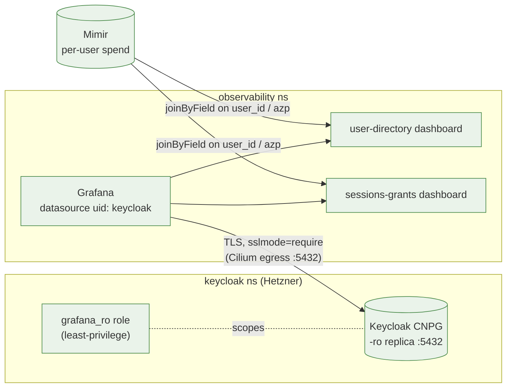

# Keycloak identity datasource — resolving `user_id`, sessions & grants

**Status:** live (2026-06-26). **ADRs:** [0063](./adr/0063-grafana-readonly-keycloak-datasource.md) (identity resolution), [0064](./adr/0064-keycloak-sessions-and-grants-visibility.md) (sessions & grants).

This is the "how it works + how to run it" guide for the read-only Keycloak
Postgres datasource that Grafana uses to turn opaque per-user identifiers into
people, and to surface standing offline grants alongside spend. It complements
[`per-user-observability.md`](./per-user-observability.md) (the Loki attribution
pipeline) — that doc gets the `user_id` *label* onto a log line; this one
resolves that `user_id` to a **name** and shows the **sessions** behind it.

## Why it exists

The per-user cost dashboards key every request on a `user_id` label, which for a
Keycloak access token is the `sub` — a **UUID**. The human-readable
`email`/`display_name` labels are populated from JWT claims (ADR-0011), so when a
token is **thin** (no email/name claim) Alloy stamps the `missing:`/`unstamped:`
sentinels and the opaque UUID is the only stable identifier left. "Who is
`49534505-…`?" used to mean a manual Keycloak Admin-API lookup.

Keycloak, Grafana and the gateway all run on the same Hetzner `home-remote`
cluster, and Keycloak's CNPG Postgres holds the authoritative `user_entity`
table. So we resolve `user_id → identity` **at query time** with a read-only
Grafana Postgres datasource onto that DB — the same proven shape as the
Lightbridge `lci-postgres` datasource.

## The shape (cross-repo)



| Concern | Repo | What |
|---|---|---|
| Read-only DB **role** + ESO password + GRANT job | **home-os** `charts/home-apps/keycloak-ha` | it owns the Keycloak CNPG cluster |
| **Datasource** + egress NetworkPolicy + password copy | **ai-helm-values** `environments/prod/{values/grafana.yaml,deps/observability-secrets,deps/grafana}` | per-env config (ADR-0056) |
| **Dashboards** (generators + JSON) | **ai-helm** `tools/dashboards/envoy_ai_gateway/{user_directory,sessions_grants}.py` | dashboards-as-code (ADR-0008) |

The datasource targets the CNPG **read replica**
`keycloak-ha-cluster-ro.keycloak.svc.cluster.local:5432`, database `app`, user
`grafana_ro`, `sslmode=require` (the cluster serves TLS from the internal
`self-signed-ca`; `require` encrypts without needing a CA bundle mounted). The
password is injected via `$__env{KEYCLOAK_GRAFANA_RO_PASSWORD}` from a
`keycloak-grafana-ro` ExternalSecret, wired through Grafana's `envFromSecrets`.

> ⚠️ **Grafana 12 reads the Postgres database from `jsonData.database`** — the
> top-level `database` field is ignored for provisioned datasources, surfacing as
> "You do not currently have a default database configured for this data source"
> on every query (the connection itself is fine). Set `jsonData.database: app`.
> Also: do not put the DB name in the `url`.

## Least-privilege on the auth database

This is the **auth DB** — it also holds password/OTP hashes, client secrets,
federated-identity tokens and LDAP bind creds. So `grafana_ro` is **not** a member
of `pg_read_all_data`. It is granted, by an idempotent GRANT Job (CNPG managed
roles can't express per-table grants), SELECT on exactly:

| Granted | Why |
|---|---|
| `user_entity`, `user_attribute` | identity (id/username/email/name) |
| `offline_user_session`, `offline_client_session` | the "tokens" — offline grants |
| **column-level** `client(id, client_id, name)` | resolve a session's client UUID → name **without** `client.secret` |

**Deliberately NOT granted:** `credential`, `federated_identity`, the rest of
`client` (esp. `secret`), `component_config`, `realm`, `user_federation_*`, and
the authz/consent tables (`user_role_mapping`, `user_group_membership`,
`user_consent*`, `user_required_action`).

Because the `realm` table isn't readable, queries filter `user_entity.realm_id`
(and `offline_*.realm_id`) by the **literal** internal id of the trusted realm —
`camer-digital` = `04793949-13aa-48ef-9d4d-1c60761f0c97`
(`tools/dashboards/src/dashboards/_common.py:CAMER_DIGITAL_REALM_ID`), not by name. Re-confirm
that id only if the realm is ever recreated.

The GRANT Job is an ArgoCD `Sync` hook with a **bounded** wait loop +
`activeDeadlineSeconds`, so a never-created role (e.g. the password ExternalSecret
never synced) fails the hook fast instead of wedging the Application `OutOfSync`.

## The two dashboards

### `AI Gateway — user directory (identity attribution)` — ADR-0063
- **Spend by user — resolved to identity**: a `-- Mixed --` table OUTER-joining
  (`joinByField` on `user_id`) the Mimir `sum by (user_id)` spend to the Keycloak
  directory. A row with an **empty Name** is a non-human subject (a CI repo
  subject like `repo:ADORSYS-GIS/…:pull_request`, or an `internal-key-*` service)
  — those never resolve because they aren't Keycloak users.
- **Keycloak user directory**: the raw `user_id → username/email/name` lookup.

### `AI Gateway — sessions & grants` — ADR-0064
Offline grants (standing long-lived refresh-token sessions) resolved to people +
client names, cross-referenced with spend:
- stats (active grants / users / clients), a per-(user, client) detail table with
  **last-active + idle-days** (per-client `offline_client_session.timestamp`), and
  an offline-grants-by-client bargauge;
- two **Mixed** tables joining grant counts to Mimir spend — per-**`azp`**
  ("which credential channel used which budget") and per-user.

> ⚠️ **Keycloak 26 persistent-sessions trap.** This KC stores **both** online and
> offline sessions in the **same** `offline_{user,client}_session` tables,
> distinguished by **`offline_flag`** (`'1'` = offline grant, `'0'` = online
> login). Every grant query **must** filter `offline_flag = '1'` or it miscounts
> online web/CLI logins (e.g. the grafana/argocd console sessions) as offline
> grants. (Online-session visibility would be a trivial `flag='0'` variant.)
> All "grant" counts key on the **client**-session table so per-user / per-azp /
> total stay consistent.

## What this can and cannot answer

Bounded by what Keycloak actually persists (verified live, KC 26.6.1):

| Question | Answer |
|---|---|
| Who is `user_id` X? | ✅ resolved from `user_entity` at query time, for ALL historical UUIDs |
| Which standing grants are **still in use**? | ✅ offline grants present + recent `timestamp` (idle-days) |
| Which were **revoked**? | ⚠️ revocation **deletes** the row (no tombstone) → present vs gone, not an enumerable list. `revoked_token` is the live revoke list; `not_before` covers bulk invalidation |
| Which **access tokens** hit the gateway? | ❌ access tokens are stateless JWTs — never in the DB |
| Which **individual token** used which budget? | ❌ cost metrics carry `user_id`/`azp` but **no `jti`**; one offline token mints many access tokens. Use **per-user** and **per-`azp`** (channel) instead — the attributable units |

Per-token budget would require promoting `jti` to a Mimir label — an
**unbounded-cardinality** explosion (every access token is a new `jti`).
Explicitly rejected.

## Operations

**Onboarding / cutover ordering** (out-of-band-secret-first, then home-os, then
ai-helm-values, then ai-helm):

1. Add `keycloak_grafana_ro_db_password` to `ssegning-aws` `prod/meta/test-app`
   (else both ExternalSecrets sit in `SecretSyncedError` and the role gets no
   password).
2. Merge the **home-os** role + GRANT job.
3. Merge the **ai-helm-values** datasource + egress + secret copy.
4. Merge the **ai-helm** dashboard(s).

**Verify live** (workload cluster = Hetzner `home-remote`):

```bash
export KUBECONFIG=/path/to/hetzner-k8s/kubeconfig
# Resolve a CNPG pod by label (the StatefulSet ordinal is not stable across
# restores) — any instance can run psql; -ro/-rw Services route to the role.
KCPOD=$(kubectl -n keycloak get pod -l cnpg.io/cluster=keycloak-ha-cluster \
  -o jsonpath='{.items[0].metadata.name}')
# role + scoped grants
kubectl -n keycloak exec "$KCPOD" -c postgres -- psql -U postgres -d app -tAc \
  "SELECT table_name, privilege_type FROM information_schema.role_table_grants WHERE grantee='grafana_ro' ORDER BY 1;"
# least-privilege holds: client name readable, secret denied
PW=$(kubectl -n keycloak get secret keycloak-ha-grafana-ro -o jsonpath='{.data.password}' | base64 -d)
kubectl -n keycloak exec "$KCPOD" -c postgres -- env PGPASSWORD="$PW" \
  psql "host=keycloak-ha-cluster-ro.keycloak.svc.cluster.local dbname=app user=grafana_ro sslmode=require" \
  -tAc "SELECT secret FROM client LIMIT 1;"   # -> permission denied for table client
# datasource health through Grafana
AU=$(kubectl -n observability get secret grafana-admin -o jsonpath='{.data.admin-user}' | base64 -d)
AP=$(kubectl -n observability get secret grafana-admin -o jsonpath='{.data.admin-password}' | base64 -d)
kubectl -n observability port-forward svc/grafana 13000:80 &
curl -s -u "$AU:$AP" http://localhost:13000/api/datasources/uid/keycloak/health   # -> "Database Connection OK"
```

**Rollback:** revert the ai-helm-values datasource (Grafana drops it) and/or the
home-os role; the GRANT is idempotent and the role is read-only, so there's no
data risk.

## Possible extensions

- **Online-session visibility** — a `flag='0'` variant of the sessions queries
  ("who is actively logged in").
- **Native name labels** — have Authorino always stamp `x-oidc-user-name` so the
  Loki `display_name` label is never `missing:`; this datasource then becomes a
  cross-check rather than the only resolver. Complementary, not a replacement.
