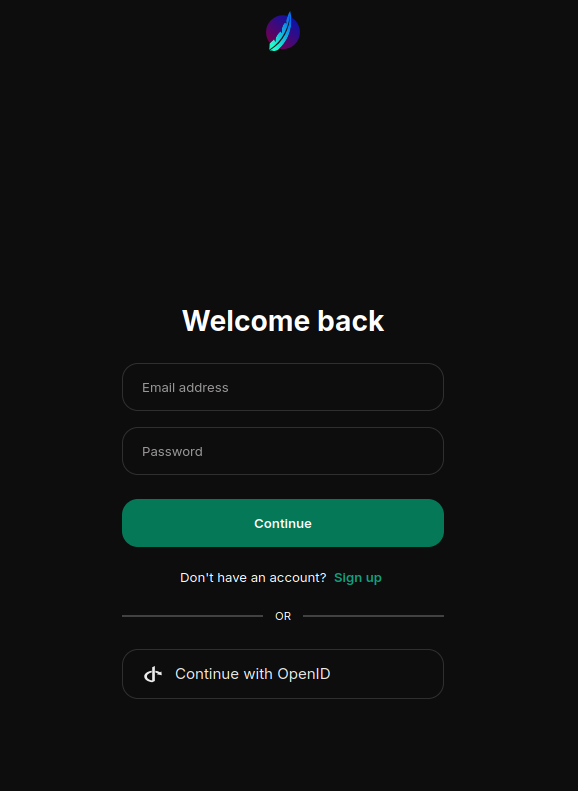
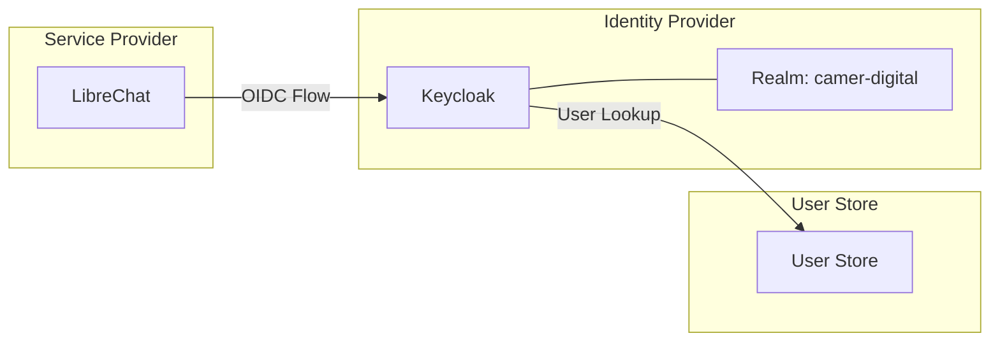
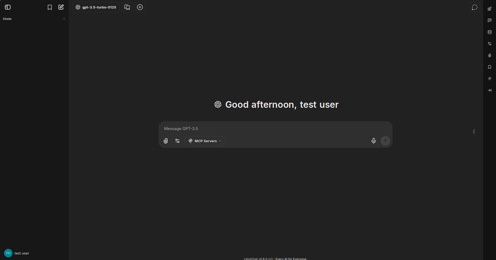
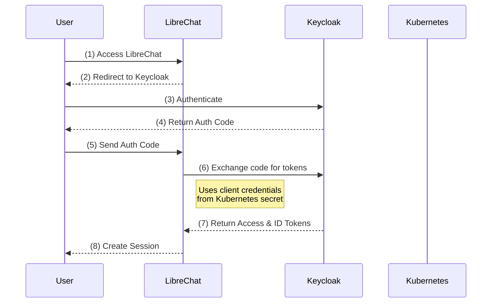
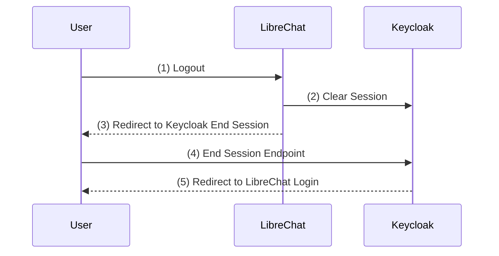

# LibreChat OIDC Integration with Keycloak

## Overview

This document describes the OIDC (OpenID Connect) integration between LibreChat and Keycloak, providing a reusable SSO mapping contract for downstream applications.



## Architecture




## Keycloak Configuration

### Realm Settings

- **Realm Name**: `camer-digital`
- **Issuer URL**: `https://accounts.camer.digital/realms/camer-digital`
- **Discovery Endpoint**: `https://accounts.camer.digital/realms/camer-digital/.well-known/openid-configuration`

### Client Configuration

| Setting | Value |
|---------|-------|
| Client ID | `librechat` (stored in secret `librechat-openid-config`) |
| Client Secret | Stored in Kubernetes secret `librechat-openid-config` |
| Protocol | OpenID Connect |
| Access Type | Confidential |
| Standard Flow | Enabled |
| Direct Access Grants | Disabled |
| Service Accounts | Disabled |

### Required Scopes

| Scope | Purpose |
|-------|---------|
| `openid` | Standard OIDC scope - provides ID token |
| `profile` | User profile information (name, username) |
| `email` | Email address and verification status |
| `librechat` | Custom scope for LibreChat-specific claims |

## LibreChat OIDC Configuration

### Environment Variables

The following environment variables configure OIDC in LibreChat:

```yaml
# Core OIDC Settings
OPENID_ISSUER: "https://accounts.camer.digital/realms/camer-digital"
OPENID_CALLBACK_URL: "/oauth/openid/callback"
OPENID_SCOPE: "openid profile email librechat"

# Client Credentials (from Kubernetes secret)
OPENID_CLIENT_ID:
  secretKeyRef:
    name: librechat-openid-config
    key: client_id
OPENID_CLIENT_SECRET:
  secretKeyRef:
    name: librechat-openid-config
    key: client_secret
OPENID_SESSION_SECRET:
  secretKeyRef:
    name: librechat-openid-config
    key: session_secret

# Role-Based Access Control
OPENID_REQUIRED_ROLE_TOKEN_KIND: "access"
OPENID_REQUIRED_ROLE_PARAMETER_PATH: "librechat_roles"
# OPENID_REQUIRED_ROLE: "user"  # Currently disabled for open beta

# User Experience
OPENID_AUTO_REDIRECT: "true"
OPENID_USE_END_SESSION_ENDPOINT: "true"

# Authentication Settings
ALLOW_EMAIL_LOGIN: "false"
ALLOW_REGISTRATION: "false"
ALLOW_SOCIAL_LOGIN: "true"
ALLOW_SOCIAL_REGISTRATION: "true"
```

### Configuration Reference

| Variable | Description | Value |
|----------|-------------|-------|
| `OPENID_ISSUER` | Keycloak realm issuer URL | `https://accounts.camer.digital/realms/camer-digital` |
| `OPENID_CALLBACK_URL` | OAuth callback path | `/oauth/openid/callback` |
| `OPENID_SCOPE` | Requested OAuth scopes | `openid profile email librechat` |
| `OPENID_REQUIRED_ROLE_TOKEN_KIND` | Token type for role extraction | `access` |
| `OPENID_REQUIRED_ROLE_PARAMETER_PATH` | JSON path for roles in token | `librechat_roles` |
| `OPENID_AUTO_REDIRECT` | Auto-redirect to IdP | `true` |
| `OPENID_USE_END_SESSION_ENDPOINT` | Use Keycloak logout endpoint | `true` |

## Claim Mapping Contract

### Token Structure

Keycloak issues two tokens during the OIDC flow:

| Token | Purpose | Used by LibreChat |
|-------|---------|-------------------|
| **ID Token** | User identity claims | User profile creation |
| **Access Token** | Authorization claims | Role-based access control |

### JWT Claim Reference

All tokens use standard JWT claims defined by the OpenID Connect and OAuth 2.0 specifications:

| Claim | Full Name | Description | Example Value |
|-------|-----------|-------------|---------------|
| `exp` | Expiration Time | Unix timestamp when token expires. Tokens after this time are rejected. | `1776169232` (2026-04-16T10:37:32 UTC) |
| `iat` | Issued At | Unix timestamp when token was created. Token lifetime = `exp - iat`. | `1776168932` (2026-04-16T10:35:32 UTC) |
| `iss` | Issuer | URL identifying the Keycloak realm that issued the token. Used to validate token source. | `https://accounts.camer.digital/realms/camer-digital` |
| `sub` | Subject | Unique user identifier (Keycloak UUID). The canonical user ID across all applications. | `e3e778d8-f22f-4ffc-9f3e-be98053d813b` |
| `aud` | Audience | Intended recipient(s) of the token. For ID tokens, this is the client ID. | `librechat` |
| `typ` | Token Type | Indicates token usage. `ID` for ID tokens, `Bearer` for access tokens. | `Bearer` or `ID` |
| `azp` | Authorized Party | Client ID that requested the token. Validates token is for your application. | `librechat` |
| `acr` | Authentication Context Class Reference | Level of authentication performed. `0`=none, `1`=password, `2+=MFA`. | `1` |
| `scope` | Scope | Space-separated list of granted scopes. | `openid email profile` |
| `allowed-origins` | Allowed Origins | Keycloak-specific claim listing CORS origins for browser-based requests. | `["https://ai.camer.digital"]` |

> **Note**: Token lifetime is typically 5 minutes (`exp - iat = 300s`). Refresh tokens are used to obtain new access tokens without re-authentication.

### Standard Claims (ID Token)

LibreChat extracts user profile information from the ID token:

| Claim | Type | Source | LibreChat Usage | Example Value |
|-------|------|--------|-----------------|---------------|
| `sub` | string | Keycloak | Unique user ID in LibreChat | `e3e778d8-f22f-4ffc-9f3e-be98053d813b` |
| `preferred_username` | string | Keycloak | Display name in UI | `testuser` |
| `email` | string | Keycloak | User email address | `testuser@test.local` |
| `email_verified` | boolean | Keycloak | Email verification status | `true` |
| `name` | string | Keycloak | Full display name | `Test User` |
| `given_name` | string | Keycloak | First name | `Test` |
| `family_name` | string | Keycloak | Last name | `User` |

### Access Token Claims

The access token contains authorization information:

| Claim | Type | Description | Example Value |
|-------|------|-------------|---------------|
| `sub` | string | User ID (same as ID token) | `e3e778d8-f22f-4ffc-9f3e-be98053d813b` |
| `azp` | string | Authorized party (client ID) | `librechat` |
| `scope` | string | Granted scopes | `openid email profile` |
| `acr` | string | Authentication context class reference | `1` |
| `allowed-origins` | string[] | CORS allowed origins | `["https://ai.camer.digital"]` |

### Custom Claims (LibreChat-Specific)

The `librechat` custom scope provides application-specific claims for role-based access control:

| Claim | Type | Token | Description |
|-------|------|-------|-------------|
| `librechat_roles` | `string[]` | Access Token | Array of role names for LibreChat access control |

> **⚠️ Configuration Required**: The `librechat_roles` claim requires explicit configuration in Keycloak. By default, Keycloak does not include client roles in tokens. See the [Keycloak Mapper Configuration](#keycloak-mapper-configuration) section below.

### Example Token Payloads

#### ID Token (Decoded)

```json
{
  "exp": 1776169232,
  "iat": 1776168932,
  "iss": "https://accounts.camer.digital/realms/camer-digital",
  "aud": "librechat",
  "sub": "e3e778d8-f22f-4ffc-9f3e-be98053d813b",
  "typ": "ID",
  "azp": "librechat",
  "acr": "1",
  "email_verified": true,
  "name": "Test User",
  "preferred_username": "testuser",
  "given_name": "Test",
  "family_name": "User",
  "email": "testuser@test.local"
}
```

#### Access Token (Decoded)

```json
{
  "exp": 1776169232,
  "iat": 1776168932,
  "iss": "https://accounts.camer.digital/realms/camer-digital",
  "sub": "e3e778d8-f22f-4ffc-9f3e-be98053d813b",
  "typ": "Bearer",
  "azp": "librechat",
  "acr": "1",
  "allowed-origins": [
    "https://ai.camer.digital"
  ],
  "scope": "openid email profile",
  "email_verified": true,
  "name": "Test User",
  "preferred_username": "testuser",
  "given_name": "Test",
  "family_name": "User",
  "email": "testuser@test.local"
}
```

#### Access Token with Roles (After Configuration)

After configuring the role mapper, the access token will include:

```json
{
  "exp": 1776169232,
  "iat": 1776168932,
  "iss": "https://accounts.camer.digital/realms/camer-digital",
  "sub": "e3e778d8-f22f-4ffc-9f3e-be98053d813b",
  "typ": "Bearer",
  "azp": "librechat",
  "scope": "openid email profile librechat",
  "librechat_roles": ["user"],
  "email_verified": true,
  "name": "Test User",
  "preferred_username": "testuser",
  "email": "testuser@test.local"
}
```

### Keycloak Mapper Configuration

The mapper configuration ensures:
- `librechat_roles` claim is added to both ID and access tokens
- Roles are extracted from the `librechat` client's role mappings
- The claim path matches `OPENID_REQUIRED_ROLE_PARAMETER_PATH: "librechat_roles"`

## Role-Based Access Control

### Role Hierarchy

| Role | Description | Access Level |
|------|-------------|--------------|
| `admin` | Administrator | Full access, user management |
| `user` | Standard user | Chat access, personal settings |
| `viewer` | Read-only | Limited access (if applicable) |

### Role Assignment in Keycloak

1. Navigate to **Clients** → `librechat` → **Roles**
2. Create roles: `admin`, `user`, `viewer`
3. Navigate to **Users** → Select user → **Role Mappings**
4. Select `librechat` client and assign appropriate roles

### Role Validation in LibreChat

When `OPENID_REQUIRED_ROLE` is set, LibreChat validates:

1. Extracts roles from access token at path specified by `OPENID_REQUIRED_ROLE_PARAMETER_PATH` (default: `librechat_roles`)
2. Checks if user has the required role specified in `OPENID_REQUIRED_ROLE`
3. Denies access if role is missing

### Current Configuration Status

> **Note**: Currently `OPENID_REQUIRED_ROLE` is disabled (commented out) for open beta testing. All authenticated users can access LibreChat.

**Environment Variables for Role-Based Access:**

```yaml
# Role extraction configuration
OPENID_REQUIRED_ROLE_TOKEN_KIND: "access"           # Extract roles from access token
OPENID_REQUIRED_ROLE_PARAMETER_PATH: "librechat_roles"  # JSON path to roles array
# OPENID_REQUIRED_ROLE: "user"                      # Uncomment to require 'user' role
```

### Testing Role Configuration

To verify roles are correctly included in tokens:

```bash
# Get access token with librechat scope
curl -s "https://accounts.camer.digital/realms/camer-digital/protocol/openid-connect/token" \
  -d "client_id=librechat" \
  -d "client_secret=<your-client-secret>" \
  -d "username=testuser" \
  -d "password=testpassword" \
  -d "grant_type=password" \
  -d "scope=openid profile email librechat" | jq -r '.access_token' | cut -d. -f2 | base64 -d 2>/dev/null | jq '.librechat_roles'
```

Expected output after proper configuration:
```json
["user"]
```

## Login Flow

### Sequence Diagram



### Flow Steps

1. **Initial Access**: User navigates to `https://ai.camer.digital`
2. **Auto-Redirect**: LibreChat redirects to Keycloak (enabled by `OPENID_AUTO_REDIRECT=true`)
3. **Authentication**: User authenticates at Keycloak login page
4. **Authorization Code**: Keycloak redirects back with auth code
5. **Code Exchange**: LibreChat receives the authorization code
6. **Token Request**: LibreChat exchanges code for tokens (using client credentials from Kubernetes secret)
7. **Token Response**: Keycloak returns access token and ID token
8. **Session Creation**: LibreChat creates user session and sets cookies

## Logout Flow

### Sequence Diagram



### Logout Configuration

With `OPENID_USE_END_SESSION_ENDPOINT=true`:
1. User initiates logout in LibreChat
2. LibreChat clears local session
3. LibreChat redirects to Keycloak's end session endpoint
4. Keycloak clears SSO session
5. User is redirected back to LibreChat login page

### End Session Endpoint

```
https://accounts.camer.digital/realms/camer-digital/protocol/openid-connect/logout
```

## Kubernetes Secrets

### Required Secrets

#### `librechat-openid-config`

```yaml
apiVersion: v1
kind: Secret
metadata:
  name: librechat-openid-config
  namespace: converse-chat
type: Opaque
stringData:
  client_id: "<keycloak-client-id>"
  client_secret: "<keycloak-client-secret>"
  session_secret: "<random-session-secret>"
```

#### Creating the Secret

```bash
# Generate session secret
SESSION_SECRET=$(openssl rand -hex 32)

# Create secret (replace with actual client credentials)
kubectl create secret generic librechat-openid-config \
  --namespace=converse-chat \
  --from-literal=client_id=librechat \
  --from-literal=client_secret=<your-client-secret> \
  --from-literal=session_secret=$SESSION_SECRET
```

## Downstream Application Integration Guide

### Reusable SSO Mapping Contract

For other internal applications to integrate with the same Keycloak realm:

#### 1. Standard Configuration Pattern

```yaml
# Application OIDC Configuration
OIDC_ISSUER: "https://accounts.camer.digital/realms/camer-digital"
OIDC_CLIENT_ID: "<app-name>"
OIDC_CLIENT_SECRET:
  secretKeyRef:
    name: <app-name>-openid-config
    key: client_secret
OIDC_SCOPES: "openid profile email <app-scope>"
```

#### 2. Required Keycloak Setup

For each new application:

1. **Create Client**:
   - Client ID: `<app-name>`
   - Protocol: OpenID Connect
   - Access Type: Confidential

2. **Create Client Scope**:
   - Name: `<app-name>`
   - Add role mapper for `<app-name>_roles`

3. **Create Roles**:
   - Define application-specific roles
   - Assign to users as needed

#### 3. Claim Mapping Template

| Claim | Purpose | Mapping |
|-------|---------|---------|
| `sub` | User ID | Direct from Keycloak |
| `email` | User email | Direct from Keycloak |
| `preferred_username` | Display name | Direct from Keycloak |
| `<app>_roles` | App roles | Role mapper per app |

## Validation Checklist

### Login Validation

- [ ] User can access LibreChat at `https://ai.camer.digital`
- [ ] User is automatically redirected to Keycloak login
- [ ] User can authenticate with Keycloak credentials
- [ ] User is redirected back to LibreChat after authentication
- [ ] User session is created in LibreChat
- [ ] User profile information is correctly populated
- [ ] Roles are correctly extracted from token

### Logout Validation

- [ ] User can initiate logout from LibreChat
- [ ] LibreChat session is cleared
- [ ] User is redirected to Keycloak end session endpoint
- [ ] Keycloak SSO session is terminated
- [ ] User cannot access LibreChat without re-authentication
- [ ] User is redirected to login page after logout

### Role-Based Access Validation

- [ ] Users without required role are denied access (when enabled)
- [ ] Users with required role can access the application
- [ ] Role changes in Keycloak are reflected on next login
- [ ] Admin users have elevated permissions

## Troubleshooting

### Common Issues

#### 1. "Invalid redirect URI"

**Cause**: Callback URL not configured in Keycloak client
**Solution**: Add `https://ai.camer.digital/oauth/openid/callback` to Valid Redirect URIs

#### 2. "Invalid client credentials"

**Cause**: Incorrect client ID or secret
**Solution**: Verify Kubernetes secret `librechat-openid-config` contains correct values

#### 3. "Missing roles in token"

**Cause**: Role mapper not configured or scope not assigned
**Solution**: 
- Verify `librechat` scope is assigned to client
- Check role mapper configuration
- Ensure user has role assignments

#### 4. "Session not created"

**Cause**: Session secret missing or invalid
**Solution**: Verify `session_secret` in Kubernetes secret

### Debug Mode

Enable debug logging for OIDC:

```yaml
env:
  DEBUG_OPENID_REQUESTS: "true"
  DEBUG_LOGGING: "true"
  DEBUG_CONSOLE: "true"
```

### Useful Commands

```bash
# Check LibreChat logs
kubectl logs -n converse-chat -l app=librechat-app

# Verify secret exists
kubectl get secret -n converse-chat librechat-openid-config

# Decode secret values
kubectl get secret -n converse-chat librechat-openid-config -o jsonpath='{.data.client_id}' | base64 -d

# Test OIDC discovery endpoint
curl -s https://accounts.camer.digital/realms/camer-digital/.well-known/openid-configuration | jq
```

## References

- [LibreChat OIDC Documentation](https://www.librechat.ai/docs/configuration/auth/oidc)
- [Keycloak OpenID Connect Documentation](https://www.keycloak.org/docs/latest/server_admin/#_oidc)
- [Kuadrant AuthConfig Template](../charts/kuadrant-policies/templates/authconfig.yaml)
- [Advanced Access Control Experiments](./librechat-oidc-experiments.md) - Group-based access, MCP role control, token propagation