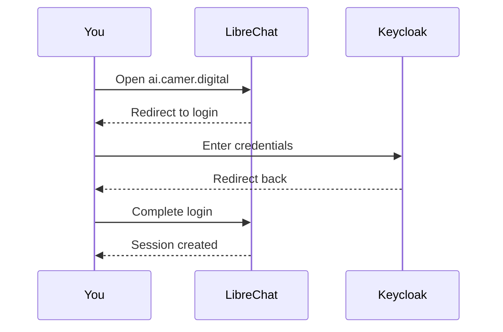

# LibreChat Platform Component

LibreChat is the primary chat interface for the CAMER DIGITAL AI platform, providing a web-based UI for interacting with AI models.

## What is LibreChat?

LibreChat is a multi-model AI chat interface where you can:

- **Chat with multiple AI models** — Choose from various AI models for different tasks
- **Use MCP tools** — Access GitHub issues, projects, PRs, and repositories directly in chat
- **Upload files** — Process documents and ask questions about them using LibreChat's built-in RAG

## How to Access

1. Open **https://ai.camer.digital** in your browser
2. Sign in with your organization credentials (Keycloak SSO)
3. Start chatting!

> **Need access?** Contact your organization's CAMER DIGITAL administrator.

## Getting Started

### Starting a Conversation

1. **New chat:** Click the "New Chat" button in the sidebar
2. **Select a model:** Click the model dropdown at the top to choose from available models
3. **Type your message:** Ask questions, request code, analyze documents, etc.
4. **Continue:** Your conversation history is saved automatically—you can resume any previous chat from the sidebar

### Using MCP Tools

MCP (Model Context Protocol) tools let you interact with GitHub directly in chat:

| Tool | Example Prompt |
|------|----------------|
| **GitHub Issues** | "Show me open issues in the frontend repo" |
| **GitHub Projects** | "What's on the project board for sprint 5?" |
| **GitHub Pull Requests** | "Summarize PR #123" |
| **GitHub Repositories** | "What files are in the src directory?" |

**To connect GitHub:**
1. Click the **Connect** button in the GitHub MCP tool section
2. Authorize the app with your GitHub account
3. Once linked, the AI can use your GitHub data in conversations

### File Uploads

You can upload documents (PDFs, Word docs, text files) and ask questions about them:

1. Click the attachment icon or drag-and-drop files into the chat
2. Ask questions about the uploaded content
3. The AI will search your documents for answers

LibreChat uses built-in RAG (Retrieval-Augmented Generation) to process your files.

## Authentication

LibreChat uses Keycloak for single sign-on:

Your session is managed automatically. If you're logged out, simply visit the URL again to sign back in.

## Available Models

The models available to you depend on your organization's configuration. Common categories include:

| Category | Best For |
|----------|----------|
| **Chat models** | General conversation, code assistance, analysis |
| **Reasoning models** | Complex problem-solving, multi-step reasoning |

> **Model not available?** Some models require specific permissions. Contact your administrator if you need access to additional models.

## Usage Quotas

LibreChat uses your **Keycloak account** for billing. Usage is shared across all platform clients:

| Plan | Requests/min | Tokens/min | Monthly Budget |
|------|--------------|------------|----------------|
| `free` | 200 | 1 million | $50 |
| `pro` | 400 | 2 million | $200 |

Your billing plan is determined by your Keycloak `librechat_roles` claim:
- `pro` role → `pro` plan
- No `pro` role → `free` plan

> **Note:** Your usage counts toward the same monthly budget across all platform interfaces (LibreChat, OpenCode CLI, etc.). The `internal` plan (600 req/min, uncapped) is only for service-to-service calls without a forwarded user identity.

If you hit a rate limit, you'll see an error message indicating too many requests. Wait a minute and try again.

## Troubleshooting

### Can't Log In

**Symptoms:** Login redirects don't complete, or you're repeatedly asked to sign in.

**Solutions:**
- Clear your browser cookies for `ai.camer.digital`
- Try an incognito/private browser window
- Make sure you're using your organization account (not personal)
- Contact your administrator if access was recently granted

### Models Not Loading

**Symptoms:** Model dropdown is empty or shows errors.

**Solutions:**
- Refresh the page (F5)
- Try a different browser (Chrome, Firefox, Edge)
- Check your network connection
- Contact support if the issue persists

### Chat History Not Loading

**Symptoms:** Previous conversations don't appear in the sidebar.

**Solutions:**
- Wait a few moments and try again—search indexing may be delayed
- Start a new chat; history may recover shortly
- Contact support if history doesn't return

### MCP Tools Not Responding

**Symptoms:** GitHub tools show errors or don't respond.

**Solutions:**
- Make sure you've clicked **Connect** and authorized your GitHub account
- Rephrase your request (e.g., "List open issues" → "Show open issues in the backend repo")
- Some tools require specific repository permissions—check with your administrator
- Try again in a few minutes—temporary issues can occur

### Rate Limited

**Symptoms:** You see **HTTP 429** "Too Many Requests" or a rate limit error message.

**Solutions:**
- Wait a minute and try again (free tier: 200 requests/min, pro: 400 requests/min)
- If you're on the free tier and need higher limits, contact your administrator about upgrading to `pro`

## Getting Help

| Issue | Contact |
|-------|---------|
| Account access | Your organization's help desk |
| Technical issues | Your CAMER DIGITAL administrator |
| Feature requests | Your organization's feedback process |

---

*For technical architecture details, see the [Related Documentation](#related-documentation) section below.*

## Related Documentation

| Document | Description |
|----------|-------------|
| [LibreChat OIDC Integration](librechat-oidc-integration.md) | Authentication configuration (for administrators) |
| [Chain-of-Agent use cases](librechat-chain-of-agents.md) | Multi-agent pattern catalogue (ticket #414) |
| [ADR-0014](adr/0014-split-librechart-and-opencode-wellknown.md) | Architecture decision (technical) |
| [ADR-0021](adr/0021-burst-budget-billing-and-dual-plane-authconfigs.md) | Gateway architecture (technical) |