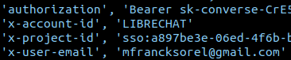
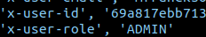
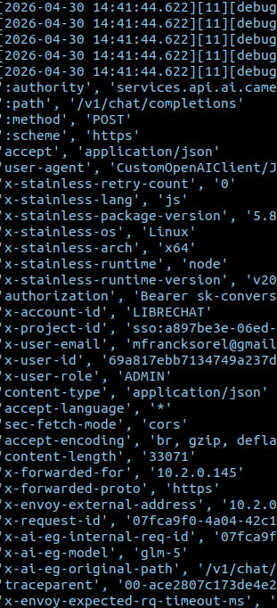

# Configuring and Tracing LibreChat Headers and MCP Headers via Envoy

This guide documents how to inject dynamic user session information as custom HTTP headers into Model Context Protocol (MCP) servers configured via LibreChat, and how to trace their successful propagation using Envoy Gateway logs.

---

## 1. Injecting Headers in `values.yaml`

LibreChat supports passing dynamic variables via custom API headers down to MCP servers and custom endpoints. Inside your `values.yaml` (under the `librechat` chart configuration), you can declare an `mcpServers` or `custom` endpoints block. 

Because we deploy via Helm, we need to escape the double curly braces `{{ }}` natively expected by LibreChat so that Helm does not attempt to evaluate them during template processing. You can do this by using the `{{ `{{` }} ... {{ `}}` }}` trick.

### Configuration Example

Here is how you can pass the relevant user information down to downstream endpoints/MCPs:



```yaml
    lightbridge_self_service:
      title: "LightBridge API KEYs"
      description: "LightBridge Self Service API-KEYs"
      type: "streamable-http"
      initTimeout: 150000
      url: "https://mcp.ai.camer.digital/mcp"
      headers:
        X-ACCOUNT-ID: 'LIBRECHAT'
        X-PROJECT-ID: 'sso:{{ `{{` }}LIBRECHAT_USER_OPENIDID{{ `}}` }}'
        X-USER-ID: '{{ `{{` }}LIBRECHAT_USER_ID{{ `}}` }}'
        X-USER-EMAIL: '{{ `{{` }}LIBRECHAT_USER_EMAIL{{ `}}` }}'
        X-USER-ROLE: '{{ `{{` }}LIBRECHAT_USER_ROLE{{ `}}` }}'
        X-USER-NAME: '{{ `{{` }}LIBRECHAT_USER_NAME{{ `}}` }}'
```

When LibreChat performs requests upstream towards the MCP server, it will automatically replace markers like `{{LIBRECHAT_USER_EMAIL}}` with the active user's session context (e.g., `mfrancksorel@gmail.com`).

---

## 2. Keycloak OIDC Context

To understand where LibreChat obtains variables like `LIBRECHAT_USER_ID` or `LIBRECHAT_USER_ROLE`, we must look at the underlying Identity Provider integration. 

LibreChat is integrated with our Keycloak realm (`camer-digital`). Upon successful authentication, Keycloak issues an **ID Token** and an **Access Token**. LibreChat automatically maps the claims from these tokens to its internal dynamic variables. 



* **`LIBRECHAT_USER_ID`**: Maps directly to the `sub` claim (the Keycloak UUID).
* **`LIBRECHAT_USER_EMAIL`**: Maps to the standard `email` claim.
* **`LIBRECHAT_USER_OPENIDID`**: Corresponds to the persistent user's OpenID ID.
* **`LIBRECHAT_USER_ROLE`**: Derived from the custom `librechat_roles` array injected into the token payload (via Keycloak Client Scopes).

For deeper architectural context on how these tokens are structured, propagated, and how custom roles are built, review the following guides:
- [LibreChat OIDC Integration with Keycloak](./librechat-oidc-integration.md) - Details the SSO mapping contract and standard configuration.
- [LibreChat OIDC Experiments and Advanced Access Control](./librechat-oidc-experiments.md) - Documents experiments surrounding custom role propagation and downstream claim usage.

---

## 3. Tracing Custom Headers in Envoy Logs

Once the headers are forwarded by LibreChat, they will hit the Gateway (Envoy) before reaching the MCP Server or upstream API. To verify that headers are successfully attached in **production**, you should observe Envoy's routing logs.


### Enabling Envoy Debug Logging in Production

By default, Envoy logs at the `info` or `warn` level, which is insufficient to inspect raw HTTP headers. You must temporarily set the logging level to `debug` via your Helm configuration for the Envoy Gateway:

```yaml
# In your apps/values.yaml under the Envoy Gateway section:
eg:
  config:
    envoyGateway:
       logging:
         level:
           default: debug  # Change from warn to debug
```


### Analyzing the Envoy Trace

Once the configuration is synced, monitor the Envoy proxy logs either directly using `kubectl logs` or k9s or your centralized logging dashboard .

```bash
# Example using kubectl for a specific gateway namespace
kubectl logs -l app.kubernetes.io/name=envoy -n converse-gateway -c envoy --tail=200 -f
```


When LibreChat issues an MCP request, you will observe Envoy decoding and forwarding your custom headers, confirming that the data propagates exactly as configured in `values.yaml`. For example:




### Explanation of Fields
* **`[router] router decoding headers`**: Specifically shows exactly which downstream request headers Envoy received from LibreChat.
* **`x-project-id`**: The template `sso:{{LIBRECHAT_USER_OPENIDID}}` successfully evaluated to the user SSO ID.
* **`x-user-role`**: Shows that the `ADMIN` role mapped successfully via Keycloak claims.
* **`x-user-email`**: Safely extracted the logged in user email matching the dynamic placeholder.

---

## 4. Best Practices
* **Security**: Only configure sensitive user payloads downstream to trusted, internal MCP/RAG services over HTTPS. Never pass role bindings or admin emails to external or unvetted MCP servers.
* **Helm Escaping**: Always remember that `values.yaml` natively leverages Go templates. The `{{ `{{` }} ... {{ `}}` }}` wrapping syntax is strictly necessary to prevent helm from incorrectly evaluating the variable at deployment time.
* **Performance**: Always revert Envoy's debug logging to `warn` or `error` in production environments immediately after confirming header traces to prevent disk space exhaustion and CPU overhead.

