# Envoy AI Gateway MCP Traffic Handling - Investigation Report


## Executive Summary

This report documents how Envoy AI Gateway (AIEG) handles Model Context Protocol (MCP) traffic, based on analysis of the ai-helm codebase and AIEG v0.6+ capabilities. Key findings:

1. **MCPRoute CRD** is the primary routing primitive, supporting path-based routing with OAuth discovery
2. **Transport Support** covers both SSE and streamable-HTTP via the mcpproxy filter
3. **Authentication** uses Envoy's native `jwt_authn` filter, bypassing Authorino for MCP routes
4. **Backend Modes** support self-hosted, proxied external, and direct external deployments

---

## 1. What is MCP (Model Context Protocol)?

MCP is a protocol that allows AI agents (like opencode, Claude, Goose) to connect to external tools and data sources. It provides a standardized way for AI systems to discover and call tools.

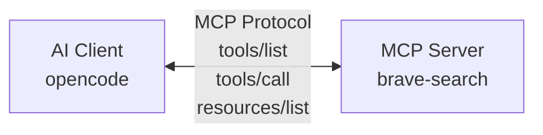

The MCP specification (June 2025 revision) defines:
- **Tools**: Functions the AI can call
- **Resources**: Data the AI can read
- **Prompts**: Pre-defined templates
- **Notifications**: Server-to-client events

---

## 2. Envoy AI Gateway's Role

The Envoy AI Gateway acts as a **transparent proxy** between MCP clients and backend MCP servers, providing:

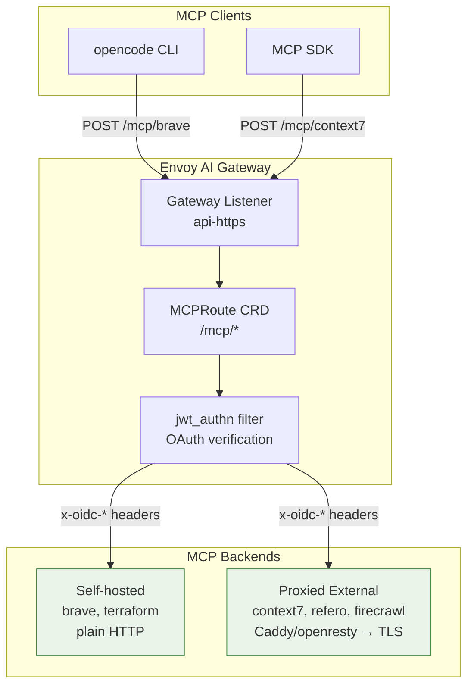

### Key Features (from official AIEG docs)

| Feature | Description |
|---------|-------------|
| **Streamable HTTP Transport** | Full support for MCP's streamable HTTP transport (June 2025 spec) |
| **Fine-Grained Authorization** | OAuth authentication with JWT claims and CEL expressions |
| **Server Multiplexing** | Route tool calls to correct backends, aggregate tools from multiple servers |
| **Upstream Authentication** | Inject API keys when connecting to external MCP servers |
| **Full MCP Spec Coverage** | Tool calls, notifications, prompts, resources, bi-directional requests |
| **Built-in Observability** | OpenTelemetry tracing and Prometheus metrics |

---

## 3. The MCPRoute CRD - Primary Routing Primitive

The `MCPRoute` CRD (Custom Resource Definition) is the main way to configure MCP routing. It's defined in AIEG's CRDs and implemented in the ai-helm codebase.

### 3.1 MCPRoute Structure

From [`charts/mcp/templates/mcproute.yaml`](../../charts/mcp/templates/mcproute.yaml):

```yaml
apiVersion: aigateway.envoyproxy.io/v1alpha1
kind: MCPRoute
metadata:
  name: brave-search
  namespace: converse-mcp
spec:
  parentRefs:
    - name: core-gateway
      namespace: converse-gateway
      kind: Gateway
      group: gateway.networking.k8s.io
      sectionName: api-https

  path: /mcp/brave  # Clients connect here

  # OAuth configuration (ADR-0038)
  securityPolicy:
    oauth:
      issuer: https://auth.verif.fyi/realms/camer-digital
      audiences: []
      claimToHeaders:
        - claim: sub
          header: x-oidc-user-id
        - claim: azp
          header: x-oidc-azp
        # ... more claims
      protectedResourceMetadata:
        resource: https://api.ai.camer.digital/mcp/brave
        resourceName: Brave Search MCP Server

  backendRefs:
    - name: brave-search
      kind: Backend
      group: gateway.envoyproxy.io
      path: /mcp
      securityPolicy:
        apiKey:
          secretRef:
            name: brave-token
```

### 3.2 Key Fields

| Field | Purpose |
|-------|---------|
| `spec.parentRefs` | Gateway attachment (which Gateway to use) |
| `spec.path` | URL path prefix (e.g., `/mcp/brave`) |
| `spec.securityPolicy.oauth` | OAuth configuration (displaces Authorino) |
| `spec.backendRefs` | Backend MCP servers to route to |
| `spec.backendRefs[].securityPolicy.apiKey` | Upstream API key injection |

### 3.3 Routing Architecture

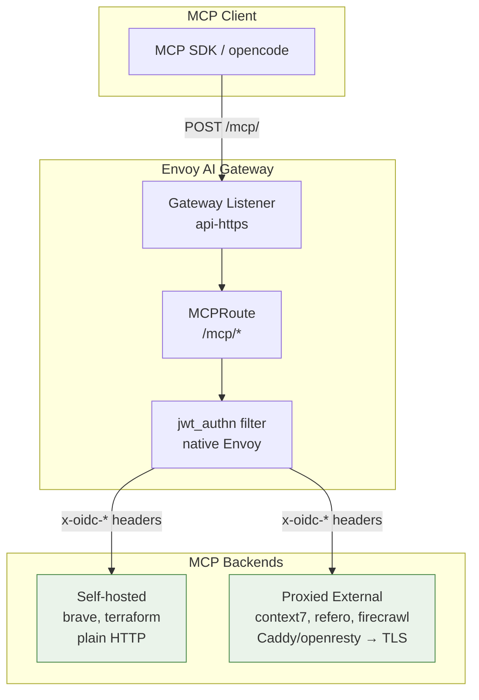

---

## 4. Transport Support (SSE vs Streamable-HTTP)

### 4.1 The Problem: MCP Needs Long-Running Connections

MCP (Model Context Protocol) is different from typical HTTP request-response. When an AI agent calls a tool, the response might:

- Come back immediately (simple tool call)
- Stream back progressively (long-running operation)
- Send multiple events over time (notifications, progress updates)

This requires **transport mechanisms** that can handle long-lived, streaming connections.

### 4.2 Supported Transports

#### SSE (Server-Sent Events)

**What it is:** A one-way server-to-client streaming mechanism over HTTP. The server keeps the connection open and sends events as they occur.

**Key Characteristics:**

| Characteristic | Description |
|----------------|-------------|
| **Direction** | One-way (server → client) |
| **Connection** | Long-lived HTTP connection |
| **Reconnection** | Client can reconnect with `Last-Event-ID` header |
| **Content-Type** | `text/event-stream` |

**SSE Format:**
```
event: message
data: {"jsonrpc":"2.0","id":1,"result":{"tools":[...]}}

event: message
data: {"jsonrpc":"2.0","method":"notifications/progress"}
```

#### Streamable-HTTP

**What it is:** A newer MCP transport (June 2025 spec) that uses standard HTTP with session management via the `Mcp-Session-Id` header.

**How it works:**
1. Client sends request with `Mcp-Session-Id` header
2. Server maintains state between requests using the session ID
3. Response can be JSON or SSE stream based on `Accept` header

**Key Characteristics:**

| Characteristic | Description |
|----------------|-------------|
| **Session ID** | `Mcp-Session-Id` header links requests to a session |
| **Stateful** | Server maintains state between requests |
| **Flexible Response** | Can return JSON or SSE stream based on `Accept` header |
| **Stateless Servers** | AIEG can work with stateless backends |

#### Why Both Transports?

| Transport | Best For | Limitations |
|-----------|----------|-------------|
| **SSE** | Simple streaming, browser clients | One-way only, requires persistent connection |
| **Streamable-HTTP** | Complex interactions, stateful sessions | Requires session management |

MCP supports both because SSE is simpler for straightforward streaming, while Streamable-HTTP handles more complex scenarios (bi-directional, stateful).

### 4.3 How mcpproxy Works

The `mcpproxy` filter runs inside the `ai-gateway-controller` process (not a sidecar). It handles:

1. **Session Management**: Encrypts backend session IDs into client-facing tokens
2. **SSE Parsing**: Reads `Accept: application/json, text/event-stream` on upstream POSTs
3. **Event Framing**: Parses SSE events (`event: message`, `data: ...`)
4. **Reconnection**: Supports `Last-Event-ID` for SSE stream resumption

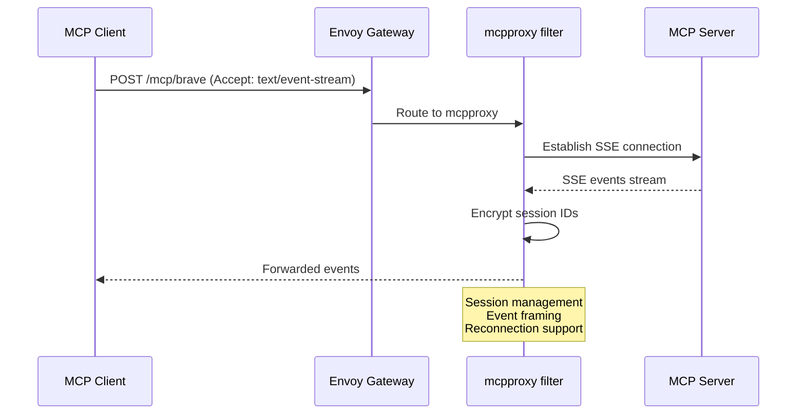

### 4.3 Known Issues (AIEG v0.6.0-v0.7.0)

| Issue | AIEG Issue | Workaround |
|-------|------------|------------|
| Empty leading SSE event causes parse failure | [#2219](https://github.com/envoyproxy/ai-gateway/issues/2219) | openresty engine pins `protocolVersion` |
| Mislabeled `Content-Type: text/event-stream` for JSON | [#2218](https://github.com/envoyproxy/ai-gateway/issues/2218) | Caddy `header_down` rewrite |

### 4.4 Transport Configuration in Charts

Self-hosted MCP servers specify transport via args, as shown in [`charts/mcp/ci/selfhosted-values.yaml`](../../charts/mcp/ci/selfhosted-values.yaml):

```yaml
mcp:
  name: brave-search
  mode: selfHosted
  path: /mcp/brave
  backendPath: /mcp
  image: docker.io/mcp/brave-search:latest
  port: 8080
  args:
    - --transport
    - http
  env:
    - name: BRAVE_API_KEY
      valueFrom:
        secretKeyRef:
          name: brave-token
          key: apiKey
    - name: BRAVE_MCP_TRANSPORT
      value: "http"
```

The mcpproxy automatically handles transport negotiation based on the `Accept` header.

---

## 5. Authentication Integration (The OAuth Carve-Out)

### 5.1 Critical Concept: Authorino Bypass

**MCP routes DISPLACE the gateway-level Authorino policy entirely.** This is documented in [ADR-0038](../adr/0038-mcp-oauth-protected-resource-metadata.md):

> The route-level SecurityPolicy AIEG generates *displaces* the gateway-attached Authorino policy for the whole MCPRoute (EG policy precedence is whole-policy, not merge), so Authorino's headers stop on `/mcp/*`.

This means:
- ✅ Envoy native `jwt_authn` filter handles JWT validation
- ✅ `claimToHeaders` maps JWT claims to `x-oidc-*` headers
- ❌ Authorino rate-limit descriptors (`x-account-id`, `x-org-id`, `x-billing-plan`) are **NOT** stamped on MCP routes

### 5.2 OAuth Discovery Flow (RFC 9728)

MCP routes implement the MCP authorization spec (2025-11-25 revision) via AIEG's native `securityPolicy.oauth`:

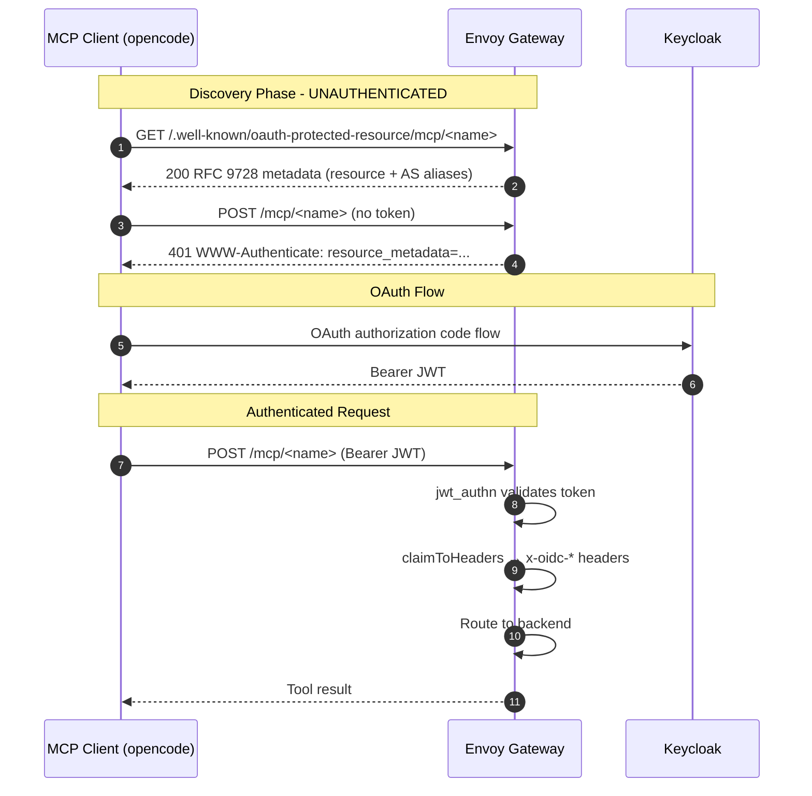

### 5.3 Discovery Endpoints

AIEG synthesizes unauthenticated endpoints for OAuth discovery:

| Endpoint | Purpose |
|----------|---------|
| `/.well-known/oauth-protected-resource/mcp/<name>` | RFC 9728 Protected Resource Metadata |
| `/.well-known/oauth-authorization-server/mcp/<name>` | Authorization server metadata (Keycloak snapshot) |
| `/.well-known/openid-configuration/mcp/<name>` | OpenID Connect discovery (same as above) |
| `<mcp.path>/.well-known/oauth-protected-resource` | Path-appended alias (non-spec fallback) |

### 5.4 SecurityPolicy Configuration

The OAuth configuration is defined in [`charts/mcp/values.yaml`](../../charts/mcp/values.yaml):

```yaml
oauth:
  enabled: false
  # Keycloak realm issuer — becomes authorization_servers[0] in the PRM
  issuer: ""
  # Public origin of the gateway listener; PRM `resource` = publicOrigin + mcp.path
  publicOrigin: ""  # e.g. https://api.ai.camer.digital
  # Human-readable PRM resource_name; defaults to mcp.name
  resourceName: ""
  # Minimal scopes for basic use
  scopesSupported: []
  # JWT audience allowlist
  audiences: []
  # ADR-0011 x-oidc-* parity, stamped by the gateway from verified JWT claims
  claimToHeaders:
    - claim: sub
      header: x-oidc-user-id
    - claim: azp
      header: x-oidc-azp
    - claim: preferred_username
      header: x-oidc-user-name
    - claim: iss
      header: x-oidc-iss
    - claim: realm_access.roles
      header: x-oidc-roles-realm
    - claim: resource_access
      header: x-oidc-resource-access
    - claim: scope
      header: x-oidc-scope
    - claim: jti
      header: x-oidc-jti
    - claim: email
      header: x-oidc-email
    - claim: name
      header: x-oidc-name
  # Also serve at path-appended form
  pathAppendedDiscovery: true
```

**Important Caveat:** Non-primitive claims (`realm_access.roles`, `resource_access`) are serialized by Envoy as **base64url(JSON)**, unlike Authorino's plain-JSON strings. Consumers must decode these headers.

---

## 6. Backend Modes (How MCP Servers Connect)

The ai-helm codebase supports **three backend modes**:

### 6.1 Mode 1: Self-Hosted (In-Cluster)

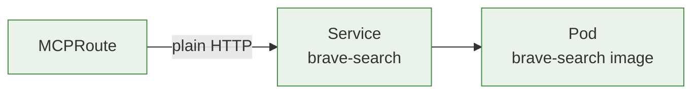

**Use for:** MCP servers you run yourself (brave, terraform)

**Resources created:**
- `Deployment` - MCP server pod
- `Service` - ClusterIP service
- `Backend` - Points to in-cluster service
- `MCPRoute` - Routing + OAuth

**Configuration (from [`charts/mcps/values.yaml`](../../charts/mcps/values.yaml)):**

```yaml
brave:
  enabled: true
  oauth:
    resourceName: Brave Search MCP Server
  mcp:
    name: brave-search
    mode: selfHosted
    path: /mcp/brave
    backendPath: /mcp
    image: docker.io/mcp/brave-search:latest
    port: 8080
    args:
      - --transport
      - http
    env:
      - name: BRAVE_API_KEY
        valueFrom:
          secretKeyRef:
            name: brave-token
            key: apiKey
  externalSecret:
    enabled: true
    secretName: brave-token
    data:
      - secretKey: apiKey
        key: ai/camer/digital/prod/env
        property: brave_api_key
```

### 6.2 Mode 2: Proxied External (Recommended for External MCPs)

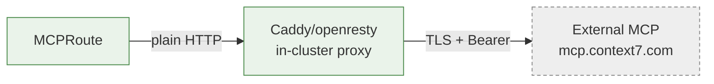

**Why proxiedExternal?** Direct external TLS backends failed due to three issues documented in [ADR-0040](../adr/0040-external-mcps-via-caddy-normalizing-proxy.md):

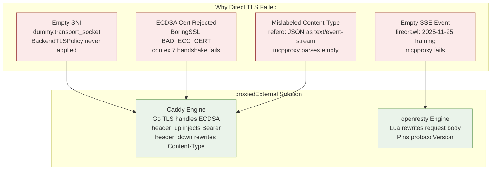

**Caddy Engine (default):**
- Go TLS handles ECDSA certificates (fixes context7)
- Injects credentials via `header_up Authorization "Bearer {env.MCP_TOKEN}"`
- Rewrites response Content-Type via `header_down` (fixes refero)

**openresty Engine (for firecrawl):**
- Lua rewrites request body to pin `protocolVersion`
- Workaround for AIEG issue #2219

**Configuration (from [`charts/mcps/values.yaml`](../../charts/mcps/values.yaml)):**

```yaml
context7:
  enabled: true
  oauth:
    resourceName: Context7 MCP Server
  mcp:
    name: context7
    mode: proxiedExternal
    path: /mcp/context7
    backendPath: /mcp
    externalHost: mcp.context7.com
    proxy:
      engine: caddy  # Go TLS handles ECDSA
  externalSecret:
    enabled: true
    secretName: context7-token
    data:
      - secretKey: apiKey
        key: ai/camer/digital/prod/env
        property: context7_api_key

firecrawl:
  enabled: true
  oauth:
    resourceName: Firecrawl MCP Server
  mcp:
    name: firecrawl
    mode: proxiedExternal
    path: /mcp/firecrawl
    backendPath: /v2/mcp
    externalHost: mcp.firecrawl.dev
    proxy:
      # openresty for request body rewrite (AIEG #2219 workaround)
      engine: openresty
      pinRequestProtocolVersion: "2025-06-18"
  externalSecret:
    enabled: true
    secretName: firecrawl-token
    data:
      - secretKey: apiKey
        key: ai/camer/digital/prod/env
        property: firecrawl_api_key

refero:
  enabled: true
  oauth:
    resourceName: Refero Design MCP Server
  mcp:
    name: refero
    mode: proxiedExternal
    path: /mcp/refero
    backendPath: /mcp
    externalHost: api.refero.design
    proxy:
      engine: caddy
      rewriteResponseContentType: application/json  # Fix AIEG #2218
  externalSecret:
    enabled: true
    secretName: refero-token
    data:
      - secretKey: apiKey
        key: ai/camer/digital/prod/env
        property: refero_api_key
```

### 6.3 Mode 3: External (Legacy - Not Recommended)

Direct TLS backend - has SNI and certificate issues. The BackendTLSPolicy is rendered but doesn't work properly due to AIEG's `dummy.transport_socket` issue.

**Warning from [ADR-0039](../adr/0039-mcp-external-backend-tls-envoypatchpolicy.md):**

> The Envoy AI Gateway's extension server generates the upstream cluster for each external MCP backend and stamps a **placeholder `dummy.transport_socket`** on it — an `UpstreamTlsContext` with an **empty `common_tls_context`**: no SNI, no CA.

Use `proxiedExternal` instead.

---

## 7. The MCP Catalog (Current Deployment)

From [`docs/architecture/10-mcp.md`](../architecture/10-mcp.md):

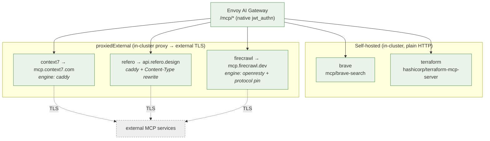

| MCP Server | Path | Backend Mode | Proxy Engine | Upstream |
|------------|------|--------------|--------------|----------|
| `brave` | `/mcp/brave` | selfHosted | — | in-cluster image |
| `terraform` | `/mcp/terraform` | selfHosted | — | in-cluster image |
| `context7` | `/mcp/context7` | proxiedExternal | caddy | `mcp.context7.com` |
| `refero` | `/mcp/refero` | proxiedExternal | caddy | `api.refero.design` |
| `firecrawl` | `/mcp/firecrawl` | proxiedExternal | openresty | `mcp.firecrawl.dev` |

---

## 8. Helm Chart Architecture

### 8.1 Orchestrator Pattern (ADR-0027)

The `charts/mcps` orchestrator uses an ApplicationSet to deploy multiple MCP servers:

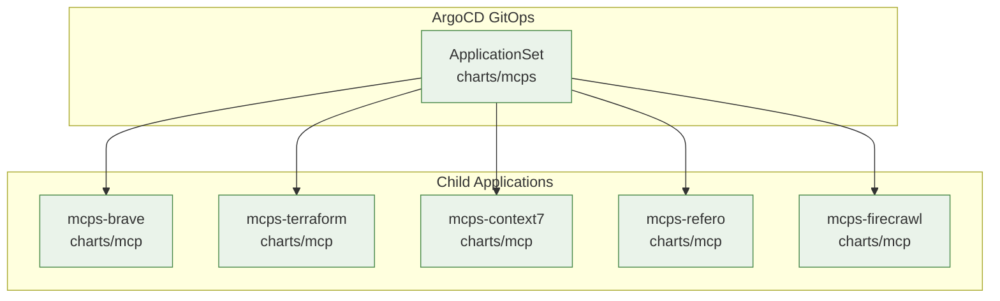

### 8.2 ApplicationSet Template

From [`charts/mcps/templates/applicationset.yaml`](../../charts/mcps/templates/applicationset.yaml):

```yaml
apiVersion: argoproj.io/v1alpha1
kind: ApplicationSet
metadata:
  name: mcps
  namespace: argocd
spec:
  goTemplate: true
  goTemplateOptions:
    - missingkey=error
  generators:
    - list:
        elements:
{{- range $mcpName, $mcpConfig := .Values.mcps }}
{{- if not (eq $mcpConfig.enabled false) }}
          - appName: {{ printf "%s-%s" $.Release.Name $mcpName | quote }}
            chartPath: charts/mcp
            valuesYaml: |-
{{- $childValues := dict
      "mcp" $mcpConfig.mcp
      "gatewayRef" $.Values.gatewayRef
      "externalSecret" (default (dict "enabled" false) $mcpConfig.externalSecret)
      "oauth" (mustMergeOverwrite (deepCopy (default (dict) $.Values.oauth)) (default (dict) $mcpConfig.oauth))
}}
{{ $childValues | toYaml | indent 14 }}
{{- end }}
{{- end }}
```

### 8.3 Per-MCP Values

From [`charts/mcp/values.yaml`](../../charts/mcp/values.yaml):

```yaml
mcp:
  name: example
  mode: external  # external | selfHosted | proxiedExternal
  path: /mcp/example
  backendPath: /mcp
  
  # selfHosted / proxiedExternal
  image: ""
  port: 8080
  
  # proxiedExternal
  externalHost: "example.com"
  proxy:
    engine: caddy  # caddy | openresty
    authHeader: Authorization
    bearer: true
    rewriteResponseContentType: ""
    pinRequestProtocolVersion: ""  # openresty only
  
  # Upstream auth
  auth:
    enabled: false
    secretName: ""
    header: ""  # empty = Authorization + Bearer prefix

oauth:
  enabled: false
  issuer: ""
  publicOrigin: ""
  resourceName: ""
  claimToHeaders: [...]
```

---

## 9. Required CRD Changes for MCP

### 9.1 MCPRoute CRD

The `MCPRoute` CRD is defined in AIEG's CRDs. Key fields:

| Field | Purpose |
|-------|---------|
| `spec.parentRefs` | Gateway attachment |
| `spec.path` | URL path prefix |
| `spec.securityPolicy.oauth` | OAuth configuration |
| `spec.backendRefs` | Backend references |

### 9.2 Backend CRD

From [`charts/mcp/templates/backend.yaml`](../../charts/mcp/templates/backend.yaml):

```yaml
apiVersion: gateway.envoyproxy.io/v1alpha1
kind: Backend
metadata:
  name: <mcp-name>
spec:
  endpoints:
    - fqdn:
        hostname: <service>.<namespace>.svc.cluster.local
        port: <port>
```

### 9.3 BackendTLSPolicy (External Mode Only)

```yaml
apiVersion: gateway.networking.k8s.io/v1
kind: BackendTLSPolicy
metadata:
  name: <mcp-name>
spec:
  targetRefs:
    - group: gateway.envoyproxy.io
      kind: Backend
      name: <mcp-name>
  validation:
    wellKnownCACertificates: "System"
    hostname: <external-host>
```

### 9.4 HTTPRoute for Path-Appended Discovery

From [`charts/mcp/templates/oauth-discovery-alias.yaml`](../../charts/mcp/templates/oauth-discovery-alias.yaml):

```yaml
apiVersion: gateway.networking.k8s.io/v1
kind: HTTPRoute
metadata:
  name: <mcp-name>-oauth-discovery
spec:
  parentRefs:
    - name: <gateway-name>
      namespace: <gateway-namespace>
  hostnames: [<public-origin>]
  rules:
    - matches:
        - path:
            type: PathPrefix
            value: <mcp-path>/.well-known/oauth-protected-resource
      filters:
        - type: RequestHeaderModifier
          requestHeaderModifier:
            set:
              - name: Content-Type
                value: application/json
        - type: ExtensionRef
          extensionRef:
            group: gateway.envoyproxy.io
            kind: DirectResponse
            name: <mcp-name>-oauth-discovery
```

---

## 10. Long-Lived SSE Connections

### 10.1 Connection Handling

The mcpproxy manages SSE sessions with:

1. **Session Encryption**: Backend session IDs are encrypted into client-facing tokens
2. **Connection Pooling**: Maintained in the controller process
3. **Timeout Handling**: Route-level timeouts apply

### 10.2 Authorino Behavior with SSE

Since Authorino is **bypassed** on MCP routes:

- No ext_authz timeout concerns for long-lived SSE
- JWT validation happens at connection establishment
- Subsequent SSE events flow without re-authentication

### 10.3 Timeout Configuration

From [`charts/ai-model/templates/aigatewayroute.yaml`](../../charts/ai-model/templates/aigatewayroute.yaml):

```yaml
timeouts:
  request: 600s  # Default, configurable per-route
  backendRequest: 600s
```

For MCP routes, timeouts are inherited from the Gateway's listener configuration.

---

## 11. Complete Architecture Diagram

### 11.1 Full MCP Request Flow

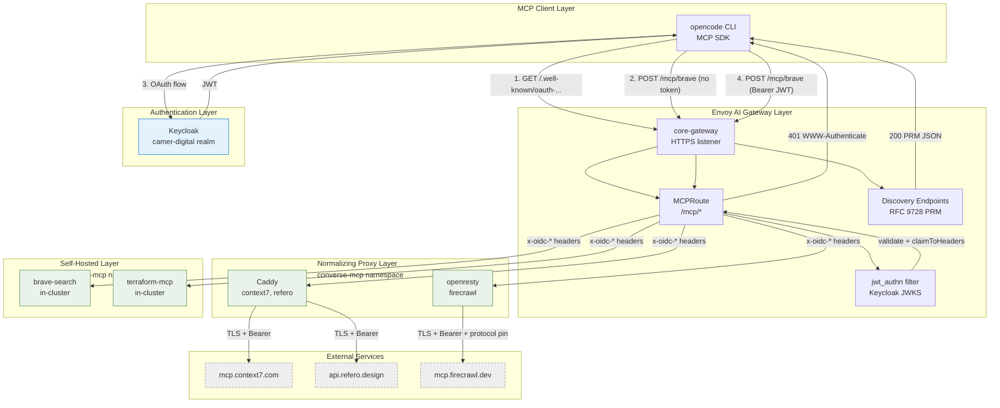

### 11.2 Component Responsibilities

| Component | Responsibility |
|-----------|----------------|
| `MCPRoute` | Path routing, OAuth config, backend selection |
| `jwt_authn` | JWT validation, claim extraction |
| `claimToHeaders` | Map JWT claims to `x-oidc-*` headers |
| `Backend` | Endpoint definition (FQDN + port) |
| `Caddy proxy` | TLS termination, credential injection, Content-Type rewrite |
| `openresty proxy` | Request body rewrite (protocolVersion pinning) |

---

## 12. Gaps and Limitations

### 12.1 Current Limitations

| Limitation | Impact | Mitigation |
|------------|--------|------------|
| No rate limiting on `/mcp/*` | Cannot throttle MCP requests per user | Add `BackendTrafficPolicy` with rate limits |
| No audience validation | Any valid realm JWT accepted | Add Keycloak audience mapper |
| Non-primitive claims are base64url(JSON) | Must decode `realm_access.roles`, `resource_access` | Document for consumers |
| `optional: false` for MCP_TOKEN | Pod waits in ContainerCreating if ESO slow | Acceptable trade-off for security |

### 12.2 Open Questions

1. **MCP Rate Limiting**: How to implement per-user rate limits without Authorino descriptors?
   - Option A: Add `claimToHeaders` for `sub`→`x-account-id` + `BackendTrafficPolicy`
   - Option B: Re-attach Authorino with `mergeType` (requires AIEG support)

2. **Audience Validation**: Requires Keycloak audience mapper configuration
   - Current: `audiences: []` (no validation)
   - Desired: `audiences: [<mcp-resource>]` derived from RFC 8707 `resource` parameter

3. **Dynamic Client Registration**: Pre-registered clients assumed
   - Gap: Clients without pre-registered Keycloak client need DCR or Client ID Metadata Documents

### 12.3 AIEG Upstream Issues

| Issue | Status | Workaround |
|-------|--------|------------|
| [#2218](https://github.com/envoyproxy/ai-gateway/issues/2218) - Content-Type mislabeling | Open | Caddy `header_down` rewrite |
| [#2219](https://github.com/envoyproxy/ai-gateway/issues/2219) - Empty SSE event parsing | Open | openresty `protocolVersion` pin |

---

## 13. References

### 13.1 Internal Documentation

- [ADR-0038: MCP OAuth Discovery](../adr/0038-mcp-oauth-protected-resource-metadata.md)
- [ADR-0040: External MCPs via Caddy Proxies](../adr/0040-external-mcps-via-caddy-normalizing-proxy.md)
- [ADR-0041: Firecrawl Protocol Version Rewrite](../adr/0041-firecrawl-protocol-version-rewrite-nginx-engine.md)
- [ADR-0027: MCPs Orchestrator Split](../adr/0027-mcps-orchestrator-split-and-coder-removal.md)
- [Architecture: MCP Servers](../architecture/10-mcp.md)

### 13.2 External References

- [Envoy AI Gateway MCP Documentation (v0.6)](https://aigateway.envoyproxy.io/docs/0.6/capabilities/mcp/)
- [MCP Authorization Spec (2025-11-25)](https://modelcontextprotocol.io/specification/latest/basic/authorization)
- [RFC 9728: OAuth Protected Resource Metadata](https://www.rfc-editor.org/rfc/rfc9728)
- [RFC 8414: OAuth 2.0 Authorization Server Metadata](https://www.rfc-editor.org/rfc/rfc8414)

### 13.3 AIEG Issues

- [#2218](https://github.com/envoyproxy/ai-gateway/issues/2218) - Content-Type mislabeling
- [#2219](https://github.com/envoyproxy/ai-gateway/issues/2219) - Empty SSE event parsing
- [#1924](https://github.com/envoyproxy/ai-gateway/issues/1924) - SSE transport issues
- [#1555](https://github.com/envoyproxy/ai-gateway/issues/1555) - Stateless backend session handling

---

## 14. Conclusion

Envoy AI Gateway v0.6+ provides robust MCP support through:

1. **Native MCPRoute CRD** with OAuth discovery (RFC 9728) integration
2. **Dual transport support** (SSE and streamable-HTTP) via the mcpproxy filter
3. **Flexible backend modes** supporting self-hosted, proxied external, and direct external deployments
4. **Seamless authentication** via Envoy's native `jwt_authn` filter with `claimToHeaders`

The ai-helm implementation demonstrates production-ready patterns for:
- OAuth discovery without Authorino dependency
- Normalizing proxies for external MCP reliability
- Per-MCP Application management via GitOps

### Key Recommendations for New MCP Deployments

1. Use `mode: proxiedExternal` for all external MCPs
2. Prefer Caddy engine unless request body rewriting is required
3. Configure OAuth with `claimToHeaders` for user attribution
4. Monitor AIEG issues #2218 and #2219 for upstream fixes