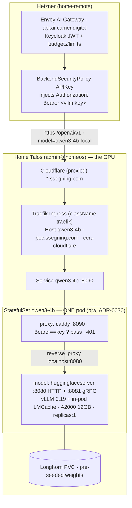

# Qwen3-4B (self-hosted) — deployment paper

> One of three self-hosted-model papers. The reusable mechanics live in the
> **[pattern guide](../self-hosted-model-serving.md)**; this paper is the
> **as-deployed truth** for Qwen3-4B. Siblings:
> [Qwen3.5-4B (vLLM/BF16)](./qwen3.5-4b.md) · [Qwen3.5-4B Q4 (llama.cpp) — **LIVE**](./qwen3.5-4b-q4.md).

| | |
|---|---|
| **Status** | 🟦 **STANDBY** — was the live self-hosted model (shipped 2026-06-07); **disabled 2026-06-08** when [Qwen3.5-4B Q4 (llama.cpp)](./qwen3.5-4b-q4.md) took the GPU. Kept wired (`enabled: false` on the app + `qwen3-4b-local` model) for instant rollback. Everything below is the as-built truth of this build. |
| **Chart** | `charts/model-serving-qwen3-4b` (renamed from `model-serving` 2026-06-08) |
| **Engine** | vLLM via `kserve/huggingfaceserver:v0.18.0-gpu` + in-pod **LMCache** |
| **Quant** | BF16 (official weights, `Qwen/Qwen3-4B`) |
| **Gateway model-id** | `qwen3-4b-local` · backend `vllm-local-01` (`prefix: /openai/v1`) |
| **Edge host** | `qwen3-4b--poc.ssegning.com` |
| **Why** | [ADR-0022](../adr/0022-self-hosted-gpu-model-federated-into-gateway.md) (federation) · [ADR-0028](../adr/0028-owned-hardware-model-pricing.md) (pricing) · [ADR-0029](../adr/0029-self-hosted-model-plain-deployment.md) (off Knative) · [ADR-0030](../adr/0030-merge-model-and-proxy-into-one-statefulset-bjw.md) (one STS via bjw) |

The serving **pattern** (bjw StatefulSet, Caddy auth-proxy sidecar, pre-seeded RWX
PVC, plain Ingress + cert-cloudflare, `homeCluster: true`, gateway federation) is
described once in the [guide](../self-hosted-model-serving.md). This paper records
only what's **specific to Qwen3-4B**.

---

## 1. Model card — `Qwen/Qwen3-4B`

Source: the official [Qwen/Qwen3-4B](https://huggingface.co/Qwen/Qwen3-4B) card (Apache-2.0).

| Property | Value | How we use it |
|---|---|---|
| Type | Causal LM (dense) | — |
| Parameters | **4.0 B** total / 3.6 B non-embedding | ~8 GB BF16 weights → fits the 12 GB A2000 |
| Layers | 36 | — |
| Attention (GQA) | **32 query / 8 KV heads** | GQA keeps KV small — important on a thin-VRAM card |
| Native context | **32,768** | We **clamp to 16,384** (`--max-model-len`) so KV fits |
| Extended context | 131,072 (YaRN) | **Not** enabled — costs accuracy + KV we don't have |
| Modes | Thinking / non-thinking | → `supportedParameters: *spReasoning` |
| Capabilities | Tool calling, 100+ languages | routed like any tool-capable chat model |
| License | Apache-2.0 | seed needs no token for access (only to lift the rate limit) |

**Recommended sampling** (surface to clients; vLLM doesn't force it): thinking
`temp 0.6 / top_p 0.95 / top_k 20`; non-thinking `temp 0.7 / top_p 0.8 / top_k 20`.
**Never greedy** (repetition loops). `presence_penalty` 0–2 is the repetition lever.

---

## 2. VRAM budget (RTX A2000, 12 GB, Ampere)

`Qwen/Qwen3-4B` BF16 at `--gpu-memory-utilization 0.90` (≈10.8 GB usable):

| Consumer | ~VRAM |
|---|---|
| Weights (BF16, 4B) | ~8.0 GB |
| Activations + overhead (`--enforce-eager`, no CUDA-graph) | ~1.0 GB |
| **On-GPU KV (remainder)** | **~1.5–2 GB** (~10–14k tokens) |

That thin on-GPU KV is why **LMCache** (CPU-DRAM offload + cross-request prefix
reuse) is load-bearing here, and why the window is clamped to 16k.

### 2.1 Context / output limits (the operating contract)

**Window = 16,384 tokens (prompt + completion), HARD cap — a VRAM choice, not a
model limit.** A >16k prompt → `400`. KV per full request: 16k ≈ 2–2.4 GB (fits
only because LMCache spills overflow to CPU); 32k ≈ 4–4.7 GB (heavy offload); 131k
(YaRN) ≈ 12–19 GB (exceeds the card — not viable).

⚠️ **Output is the binding constraint for hard dev work.** Qwen recommends 32k+
output for math/coding and thinking-mode spends output tokens on `<think>` — but
our whole window is 16k (8k output cap). **Route big-context / long-output work to
the SaaS models** (e.g. `deepseek-v4-flash`). This is the **owned / cheap / private
/ low-stakes** tier: routing, extraction, summarization, simple RAG, light agent
steps, drafting — *not* a frontier replacement.

**Decision (2026-06-07): keep 16k / 8k output.** It fits, it's advertised, it
matches the tier. The historical upgrade lever was AWQ-INT4 → ~32k; that's now
superseded by the Qwen3.5 Q4 path (see [that paper](./qwen3.5-4b-q4.md)), whose
linear-attention KV makes long context cheap.

---

## 3. As-built architecture



**Request path:** client → Envoy gateway (JWT + budgets) → backend injects the
Bearer → Cloudflare → home Traefik Ingress (TLS) → Service `:8090` → **Caddy
sidecar** (enforces the Bearer the image ignores; 401 otherwise) → model over
`localhost:8080`. Two enforcement points: Keycloak JWT at the gateway, static key
at the home edge. The model's `:8080` is never exposed outside the pod.

**Components:** model `kserve/huggingfaceserver:v0.18.0-gpu` (vLLM **0.19.0** +
aligned LMCache) · proxy `caddy:2-alpine` (sidecar) · weights Longhorn **RWX** PVC
(bjw seed Job, ArgoCD Sync hook) · public route plain k8s Ingress (`className:
traefik`, ingress-shim `cert-cloudflare` DNS-01) · DNS Cloudflare-proxied
`*.ssegning.com`.

---

## 4. Container arguments (`modelServing.controllers.main.containers.model.args`)

| Arg | Why |
|---|---|
| `--model_name=qwen3-4b` | served name (gateway alias `qwen3-4b-local`) |
| `--model_dir=/mnt/models` | local weights (PVC mount; replaces KServe `pvc://`) |
| `--backend=vllm` · `--dtype=float16` | vLLM; Ampere (no hardware FP8) |
| `--max-model-len=16384` · `--max-num-seqs=4` | context cap + concurrency (12 GB) |
| `--gpu-memory-utilization=0.90` · `--swap-space=1` | ~10 % headroom; cap CPU swap |
| `--enforce-eager` | skip CUDA-graph (memory + stability) |
| `--enable-auto-tool-choice` + `--tool-call-parser=hermes` | agentic tools (Qwen3 → hermes) |
| `--kv-transfer-config={"kv_connector":"LMCacheConnectorV1","kv_role":"kv_both"}` | in-pod LMCache |
| ~~`--kv-cache-dtype=fp8`~~ | **REMOVED** — flashinfer can't pass fp8 KV via dlpack on Ampere → crash every prefill |
| ~~`--reasoning-parser=qwen3`~~ | **NOT set** — conflicts with the hermes tool parser (vllm#19513/#19051) |

Env: `LMCACHE_*` (offload, `maxLocalCpuSizeGb: 1`), `VLLM_API_KEY` (set but
**ignored by the image** — Caddy is the real gate). Resources `requests 2Gi /
limits 6Gi`; `nvidia.com/gpu` commented out (PoC node has no device plugin → GPU
via `runtimeClassName: nvidia` + `gpu-node`). Probes per the guide's
"slow-loader" rule (`httpGet /v2/health/ready`, not tcpSocket).

---

## 5. Model-specific gotchas (the ones that bit)

- ⚠️ **huggingfaceserver IGNORES `VLLM_API_KEY`** — serves the OpenAI API itself; a
  public route = an open GPU. This is the whole reason for the Caddy auth-proxy.
  Verified pre-fix: no-auth and wrong-key both returned 200.
- **vLLM ↔ LMCache version skew is image-pinned.** v0.17.0 →
  `AttributeError: …get_kv_events`; v0.18.0-gpu (vLLM 0.19.0) is aligned. LMCache
  isn't separately pinned (rides the vLLM extra) → **bumping the image can re-break
  it; test before bumping.**
- **Ampere = no FP8** → never `--kv-cache-dtype=fp8` (dlpack BufferError every prefill).
- ⚠️ **The model binds TWO ports: HTTP `:8080` + gRPC `:8081`.** In one pod the
  Caddy sidecar must **not** use 8081 (it did → gRPC crashed `Failed to bind …
  [::]:8081`). Proxy is on `:8090`.
- **8Gi host RAM** is tight; 12/16Gi requests wouldn't schedule.
- **SSA is strict** — a malformed probe field fails the whole apply; the pod never starts.

---

## 6. Cost — €/hour TCO → catalog price (Erlangen, 2026; ADR-0028)

Cost-recovery pricing, not $0. Capex amortized 3 yr (26,280 h): GPU A2000 100 %
(€413), CPU 3/28 (€37.83), RAM 6 GB (€15) = **€0.0177/h**. Opex ≈ 95 W at the wall
× €0.34/kWh = **€0.0323/h**. **Total ≈ €0.05/h (~$0.054) while serving** (€36.5/mo
at 730 h).

Mapped to the weighted per-token catalog price at low/bursty utilization:

| `pricing.standard` (USD / 1M) | Value | Rationale |
|---|---|---|
| `outputPer1M` | **$1.00** | decode = the cost driver at cost-recovery util |
| `inputPer1M` | **$0.15** | prefill ~5–7× cheaper than decode |
| `cachedInputPer1M` | **$0.03** | LMCache prefix reuse → near-free |

> Parity-of-accounting, not a price win — DeepInfra-class 4B output is
> ~$0.02–0.05/1M. Self-hosting here is a control/learning/privacy play; the price
> only beats SaaS as utilization rises. Re-tune if the GPU gets busier (ADR-0028).

---

## 7. Verify (runbook)

```bash
KEY=$(kubectl --context=admin@homeos -n converse-poc get secret vllm-local-api-key -o jsonpath='{.data.api_key}' | base64 -d)
H=qwen3-4b--poc.ssegning.com
# edge: 401 without key, 200 (completion) with it
curl -s -o /dev/null -w "no-auth: %{http_code}\n" https://$H/openai/v1/models
curl -s https://$H/openai/v1/chat/completions -H "Authorization: Bearer $KEY" \
  -H 'Content-Type: application/json' \
  -d '{"model":"qwen3-4b","messages":[{"role":"user","content":"hi"}],"max_tokens":16}'
# bjw StatefulSet (always-on), 2 containers, Service targets ONLY the proxy :8090
kubectl --context=admin@homeos -n converse-poc get sts,svc qwen3-4b
# through the gateway: JWT + model header
curl -s https://api.ai.camer.digital/v1/chat/completions \
  -H "Authorization: Bearer $KEYCLOAK_JWT" -H "x-ai-eg-model: qwen3-4b-local" \
  -d '{"messages":[{"role":"user","content":"hi"}]}'
```

LMCache win check: fire the same long system-prompt twice; the 2nd request's TTFT
should drop as prefill is served from cache.
