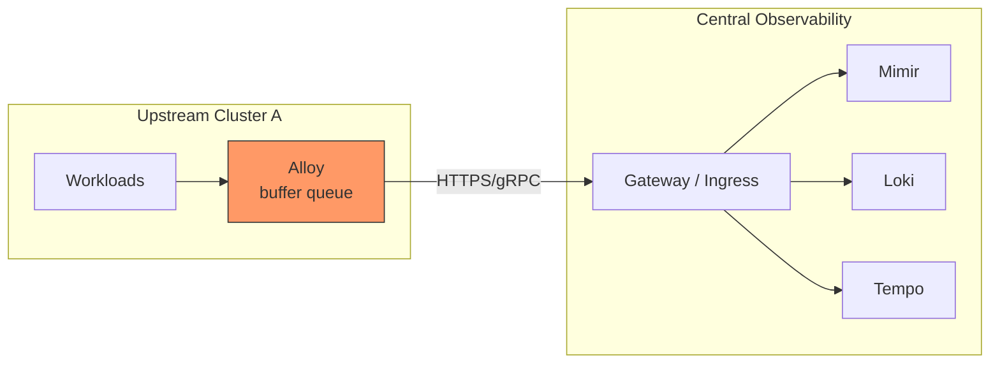

# Multi-Upstream Observability: Push-Forward Mode (Headless Upstreams)

> **Scope:** Design document for syncing observability data (metrics, logs, traces)
> from many tenant/upstream clusters into a central observability cluster.
>
> **Status:** Draft design for review
> **Relates to:** [ADR-0080](./adr/0080-adopt-push-forward-observability-federation.md) (proposed)

---

## 1. Problem

The central observability cluster (LGTM — Loki, Grafana, Tempo, Mimir) currently
ingests telemetry **only from its own cluster**. Components running outside this
cluster — such as:

- A home GPU cluster running model-serving workloads
- Future tenant clusters as teams are onboarded

have **no path** to push metrics, logs, or traces into the central stores.
As documented in [docs/observability-gaps.md](./observability-gaps.md):

> "Model-serving on the home GPU cluster … has no path into this Mimir yet —
> blocked on a remote-write/federation decision (needs its own ADR)."

The central stores (Mimir, Loki, Tempo) are deployed as ClusterIP-only Services
behind Cilium. The central Alloy DaemonSet is the only telemetry pipeline.
This document defines the federation strategy so onboarding new clusters follows
a repeatable, documented process.

---

## 2. The Approach — Push-Forward Mode (Headless Upstreams)

### Concept

Upstream (tenant) clusters **do not store observability data locally**. Their
Alloy collector (or equivalent agent) acts as a **buffer queue** that immediately
streams every piece of telemetry out over HTTPS/gRPC directly into the central
cluster’s ingress endpoints.



### How it works

Upstream elements act as **buffer queues**:

- **Metrics:** upstream Alloy’s `prometheus.remote_write` pushes immediately
  to central Mimir via its `/api/v1/push` HTTP endpoint. A WAL on disk buffers
  data if the central cluster is unreachable.
- **Logs:** upstream Alloy continuously tails containers and streams them out
  to central Loki via its Push API (`/loki/api/v1/push`). A disk-backed queue
  retries on failure.
- **Traces:** upstream Alloy receives OTLP spans and exports them over gRPC
  to central Tempo (`:4317`). Traces are buffered in memory only.

### The three alternative approaches

#### A. Push-Forward Mode (Headless Upstreams)
Upstream clusters run a collector (Alloy) that continuously pushes telemetry
to the central cluster over HTTPS/gRPC. **No local storage** — the collector
buffers in a WAL or disk-backed queue only to survive transient central outages.
Data arrives near-real-time, but a prolonged central outage means data loss
for traces (in-memory buffer) and partial loss for metrics/logs (disk buffers
eventually fill).

#### B. Pull / Federation
The central cluster scrapes or federates from upstream Prometheus servers
(e.g., Prometheus federate endpoint or Thanos sidecar). Upstreams store data
locally first. The central cluster controls the scrape cadence. **No data loss**
on central outage (data persists upstream), but adds operational complexity
(each upstream needs a reachable endpoint, TLS, auth) and the pull model
introduces a delay between data generation and availability.

#### C. Local Store + Replicate
Each upstream runs a full observability stack (Prometheus/Loki/Tempo) with
long retention, and periodically ships a copy to the central cluster (e.g.,
Thanos objstore, Loki batch upload). **Zero data loss** even on extended
central outages, but at the cost of running and maintaining storage on every
upstream — multiplicatively expensive at our scale.

### Comparison

| Mode | Storage on upstream | Latency | Complexity | Data loss on central outage | Operational cost |
|---|---|---|---|---|---|
| **A. Push-Forward** | None (buffer only) | Near-real-time | Low | Metrics/Logs: hours of buffer; Traces: dropped on restart | Low |
| **B. Pull / Federation** | Full local retention | Scrape-interval delay | Medium | No loss | Medium |
| **C. Local Store + Replicate** | Full local retention | High (batch) | Very high | No loss | High |

### Decision: Push-Forward Mode

We choose **Push-Forward Mode (A)** because:

1. **Fit to scale:** the clusters are small enough that the operational
   simplicity of a stateless upstream outweighs the data-loss risk on extended
   central outage. Running full local storage on every upstream (C) would be
   disproportionate overhead.
2. **Single direction of data flow** — upstream pushes, central ingests —
   reduces failure modes and makes debugging straightforward (everything is
   a `curl` or `grpcurl` away).
3. **Alloy already known and deployed** in the central cluster; reusing the
   same component on upstreams keeps the team’s cognitive load low.
4. **Data-loss risk is manageable:** metrics and logs survive hours of central
   outage via disk-backed WAL/queues. Traces are the lowest-value signal and
   their loss on restart is acceptable (30-day retention already generous).

Mode B (Pull) may become relevant later if we need cross-cluster PromQL querying
(Stage 3 in §10), but it adds TLS and reachability concerns for every upstream
endpoint today.


## 3. Per-Signal Mechanisms

### 3.1 Metrics → Mimir

**Mechanism:** `prometheus.remote_write` from upstream Alloy to central Mimir's
HTTP API (`/api/v1/push`).

**Upstream Alloy River config (component):**

```river
prometheus.remote_write "central_mimir" {
  endpoint {
    url = "https://mimir.observability.ai.camer.digital/api/v1/push"

    basic_auth {
      username = env("MIMIR_REMOTE_WRITE_USER")
      password = env("MIMIR_REMOTE_WRITE_PASS")
    }

    tls {
      ca_file   = "/etc/alloy/mimir-ca.pem"
      cert_file = "/etc/alloy/mimir-cert.pem"
      key_file  = "/etc/alloy/mimir-key.pem"
    }
  }

  // Buffer on disk to survive short central outages.
  // Defaults to 10 GiB; tune per upstream cluster based on volume.
  wal {
    truncate_frequency = "1m"
  }

  external_labels = {
    cluster   = env("CLUSTER_NAME"),
    tenant_id = env("TENANT_ID"),
  }
}
```

**Key properties:**
- WAL buffers metrics to disk — survives central outages up to buffer capacity
- `external_labels` stamps `cluster` and `tenant_id` at the edge, before any
  transform or filter stage
- Mimir receives the data identically to local data — no Mimir-side changes needed

### 3.2 Logs → Loki

**Mechanism:** `loki.write` from upstream Alloy to central Loki's Push API
(`/loki/api/v1/push`).

**Upstream Alloy River config (component):**

```river
loki.write "central_loki" {
  endpoint {
    url = "https://loki.observability.ai.camer.digital/loki/api/v1/push"

    basic_auth {
      username = env("LOKI_PUSH_USER")
      password = env("LOKI_PUSH_PASS")
    }

    tls {
      ca_file   = "/etc/alloy/loki-ca.pem"
      cert_file = "/etc/alloy/loki-cert.pem"
      key_file  = "/etc/alloy/loki-key.pem"
    }
  }

  // Disk-backed queue: retries on transient failure.
  encoding = "json"
}
```

**Key properties:**
- Disk-backed retry queue — does not drop logs on transient central outage
- Use `loki.process` blocks to add `cluster` and `tenant_id` as log labels
  before they leave the upstream cluster
- Loki's multi-tenancy remains disabled (`auth_enabled: false`); isolation is
  label-based

### 3.3 Traces → Tempo

**Mechanism:** `otlp.exporter` from upstream Alloy to central Tempo's OTLP
gRPC endpoint (`:4317`).

**Upstream Alloy River config (component):**

```river
otelcol.exporter.otlp "central_tempo" {
  client {
    endpoint = "tempo.observability.ai.camer.digital"

    tls {
      ca_file   = "/etc/alloy/tempo-ca.pem"
      cert_file = "/etc/alloy/tempo-cert.pem"
      key_file  = "/etc/alloy/tempo-key.pem"
      insecure             = false
      insecure_skip_verify = false
    }
  }
}
```

Wire trace pipeline:
`otelcol.receiver.otlp.default → otelcol.processor.batch → otelcol.exporter.otlp.central_tempo`

**Key properties:**
- Traces flow over gRPC (port 4317) — ensure central Ingress supports HTTP/2
- The `batch` processor is essential: Tempo is optimised for batched trace pushes
- Traces are queued in-memory only (OTel exporter has no disk-backed queue) —
  on long upstream outage, in-flight traces are dropped. This is acceptable
  for traces (30-day retention is already generous; traces are the highest-volume,
  lowest-per-unit-value signal)

## 4. Central Cluster Ingress Changes

### Current state

All three stores are deployed as ClusterIP Services -- no external ingress exists.
They are only reachable from within the `observability` namespace.

### Required changes

#### 4.1 Expose each store via Ingress

```yaml
# Ingress for Mimir
apiVersion: networking.k8s.io/v1
kind: Ingress
metadata:
  name: mimir-ingress
  namespace: observability
  annotations:
    # TLS cert managed via deps overlay Certificate (ADR-0018 pattern)
spec:
  ingressClassName: traefik
  tls:
    - hosts:
        - mimir.observability.ai.camer.digital
      secretName: mimir-ingress-tls
  rules:
    - host: mimir.observability.ai.camer.digital
      http:
        paths:
          - path: /api/v1/push
            pathType: Prefix
            backend:
              service:
                name: mimir
                port:
                  number: 8080
```

Repeat for:

| Store | Hostname | Path | Service Port |
|---|---|---|---|
| **Loki** | `loki.observability.ai.camer.digital` | `/loki/api/v1/push` | loki:3100 |
| **Tempo** | `tempo.observability.ai.camer.digital` | gRPC | tempo:4317 |

> **gRPC note:** Traefik handles HTTP/2 natively. For gRPC (Tempo) use
> `traefik.ingress.kubernetes.io/service.serversscheme: "h2c"`.
> For multiple upstream clusters, consider a dedicated Envoy proxy in front
> of Tempo for OTLP/gRPC ingress.

#### 4.2 CiliumNetworkPolicy -- allow external push traffic

The central cluster runs Cilium with `default-deny-egress` (CLAUDE.md gotcha).
The Ingress controller already has broad egress allow. **For the stores
themselves**, allow ingress from the Ingress controller:

```yaml
apiVersion: cilium.io/v2
kind: CiliumNetworkPolicy
metadata:
  name: allow-ingress-from-world
  namespace: observability
spec:
  endpointSelector:
    matchLabels:
      app.kubernetes.io/instance: mimir  # also: loki, tempo
  ingress:
    - fromEndpoints:
        - matchLabels:
            app.kubernetes.io/name: traefik
      toPorts:
        - ports:
            - port: "8080"   # or 3100 for Loki, 4317 for Tempo
              protocol: TCP
```

> **Cilium gotcha:** Match the Ingress controller with `fromEndpoints`. Use a
> CiliumNetworkPolicy, NOT a plain Kubernetes `NetworkPolicy` with `ipBlock`.
> Cilium's `default-deny-egress` baseline is enforced at the Cilium layer;
> a k8s NetworkPolicy does not override it.

#### 4.3 No store-side config changes (yet)

- Mimir stays `multitenancy_enabled: false`
- Loki stays `auth_enabled: false`
- Tempo stays as-is

All tenant isolation is handled via label-stamping at the upstream edge.

---

## 5. Authentication & Security

Three options, ordered by preference:

### Option A: mTLS (recommended for production)

Reuse the cluster's existing self-signed CA (see [architecture/06-networking-tls.md](./architecture/06-networking-tls.md#tls-issuance) — the  ClusterIssuer for internal TLS). Issue per-upstream certificates:

- Each upstream gets a unique client cert for each store endpoint
- Validate the client certificate at the Ingress level (nginx
  `nginx.ingress.kubernetes.io/auth-tls-*` annotations)
- Alloy on the upstream mounts the cert+key via a Kubernetes Secret

**Pros:** Strong identity per upstream, no shared secrets, no password rotation.
**Cons:** More complex initial setup, cert rotation overhead.

### Option B: HTTP Basic Auth (simpler stepping stone)

Static credentials per upstream, stored in Kubernetes Secrets, injected as
environment variables into upstream Alloy (`env("MIMIR_REMOTE_WRITE_USER")`,
etc.).

**Pros:** Dead simple to set up, matches the River config examples in this doc.
**Cons:** Shared static secret per upstream; rotation requires coordination.

### Option C: No auth (not recommended)

Only acceptable in an air-gapped or VPC-isolated network where all upstream
clusters are on the same private network as the central cluster, behind a
firewall.

**Recommendation:** Start with **Basic Auth** for the PoC (home GPU cluster),
migrate to **mTLS** before onboarding a second production upstream.

## 6. Tenant Isolation -- Label-Based

### Design

At our current scale (the clusters are small enough), native multi-tenancy does not
justify the operational complexity:

- Mimir's `multitenancy_enabled: true` requires every push to carry an
  `X-Scope-OrgID` header, and every query to specify it
- Grafana would need per-tenant data-source configuration
- All queries, dashboards, and alert rules must be tenant-aware

Instead, **label-based isolation** is used:

| Label | Value | Set by |
|---|---|---|
| `cluster` | Unique name (e.g., `home-gpu`, `prod-eu-1`) | upstream Alloy `external_labels` |
| `tenant_id` | Tenant ID (e.g., `adorsys`, `team-ml`) | upstream Alloy `external_labels` |

### How it works

1. Every upstream Alloy stamps both labels on every metric/log/trace before forwarding
2. In Grafana, queries can be scoped by `cluster` or `tenant_id`
3. Dashboards are parameterised with a `cluster` variable
4. Alert rules can include label matchers (e.g., `cluster="home-gpu"`)

### Risk: data mixing

> If upstream Alloy is misconfigured and does not stamp the correct `cluster`
> label, its data mixes with data from other clusters.

**Mitigations:**
1. The upstream Alloy River config is **templated** -- operators only provide
   `CLUSTER_NAME` and `TENANT_ID` as env vars; the `external_labels` stanza
   is not hand-edited
2. Post-deployment verification queries check that every metric has a `cluster` label
3. The onboarding checklist includes a manual `cluster` label audit

### Future: native multi-tenancy

If we ever need per-tenant rate limiting, quota enforcement, per-tenant retention,
or regulatory isolation -- the upgrade path is:

1. Flip `multitenancy_enabled: true` in Mimir, `auth_enabled: true` in Loki
2. Add an `x-scope-orgid` metadata stage in upstream Alloy
3. Update Grafana data-sources

No architectural overhaul.

---

## 7. Onboarding a New Upstream

### What lives where

| Artifact | Repo | File / Location |
|---|---|---|
| Upstream Alloy values | `ai-helm-values` | `environments/<env>/values/alloy-<cluster>.yaml` |
| Central Ingress rules | `ai-helm` | `charts/observability/` or new `templates/` |
| TLS certs / CA | `ai-helm-values` (secrets) | Managed by cert-manager / External Secrets |
| Basic auth credentials | `ssegning-aws` (or Vault) | Secret store, pushed by External Secrets |
| Dashboards | `ai-helm` | `tools/dashboards/` → dashboards as code |

### Standard operating procedure

1. **Provision credentials** -- generate basic auth user/pass or mTLS cert for
   the upstream; store in the central cluster's External Secret source
2. **Deploy headless Alloy** -- add an `alloy-<cluster>` values file in
   `ai-helm-values`; the upstream gets its own Alloy that reads local
   ServiceMonitors/PodMonitors and forwards via remote_write; no local store
   dependencies
3. **Expose central Ingress** -- ensure the central Ingress rules exist for Mimir,
   Loki, Tempo
4. **Verify connectivity** -- from the upstream cluster, run the verification
   commands
5. **Add dashboards** -- parameterise existing dashboards with `cluster` variable;
   add to the dashboards-as-code pipeline (`tools/dashboards/`)

## 8. Verification

### Pre-flight: upstream can reach central ingress

```bash
# From the upstream cluster
curl -v https://mimir.observability.ai.camer.digital/api/v1/push
# Expect: 401 (auth enabled) or 404 (no auth -- Mimir returns
# "not found" for GET /api/v1/push, which is expected)
```

### After Alloy is deployed and forwarding

```bash
# 1. Confirm metrics arrive with correct cluster label
kubectl exec -n observability deploy/mimir -- /bin/mimir   -query=/api/v1/query --param='query=count({cluster="home-gpu"})'
# Expect: non-zero count

# 2. Spot-check a specific metric from the upstream
kubectl exec -n observability deploy/mimir -- /bin/mimir   -query=/api/v1/query --param='query=up{cluster="home-gpu"}'
# Expect: values for upstream targets

# 3. Verify no metric lacks a cluster label
kubectl exec -n observability deploy/mimir -- /bin/mimir   -query=/api/v1/query --param='query=up{cluster=""}'
# Expect: empty result (no data without cluster label)

# 4. Logs: check Loki label values
kubectl exec -n observability deploy/loki -- /bin/loki   -query=/loki/api/v1/label/cluster/values
# Expect: includes "home-gpu"
```

### PoC target: home GPU cluster → central Mimir

The first upstream to connect is the **home GPU cluster** (the gap from
`observability-gaps.md`). Success criteria:

- [ ] `cluster="home-gpu"` appears in Mimir label values
- [ ] `llama-server_*` metrics from the GPU cluster are queryable in Grafana
- [ ] No metric from the GPU cluster appears without a `cluster` label
- [ ] Central cluster's own metrics remain unaffected
- [ ] WAL replay survives a 5-minute central network disconnect

---

## 9. Limitations & Trade-offs

| Concern | Impact | Mitigation |
|---|---|---|
| Data loss on extended central outage | Metrics: WAL survives ~hours. Logs: disk queue survives ~hours. Traces: dropped on restart | PagerDuty on central store health; traces are lowest priority |
| Bandwidth cost (same-region Hetzner) | Negligible intra-datacenter; cross-region could add cost | Keep upstream clusters in same DC as central |
| Single point of failure | Central cluster outage = total observability loss | Multi-AZ central cluster; DR plan (future) |
| Label cardinality explosion | `cluster` label adds 1 per upstream; ok at ≤10 | Review cardinality monitoring; prune inactive clusters |
| No tenant isolation on storage | One bucket space shared by all upstreams | Prefix isolation already exists (blocks/, loki/, tempo/); add cluster/ prefix if desired |
| Auth credential rotation | Manual for basic auth; automated for mTLS | Adopt mTLS after PoC |

---

## 10. Future Evolution

| Stage | What | When |
|---|---|---|
| **Stage 0** (now) | Central cluster only; no federation | Present |
| **Stage 1** (this doc) | Push-Forward from upstream clusters via Alloy | First upstream onboarded |
| **Stage 2** | Native multi-tenancy (X-Scope-OrgID) | >10 clusters or regulatory need |
| **Stage 3** | Pull/federation for cross-cluster Prometheus queries | Advanced use-cases |
| **Stage 4** | Agent gateway (single ingress point, tenant routing) | Operational scaling need |

---

## Related

- [docs/architecture/08-observability.md](./architecture/08-observability.md) -- current pipeline diagram
- [docs/observability-stack.md](./observability-stack.md) -- LGTM deployment guide
- [docs/observability-storage-retention.md](./observability-storage-retention.md) -- store config & retention
- [docs/observability-gaps.md](./observability-gaps.md) -- gap inventory (source of this ticket)
- [docs/alloy-servicemonitor-guide.md](./alloy-servicemonitor-guide.md) -- Phase 2 preview mentions external cluster
- [CLAUDE.md](../CLAUDE.md) -- cluster gotchas (Cilium, Alloy egress, memberlist)
- [ADR-0080](./adr/0080-adopt-push-forward-observability-federation.md) -- corresponding ADR for the federation decision
- [architecture/06-networking-tls.md](./architecture/06-networking-tls.md#tls-issuance) -- TLS issuance (cert-home-cert-http ClusterIssuer + self-signed-ca for internal)
