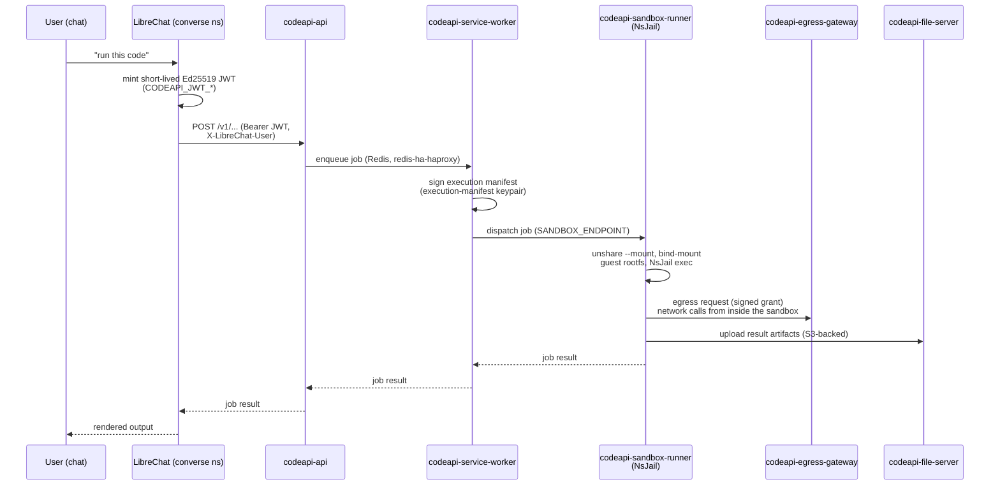

# Self-Hosted LibreChat Code Interpreter

The *why* is [ADR-0122](../adr/0122-self-hosted-code-interpreter.md). This is
the *how*: what to generate before the first deploy, what to verify once it's
live, and how to change/rotate things afterward.

## What this is

`charts/librechat-code-interpreter` re-implements
[`clickhouse/code-interpreter`](https://github.com/clickhouse/code-interpreter)'s
design — the open-source sandboxed code-execution service behind LibreChat's
Code Interpreter agent capability — on `bjw-template` (this repo's standard
app-scaffolding chart, repo convention), not upstream's own `helm/codeapi`
chart. It replaces the managed librechat.ai API (issue #734) as the backend
for `execute_code`. Six controllers (api, service-worker, sandbox-runner,
file-server, tool-call-server, egress-gateway) plus a `package-init` hook Job
in the dedicated `librechat-sandbox` namespace on `home-remote`, deployed as
a flat `charts/apps` app (not a `librechart` child — see the ADR for why).

**Images are not upstream's** — `clickhouse/code-interpreter` publishes none
(its own CI only validates the Dockerfiles build, never pushes). This chart
pulls from [`ADORSYS-GIS/code-interpreter`](https://github.com/ADORSYS-GIS/code-interpreter),
a fork with its own `publish-images.yml` workflow building the 7 images
(`code-interpreter-{api,worker,tool-call-server,egress-gateway,file-server,
sandbox-runner,package-init}`) to `ghcr.io/adorsys-gis/code-interpreter-*` on
every push to its `main`. Chart image tags are pinned to a commit SHA
(`sha-<short-sha>`), not `latest` — bump them deliberately when the fork
publishes a new build.

## How it's wired



`tool-call-server` sits alongside as an additional callback surface for
long-running/streaming tool calls; not shown above for clarity. Every
controller's env in `charts/librechat-code-interpreter/values.yaml` maps
directly onto this flow — `SANDBOX_ENDPOINT`, `EGRESS_GATEWAY_URL`,
`FILE_SERVER_URL`, `TOOL_CALL_SERVER_URL` are literally these arrows.

**Two separate JWT/keypair boundaries, easy to conflate:**

1. **LibreChat ↔ codeapi `api`** — the `CODEAPI_JWT_*` Ed25519 keypair
   (§ below, item 4). LibreChat signs, `api` verifies. This is the outer
   "are you allowed to use this service at all" boundary.
2. **`service-worker` ↔ `sandbox-runner`** — the *execution-manifest*
   Ed25519 keypair (item 3). `service-worker` signs a manifest describing
   exactly what a given job is allowed to do (packages, egress budget,
   timeouts); `sandbox-runner` verifies it before running anything. This
   is the inner "is this specific job's manifest genuine" boundary,
   scoped per-execution, not per-user.

**Inside `sandbox-runner`, one process per job.** `start-direct-sandbox.sh`
(the container entrypoint) does the heavy lifting once at container start
— `unshare --mount` into a private mount namespace, bind-mount the guest
rootfs (a Debian tree baked into the image, `$ROOTFS`) over `/usr/{sbin,
lib,lib64,local,bin}`, run an NsJail smoke test, then `exec
/sandbox_api/entrypoint.sh` (the actual Node/Bun sandbox API). **Every
sandboxed job execution after that goes through NsJail itself** — the
`unshare`/bind-mount dance only happens once, to assemble the environment
NsJail's own per-job sandboxing runs inside.

## One-time setup: generate and store the secrets

Every property below must exist in `ssegning-aws` **before** the app first
syncs, or the `codeapi-secrets` / `librechat-codeapi-jwt` ExternalSecrets sit
in `SecretSyncedError` and every codeapi pod (and JWT-signing on the LibreChat
side) fails. All go under the consolidated app secret
`ai/camer/digital/prod/env` unless noted otherwise.

```bash
# 1. Internal service-to-service token (any component ↔ any component auth).
openssl rand -hex 32
# → librechat_codeapi_internal_service_token

# 2. Egress-gateway encrypted-grant secret (≥32 bytes).
openssl rand -hex 32
# → librechat_codeapi_egress_grant_secret

# 3. Execution-manifest Ed25519 keypair (service-worker signs, sandbox-runner
#    verifies). Chart wants base64-encoded DER for both halves.
openssl genpkey -algorithm ed25519 -out /tmp/exec-manifest.pem
openssl pkey -in /tmp/exec-manifest.pem -pubout -out /tmp/exec-manifest.pub.pem
openssl pkey -in /tmp/exec-manifest.pem -outform DER | base64 -w0
# → librechat_codeapi_execution_manifest_private_key
openssl pkey -in /tmp/exec-manifest.pem -pubout -outform DER | base64 -w0
# → librechat_codeapi_execution_manifest_public_key

# 4. Code-API JWT auth keypair (LibreChat signs, codeapi verifies) — a
#    DIFFERENT keypair from #3. PEM (not DER) for the private half — LibreChat
#    reads CODEAPI_JWT_PRIVATE_KEY_BASE64 as base64(PEM).
openssl genpkey -algorithm ed25519 -out /tmp/codeapi-jwt.pem
openssl pkey -in /tmp/codeapi-jwt.pem -pubout -out /tmp/codeapi-jwt.pub.pem
base64 -w0 /tmp/codeapi-jwt.pem
# → librechat_codeapi_jwt_private_key_base64  (librechat-app's secret)
cat /tmp/codeapi-jwt.pub.pem
# → librechat_codeapi_jwt_public_key  (codeapi's secret; PEM, not base64 —
#   CODEAPI_JWT_PUBLIC_KEY accepts PEM directly)

rm -f /tmp/exec-manifest*.pem /tmp/codeapi-jwt*.pem
```

Redis and S3 reuse **existing** properties (no new generation needed) — see
`codeApiSecrets.remoteRefs` in `charts/librechat-code-interpreter/values.yaml`
for the exact property names (`redis_password`, `s3_backup_cnpg_client_id`,
`s3_backup_cnpg_secret` — all in `prod/meta/test-app`, the platform secret
every redis-ha/S3 consumer already reads from).

**`CODEAPI_JWT_KID` must match on both sides** — the chart default
(`lc-codeapi-2026-05`, matching LibreChat's own compiled-in default) is used
on both `charts/librechat-code-interpreter` (the `api` controller's `env`)
and `charts/librechat-app` (`CODEAPI_JWT_KID` env). If you ever rotate the JWT
keypair, bump the kid on **both** sides in the same change, or the old kid's
verifier key stays cached (`CODEAPI_JWT_KEY_CACHE_TTL_SECONDS`, default 30s)
and new tokens fail `unknown_kid` until it expires.

## Verifying a fresh install

```bash
# ExternalSecrets synced?
kubectl -n librechat-sandbox get externalsecret codeapi-secrets -o jsonpath='{.status.conditions}'
kubectl -n converse get externalsecret librechat-codeapi-jwt -o jsonpath='{.status.conditions}'

# Package-init Job completed (populates the NsJail runtime PVC)?
kubectl -n librechat-sandbox get job codeapi-package-init
kubectl -n librechat-sandbox logs job/codeapi-package-init

# All pods Running?
kubectl -n librechat-sandbox get pods

# API healthy from in-cluster?
kubectl -n librechat-sandbox run -it --rm curl --image=curlimages/curl --restart=Never -- \
  curl -s http://codeapi-api.librechat-sandbox.svc.cluster.local:3112/v1/health
```

Then in LibreChat: start a chat on an agent with Code Interpreter enabled
("Converse" — the default persona — has `executeCode: true`) and ask it to
run a trivial snippet (`print("hello")`). A 401 on the LibreChat side usually
means the JWT keypair/kid mismatch above; a `SecretSyncedError` means a
missing `ssegning-aws` property; a pod stuck `Pending` on the packages PVC
means no storage class bound (see the ADR's RWO-storage note).

## Known limitations of the current deploy (see the ADR for the trade-offs)

- **NsJail/chroot sandbox mode**, not the safer KVM microVM mode — no
  confirmed `/dev/kvm` on `home-remote` worker nodes. sandbox-runner's
  container `securityContext` (the `SYS_ADMIN` capability list) is what would
  need to change to move to KVM mode; there's no simple flag for it in this
  chart today (it wasn't built with a KVM path at all — the previous revision
  vendored upstream's own KVM/NsJail toggle, this one doesn't). Revisit if
  `/dev/kvm` is ever confirmed on a node pool — likely worth a fresh design
  pass rather than a values tweak.
- **`api`/`service-worker`/`sandbox-runner` pinned to 1 replica each** — the
  packages PVC is ReadWriteOnce and `home-remote`'s general nodes have no RWX
  storage class (Longhorn is GPU-node-scoped, ADR-0092). Scaling
  `sandbox-runner` past 1 needs either an RWX-capable storage class or
  `nodeSelector`/`affinity` pinning every replica to one node.
- **File-server shares LibreChat's own S3 bucket root** (`ssegning-k8s-state`)
  — the service has no key-prefix knob. Low collision risk (both use opaque
  random keys) but not a hard guarantee; point the `file-server` controller's
  `MINIO_BUCKET` env at a dedicated bucket if that ever matters.
- **Redis TLS is encrypted but not CA-verified** — `REDIS_TLS=true` maps to
  `tls.rejectUnauthorized: false` in this service's own Redis client; there's
  no CA-verification knob like `librechat-app`'s `rediss://`+`REDIS_CA`.
  Accepted for now (redis-ha is in-cluster only, no public exposure); would
  need an upstream patch to fix properly.

## Bumping the image version

Push to `main` on [`ADORSYS-GIS/code-interpreter`](https://github.com/ADORSYS-GIS/code-interpreter)
(e.g. merging an upstream sync PR) to publish new `sha-<short-sha>`-tagged
images, then bump every `tag:` in `charts/librechat-code-interpreter/values.yaml`
to the new SHA and `helm template` to confirm nothing else changed shape
(env var names, ports, probe paths) before merging. As of this writing the
fleet is pinned to `sha-d3b0f05` — see the live-incident log below before
bumping past it; several of those commits fix real bugs in `sandbox-runner`'s
startup, not upstream feature work.

## Live-incident log (first deploy, 2026-08-09/10)

The first real deploy — after #941 merged and the maintainer generated the
`ssegning-aws` secrets — needed six follow-up fixes before every pod came up
healthy. Recorded here because most of these are non-obvious and would bite
again on a from-scratch redeploy or a naive image bump. Chronological:

1. **ArgoCD `Replace=true` vs. immutable PVC/Job fields** ([#951](https://github.com/ADORSYS-GIS/ai-helm/pull/951)/[#952](https://github.com/ADORSYS-GIS/ai-helm/pull/952)).
   The repo-wide default `syncPolicy` uses `Replace=true` (`kubectl
   replace`, not `apply`). Once the `packages` PVC is `Bound` or the
   `package-init` Job's pod exists, both develop server-populated
   immutable fields — every subsequent sync then fails forever with `spec
   is immutable` / `field is immutable`, even though the workload itself
   is healthy. A per-resource `argocd.argoproj.io/sync-options:
   Replace=false` annotation does **not** work for `Replace` (unlike
   `Prune`/`Validate`, it isn't resource-level-overridable in this ArgoCD
   version — confirmed by testing it). Fixed with a `syncPolicy` override
   on this app's `charts/apps/values.yaml` entry instead (drops
   `Replace=true`, keeps `CreateNamespace=true` + `ServerSideApply=true` +
   `automated.prune/selfHeal`).
2. **`sandbox-runner` needs `appArmorProfile: Unconfined`** ([#962](https://github.com/ADORSYS-GIS/ai-helm/pull/962)).
   Without an explicit `appArmorProfile`, the kubelet (native AppArmor
   field, GA since 1.30) defaults new containers to `RuntimeDefault` on an
   AppArmor-enabled node (Ubuntu 24.04). That profile blocks the
   mount-propagation syscall NsJail needs at startup even with `SYS_ADMIN`
   granted — `seccompProfile: Unconfined` (already set) only disables
   seccomp filtering, AppArmor is a separate, independently-enforced LSM.
   Symptom: `unshare: cannot change root filesystem propagation:
   Permission denied`.
3. **`REDIS_HOST` was a nonexistent hybrid hostname** ([#963](https://github.com/ADORSYS-GIS/ai-helm/pull/963)).
   Written as `redis-ha-redis-haproxy...` — a typo transposing the two
   real `redis-system` Services (`redis-ha-redis`, `redis-ha-haproxy`).
   Fixed to `redis-ha-haproxy` specifically (not the round-robin
   `redis-ha-redis`), matching the durable fix `librechat-app` already
   needed for its own Redis connection: `redis-ha-redis` load-balances
   master+replica, so a write connection lands on the read-only replica
   ~50% of the time.
4. **Upstream bash command-hashing bugs in `start-direct-sandbox.sh`**
   ([#964](https://github.com/ADORSYS-GIS/ai-helm/pull/964)/[#965](https://github.com/ADORSYS-GIS/ai-helm/pull/965),
   [ADORSYS-GIS/code-interpreter@1d37e37](https://github.com/ADORSYS-GIS/code-interpreter/commit/1d37e37c5bc6b194309b400ceb55d312b77cdd49)).
   The script bind-mounts the guest rootfs's `/usr/sbin` over the
   container's own `/usr/sbin` as its first step, then keeps calling bare
   `mount` for every later bind. Bash caches a bare command's resolved
   path and does not re-search `$PATH` on later calls — once the bind
   replaces `/usr/sbin`'s content, the cached `mount` path breaks. A first
   attempt (pin `mount`'s path to a variable) does **not** work either — a
   bind-mount replaces file content at a path system-wide, not just
   bash's belief about where it lives. Real fix: copy `mount` and its
   full shared-library closure (`ldd`) to `/host-tools`, a path none of
   the binds ever touch, before the first bind runs.
5. **NsJail's smoke test swallowed its own error output** ([#966](https://github.com/ADORSYS-GIS/ai-helm/pull/966)).
   `api/src/entrypoint.sh`'s smoke test redirected nsjail's stdout/stderr
   to `/dev/null`, relying only on nsjail's `--log` file for diagnostics —
   which came back completely empty on the actual failure. Now captures
   and prints raw stdout/stderr too.
6. **`/usr/sbin` is a symlink to `/usr/bin` on the `fedora:43` base image**
   ([#967](https://github.com/ADORSYS-GIS/ai-helm/pull/967)/[#968](https://github.com/ADORSYS-GIS/ai-helm/pull/968),
   [@5d53fcc](https://github.com/ADORSYS-GIS/code-interpreter/commit/5d53fcc945b9184c4c6e5c5ed37cfe6682a76c5e)/[@d3b0f05](https://github.com/ADORSYS-GIS/code-interpreter/commit/d3b0f054c90936f3855c8a00169e22786787c2ba)).
   The root cause behind `nsjail` itself vanishing after the bind-mount
   sequence (`timeout: failed to run command '/usr/sbin/nsjail': No such
   file or directory`), confirmed by manually replaying each bind-mount
   step in a debug pod. `/usr/sbin -> bin` means binding the guest
   rootfs's `usr/sbin` onto `/usr/sbin` actually lands on `/usr/bin`; the
   later bind of the guest rootfs's own `usr/bin` then stacks on top and
   shadows it, hiding `nsjail` (which lives only in the guest rootfs's
   `usr/sbin`, a real, separate directory there). Fix: if `/usr/sbin` is a
   symlink, delete it and `mkdir` a real directory in its place, inside
   the private mount namespace, before binding — namespace-local, never
   touches the node. (The `mkdir` call itself then needed a `hash -r`
   between the `rm` and the `mkdir`, for the identical hashing reason as
   #4 — the fix briefly re-introduced the bug it was fixing.)

**If you're debugging a similar `sandbox-runner` failure**, the fastest path
is a throwaway debug pod using the same image with `command: ["sleep",
"3600"]` and a matching `securityContext` (including `appArmorProfile`), so
you can `kubectl exec` in and manually replay
`start-direct-sandbox.sh`'s `unshare --mount` sequence step by step,
checking file existence with `[ -f ... ]` after each bind (not `ls`, which
itself becomes unresolvable once `/usr/sbin` is bound over).
