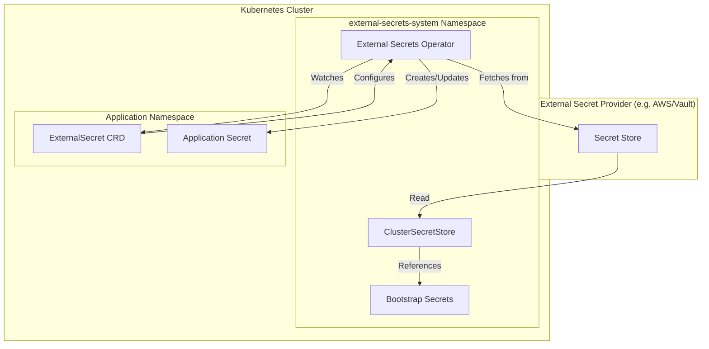

# Secret Management

This directory contains documentation for the External Secrets Operator (ESO) integration and secret management patterns used in the AI platform.

## Overview

The platform uses [External Secrets Operator](https://external-secrets.io/) to synchronize secrets from external secret management systems into Kubernetes secrets. This provides:

- **Centralized secret management**: Secrets are stored in a secure external system
- **GitOps-friendly**: No secrets stored in Git repositories
- **Automatic synchronization**: Secrets are kept in sync with external sources
- **Audit trail**: Changes to secrets are tracked

## Architecture



## Installation

External Secrets Operator is installed via ArgoCD using the official upstream Helm chart:

- **Chart**: `https://charts.external-secrets.io`
- **Version**: 0.14.0
- **Namespace**: `external-secrets-system`

See [`charts/apps/values.yaml`](../../charts/apps/values.yaml) for the ArgoCD Application configuration.

## Bootstrap Secrets

Bootstrap secrets are manually created secrets that must exist before the platform can be fully operational. These are "chicken-and-egg" secrets that cannot be managed by ESO itself.

### Required Bootstrap Secrets

| Secret Name | Namespace | Keys | Purpose |
|-------------|-----------|------|---------|
| `openai-api-key` | `external-secrets-system` | `api-key` | OpenAI API access |
| `gemini-api-key` | `external-secrets-system` | `api-key` | Google Gemini API access |
| `fireworks-api-key` | `external-secrets-system` | `api-key` | Fireworks AI API access |

### Creating Bootstrap Secrets

```bash
# Create the namespace
kubectl create namespace external-secrets-system

# Create API key secrets
kubectl create secret generic openai-api-key \
  --namespace=external-secrets-system \
  --from-literal=api-key=sk-...

kubectl create secret generic gemini-api-key \
  --namespace=external-secrets-system \
  --from-literal=api-key=...

kubectl create secret generic fireworks-api-key \
  --namespace=external-secrets-system \
  --from-literal=api-key=...
```

## Synchronized Secrets

Application secrets are synchronized from bootstrap secrets using `ExternalSecret` resources. See [`reference-patterns.md`](./reference-patterns.md) for examples.

### How It Works

1. **Bootstrap secrets** are manually created in `external-secrets-system` namespace
2. **ClusterSecretStore** provides access to bootstrap secrets across namespaces
3. **ExternalSecret** resources in application namespaces reference the ClusterSecretStore
4. **ESO controller** creates and syncs Kubernetes secrets from bootstrap secrets

## Documentation

- [`bootstrap-secrets-inventory.md`](./bootstrap-secrets-inventory.md) - Complete inventory of bootstrap secrets
- [`reference-patterns.md`](./reference-patterns.md) - Patterns for application secret synchronization

## Configuration Chart

Configuration is managed via the [`charts/external-secrets/`](../../charts/external-secrets/) Helm chart:

- `templates/rbac.yaml` - ServiceAccount and RBAC for ClusterSecretStore
- `templates/clustersecretstore.yaml` - ClusterSecretStore configuration
- `templates/externalsecrets.yaml` - ExternalSecret resources

### Adding New ExternalSecrets

To add a new ExternalSecret, edit [`charts/external-secrets/values.yaml`](../../charts/external-secrets/values.yaml):

```yaml
externalSecrets:
  my-api-key:
    namespace: my-app-namespace
    secretName: my-api-key
    refreshInterval: 1h
    data:
      - secretKey: api-key
        remoteRef:
          key: my-api-key
          namespace: external-secrets-system
          property: api-key
