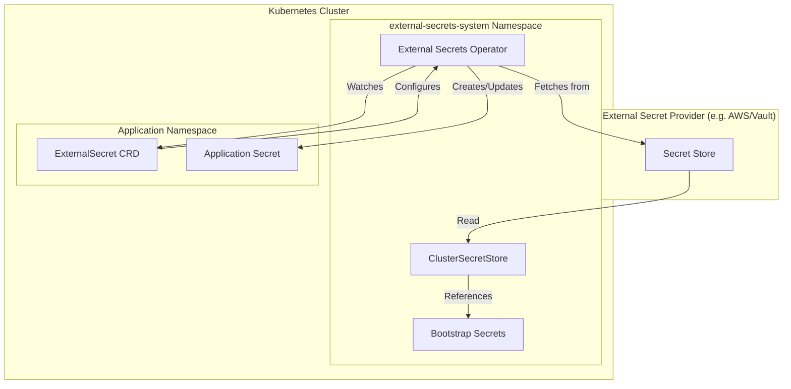

# Secret Management

This directory contains documentation for the External Secrets Operator (ESO) integration and secret management patterns used in the AI platform.

> **Note (ownership):** ESO itself — the operator (controller + CRDs)
> and the `ClusterSecretStore` (`ssegning-aws`) — is **provisioned
> externally**, not by this repo. The old in-repo `charts/external-secrets`
> (a Vault-based `bootstrap-secrets` store + operator install) was
> removed; it was never the store actually used. The patterns below
> still describe how ExternalSecrets are authored and referenced — just
> note the real store is `ssegning-aws` and the operator lives in the
> `external-secrets` namespace, both managed out-of-band.

## Overview

The platform uses [External Secrets Operator](https://external-secrets.io/) to synchronize secrets from external secret management systems into Kubernetes secrets. This provides:

- **Centralized secret management**: Secrets are stored in a secure external system
- **GitOps-friendly**: No secrets stored in Git repositories
- **Automatic synchronization**: Secrets are kept in sync with external sources
- **Audit trail**: Changes to secrets are tracked

## Architecture



## Installation

External Secrets Operator is installed via ArgoCD using the official upstream Helm chart:

- **Chart**: `https://charts.external-secrets.io`
- **Version**: 2.4.0
- **Namespace**: `external-secrets-system`

See [`charts/apps/values.yaml`](../../charts/apps/values.yaml) for the ArgoCD Application configuration.

## Bootstrap Secrets

Bootstrap secrets are manually created secrets that must exist before the platform can be fully operational. These are "chicken-and-egg" secrets that cannot be managed by ESO itself.

### Required Bootstrap Secrets

| Secret Name | Namespace | Keys | Purpose |
|-------------|-----------|------|---------|
| `openai-api-key` | `external-secrets-system` | `api-key` | OpenAI API access |
| `gemini-api-key` | `external-secrets-system` | `api-key` | Google Gemini API access |
| `fireworks-api-key-01` | `external-secrets-system` | `api-key` | Fireworks AI API access |

### Creating Bootstrap Secrets

```bash
# Create the namespace
kubectl create namespace external-secrets-system

# Create API key secrets
kubectl create secret generic openai-api-key \
  --namespace=external-secrets-system \
  --from-literal=api-key=sk-...

kubectl create secret generic gemini-api-key \
  --namespace=external-secrets-system \
  --from-literal=api-key=...

kubectl create secret generic fireworks-api-key-01 \
  --namespace=external-secrets-system \
  --from-literal=api-key=...
```

## Synchronized Secrets

Application secrets are synchronized from bootstrap secrets using `ExternalSecret` resources. See [`reference-patterns.md`](./reference-patterns.md) for examples.

### How It Works

1. **Bootstrap secrets** are manually created in `external-secrets-system` namespace
2. **ClusterSecretStore** provides access to bootstrap secrets across namespaces
3. **ExternalSecret** resources in application namespaces reference the ClusterSecretStore
4. **ESO controller** creates and syncs Kubernetes secrets from bootstrap secrets

## Documentation

- [`bootstrap-secrets-inventory.md`](./bootstrap-secrets-inventory.md) - Complete inventory of bootstrap secrets
- [`reference-patterns.md`](./reference-patterns.md) - Patterns for application secret synchronization

## Where the configuration lives

ESO and its `ClusterSecretStore` (`ssegning-aws`) are **not** in this
repo (see the ownership note at the top). The in-repo
`charts/external-secrets` chart was removed.

- **ClusterSecretStore** (`ssegning-aws`) — provisioned externally
  (cluster bootstrap / home-os). Cluster-scoped, so every namespace can
  reference it.
- **ExternalSecret CRs** — authored in `ai-ops-secrets.git` (synced by
  the `secrets` Application in `charts/apps/values.yaml`) and other
  external sources.

### Adding a new ExternalSecret

Add it to `ai-ops-secrets.git` (or the relevant external source),
referencing the `ssegning-aws` store. Shape:

```yaml
apiVersion: external-secrets.io/v1
kind: ExternalSecret
metadata:
  name: my-api-key
  namespace: my-app-namespace
spec:
  refreshInterval: 1h
  secretStoreRef:
    kind: ClusterSecretStore
    name: ssegning-aws
  target:
    name: my-api-key
    creationPolicy: Owner
  data:
    - secretKey: api-key
      remoteRef:
        key: prod/path/to/my-secret
        property: api-key
```
