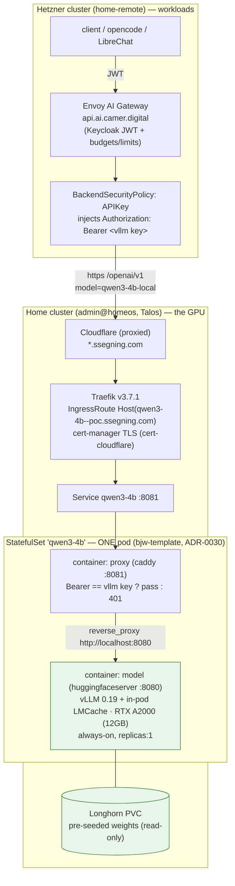

# Self-hosted model serving on the home GPU (vLLM + LMCache)

**This is the platform pattern for serving *any* self-hosted model or agent on the
home GPU**, plus the reference build for the first one. `charts/model-serving` is
the reusable chart; **Qwen3-4B is the reference deployment** documented in detail
throughout (§1–§13). The *why* of the pattern is
[ADR-0022](./adr/0022-self-hosted-gpu-model-federated-into-gateway.md) (federation
+ exposure), [ADR-0028](./adr/0028-owned-hardware-model-pricing.md) (how we price
owned-hardware models), and [ADR-0029](./adr/0029-self-hosted-model-plain-deployment.md)
(**serving mode: a plain Deployment, not KServe/Knative**). The *how* of adding the
**next** model is the checklist in **§14**.

> ⚠️ **Serving mode changed (ADR-0029 → ADR-0030, 2026-06-07).** Originally this
> used a **KServe `InferenceService` in Knative Serverless mode**; on a single
> *owned, dedicated* GPU that bought ~€3/mo of idle power while causing cold-start
> 504s and a blue-green rollout deadlock (two models can't share 12 GB). It's now
> a **single `StatefulSet` rendered via `bjw-template`** (ADR-0016) with **two
> containers in one pod** — the model server (huggingfaceserver, same image, so
> vLLM + LMCache are unchanged) **+ the Caddy auth-proxy as a sidecar**, which
> reaches the model over **`localhost`**. `replicas: 1` always-on; the StatefulSet
> rolling-update recreates the single pod (never two model containers on the GPU).
> Only the proxy's `:8081` is exposed (Service → IngressRoute); the model's
> `:8080` is pod-local. Mentions of "Knative", "InferenceService",
> "ServingRuntime", "scale-to-zero", "scale-from-zero", or a *separate proxy
> Deployment* in §1–§11 are **historical** unless in §11.4 — see ADR-0029/0030.

> **Reading order.** New here / want the as-built truth → **§11 "What actually
> shipped"** (real architecture, full tool+argument inventory,
> goods/averages/bads/caveats, backlog). Adding another model/agent → **§14
> checklist**. Model facts → **§12 model card**. Cost → **§13 cost model**.
> Everything in §1–§10 is the build narrative; the VRAM math, seed-PVC mechanics,
> and vLLM/LMCache flags there are all current.

> Status: **SHIPPED & serving (2026-06-07)** — Qwen3-4B answers completions
> end-to-end, including agentic **tool calling** (`--enable-auto-tool-choice
> --tool-call-parser hermes`, see §11.3/§14). ⚠️ **The exposure/security design in
> the older sections ("public FQDN + the vLLM API key is the sole gate") was
> REPLACED in production.** KServe's huggingfaceserver ignores `VLLM_API_KEY`, so
> that "sole gate" never existed — the model is now **cluster-local behind a Caddy
> auth-proxy** (§11.1). The model is no longer billed at $0: it carries
> **cost-recovery pricing** (ADR-0028, §13).

---

## 1. The picture

```
 USER ──TLS + Keycloak JWT──▶  HETZNER k3s  (home-remote, public)         HOME Talos (admin@homeos, GPU)
                              ┌─────────────────────────────┐            ┌──────────────────────────────────┐
                              │ core-gateway (Envoy AI GW)   │            │ KServe InferenceService (Knative) │
                              │  authz: Keycloak JWT (0021)  │  HTTPS     │  kserve/huggingfaceserver (vLLM)  │
                              │  AIServiceBackend vllm-local ─┼── +APIkey ─▶  + LMCache (in-pod, CPU offload)  │
                              │  rate-limit + token metering │  (public   │  Qwen3-4B · RTX A2000 12GB        │
                              │                              │   FQDN)    │  /openai/v1/chat/completions     │
                              └─────────────────────────────┘            └──────────────────────────────────┘
                                                                            exposed by Knative→Traefik→cert-mgr
                                                                            at qwen3-4b-<ns>--sls.ssegning.com
```

The model is, from the gateway's point of view, **identical to DeepInfra**: an
OpenAI-compatible FQDN over TLS with an API key. The only novelty is on the home
side (KServe/vLLM/LMCache on the GPU). The exposure is free — Knative already
mints a public, TLS-terminated FQDN.

### What's already live (do **not** re-create)

| Piece | Where | Note |
|---|---|---|
| KServe v0.17.0 | home, ns `kserve` | `kserve-crd` + `kserve-resources` apps (home-os `charts/cd`) |
| Knative Serving | home, ns `knative-serving` | Gateway-API ingress → Traefik `kube-system/traefik-gateway` |
| Domain + TLS | — | `sls.ssegning.com`; external issuer `cert-cloudflare` (publicly-trusted) |
| Knative feature flags | — | `podspec-runtimeclassname`, `podspec-nodeselector`, `podspec-persistent-volume-claim/-write` all **enabled** |
| GPU node | home | labelled `gpu-node: "true"`, `RuntimeClass nvidia`, nvidia-device-plugin |
| Gateway + ADR-0021 policy | Hetzner | JWT auth, per-user/org rate limits, token metering |

---

## 2. Model & VRAM budget (RTX A2000, 12 GB, Ampere)

**Ampere has no hardware FP8** — do not deploy FP8 checkpoints. Use **BF16/FP16**
(launch) or **AWQ-INT4 + Marlin** (optimization).

`Qwen/Qwen3-4B`, BF16, on a 12 GB card at `--gpu-memory-utilization 0.90`
(≈10.8 GB usable):

| Consumer | ~VRAM |
|---|---|
| Weights (BF16, 4B) | ~8.0 GB |
| Activations + non-torch overhead (with `--enforce-eager`, no CUDA-graph capture) | ~1.0 GB |
| **KV cache (remainder, on-GPU)** | **~1.5–2 GB** |

That on-GPU KV is thin — which is exactly what **LMCache** fixes: it offloads KV
to **CPU DRAM** (`LMCACHE_LOCAL_CPU=True`, `LMCACHE_MAX_LOCAL_CPU_SIZE=5` GB),
extending the effective cache far past HBM and giving **prefix reuse** across
requests (repeated system prompts, RAG context, multi-turn history skip prefill).
`--kv-cache-dtype fp8` halves KV *storage* (a memory format, not FP8 compute — fine
on Ampere).

**Launch config (trustworthy, official weights):** BF16, `--max-model-len 16384`,
`--max-num-seqs 4`, `--enforce-eager`, LMCache CPU offload.
**Later optimization:** swap to a *vetted* community `Qwen3-4B` AWQ-INT4 (~2.5 GB
weights) → far more KV headroom and concurrency; add `--quantization awq_marlin`.
Vet the quant repo before trusting it (the platform's posture is "no random
third-party artifacts").

> Qwen3 quantized + thinking mode: avoid greedy decoding (repetition loops). The
> model card recommends `temperature 0.6, top_p 0.95, top_k 20`.

---

## 3. Home side — `charts/model-serving` (targets the home cluster)

A KServe `InferenceService` in **Knative Serverless** mode. Shape (values-driven;
final chart TBD):

```yaml
apiVersion: serving.kserve.io/v1beta1
kind: InferenceService
metadata:
  name: qwen3-4b
  namespace: converse-poc
  annotations:
    autoscaling.knative.dev/minScale: "1"   # keep one pod WARM (cold start = reload ~8GB)
    autoscaling.knative.dev/maxScale: "1"   # one GPU
spec:
  predictor:
    runtimeClassName: nvidia                 # needs podspec-runtimeclassname (enabled)
    nodeSelector: { gpu-node: "true" }       # needs podspec-nodeselector (enabled)
    minReplicas: 1
    maxReplicas: 1
    model:
      modelFormat: { name: huggingface }
      runtime: huggingfaceserver             # the chart's OWN namespaced ServingRuntime (§3b)
      storageUri: "pvc://qwen3-4b-models/Qwen3-4B"   # pre-seeded PVC — NOT hf:// (see §3a)
      args:
        - --model_name=qwen3-4b
        - --backend=vllm
        - --dtype=float16
        - --max-model-len=16384
        - --max-num-seqs=4
        - --gpu-memory-utilization=0.90
        - --kv-cache-dtype=fp8
        - --enforce-eager
        - --kv-transfer-config={"kv_connector":"LMCacheConnectorV1","kv_role":"kv_both"}
        # AWQ optimization only: --quantization=awq_marlin
      env:
        - { name: LMCACHE_USE_EXPERIMENTAL,  value: "True" }
        - { name: LMCACHE_LOCAL_CPU,         value: "True" }
        - { name: LMCACHE_MAX_LOCAL_CPU_SIZE, value: "5" }   # GB host RAM for KV
        - name: VLLM_API_KEY                 # the gate on the public endpoint
          valueFrom: { secretKeyRef: { name: vllm-local-api-key, key: api_key } }
      resources:
        limits:   { nvidia.com/gpu: "1", cpu: "4", memory: 16Gi }
        requests: { cpu: "2", memory: 12Gi }    # memory must cover LMCACHE CPU pool
```

Notes:
- **Memory request must exceed the LMCache CPU pool** (`12Gi` covers a 5 GB KV
  pool + the runtime). Undersize it and the pod OOM-kills mid-cache.
- **Weights come from a pre-seeded PVC, not `hf://`** — see §3a (this is the
  answer to "does it download every time?": no).
- **Exposure is automatic:** Knative + net-gateway-api create the HTTPRoute on
  the Traefik gateway; cert-manager (`cert-cloudflare`) issues the public cert.
  Resulting FQDN: **`qwen3-4b-converse-poc--sls.ssegning.com`**. OpenAI paths land
  under **`/openai/v1/...`** (KServe's huggingface runtime prefixes them).
- **Secret:** `vllm-local-api-key` (key `api_key`) via an in-chart ExternalSecret
  → `ssegning-aws` key `ai/camer/digital/prod/env`, property `vllm_local_api_key`
  (maintainer populates it in AWS SM).

### 3a. Model weights: a pre-seeded volume, **not** a per-start download

Left to its default (`storageUri: hf://…` → an `emptyDir`), KServe's
storage-initializer re-downloads the **~8 GB of weights on every cold start** —
pod restart, node reboot, OOM-kill, or *any* config change that rolls the Knative
revision. `minScale: 1` keeps the pod warm so it's not per-request, but it **is
per-rollout** — slow and HF-rate-limit-prone on a home uplink. So the weights
live on a **Longhorn PVC**.

**Chosen: pre-seed the PVC once, then mount it read-mostly** (zero download at pod
start; cold start = a local mount in seconds):

```yaml
# 1) PVC for the weights (Longhorn). ~8GB BF16 + headroom for a future AWQ variant.
apiVersion: v1
kind: PersistentVolumeClaim
metadata: { name: qwen3-4b-models, namespace: converse-poc }
spec:
  accessModes: [ReadWriteOnce]            # safe here — see the gotcha below
  storageClassName: longhorn
  resources: { requests: { storage: 25Gi } }
---
# 2) One-time seed Job — downloads Qwen3-4B into the PVC. Qwen3 is Apache-2.0,
#    so NO HF token needed. Runs once; the InferenceService never downloads.
apiVersion: batch/v1
kind: Job
metadata: { name: seed-qwen3-4b, namespace: converse-poc }
spec:
  ttlSecondsAfterFinished: 600
  template:
    spec:
      restartPolicy: OnFailure
      nodeSelector: { gpu-node: "true" }   # same node the model pins to
      containers:
        - name: seed
          image: python:3.12-slim
          command: ["sh","-c"]
          args:
            - pip install -q huggingface_hub &&
              hf download Qwen/Qwen3-4B --local-dir /models/Qwen3-4B
          volumeMounts: [{ name: models, mountPath: /models }]
      volumes:
        - name: models
          persistentVolumeClaim: { claimName: qwen3-4b-models }
```

Then the InferenceService uses `storageUri: pvc://qwen3-4b-models/Qwen3-4B` (as in
the spec above) — KServe mounts the PVC at `/mnt/models`, no network fetch.

**The Knative + RWO gotcha (and why RWO is fine here):** normally an RWO volume +
rolling Knative revisions risks a mount deadlock (old + new pod both want it). But
the model is pinned to the **single GPU node**, and **RWO = one *node*, many pods**
(the strict per-pod variant is `ReadWriteOncePod`). Both revision pods land on that
one node → RWO Longhorn mounts cleanly to both. No RWX/NFS share-manager needed.
(Unrelated single-GPU reality: a rollout's new pod can't claim `nvidia.com/gpu: 1`
until the old pod frees it, so rollouts serialize — expected with one GPU.)

> **Simpler alternative (Option A):** skip the seed Job, keep `storageUri:
> hf://Qwen/Qwen3-4B`, and mount the PVC at the HF cache dir (`HF_HOME`) so the
> *first* boot downloads once and persists. Less elegant (first start still pulls
> 8 GB, and the storage-initializer's emptyDir must be redirected), but fewer
> moving parts. The pre-seed Job is preferred for fast, network-independent cold
> starts.

> **Re-download triggers to keep in mind even with the PVC:** deleting the PVC,
> switching `modelNameOverride`/quant (seed a new path), or moving to a different
> node pool. Day-to-day config edits roll the revision but reuse the same PVC →
> **no re-download.**

### Application wiring (ai-helm `charts/apps/values.yaml`)

The one sanctioned ADR-0017 exception — a workload that targets the **home**
cluster. This needed a small `charts/apps` template affordance: a per-app
**`homeCluster: true`** flag (the global `argocd.destination` is shared by all
other workloads, so there was no per-app cluster override). `homeCluster: true`
points the app at `argocd.inClusterServer` (the cluster ArgoCD runs on = the
home GPU cluster) and calls the ADR-0017 destination guard with
`allowInCluster: true`, while keeping the app's own workload namespace (unlike
`controlPlane`, which forces the `argocd` ns). The entry:

```yaml
- name: model-serving
  finalizers: [resources-finalizer.argocd.argoproj.io]
  homeCluster: true                 # ADR-0022 exception → in-cluster (home GPU)
  source:
    repoURL: https://github.com/ADORSYS-GIS/ai-helm
    targetRevision: claude/magical-bohr-390242
    path: charts/model-serving
    helm: { releaseName: model-serving, valuesObject: {} }
  destination:
    namespace: converse-poc
  syncPolicy:
    syncOptions: [CreateNamespace=true, ServerSideApply=true]
    automated: { prune: true, selfHeal: true }
```

Renders as the Application `aii-model-serving` (the `ai-apps-v2` / new-cluster
generation) with `destination.server: https://kubernetes.default.svc`.

### 3b. The chart ships its OWN ServingRuntime (no cluster runtimes installed)

This KServe install has **zero `ClusterServingRuntime`s**
(`kubectl --context admin@homeos get clusterservingruntimes` → none), so the
default `kserve-huggingfaceserver` the InferenceService would normally bind to
doesn't exist. Rather than depend on that cluster-wide gap, the chart carries a
**namespace-scoped `ServingRuntime`** (`templates/servingruntime.yaml`, sync-wave
0) that mirrors KServe v0.17's runtime — image
**`kserve/huggingfaceserver:v0.17.0-gpu`** (match the installed KServe version),
`LMCACHE_USE_EXPERIMENTAL=True`, non-root securityContext, `supportedModelFormats:
huggingface`. The InferenceService binds to it by name (`runtime:
huggingfaceserver`); KServe appends `--model_name` + the vLLM tuning args + the
GPU resources and injects `--model_dir=/mnt/models` from the `pvc://` storageUri.

> Dropped the `/dev/shm` `emptyDir` the upstream runtime carries — the home
> KnativeServing doesn't enable the `kubernetes.podspec-volumes-emptydir` feature
> flag, so Knative would reject it. Fine for `tensor-parallel-size=1`; if vLLM
> complains about shared memory, enable that flag in home-os instead.

> Fixing it cluster-wide (so other models work too) is a separate home-os change:
> the `kserve-resources` install should create its default runtimes. Out of scope
> here — this chart is self-contained either way.

---

## 4. Gateway side — wired exactly like DeepInfra (Hetzner, `charts/ai-models`)

### 4a. Backend (`backends:` map)

```yaml
vllm-local-01:
  schema: OpenAI
  prefix: "/openai/v1"                        # KServe huggingface prefix
  fqdn:
    hostname: qwen3-4b-converse-poc--sls.ssegning.com
    port: 443
  securityType: APIKey
  tlsHostname: qwen3-4b-converse-poc--sls.ssegning.com   # System CA (public cert)
  resourceName: vllm-local-01-svc
  secretRef:    { name: vllm-local-api-key }
  externalSecret:
    key: ai/camer/digital/prod/env
    property: vllm_local_api_key
```

This renders the same five CRs every external backend gets: `Backend`
(`fqdn` endpoint), `AIServiceBackend`, `BackendSecurityPolicy` (APIKey),
`BackendTLSPolicy` (`wellKnownCACertificates: System`, since the cert is
publicly-trusted), and the API-key `ExternalSecret`.

### 4b. Model (`models:` map)

```yaml
qwen3-4b-local:
  kind: text
  info:
    contextLength: 16384                      # match --max-model-len
    maxOutputTokens: 8192
    supportedParameters: *spReasoning         # Qwen3 has a thinking mode
  pricing:
    strategy: flat
    standard: { inputPer1M: 0.0, outputPer1M: 0.0 }   # self-hosted
  minBackends: 1                              # single self-hosted backend by design
  backends:
    vllm-local-01:
      ref: vllm-local-01
      priority: 0
      modelNameOverride: "qwen3-4b"           # = the runtime's --model_name (served name)
  # optional resilience — cloud fallback when the home GPU/uplink is down:
  # deepinfra-01: { ref: deepinfra-01, priority: 1, modelNameOverride: "Qwen/Qwen3-4B" }
```

Clients then call the gateway as usual:
`POST /v1/chat/completions` + `x-ai-eg-model: qwen3-4b-local` (+ the Keycloak JWT).
The model inherits ADR-0021 auth, rate limits, and metering; pricing `$0` means
no monthly-budget rule, but burst req/min + tokens/min still apply per plan.

### 4c. Cilium egress — **not needed** (verified)

No new egress policy is required. The Hetzner deny-egress baseline (the
`allow-dns` NetworkPolicies that make a namespace egress-deny-by-default) is
applied **only** to `platform` / `observability` / `data` / `apps`
(`hetzner-k8s/platform/base/networkpolicy-dns.yaml`). The Envoy **data-plane runs
in `envoy-gateway-system`**, which is **not** in that list — so the proxy already
egresses freely to every SaaS backend (deepinfra/fireworks/google), and reaches
the home FQDN the same way. Nothing to add.

> Only if `envoy-gateway-system` is ever brought under the baseline would you need
> an additive allow — then a `CiliumNetworkPolicy` (`endpointSelector`
> `app.kubernetes.io/component: proxy`, `toFQDNs` the model FQDN on 443, plus the
> DNS L7 visibility rule) shipped via a deps overlay, matching the S3/object-storage
> pattern.

---

## 5. Security model

The endpoint is **public**, so layer the defenses:

1. **API key (primary gate).** vLLM runs with `VLLM_API_KEY`; the gateway's
   `BackendSecurityPolicy` sends `Authorization: Bearer <key>`. No key → 401.
   The key lives only in `ssegning-aws`; it is the single thing standing between
   the internet and your GPU.
2. **TLS.** Publicly-trusted cert (cert-cloudflare); the gateway validates it via
   the System CA bundle (`BackendTLSPolicy`).
3. **All real policy is at the gateway.** Keycloak JWT, per-user/per-org budgets,
   burst limits, metering (ADR-0021) apply to traffic *through* the gateway.
   **Direct hits to the FQDN bypass all of it** — which is why (1) matters.
4. **Hardening (recommended before heavy use):**
   - **Traefik IP-allowlist middleware** scoped to the Hetzner LB egress IP on the
     model's HTTPRoute — so only the gateway's source IP can even reach it.
   - and/or **Cloudflare Access** with a service token on `*.sls.ssegning.com`.
5. **Tighter future posture.** If a home↔Hetzner mesh is ever added, flip the
   Knative service to `networking.knative.dev/visibility: cluster-local` and drop
   the public exposure entirely.

Secrets touched (all by-name from `ssegning-aws`, never embedded):
`vllm_local_api_key` (property under `ai/camer/digital/prod/env`).

---

## 6. Build order (status)

1. ✅ **`charts/model-serving`** — PVC + idempotent seed Job + InferenceService
   (`pvc://`) + API-key ExternalSecret, sync-wave ordered (-2…1). The seed Job has
   **no `ttlSecondsAfterFinished`** (a TTL'd Job would vanish and ArgoCD would
   re-download); it lingers as a completed, in-sync resource. Commit `f8d9410`.
2. ✅ **AWS SM** — `vllm_local_api_key` added to `ai/camer/digital/prod/env`.
3. ✅ **`charts/apps`** — the `model-serving` Application via the new
   `homeCluster: true` flag (→ `aii-model-serving`, in-cluster/home). Commit `152c60e`.
4. ✅ **`charts/ai-models/values.yaml`** — `vllm-local-01` backend + `qwen3-4b-local`
   model (flat $0, `minBackends: 1`). Commit `152c60e`.
5. ⛔ **Cilium egress** — **not needed** (§4c): `envoy-gateway-system` isn't under
   the deny-egress baseline.
6. ⏳ **Reconcile** — committed on the deploy branch; awaiting the next
   `ai-apps-v2` root sync (consequential — creates the model on the home GPU +
   routes the gateway to it).

**On first deploy, confirm two things** (both have troubleshooting rows in §8):
the live `InferenceService` `.status.url` matches the backend `fqdn.hostname`, and
the served-model-name matches `modelNameOverride` (`qwen3-4b`).

---

## 7. Verify end-to-end

```bash
# Home: model pod up, GPU claimed, route + cert ready
kubectl --context admin@homeos -n converse-poc get inferenceservice,ksvc,pod
kubectl --context admin@homeos -n converse-poc get httproute,certificate
kubectl --context admin@homeos -n converse-poc logs deploy/qwen3-4b-... | grep -i lmcache  # cache active

# Direct (must require the key) — 401 without, 200 with:
curl -sk https://qwen3-4b-converse-poc--sls.ssegning.com/openai/v1/models            # expect 401
curl -sk -H "Authorization: Bearer $VLLM_API_KEY" \
     https://qwen3-4b-converse-poc--sls.ssegning.com/openai/v1/models                # expect the model

# Through the gateway (the real path) — JWT + model header:
curl -s https://api.ai.camer.digital/v1/chat/completions \
  -H "Authorization: Bearer $KEYCLOAK_JWT" -H "x-ai-eg-model: qwen3-4b-local" \
  -d '{"messages":[{"role":"user","content":"hi"}]}'

# Hetzner: backend CRs Accepted
kubectl --context admin@homeos -n converse get backend,aiservicebackend,backendsecuritypolicy | grep vllm-local
```

LMCache win check: fire the same long system-prompt twice; the second request's
TTFT (time-to-first-token) should drop sharply as prefill is served from cache.

---

## 8. Troubleshooting

| Symptom | Likely cause | Fix |
|---|---|---|
| Pod OOM-killed shortly after ready | LMCache CPU pool > pod memory request | raise `requests.memory` above `LMCACHE_MAX_LOCAL_CPU_SIZE` + runtime |
| CUDA OOM on load | weights+graph > budget | `--enforce-eager`, lower `--gpu-memory-utilization`/`--max-model-len`/`--max-num-seqs`, or move to AWQ-INT4 |
| Route has no cert / 526 | cert-manager issuance pending | check `Certificate` in `converse-poc`; `cert-cloudflare` needs the Cloudflare token secret present |
| Gateway → backend `no healthy upstream` / DNS fail | backend FQDN ≠ the live route | **confirm on first deploy:** `kubectl -n converse-poc get inferenceservice qwen3-4b -o jsonpath='{.status.url}'` and set the `vllm-local` backend `fqdn.hostname` + `tlsHostname` to match (KServe/Knative may add a `-predictor`/route suffix) |
| Gateway → backend `no healthy upstream` | (egress is NOT restricted in envoy-gateway-system — §4c) | check the home route is actually serving (curl the FQDN direct); TLS/cert; the FQDN-vs-`.status.url` row above |
| Backend 404 `model not found` | `modelNameOverride` ≠ served name | **confirm on first deploy:** the served name = the runtime's `--model_name` (`qwen3-4b`); if huggingfaceserver advertises the HF path instead, set `modelNameOverride` to that |
| 404 at `/v1/...` | KServe prefixes paths | backend `prefix: /openai/v1` |
| Cold start minutes long / re-downloads weights | using `hf://` + emptyDir, or PVC deleted | pre-seed the PVC and use `pvc://` (§3a); keep `minScale: 1` |
| Pod won't schedule | GPU node taint / label | confirm `gpu-node: "true"` + `nvidia.com/gpu` capacity on the A2000 node |
| `No ServingRuntimes or ClusterServingRuntimes with the name …` | no cluster runtimes installed | the chart now ships a namespaced `ServingRuntime` (§3b); confirm `kubectl -n converse-poc get servingruntime huggingfaceserver` exists and the IS `runtime:` matches |
| Seed Job: `huggingface-cli is deprecated` / `extra 'cli'` | huggingface_hub 1.x renamed the CLI | use `hf download` + `pip install huggingface_hub` (no `[cli]`) — already fixed in the seed Job |
| Seed Job stalls partway (`unauthenticated requests to the HF Hub` / hangs at N%) | anonymous HF Hub rate limit throttles the big shards | set an **HF token**: add `hf_token` to `ssegning-aws ai/camer/digital/prod/env`, then `seedJob.hfToken.enabled: true`. The Job already enables `hf_transfer` + a 1h `activeDeadlineSeconds` (so a stuck attempt dies + retries) |
| Model pod can't read `/mnt/models` | root-seeded files vs non-root runtime | HF files are world-readable (644) so this is usually fine; if not, seed with the runtime's uid or add an `fsGroup` (needs the Knative securityContext feature flag) |

---

## 11. What actually shipped (2026-06-07)

The model serves. Getting from "planned" to "serving" surfaced a chain of
single-GPU / home-lab / KServe realities that changed the design — most
importantly the **security model**. This section is the source of truth for the
running system.

### 11.1 Architecture (as deployed)



**Request path:** client → Envoy gateway (`api.ai.camer.digital`, Keycloak JWT +
per-model budget/limits) → backend `vllm-local-01` injects the Bearer →
Cloudflare → home Traefik IngressRoute (TLS) → Service `qwen3-4b:8081` → the
**Caddy sidecar** (enforces the Bearer the model image ignores; `401` otherwise)
→ reverse-proxies to the **model container over `localhost:8080`** (same pod).
The model's `:8080` is never exposed outside the pod.

Two enforcement points: **Keycloak JWT** at the Envoy gateway (identity, budgets,
rate limits) and the **static key** at the home edge (so direct hits to the home
domain can't bypass the gateway). The model itself enforces nothing.

### 11.2 Tools & components

| Layer | Tool / image | Notes |
|---|---|---|
| Model server | `kserve/huggingfaceserver:v0.18.0-gpu` (stock image; **no KServe runtime**) | vLLM **0.19.0** + a compatible **LMCache**. v0.17.x (vLLM 0.15.1) had the LMCache skew (below). |
| Serving | **`bjw-template` `StatefulSet`** (`replicas:1`), **two containers** (model `:8080` + Caddy sidecar `:8081`) + ClusterIP `Service` | always-on; no KServe/Knative (ADR-0029/0030). GPU via `runtimeClassName: nvidia` + `gpu-node`. Chart shape = hybrid bjw (own templates/ for the CRDs). |
| Auth-proxy | **`caddy:2-alpine`** — a **sidecar in the model pod** | validates the Bearer, reverse-proxies to `localhost:8080`. ⚠️ model probes need bjw `custom: true` (else they target the Service port `:8081`, not `:8080`). |
| KV cache | **LMCache** (in-pod, CPU offload + prefix reuse) | via `--kv-transfer-config`, NOT the standalone server. |
| Weights | Longhorn **PVC**, pre-seeded by a one-time Job | `hf` CLI + **Xet** (`huggingface_hub[hf_xet]`) + `HF_TOKEN`. |
| Auth-proxy | **`caddy:2-alpine`** (plain Deployment) | validates `Authorization: Bearer`, reverse-proxies to the model. |
| Public route | **Traefik v3.7.1** `IngressRoute` (routing only, no middleware) | the proxy does auth. |
| TLS | **cert-manager** `Certificate` via the `cert-cloudflare` ClusterIssuer (DNS-01) | for `qwen3-4b--poc.ssegning.com`. |
| DNS | **Cloudflare** (proxied), wildcard `*.ssegning.com` → home Traefik | see §11.5. |
| Federation | Envoy AI Gateway `Backend` + `BackendSecurityPolicy: APIKey` (`charts/ai-models`) | model `qwen3-4b-local`, prefix `/openai/v1`. |

### 11.3 Container arguments

**huggingfaceserver (vLLM) — `charts/model-serving` `modelServing.controllers.main.containers.model.args`:**

| Arg | Why |
|---|---|
| `--model_name=qwen3-4b` | served name (clients send `model: qwen3-4b` direct; `qwen3-4b-local` is the gateway alias) |
| `--model_dir=/mnt/models` | local weights path (the PVC mount). Replaces KServe's injected `pvc://` storageUri (ADR-0029) |
| `--backend=vllm` | vLLM engine |
| `--dtype=float16` | A2000 is Ampere (FP16/BF16; no hardware FP8) |
| `--max-model-len=16384` | context cap (VRAM-bound) |
| `--max-num-seqs=4` | concurrent sequences (12GB VRAM) |
| `--gpu-memory-utilization=0.90` | leave ~10% VRAM headroom |
| `--swap-space=1` | cap vLLM CPU swap (default 4Gi) |
| `--enforce-eager` | skip CUDA-graph capture (memory + stability on the small GPU) |
| `--enable-auto-tool-choice` + `--tool-call-parser=hermes` | agentic tool calling: `tool_choice:"auto"` 400s without these; Qwen3 → hermes parser |
| `--kv-transfer-config={"kv_connector":"LMCacheConnectorV1","kv_role":"kv_both"}` | enable in-pod LMCache |
| ~~`--kv-cache-dtype=fp8`~~ | **REMOVED** — flashinfer can't pass fp8 KV via dlpack on Ampere → crash every prefill |
| ~~`--reasoning-parser=qwen3`~~ | **NOT set** — conflicts with the hermes tool parser (vllm#19513/#19051); `<think>` stays inline |

Env: `LMCACHE_*` (offload), `VLLM_API_KEY` (set but **ignored by the image** — the Caddy proxy is the real gate). Resources: `requests 2Gi / limits 6Gi`, `lmcache.maxLocalCpuSizeGb: 1`. The `nvidia.com/gpu` limit is **commented out** (the PoC node has no device-plugin resource; GPU comes via `runtimeClassName: nvidia` + the `gpu-node` selector).

**Caddy auth-proxy** — a **sidecar in the model pod** (ADR-0030). No command/args override (the image CMD runs `caddy run --config /etc/caddy/Caddyfile`). Env `MODEL_API_KEY` ← secret `vllm-local-api-key`. Listens on `:8081` (the model owns `:8080`); reverse-proxies to its pod-mate over `localhost`. Caddyfile (`templates/configmap-caddy.yaml`):

```caddyfile
:8081 {
  @unauthorized not header Authorization "Bearer {env.MODEL_API_KEY}"
  respond @unauthorized 401
  reverse_proxy http://localhost:8080 {
    transport http { dial_timeout 10s; response_header_timeout 600s }
  }
}
```
(`localhost` — the proxy and model share one pod's network namespace, ADR-0030. No Knative/Traefik in this hop, so no `:80→:443` redirect, no `https`/`skip-verify`.)

**Seed Job** — `hf download <repo> --local-dir …`; `huggingface_hub[hf_xet]` + `HF_TOKEN`; **no** `HF_XET_HIGH_PERFORMANCE` (its parallel buffering OOM-killed the 2Gi pod → use ≤4Gi, plain Xet).

### 11.4 Serving mode: one bjw-template StatefulSet, model + proxy sidecar (ADR-0029/0030)

**This section is current; it supersedes the Knative/serverless description elsewhere.** The model is a `bjw-template`-rendered `StatefulSet` with **two containers in one pod**, not a KServe InferenceService (and no longer a separate Deployment + proxy):

- **Chart shape (hybrid bjw, like `charts/librechat-app`):** `Chart.yaml` depends on `bjw-template` (alias `modelServing`); the workload (StatefulSet + Service) is values under `modelServing:`. The chart's **own `templates/`** render the rest — PVC, ExternalSecrets, seed Job (ArgoCD hook), the Caddyfile ConfigMap, and the edge Certificate + IngressRoute.
- **Two containers, one pod (ADR-0030):** `model` (huggingfaceserver, `:8080`) + `proxy` (caddy, `:8081`). The proxy reverse-proxies to **`localhost:8080`** — no Service hop, and the model port is never exposed even in-cluster. Only the proxy's `:8081` is on the Service.
- **Always-on** (`replicas: 1`) — the pod stays warm, so **no routine cold starts**. On a single *dedicated* owned GPU, scale-to-zero saved only ~€3/mo (idle *loaded* A2000 ≈ 10–15 W) while causing cold-start 504s + a rollout deadlock (ADR-0029). It holds VRAM continuously; fine because nothing else wants this GPU.
- **StatefulSet single-instance guarantee:** with `replicas: 1`, the rolling update deletes the pod and recreates it — a StatefulSet never runs two pods of the same ordinal, so there's never two model containers fighting the 12 GB GPU (what ADR-0029 got from `Deployment` + `Recreate`). Trade-off: a deploy has **~1–2 min downtime** while the single pod restarts (single GPU = no HA anyway).
- **⚠️ bjw probe gotcha:** the model's probes set **`custom: true`** so bjw uses the given `spec` (port `:8080`) verbatim. Without it bjw auto-derives the probe from the *Service* port (`:8081` = the always-up proxy) → the model would be marked Ready *before* its weights load. A long `startupProbe` (tcpSocket `:8080`, ~10 min) covers the multi-GB load.
- **Deploy-time 504s — raise the timeout at BOTH hops.** The only slow path is a request landing *during* a restart (reload weights). Path: **Envoy (Hetzner) → Caddy sidecar → model (localhost)**; *either* of the first two returns `504` if too short:
  - **Envoy:** a route-scoped `BackendTrafficPolicy` *replaces* the gateway-wide one for its route (Envoy Gateway = closest-wins, no merge), so a model route otherwise falls back to Envoy's **default ~15s**. Set `timeout.requestTimeout` per model (`ai-models` entry → `timeout: {requestTimeout, connectionIdleTimeout}`; `charts/ai-model` plumbs it onto the BTP). `qwen3-4b-local` = **600s**.
  - **Caddy:** `edgeAuth.proxyResponseTimeout` (the proxy's `response_header_timeout`) must also exceed it — **600s**, in sync with the Envoy value.
- GPU access: `runtimeClassName: nvidia` + `nodeSelector: gpu-node` (bjw `defaultPodOptions`) — **no `nvidia.com/gpu` resource** (the PoC node has no device plugin advertising it).

### 11.5 DNS & domain choices

- Public host: **`qwen3-4b--poc.ssegning.com`** (pattern `<model>--poc.ssegning.com`). Configurable via `edgeAuth.host` — **must match** `ai-models` `vllmLocal.hostname`/`tlsHostname`.
- `*.ssegning.com` is **Cloudflare-proxied** → home Traefik, so the host resolved with no per-record setup; Cloudflare terminates edge TLS, origin TLS is the cert-manager cert.
- The model's *own* Knative auto-domain (`…--sls.ssegning.com`) is **not** used externally — the model is cluster-local; the proxy's domain is the only public one.
- TLS issued by **`cert-cloudflare`** (DNS-01) — works on the home cluster (the `cloudflare-secret` token exists there; it does **not** on Hetzner).

### 11.6 The good

- **Real public-trusted TLS**, federated into the gateway like any SaaS model (`qwen3-4b-local`) — inherits Keycloak JWT + budgets/rate-limits centrally.
- **Scale-from-zero**: the GPU is free when idle (precious on a shared home-lab box).
- **LMCache works** (v0.18 image) — KV offload + prefix reuse.
- **Two-layer auth**: gateway JWT + edge key; the model is never directly reachable.
- **All GitOps in one chart** (`charts/model-serving`, `homeCluster: true`) — model + proxy (one StatefulSet) + seed + route + cert + secret.
- **Stock images only** (no custom builds): huggingfaceserver, caddy.

### 11.7 The average (acceptable trade-offs)

- **Deploy-time downtime ~1–2 min** — the single-replica StatefulSet recreates its one pod on update (ADR-0030), so there's no model pod briefly during a deploy. Acceptable on a single-GPU (single-instance) box. (No *routine* cold starts — the pod is always-on.)
- **A sidecar hop** (tiny Caddy in the model pod) over `localhost` — sub-millisecond, in-pod (ADR-0030); cheaper than the earlier cross-pod Service hop.
- **Static API key**, not per-user identity, at the home edge (the per-user identity lives at the gateway).
- **GPU held continuously** — always-on means VRAM is occupied even when idle. Fine on a dedicated card; revisit if the GPU becomes shared (ADR-0029).

### 11.8 The bad / caveats

- ⚠️ **The huggingfaceserver image IGNORES `VLLM_API_KEY`.** It serves the OpenAI API itself; the env only gates vLLM's *own* api-server. A public route = an open GPU. This is the whole reason for the cluster-local + Caddy auth-proxy design — and it's a property of the **image**, so it survives the move off KServe (ADR-0029). Verified: pre-fix, `no-auth` and `wrong-key` both returned `200`.
- **vLLM ↔ LMCache version skew is image-pinned.** v0.17.0 → `AttributeError: 'LMCacheConnectorV1Impl' object has no attribute get_kv_events`. LMCache isn't separately pinned (rides via the vLLM extra), so **bumping the image can re-break it** — test before bumping.
- **Ampere = no FP8** → never `--kv-cache-dtype=fp8` (dlpack BufferError on every prefill).
- **8Gi host RAM** is tight; `12Gi/16Gi` requests wouldn't even schedule.
- **Server-Side Apply is strict** — a malformed field (e.g. a bare `livenessProbe.path` instead of `httpGet.path`) fails the *whole* Deployment apply; the pod never starts (this stalled the model once, and grafana hard).
- **Single GPU** = no real HA; a deploy has a brief gap (now a clean `Recreate`, no overlap — ADR-0029).
- **Domain/DNS finalization is manual** — `edgeAuth.host` + the `ai-models` hostname must be set together, and the DNS record must point at the home cluster.
- *(historical)* Under Knative, in-cluster HTTP to the model was 301'd by Traefik's `:80→:443` redirect, forcing the proxy to use https + skip-verify. Gone with the plain ClusterIP Service (ADR-0029).

### 11.9 Improvements (backlog)

1. ✅ **Done (ADR-0029): hard single-revision guarantee** — moved from Knative to a plain `Deployment` with `strategy: Recreate` (old pod dies before new). Cold starts + rollout deadlock eliminated; the public route is now a plain ClusterIP Service + the Caddy proxy.
2. **Proper token auth at the edge** → replace the static-key Caddy check with a **JWT-validating resource-server proxy** (validate the Keycloak token, matching the gateway's identity) — oauth2-proxy in resource-server mode or a small JWT-verifying proxy.
3. **Pin/track a known-good vLLM+LMCache combo**; add a smoke test that does one completion post-deploy so a bad image bump is caught.
4. **AWQ-Marlin quant** for more VRAM headroom / a bigger model on the 12GB card.
5. **Observability** for the proxy + model (latency, cold-start frequency, GPU mem) via the existing Alloy→Mimir/Loki path.
6. **Drop the unused `VLLM_API_KEY` env** (or wire it to a vLLM-native server if ever switching off KServe's OpenAI endpoint).

### 11.10 Verify (runbook)

```bash
KCFG=~/.kube/config   # admin@homeos
KEY=$(kubectl --context=admin@homeos -n converse-poc get secret vllm-local-api-key -o jsonpath='{.data.api_key}' | base64 -d)
H=qwen3-4b--poc.ssegning.com

# public edge: must be 401 without the key, 200 (completion) with it
curl -s -o /dev/null -w "no-auth: %{http_code}\n" https://$H/openai/v1/models
curl -s https://$H/openai/v1/chat/completions -H "Authorization: Bearer $KEY" \
  -H 'Content-Type: application/json' \
  -d '{"model":"qwen3-4b","messages":[{"role":"user","content":"hi"}],"max_tokens":16}'

# the model is a bjw StatefulSet (always-on) with 2 containers + a ClusterIP
# Service that targets ONLY the proxy (:8081). The model :8080 is pod-local.
kubectl --context=admin@homeos -n converse-poc get sts,svc qwen3-4b
kubectl --context=admin@homeos -n converse-poc get sts qwen3-4b \
  -o jsonpath='replicas={.spec.replicas} containers={range .spec.template.spec.containers[*]}{.name},{end}{"\n"}'  # → 1 model,proxy,
# (no ksvc/InferenceService/Deployment named qwen3-4b — ADR-0029/0030)
```

---

## 12. Model card — `Qwen/Qwen3-4B`

Source: the official [Qwen/Qwen3-4B](https://huggingface.co/Qwen/Qwen3-4B) card
(Apache-2.0). This is what's seeded into the PVC and served; the catalog entry
(`charts/ai-models` → `qwen3-4b-local`, `info.displayName: "Qwen3-4B
(self-hosted)"`) reflects it.

| Property | Value | How we use it |
|---|---|---|
| Type | Causal language model | — |
| Parameters | **4.0 B** total / **3.6 B** non-embedding | ~8 GB BF16 weights → fits the 12 GB A2000 |
| Layers | 36 | — |
| Attention (GQA) | **32 query / 8 key-value heads** | GQA keeps the KV cache small — important on a thin-VRAM card |
| Native context | **32,768** tokens | We **clamp to 16,384** (`--max-model-len`) so KV fits in ~1.5–2 GB on-GPU + LMCache offload |
| Extended context | **131,072** with YaRN | Not enabled — YaRN scaling costs accuracy + KV we don't have |
| Modes | **Thinking / non-thinking** (hybrid reasoning) | → `supportedParameters: *spReasoning` (exposes `reasoning`) |
| Capabilities | Tool calling (agentic), **100+ languages** | Routed through the gateway like any tool-capable chat model |
| License | **Apache-2.0** | No HF gate — seed Job needs no token for *access* (one is used only to lift the anonymous rate limit) |

**Recommended sampling** (from the card — surface these to clients; vLLM does not
force them):

| | temperature | top_p | top_k | min_p | notes |
|---|---|---|---|---|---|
| **Thinking** (`enable_thinking=True`) | 0.6 | 0.95 | 20 | 0 | **Do NOT use greedy decoding** (repetition loops) |
| **Non-thinking** (`enable_thinking=False`) | 0.7 | 0.8 | 20 | 0 | — |

`presence_penalty` 0–2 is the lever for repetition. Card-recommended output budget
is ~32,768 tokens (≤38,912 for hard problems); our catalog advertises
`maxOutputTokens: 8192` (a 16k-context, single-GPU PoC ceiling, not a model limit).

---

## 13. Cost model — €/hour TCO → catalog pricing (Erlangen, 2026)

This model is **not** billed at $0. Per [ADR-0028](./adr/0028-owned-hardware-model-pricing.md)
we charge **cost-recovery** pricing derived from the hourly TCO below, so budgets,
metering, and make-vs-buy comparisons all reflect reality. §13.1–13.4 derive the
**€/hour operating cost**; §13.5 maps it to the **per-token catalog price** that
ships in `charts/ai-models` (`qwen3-4b-local`).

### 13.1 Inputs & choices (all documented)

| Input | Value | Source / choice |
|---|---|---|
| GPU | RTX A2000 12GB, **launch MSRP $449** | NVIDIA list price at launch (2021-11-23); the card is **100% dedicated** to this workload |
| CPU | i7-14700KF, **MSRP $384**, 28 threads, 125 W base / 253 W turbo | Intel ARK; allocate by the pod's cap, not the whole chip |
| RAM | Corsair DDR4-3200, **≈ €2.50/GB** | typical 32 GB Vengeance-LPX kit ≈ €80; allocate by the pod's cap |
| **Pod cap (the "at most")** | **3 vCPU** (`InferenceService` `limits.cpu`) + **6 GiB** (`limits.memory`) | "count the vCPU the pod is using at most" → CPU share = **3/28 = 10.7 %**, RAM = 6 GB |
| Electricity | **€0.34 / kWh** | German household avg, early 2026 (range 0.325–0.349; new contracts ≈ 0.349); Erlangen = Bavaria, on the household tariff |
| FX | **1 USD = €0.92** | 2026 approx., to put USD MSRPs in € |
| Depreciation | **3 years continuous = 26,280 h** | prosumer-hardware horizon; a 5-yr sensitivity is shown below |

> Why these allocations: the **GPU is dedicated**, so 100% of it is charged. The
> **CPU and RAM are shared** with the rest of the home box, so only the pod's
> *maximum* reserved slice is charged (the user's "vCPU the pod is using at most")
> — 3 of 28 threads, 6 of however-many GB. The host is the maintainer's 14700KF
> workstation, **not** the "8 GiB host" the chart comments assume for *pod sizing*
> — those two numbers measure different things (pod RAM cap vs. machine RAM).

### 13.2 Capex — amortized over 3 years (26,280 h)

| Component | Price (€) | Allocated | Allocated € | € / hour |
|---|---|---|---|---|
| GPU A2000 12GB | $449 → €413 | 100 % | €413.00 | €0.01572 |
| CPU 14700KF | $384 → €353 | 3/28 = 10.7 % | €37.83 | €0.00144 |
| RAM (6 GB @ €2.50) | — | 6 GB | €15.00 | €0.00057 |
| **Capex subtotal** | | | **€465.83** | **€0.01773 / h** |

Capex accrues **continuously** (you own the card whether it serves or scales to
zero): ≈ **€155 / year** at the 3-yr horizon.

### 13.3 Opex — power at the wall

| Component | Attributed draw | Basis |
|---|---|---|
| GPU | **70 W** | A2000 TDP; runs near TDP during inference, dedicated |
| CPU | **13 W** | 3/28 × 125 W base power |
| RAM | **2 W** | ~6 GB DDR4 under load |
| Subtotal | 85 W | |
| + PSU loss (90 % eff.) + board/NVMe/fans share | **≈ 95 W** | ~12 % overhead to wall power |

Energy = **0.095 kWh/h × €0.34/kWh = €0.0323 / h**.

### 13.4 Total

| Horizon | Capex/h | Power/h | **Total /h** | per day | per month (730 h) |
|---|---|---|---|---|---|
| **3-year** | €0.0177 | €0.0323 | **≈ €0.050 / h** | €1.20 | €36.5 |
| 5-year (sensitivity) | €0.0106 | €0.0323 | ≈ €0.043 / h | €1.03 | €31.4 |

**Headline: ≈ €0.05/hour (~$0.054) while serving.** With `minReplicas: 0` the GPU
**power** stops when idle (the pod scales to zero), so the *marginal* cost of an
idle hour ≈ capex-only (€0.018/h) plus the always-on host baseline; the €0.05
figure is the cost of an hour spent actually serving.

### 13.5 €/hour → per-token catalog price (cost-recovery, ADR-0028)

**The fork is throughput × utilization, not the hourly number.** Two reference
points bound it:

| Basis | Assumed sustained output | €/1M output | Note |
|---|---|---|---|
| **Marginal** (GPU saturated) | ~50 tok/s = 180k tok/h | €0.050 / 180k ≈ **€0.28** | best case; treats capex as sunk |
| **Cost-recovery** (realistic util) | the GPU is **idle most of the time** (scale-to-zero, bursty PoC) — say ~10 % duty → effective ~5k–18k tok/h averaged against a continuously-accruing capex | **≈ €0.8–1.4** | what actually recovers the €155/yr capex + power |

We chose **cost-recovery** (ADR-0028): a per-token price that recovers the real
cost at the low/bursty utilization a PoC actually sees, rather than the
saturated-marginal floor. Converted to USD (×1.087) and split across the
**weighted** strategy (decode is the throughput bottleneck → the cost driver;
prefill is cheap; an LMCache prefix-cache hit is near-free):

| `pricing.standard` (USD / 1M tokens) | Value | Rationale |
|---|---|---|
| `outputPer1M` | **$1.00** | the decode cost driver, at cost-recovery utilization |
| `inputPer1M` | **$0.15** | prefill is ~5–7× cheaper per token than decode |
| `cachedInputPer1M` | **$0.03** | LMCache prefix reuse → near-free |

> **This buys parity-of-accounting, not a price win.** DeepInfra-class hosted 4B
> output is ~$0.02–0.05/1M, so on raw €/token self-hosting is *more* expensive at
> PoC scale — it's a **control/learning/privacy** play. The price only drops below
> SaaS if utilization rises (the GPU also serves other workloads) — at which point
> re-tune these three numbers (every one is a knob; ADR-0028 §Pricing). The
> rate-limit *budgets* (ADR-0021) now apply to this model too, since the cost CEL
> emits real micro-USD instead of 0.

---

## 14. Deploying another self-hosted model / agent (checklist)

The Qwen3-4B build above is the **reference**; this is the repeatable path for the
next one. Today `charts/model-serving` is **single-model** (Qwen3-4B hardcoded in
its values). For model #2, the cheapest correct move is to **copy the chart** to
`charts/model-serving-<name>` and adjust its values — the orchestrator-plus-leaves
generalization (one chart, a `models:` list) is only worth it at ~3+ models (see
"When to generalize the chart" below). Either way, the wiring is the same:

**A. Pick the model & prove the VRAM budget (§2).** A2000 = 12 GB, Ampere → **no
FP8**. Weights + ~1 GB overhead + KV must fit at your `--max-model-len`. Bigger
than ~7B BF16 won't fit; use AWQ-INT4 (`--quantization awq_marlin`) for headroom.
One model per GPU (§11.4) — a 2nd concurrent model needs a 2nd GPU.

**B. Serve it (`charts/model-serving` values, §3 + §11.3).**
- `model.{name,hfRepo,storagePath}`, PVC `size` for the weights.
- `inferenceService.args`: `--model_name`, `--dtype`, `--max-model-len`,
  `--gpu-memory-utilization`, `--enforce-eager`, LMCache `--kv-transfer-config`.
  For **agentic/tool-calling** models add `--enable-auto-tool-choice
  --tool-call-parser <parser>` (Qwen→`hermes`; check vLLM's parser list per
  family). **No `--kv-cache-dtype=fp8`** on Ampere.
- Keep it **`clusterLocal: true`** + the Caddy **edge-auth** proxy (§11.1) — the
  KServe-ignores-`VLLM_API_KEY` trap applies to every huggingfaceserver model.
- Match the **image** to a vLLM+LMCache combo that isn't skewed (§11.8).

**C. Wire it into the gateway (`charts/ai-models`, §4).**
- One `backends:` entry (`<name>-local`, OpenAI schema, `/openai/v1`, the edge
  host, `securityType: APIKey`) + a `modelDefaults.backendRefs` anchor.
- One `models:` entry: `info` (displayName, contextLength, maxOutputTokens,
  `supportedParameters`), `minBackends: 1`, and **pricing per ADR-0028** (derive
  €/h TCO → cost-recovery weighted price; §13).
- `edgeAuth.host` (model-serving) **must equal** the backend `hostname` — set both
  together + add the DNS record.

**D. Document it — and "document" means *all* of these (per CLAUDE.md):**
1. **This doc** — add the model card (§12-style) + its cost row (§13).
2. **An ADR** *only if it introduces a new pattern* (new runtime, new exposure,
   new pricing basis). A same-pattern model is a release note, not an ADR.
3. **arc42** (`docs/arc42.md`) — building-block table (§5) if the chart is new;
   decisions list (§9) if there's a new ADR.
4. **`docs/README.md`** + **`docs/adr/README.md`** indexes.
5. **Memory** (`self-hosted-gpu-model.md`).

**E. Verify (§7 / §11.10):** edge 401 without key / 200 with; model is
cluster-local (no public route); a completion **with `tools`** if it's agentic
(catches the tool-parser flags); the gateway path (JWT + model header) returns
tokens; cost CEL emits non-zero micro-USD.

### When to generalize the chart (model #3+)

Convert `charts/model-serving` to the **orchestrator-plus-leaves** pattern
(ADR-0012/0014 style): an ApplicationSet List generator with one element per model
→ a `model-serving-<name>` leaf each. Worth the indirection only once 3+ models
share the lifecycle; until then, copy-the-chart is less machinery. When that day
comes, write the ADR and update §5/§9 of arc42.
