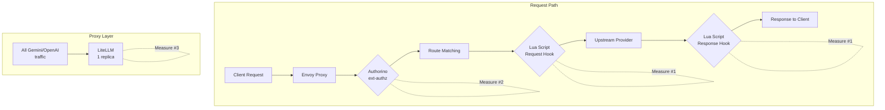
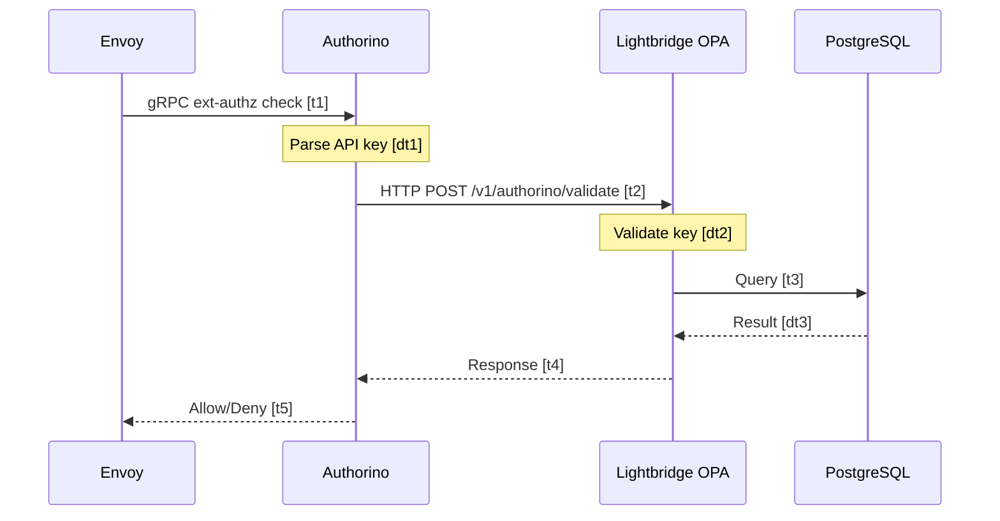

# Gateway Performance Investigation Plan

**Issue:** [#98 - Investigate and improve Envoy AI Gateway request latency and throughput](https://github.com/ADORSYS-GIS/ai-helm/issues/98)

**Created:** 2026-04-09
**Status:** Investigation Phase - Data Collection Required

---

## Investigation Principle

> **No code changes until we have data.** We investigate first, we test first, we need the data.

---

## Execution Plan

**Execution context:** Direct kubectl access to production cluster, tests during low-traffic hours.

### Test Execution Order

Run tests in this order to minimize risk and maximize data value:

| Order | Test | Risk Level | Time Required |
|-------|------|------------|---------------|
| 1 | Resource usage snapshot | None | 5 min |
| 2 | Envoy access log collection | None | 5 min |
| 3 | Authorino metrics collection | None | 5 min |
| 4 | LiteLLM resource check | None | 5 min |
| 5 | LiteLLM direct vs proxied test | Low | 15 min |
| 6 | Lua overhead test (disable policy) | Medium | 20 min |
| 7 | Load test LiteLLM | Medium | 30 min |

### Pre-Test Checklist

Before running any tests:

```bash
# 1. Verify cluster access
kubectl cluster-info

# 2. Check current traffic levels (avoid peak hours)
kubectl top pods -n converse-gateway
kubectl top pods -n converse-proxy

# 3. Verify no active incidents
kubectl get events -n converse-gateway --sort-by='.lastTimestamp' | head -20
kubectl get events -n converse-proxy --sort-by='.lastTimestamp' | head -20
```

---

## Quick Reference: Commands to Run

### Test 1: Resource Usage Snapshot (5 min, No risk)

```bash
# Envoy proxy resources
echo "=== ENVOY PROXY ===" && \
kubectl top pods -n converse-gateway -l app.kubernetes.io/name=envoy && \
kubectl get pods -n converse-gateway -l app.kubernetes.io/name=envoy -o jsonpath='{range .items[*]}{.metadata.name}{"\t"}{.spec.containers[0].resources}{"\n"}{end}'

# Authorino resources
echo "=== AUTHORINO ===" && \
kubectl top pods -n converse-gateway -l app.kubernetes.io/name=authorino && \
kubectl get deployment -n converse-gateway -l app.kubernetes.io/name=authorino -o jsonpath='{range .items[*]}{.metadata.name}{"\t"}{.spec.template.spec.containers[0].resources}{"\n"}{end}'

# LiteLLM resources
echo "=== LITELLM ===" && \
kubectl top pods -n converse-proxy -l app=proxy-app && \
kubectl get deployment -n converse-proxy -o jsonpath='{range .items[*]}{.metadata.name}{"\t"}{.spec.template.spec.containers[0].resources}{"\n"}{end}'

# Save to file for comparison
kubectl top pods -n converse-gateway > resource-snapshot-gateway.txt
kubectl top pods -n converse-proxy > resource-snapshot-proxy.txt
```

### Test 2: Envoy Access Log Collection (5 min, No risk)

```bash
# Collect last 1000 access logs
kubectl logs -n converse-gateway -l app.kubernetes.io/name=envoy --tail=1000 > envoy-access-logs.json

# Parse duration data
cat envoy-access-logs.json | grep -o '"duration":"[^"]*"' | cut -d'"' -f4 | sort -n > envoy-durations.txt

# Quick stats
echo "Duration stats (ms):" && \
cat envoy-durations.txt | awk '{sum+=$1; count++} END {print "Count:", count, "Avg:", sum/count, "Min:", min, "Max:", max} NR==1{min=$1} {if($1>max)max=$1}'

# Or use jq if available
cat envoy-access-logs.json | jq -r '.duration' | sort -n | awk 'BEGIN{count=0} {data[count++]=$1} END{print "p50:", data[int(count*0.5)], "p95:", data[int(count*0.95)], "p99:", data[int(count*0.99)]}'
```

### Test 3: Authorino Metrics Collection (5 min, No risk)

```bash
# Check if Authorino has metrics endpoint
kubectl get svc -n converse-gateway | grep authorino

# Port-forward to Authorino (run in background)
kubectl port-forward svc/kuadrant-policies-main-authorino-authorization 50051:50051 -n converse-gateway &
PF_PID=$!

# Wait for port-forward
sleep 2

# Try to get metrics (may need different endpoint)
curl -s http://localhost:50051/metrics 2>/dev/null | grep -E "auth|latency|duration|request" > authorino-metrics.txt || \
echo "Metrics endpoint not found at /metrics - check Authorino docs"

# Alternative: Check Authorino logs for timing info
kubectl logs -n converse-gateway -l app.kubernetes.io/name=authorino --tail=500 > authorino-logs.txt

# Cleanup port-forward
kill $PF_PID 2>/dev/null
```

### Test 4: LiteLLM Resource Check (5 min, No risk)

```bash
# Current state
echo "=== LiteLLM Pod Status ===" && \
kubectl get pods -n converse-proxy -l app=proxy-app -o wide

echo "=== LiteLLM Resources ===" && \
kubectl top pods -n converse-proxy -l app=proxy-app

echo "=== LiteLLM Logs (last 50 lines) ===" && \
kubectl logs -n converse-proxy -l app=proxy-app --tail=50

# Check for errors
kubectl logs -n converse-proxy -l app=proxy-app --tail=200 | grep -i "error\|warn\|fail" > litellm-errors.txt
```

### Test 5: LiteLLM Direct vs Proxied Test (15 min, Low risk)

> **Tool:** Artillery - provides precise latency percentiles and comparison reports

**Prerequisites:**
```bash
# Install Artillery if not already installed
npm install -g artillery

# Port-forward to LiteLLM (run in background)
kubectl port-forward svc/litellm 4000:4000 -n converse-proxy &
PF_PID=$!
sleep 2
```

**Artillery Config:** `artillery-latency-comparison.yml`

```yaml
# artillery-latency-comparison.yml
# Compares direct LiteLLM vs gateway-routed latency

config:
  target: "http://localhost:4000"
  phases:
    - name: "Direct LiteLLM baseline"
      duration: 60
      arrivalRate: 2
      payload:
        path: "test-payloads.csv"
  defaults:
    headers:
      Authorization: "Bearer {{ GEMINI_API_KEY }}"
      Content-Type: "application/json"

scenarios:
  - name: "Direct LiteLLM - Gemini"
    flow:
      - post:
          url: "/v1/chat/completions"
          json:
            model: "gemini/gemini-2.5-flash"
            messages:
              - role: "user"
                content: "Say hello"
            max_tokens: 10
          capture:
            - json: "$.choices[0].message.content"
              as: "response"
```

**Run commands:**
```bash
# Test A: Direct LiteLLM
artillery run artillery-latency-comparison.yml -o report-direct.json

# Test B: Through Gateway (change target in config or override)
artillery run artillery-latency-comparison.yml \
  --target https://api.ai.camer.digital \
  -e gateway \
  -o report-gateway.json \
  --overrides '{"config":{"defaults":{"headers":{"Authorization":"Bearer $LIGHTBRIDGE_API_KEY","x-ai-eg-model":"gemini-2.5-flash"}}}}'

# Generate comparison report
artillery report report-direct.json --output report-direct.html
artillery report report-gateway.json --output report-gateway.html

# Cleanup port-forward
kill $PF_PID 2>/dev/null
```

**Data to collect:**
| Metric | Direct LiteLLM | Through Gateway | Difference |
|--------|----------------|-----------------|------------|
| p50 (ms) | | | |
| p95 (ms) | | | |
| p99 (ms) | | | |
| Mean (ms) | | | |

---

### Test 6: Lua Overhead Test (20 min, Medium risk)

> ⚠️ **Warning:** This temporarily disables the Lua policy. Run during low-traffic hours.
> **Tool:** Artillery - precise before/after comparison

**Artillery Config:** `artillery-lua-overhead.yml`

```yaml
# artillery-lua-overhead.yml
# Measures Lua policy overhead by comparing with/without

config:
  target: "https://api.ai.camer.digital"
  phases:
    - name: "Baseline measurement"
      duration: 120
      arrivalRate: 5
  defaults:
    headers:
      Authorization: "Bearer {{ LIGHTBRIDGE_API_KEY }}"
      x-ai-eg-model: "qwen3-8b"
      Content-Type: "application/json"

scenarios:
  - name: "Chat completion - qwen3-8b"
    flow:
      - post:
          url: "/v1/chat/completions"
          json:
            messages:
              - role: "user"
                content: "Say hello"
            max_tokens: 10
```

**Run commands:**
```bash
# Step 1: Baseline WITH Lua
echo "=== BASELINE (with Lua) ===" && \
artillery run artillery-lua-overhead.yml -o report-with-lua.json

# Step 2: Disable Lua policy
kubectl patch envoyextensionpolicy -n converse-gateway core-gateway-telemetry-lua \
  --type=json -p='[{"op":"replace","path":"/spec/lua","value":[]}]'

# Wait for Envoy to pick up the change
echo "Waiting for Envoy to reload config..."
sleep 30

# Step 3: Measurement WITHOUT Lua
echo "=== WITHOUT Lua ===" && \
artillery run artillery-lua-overhead.yml -o report-without-lua.json

# Step 4: Re-enable Lua policy (IMPORTANT!)
kubectl rollout restart deployment/envoy -n converse-gateway
echo "Lua policy re-enabled. Waiting for rollout..."
kubectl rollout status deployment/envoy -n converse-gateway

# Step 5: Generate reports
artillery report report-with-lua.json --output report-with-lua.html
artillery report report-without-lua.json --output report-without-lua.html

# Step 6: Quick comparison from JSON
echo "=== COMPARISON ===" && \
jq '.aggregate.latency' report-with-lua.json report-without-lua.json
```

**Data to collect:**
| Metric | With Lua | Without Lua | Lua Overhead |
|--------|----------|-------------|--------------|
| p50 (ms) | | | |
| p95 (ms) | | | |
| p99 (ms) | | | |
| Mean (ms) | | | |

---

### Test 7: Load Test LiteLLM (30 min, Medium risk)

> ⚠️ **Warning:** This generates significant load. Run during low-traffic hours.
> **Tool:** Artillery - phased load testing with automatic metrics

**Prerequisites:**
```bash
# Port-forward to LiteLLM
kubectl port-forward svc/litellm 4000:4000 -n converse-proxy &
PF_PID=$!
sleep 2
```

**Artillery Config:** `artillery-load-test.yml`

```yaml
# artillery-load-test.yml
# Phased load test to find LiteLLM throughput limits

config:
  target: "http://localhost:4000"
  phases:
    # Phase 1: Warmup at 1 RPS
    - name: "Warmup"
      duration: 60
      arrivalRate: 1
      
    # Phase 2: Light load at 5 RPS
    - name: "Light load"
      duration: 120
      arrivalRate: 5
      
    # Phase 3: Medium load at 10 RPS
    - name: "Medium load"
      duration: 120
      arrivalRate: 10
      
    # Phase 4: Heavy load at 20 RPS
    - name: "Heavy load"
      duration: 120
      arrivalRate: 20
      
    # Phase 5: Stress test at 50 RPS
    - name: "Stress test"
      duration: 60
      arrivalRate: 50
      
  defaults:
    headers:
      Authorization: "Bearer {{ GEMINI_API_KEY }}"
      Content-Type: "application/json"

scenarios:
  - name: "Chat completion - Gemini Flash"
    flow:
      - post:
          url: "/v1/chat/completions"
          json:
            model: "gemini/gemini-2.5-flash"
            messages:
              - role: "user"
                content: "Hi"
            max_tokens: 5
```

**Run commands:**
```bash
# Run full load test
artillery run artillery-load-test.yml -o report-load-test.json

# Generate HTML report
artillery report report-load-test.json --output report-load-test.html

# Extract per-phase metrics
echo "=== LOAD TEST SUMMARY ===" && \
jq '.aggregate.phases' report-load-test.json

# Cleanup port-forward
kill $PF_PID 2>/dev/null
```

**Data to collect:**
| Phase | RPS | p50 (ms) | p95 (ms) | Error Rate | Notes |
|-------|-----|----------|----------|------------|-------|
| Warmup | 1 | | | | |
| Light | 5 | | | | |
| Medium | 10 | | | | |
| Heavy | 20 | | | | |
| Stress | 50 | | | | |

---

### Test 8: Gateway End-to-End Load Test (Optional, 30 min, Medium risk)

> **Tool:** Artillery - full gateway stack load test

**Artillery Config:** `artillery-gateway-load.yml`

```yaml
# artillery-gateway-load.yml
# Full gateway stack load test through Envoy

config:
  target: "https://api.ai.camer.digital"
  phases:
    - name: "Baseline"
      duration: 60
      arrivalRate: 2
      
    - name: "Scale up"
      duration: 180
      arrivalRate: 2
      rampTo: 20
      
    - name: "Sustained"
      duration: 120
      arrivalRate: 20
      
  defaults:
    headers:
      Authorization: "Bearer {{ LIGHTBRIDGE_API_KEY }}"
      Content-Type: "application/json"

scenarios:
  - name: "Fireworks direct - qwen3-8b"
    weight: 3
    flow:
      - post:
          url: "/v1/chat/completions"
          headers:
            x-ai-eg-model: "qwen3-8b"
          json:
            messages:
              - role: "user"
                content: "Hello"
            max_tokens: 10
            
  - name: "Proxied - gemini-2.5-flash"
    weight: 2
    flow:
      - post:
          url: "/v1/chat/completions"
          headers:
            x-ai-eg-model: "gemini-2.5-flash"
          json:
            messages:
              - role: "user"
                content: "Hello"
            max_tokens: 10
            
  - name: "Streaming - qwen3-8b"
    weight: 1
    flow:
      - post:
          url: "/v1/chat/completions"
          headers:
            x-ai-eg-model: "qwen3-8b"
          json:
            messages:
              - role: "user"
                content: "Count to 10"
            max_tokens: 50
            stream: true
```

**Run commands:**
```bash
# Run gateway load test
artillery run artillery-gateway-load.yml -o report-gateway-load.json

# Generate report
artillery report report-gateway-load.json --output report-gateway-load.html
```

---

## Primary Bottlenecks to Investigate



| Priority | Bottleneck | Location | Data Needed |
|----------|------------|----------|-------------|
| **1** | Lua Extension Policy | [`envoyextensionpolicy-cost.yaml`](charts/core-gateway/templates/envoyextensionpolicy-cost.yaml) | Overhead per request in ms |
| **2** | Authorino ext-authz | [`securitypolicy.yaml`](charts/kuadrant-policies/templates/securitypolicy.yaml) | Auth latency p50/p95/p99 |
| **3** | LiteLLM single replica | [`models-proxy/values.yaml`](charts/models-proxy/values.yaml:34) | Overhead vs. direct provider |

---

## Investigation #1: Lua Script Overhead

### What We Need to Measure

1. **Total Lua overhead** - How much time does the Lua policy add to each request?
2. **Request hook cost** - Time spent in `envoy_on_request`
3. **Response hook cost** - Time spent in `envoy_on_response`
4. **Per-operation cost** - Which specific Lua operations are expensive?

### Test Methodology

#### Test 1.1: Baseline with Lua Disabled

**Objective:** Measure latency WITHOUT Lua policy to establish baseline.

**Prerequisites:**
- A test model that currently uses the Lua policy
- Ability to temporarily disable the EnvoyExtensionPolicy

**Steps:**
```bash
# Step 1: Document current latency (with Lua enabled)
# Run 20 requests to a test model, capture timing

# Step 2: Disable Lua policy
kubectl patch envoyextensionpolicy -n converse-gateway core-gateway-telemetry-lua --type=json -p='[{"op":"replace","path":"/spec/lua","value":[]}]'

# Step 3: Measure latency (with Lua disabled)
# Run same 20 requests, capture timing

# Step 4: Compare
# Difference = Lua overhead
```

**Data to collect:**
| Metric | With Lua | Without Lua | Difference |
|--------|----------|-------------|------------|
| p50 latency (ms) | ? | ? | ? |
| p95 latency (ms) | ? | ? | ? |
| p99 latency (ms) | ? | ? | ? |

#### Test 1.2: Isolate Request Hook vs Response Hook

**Objective:** Determine which hook contributes more overhead.

**Method:** Modify Lua script to only run request hook, then only run response hook.

```bash
# Test A: Request hook only (comment out response hook)
# Test B: Response hook only (comment out request hook)
# Test C: Both hooks (current state)
```

**Data to collect:**
| Configuration | p50 latency (ms) | p95 latency (ms) |
|---------------|------------------|------------------|
| Request hook only | ? | ? |
| Response hook only | ? | ? |
| Both hooks | ? | ? |

#### Test 1.3: Profile Individual Operations

**Objective:** Identify which Lua operations are most expensive.

**Method:** Add timing markers inside Lua script (temporary, for profiling only).

```lua
-- Example profiling approach
function envoy_on_request(request_handle)
  local start = request_handle:streamInfo():dynamicMetadata():get("profile_start")
  
  -- Operation 1: Header access
  local t1 = os.clock()
  local model = request_handle:headers():get("x-ai-eg-model")
  local op1_time = os.clock() - t1
  
  -- Operation 2: Body read
  local t2 = os.clock()
  local body_size = request_handle:body():length()
  local body = request_handle:body():getBytes(0, body_size)
  local op2_time = os.clock() - t2
  
  -- Log timing to access log
  request_handle:logInfo("Lua timing - header: " .. op1_time .. " body: " .. op2_time)
end
```

**Data to collect:**
| Operation | Avg time (ms) | Notes |
|-----------|---------------|-------|
| Header access | ? | `headers():get()` |
| Body length check | ? | `body():length()` |
| Body read | ? | `body():getBytes()` |
| Body write | ? | `body():setBytes()` |
| String match/gsub | ? | Pattern operations |
| Metadata access | ? | `metadata:get()` |
| Metadata set | ? | `metadata:set()` |

### Data Collection Commands

```bash
# Collect Envoy access logs with timing
kubectl logs -n converse-gateway -l app.kubernetes.io/name=envoy --tail=1000 > envoy-access-logs.json

# Parse duration from logs
cat envoy-access-logs.json | jq -r '.duration' | sort -n

# Check Envoy stats for Lua errors or slow calls
kubectl exec -n converse-gateway deploy/envoy -- curl localhost:15000/stats | grep lua
```

---

## Investigation #2: Authorino ext-authz Latency

### What We Need to Measure

1. **Total auth latency** - Time from Envoy → Authorino → response
2. **Auth chain breakdown** - Time per hop in the validation chain
3. **Resource usage** - Is Authorino CPU/memory constrained?

### Test Methodology

#### Test 2.1: Measure Authorino Auth Latency

**Objective:** Get p50/p95/p99 auth latency from Authorino metrics.

**Steps:**
```bash
# Step 1: Check if Authorino exposes Prometheus metrics
kubectl get servicemonitor -n converse-gateway

# Step 2: Port-forward to Authorino metrics endpoint
kubectl port-forward svc/kuadrant-policies-main-authorino-authorization 50051:50051 -n converse-gateway &

# Step 3: Query metrics
curl http://localhost:50051/metrics | grep -E "auth|latency|duration"

# Step 4: If Prometheus is available, query directly
# P95 auth latency over last hour:
# rate(authorino_auth_duration_seconds_bucket[5m])
```

**Data to collect:**
| Metric | Value | Source |
|--------|-------|--------|
| Auth latency p50 (ms) | ? | Authorino metrics |
| Auth latency p95 (ms) | ? | Authorino metrics |
| Auth latency p99 (ms) | ? | Authorino metrics |
| Auth requests/sec | ? | Authorino metrics |
| Auth errors/sec | ? | Authorino metrics |

#### Test 2.2: Trace the Auth Chain

**Objective:** Break down latency per hop in the auth chain.



**Steps:**
```bash
# Step 1: Check Authorino logs for timing
kubectl logs -n converse-gateway -l app.kubernetes.io/name=authorino --tail=100

# Step 2: Check Lightbridge OPA logs for timing
kubectl logs -n converse -l app.kubernetes.io/component=opa --tail=100

# Step 3: Check PostgreSQL query latency
kubectl exec -n converse deploy/lightbridge-main-db -- psql -c "SELECT * FROM pg_stat_statements ORDER BY total_time DESC LIMIT 10;"
```

**Data to collect:**
| Hop | Latency (ms) | Notes |
|-----|--------------|-------|
| Envoy → Authorino | ? | gRPC call |
| Authorino processing | ? | Key parsing |
| Authorino → Lightbridge | ? | HTTP call |
| Lightbridge processing | ? | OPA evaluation |
| Lightbridge → PostgreSQL | ? | DB query |
| Total chain | ? | Sum of all hops |

#### Test 2.3: Check Authorino Resource Usage

**Objective:** Determine if Authorino is CPU/memory constrained.

**Steps:**
```bash
# Current resource usage
kubectl top pods -n converse-gateway -l app.kubernetes.io/name=authorino

# Current resource limits
kubectl get deployment -n converse-gateway -o jsonpath='{range .items[?(@.metadata.name=="authorino")]}{.spec.template.spec.containers[*].resources}'

# Check for throttling events
kubectl describe pod -n converse-gateway -l app.kubernetes.io/name=authorino | grep -A5 "Events:"
```

**Data to collect:**
| Metric | Current | Limit | % Used |
|--------|---------|-------|--------|
| CPU usage | ? | ? | ?% |
| Memory usage | ? | ? | ?% |
| Throttling events | ? | N/A | N/A |

---

## Investigation #3: LiteLLM Overhead

### What We Need to Measure

1. **LiteLLM overhead** - Added latency vs. direct provider call
2. **Resource usage** - Is the single replica constrained?
3. **Throughput limits** - Max requests/sec before degradation

### Test Methodology

#### Test 3.1: Compare Direct vs. Proxied Latency

**Objective:** Measure the overhead added by LiteLLM proxy.

**Test models:**
- `gemini-2.5-flash` (via LiteLLM)
- Compare with direct Google AI Studio call (if possible to test)

**Steps:**
```bash
# Test A: Through Envoy → LiteLLM → Google
# Run 20 requests to gemini-2.5-flash through gateway

# Test B: Direct to LiteLLM (bypass Envoy)
kubectl port-forward svc/litellm 4000:4000 -n converse-proxy &
curl http://localhost:4000/v1/chat/completions \
  -H "Authorization: Bearer $GEMINI_API_KEY" \
  -d '{"model":"gemini/gemini-2.5-flash","messages":[{"role":"user","content":"Hi"}]}'

# Test C: Direct to Google AI Studio (bypass everything)
curl https://generativelanguage.googleapis.com/v1beta/models/gemini-2.5-flash:generateContent \
  -H "x-goog-api-key: $GEMINI_API_KEY" \
  -d '{"contents":[{"parts":[{"text":"Hi"}]}]}'
```

**Data to collect:**
| Path | p50 latency (ms) | p95 latency (ms) | Notes |
|------|------------------|------------------|-------|
| Envoy → LiteLLM → Google | ? | ? | Current path |
| Direct LiteLLM → Google | ? | ? | Bypass Envoy |
| Direct Google API | ? | ? | Bypass everything |
| LiteLLM overhead | ? | ? | Path A - Path C |

#### Test 3.2: Check LiteLLM Resource Usage

**Objective:** Determine if the single replica is constrained.

**Steps:**
```bash
# Current resource usage
kubectl top pods -n converse-proxy -l app=proxy-app

# Current resource limits
kubectl get deployment -n converse-proxy -o jsonpath='{.items[0].spec.template.spec.containers[0].resources}'

# Check for OOM or throttling
kubectl describe pod -n converse-proxy -l app=proxy-app | grep -A10 "Events:"
kubectl logs -n converse-proxy -l app=proxy-app --tail=100 | grep -i "error\|oom\|throttle"
```

**Data to collect:**
| Metric | Current | Limit | % Used |
|--------|---------|-------|--------|
| CPU usage | ? | 1 core | ?% |
| Memory usage | ? | 1Gi | ?% |
| Replica count | 1 | N/A | N/A |
| Throttling events | ? | N/A | N/A |

#### Test 3.3: Load Test LiteLLM

**Objective:** Find throughput limits of single replica.

**Steps:**
```bash
# Use vegeta or wrk for load testing
# Example with vegeta:
echo "GET http://localhost:4000/v1/chat/completions" | vegeta attack -duration=30s -rate=10 | vegeta report

# Or use a simple script to send concurrent requests
for i in {1..50}; do
  curl -s -o /dev/null -w "%{time_total}\n" http://localhost:4000/v1/chat/completions \
    -H "Authorization: Bearer $GEMINI_API_KEY" \
    -d '{"model":"gemini/gemini-2.5-flash","messages":[{"role":"user","content":"Hi"}]}' &
done
wait
```

**Data to collect:**
| Load (RPS) | p50 latency (ms) | p95 latency (ms) | Error rate |
|------------|------------------|------------------|------------|
| 1 RPS | ? | ? | ?% |
| 5 RPS | ? | ? | ?% |
| 10 RPS | ? | ? | ?% |
| 20 RPS | ? | ? | ?% |
| 50 RPS | ? | ? | ?% |

---

## Results Template

After running the tests, record your findings here:

### Test 1: Resource Usage Results

| Component | CPU Used | CPU Limit | Memory Used | Memory Limit | Throttling? |
|-----------|----------|-----------|-------------|--------------|-------------|
| Envoy pod 1 | | 1000m | | 1Gi | |
| Envoy pod 2 | | 1000m | | 1Gi | |
| Authorino | | ? | | ? | |
| LiteLLM | | 1000m | | 1Gi | |

**Notes:**

### Test 2: Envoy Duration Results

| Metric | Value (ms) |
|--------|------------|
| p50 | |
| p95 | |
| p99 | |
| Max | |

**Notes:**

### Test 3: Authorino Auth Latency Results

| Metric | Value (ms) |
|--------|------------|
| p50 | |
| p95 | |
| p99 | |

**Notes:**

### Test 5: LiteLLM Direct vs Proxied Results

| Path | Avg Latency (s) |
|------|-----------------|
| Direct LiteLLM | |
| Through Gateway | |
| Overhead | |

**Notes:**

### Test 6: Lua Overhead Results

| Configuration | Avg Latency (s) |
|---------------|-----------------|
| With Lua | |
| Without Lua | |
| Lua Overhead | |

**Notes:**

### Test 7: LiteLLM Load Test Results

| RPS | Avg Latency (s) | Errors? |
|-----|-----------------|---------|
| 1 | | |
| 5 | | |
| 10 | | |
| 20 | | |

**Notes:**

---

## Analysis Template

After collecting data, answer these questions:

### Lua Script Analysis

1. What is the measured Lua overhead per request?
2. Is the overhead significant relative to total request time?
3. Which hook (request or response) contributes more?
4. What percentage of requests are image-related (need the Lua processing)?

### Authorino Analysis

1. What is the auth latency p95?
2. Is Authorino CPU/memory constrained?
3. Where is the time going in the auth chain?
4. Is caching a viable optimization?

### LiteLLM Analysis

1. What is the LiteLLM overhead vs direct provider?
2. Is the single replica CPU/memory constrained?
3. At what RPS does latency degrade?
4. Would horizontal scaling help?

---

## Decision Points

Based on the data, we will decide:

- [ ] Is Lua optimization worth pursuing? (only if overhead > 10ms)
- [ ] Is Authorino optimization worth pursuing? (only if p95 > 30ms)
- [ ] Is LiteLLM scaling worth pursuing? (only if overhead > 20ms or throttling)

---

## Data Collection Checklist

### Before Any Changes

- [ ] **Lua overhead baseline** - Test with/without Lua policy
- [ ] **Authorino auth latency** - Collect p50/p95/p99 from metrics
- [ ] **LiteLLM overhead** - Compare direct vs. proxied latency
- [ ] **Resource usage snapshot** - CPU/memory for all components
- [ ] **Envoy access log dump** - Duration data for analysis

### Data Sources

| Data | Source | Command |
|------|--------|---------|
| Envoy request duration | Access logs | `kubectl logs -n converse-gateway -l app.kubernetes.io/name=envoy` |
| Authorino auth latency | Prometheus metrics | `curl authorino:50051/metrics` |
| LiteLLM latency | LiteLLM logs | `kubectl logs -n converse-proxy -l app=proxy-app` |
| Phoenix traces | Phoenix API | Query Phoenix for trace data |
| Resource usage | Kubernetes | `kubectl top pods` |

---

## Next Steps

1. **Collect baseline data** - Run all tests before any changes
2. **Document findings** - Record all measurements in this plan
3. **Analyze results** - Identify which bottleneck has highest impact
4. **Propose changes** - Based on data, not assumptions

---

## References

- [Envoy AI Gateway Documentation](https://gateway.envoyproxy.io/docs/tasks/ai/)
- [Authorino Performance Guide](https://github.com/Kuadrant/authorino)
- [Envoy Lua Filter](https://www.envoyproxy.io/docs/envoy/latest/configuration/http/http_filters/lua_filter)
- Issue #98: https://github.com/ADORSYS-GIS/ai-helm/issues/98