# Structure et fonctionnement du projet `ai-helm`

> **Document de synthèse.** Ce fichier explique *comment tout est structuré*,
> *comment toutes les couches fonctionnent*, *comment tout est configuré et
> paramétré*, et *comment tout est planifié* dans ce dépôt.
>
> Les sources de vérité restent [`CLAUDE.md`](./CLAUDE.md) (guide des agents et
> contributeurs), [`docs/architecture.md`](./docs/architecture.md) (la carte
> système), la [suite architecture](./docs/architecture/README.md) (11 pages
> détaillées) et les [ADR](./docs/adr/README.md) (le « pourquoi »). Ce document
> est un **résumé structuré** de l'ensemble.

---

## 1. Vue d'ensemble — ce qu'est ce projet

**`ai-helm`** est la **source de vérité GitOps de la plateforme IA « Camer
Digital »** (ADORSYS-GIS) : un ensemble de **57 charts Helm** qui, rendus par
**ArgoCD**, déploient tous les workloads d'un cluster Kubernetes chez Hetzner.

Ce n'est **pas une application** : pas de build, pas de compile, pas de boucle
de test classique. La boucle de vérification est :

```
helm template  →  est-ce que ça rend ?
helm lint      →  est-ce que c'est valide ?
CI             →  rendu des charts + scans de sécurité
```

Le déploiement réel est fait par **ArgoCD qui réconcilie ces charts dans le
cluster**.

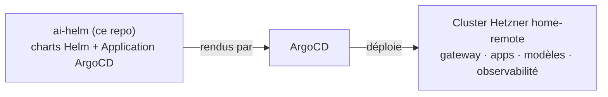

### Les trois repos complémentaires

| Repo | Rôle | Visibilité |
|---|---|---|
| **ai-helm** (ce repo) | Logique des charts, templates, umbrellas, workflows CI | public |
| **ai-helm-values** | **Ce qui est déployé** : valeurs par env, tags d'images, overlays `deps/`, `environments/` | **privé** |
| **home-os** | Infra cluster partagée consommée par nom : cert-manager, redis-ha, CNPG, Traefik, ESO, et la racine ArgoCD `ai-apps-v2` | privé |
| **hetzner-k8s** | Terraform des nœuds / réseau / CNI / LB + bootstrap de la plateforme | privé |

> **Règle d'or** : si vous ajoutez un `valuesObject`, un tag d'image ou un CR
> par environnement dans ai-helm, **stop** — ça appartient à `ai-helm-values`.
> ai-helm détient *comment rendre* ; ai-helm-values détient *ce qui est déployé*.

---

## 2. Structure du dépôt

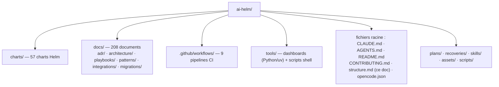

### Arborescence commentée

```
ai-helm/
├── CLAUDE.md                  ← source de vérité des conventions (agents + humains)
├── AGENTS.md                  ← pointeur vers CLAUDE.md
├── CONTRIBUTING.md            ← conventions, style de commit, processus ADR
├── README.md                  ← vue d'ensemble, où commencer
├── structure.md               ← CE document (synthèse du fonctionnement)
├── opencode.json              ← configuration de l'agent opencode
├── SYNC_WAVE_PATTERN.md       ← le pattern canonique des sync waves ArgoCD
├── MONITORING_FIX.md          ← postmortem : quota + ordre des sync waves
├── release-please-config.json ← changelogs + planchers de version par chart
├── .release-please-manifest.json
├── .trivyignore.yaml          ← exceptions du scan Trivy
├── .gitlab-ci.yml             ← miroir de la revue opencode pour GitLab
│
├── charts/                    ← LES 57 CHARTS HELM (le cœur)
│   ├── apps/                  ← L'UMBRELLA RACINE : émet une Application ArgoCD
│   │   │                         par workload (entry point d'ArgoCD)
│   │   ├── values.yaml        ← config centrale : argocd.*, applications[]
│   │   └── templates/         ← applications.yaml (le template d'Application)
│   ├── ai-models/             ← orchestrateur (ApplicationSet) du catalogue IA
│   ├── ai-model/              ← feuille : 1 AIGatewayRoute + 1 BackendTrafficPolicy par modèle
│   ├── ai-models-backends/    ← feuille : AIServiceBackend des providers (Fireworks, DeepInfra, Google AI)
│   ├── ai-models-info/        ← catalogue statique /v1/models/info (type OpenRouter)
│   ├── librechart/            ← orchestrateur LibreChat (ApplicationSet)
│   ├── librechat-app/         ← feuille : LibreChat + MongoDB
│   ├── librechat-search/      ← feuille : Meilisearch
│   ├── librechat-opencode-wellknown/ ← feuille : le .well-known opencode (nginx)
│   ├── core-gateway/          ← Envoy AI Gateway : Gateway, listeners, policies, ACME
│   ├── kuadrant-policies/     ← AuthConfigs Authorino + SecurityPolicy
│   ├── observability/         ← orchestrateur App-of-Apps (10 enfants LGTM)
│   ├── observability-dashboards/ ← CR GrafanaFolder/GrafanaDashboard
│   ├── inference/             ← orchestrateur GPU : le CATALOGUE des modèles auto-hébergés
│   ├── inference-server/      ← feuille générique : 1 conteneur engine (llamacpp/vllm/localai)
│   ├── model-serving-*        ← 7 charts LEGACY (désactivés, homeCluster) — ne pas copier
│   ├── mcps/                  ← orchestrateur MCP (ApplicationSet)
│   ├── mcp/                   ← feuille MCP (modes selfHosted / proxiedExternal)
│   ├── mcpo/                  ← MCP sur bjw-template (pas de templates propres)
│   ├── lightbridge/           ← orchestrateur App-of-Apps (secrets/db/app)
│   ├── lightbridge-db/        ← CR Cluster CNPG
│   ├── lightbridge-secrets/   ← ExternalSecrets du backend
│   ├── coder/ · homepage/ · homepage-app/ · homepage-secrets/
│   ├── lakefs/ · lakefs-proxy/ · lakefs-secrets/
│   ├── argo-workflows/ · argo-workflows-secrets/
│   ├── mlflow/ · mlflow-secrets/
│   ├── webank-training/       ← WorkflowTemplate Argo (entraînement GPU gouverné)
│   ├── llm-d/ · lmcache/      ← middleware d'inférence distribué (staged)
│   ├── longhorn-auth/         ← oauth2-proxy du UI Longhorn (ADR-0093)
│   ├── same-origin-proxy/     ← proxy Caddy CORS pour le flux d'actualités Grafana
│   ├── mongodb-backup/ · keycloak-backup/
│   ├── imageupdater/          ← CR ImageUpdater (argocd-image-updater, ADR-0055)
│   ├── keycloak-baseline/     ← config du realm camer-digital (⚠️ pas déployé par ArgoCD)
│   ├── common/                ← bibliothèque Bitnami commune
│   ├── bjw-common/            ← bibliothèque forké localement (ADR-0016)
│   └── bjw-template/          ← app-template bjw forké localement (ADR-0016)
│
├── docs/                      ← LA DOCUMENTATION
│   ├── adr/                   ← 101 Architecture Decision Records (le « pourquoi »)
│   ├── architecture.md        ← la carte système en une page
│   ├── architecture/          ← suite C4 : 01-context … 10-mcp (tous en mermaid)
│   ├── arc42.md               ← description formelle en 12 sections
│   ├── continuous-delivery.md ← runbook du déploiement continu (ADR-0055/56)
│   ├── commit-conventions.md  ← spec des Conventional Commits
│   ├── playbooks/             ← runbooks « comment faire »
│   ├── integrations/          ← guides par produit (LibreChat, opencode, Coder, MLOps…)
│   ├── patterns/              ← patterns réutilisables et analyses
│   └── migrations/            ← audits et changements point-in-time
│
├── tools/
│   ├── dashboards/            ← GÉNÉRATEUR de dashboards Grafana (Python 3.12+,
│   │                             grafana-foundation-sdk, uv + ruff) — ADR-0008
│   ├── commit-lint.sh         ← validateur Conventional Commits (POSIX, pas de npm)
│   └── check-model-catalogs.sh← CI : vérifie la cohérence du catalogue de modèles
│
├── scripts/                   ← scripts de migration (mongo) / test local
├── plans/                     ← plans (artillery, openai-alternative)
├── recoveries/                ← runbooks de reprise (librechat)
├── skills/                    ← skills opencode du repo (code-review, security-review…)
└── assets/images/             ← images (dont l'ancien serveur zimage — supprimé)
```

---

## 3. Les couches — vue d'ensemble

Toute la plateforme peut se lire comme **7 couches empilées**, traversées par
chaque requête :

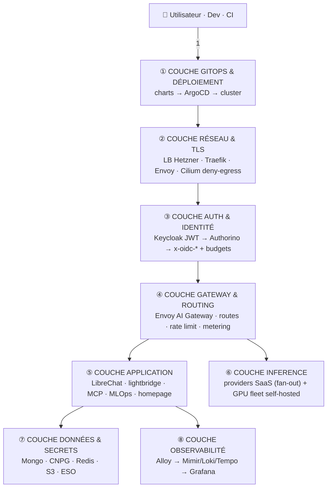

> La couche ⑤ (application) et la ⑥ (inference) sont des *consommateurs* de la
> ④ (gateway) ; la ⑦ et la ⑧ sont des *plates-formes* que les autres
> consomment. La ① (GitOps) est le *sol* qui déploie tout.

---

## 4. Couche ① — GitOps & déploiement : comment tout est structuré et déployé

### 4.1 Deux clusters, deux rôles (ADR-0017)

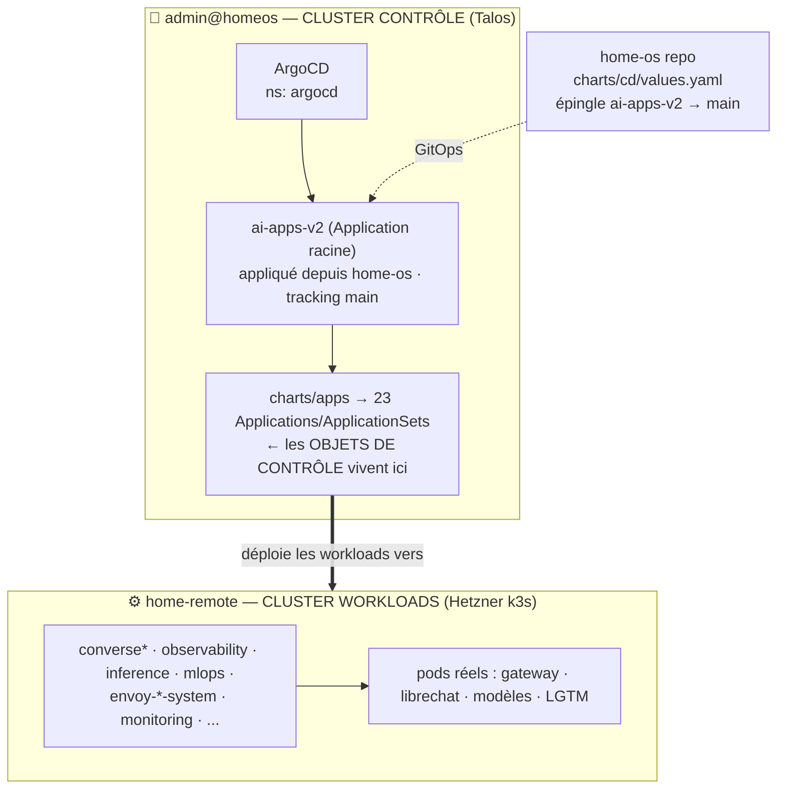

- **Objets de contrôle** (Application, ApplicationSet) → cluster où ArgoCD tourne,
  ns `argocd` (sinon les contrôleurs ne les voient jamais).
- **Workloads** → destination enregistrée **`home-remote`**. Un garde au rendu
  **fait échouer `helm template`** si un workload résout vers in-cluster sans
  opt-in (`controlPlane` ou `homeCluster`).
- **Invariant** : chaque Application/ApplicationSet est dans le **AppProject `ai`**
  (hardcodé — pas de per-app override).

### 4.2 Les trois patrons de rendu

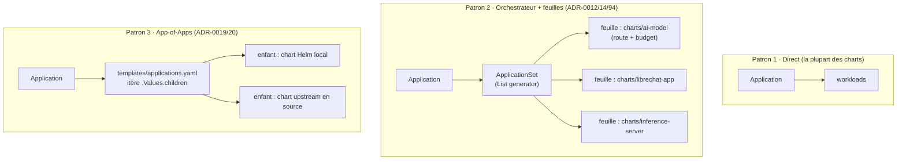

| Patron | Utilisé par | Pourquoi |
|---|---|---|
| **Direct** | `core-gateway`, `kuadrant-policies`, la plupart | un chart, un cycle de vie |
| **Orchestrateur + feuilles** | `ai-models`→`ai-model`, `librechart`→`librechat-*`, `inference`→`inference-server` | cycles de vie séparés (waves, rollback) ; ajouter un composant = une ligne de liste |
| **App-of-Apps** | `observability` (10 enfants), `lightbridge`, `mcps`, `coder`, `homepage`, `lakefs`, `argo-workflows`, `mlflow`, `longhorn-auth` | enfants fixes et hétérogènes (charts locaux + upstream) |

### 4.3 Umbrella multi-sources (ADR-0018)

Une app plate et ses prérequis sync en **une** Application multi-source :

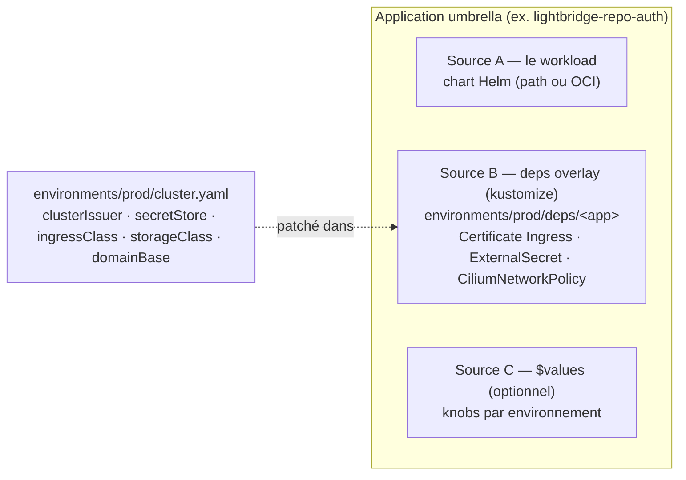

- Attache deps avec **un champ** : `depsOverlay: environments/prod/deps/<app>`.
- Kustomize confiné aux **CR simples** — jamais kustomize-over-Helm.
- Aujourd'hui seul `environments/prod/` existe ; un second env = un dossier frère.

### 4.4 Déploiement continu (ADR-0055/56) — « un merge sur main = un déploiement live »

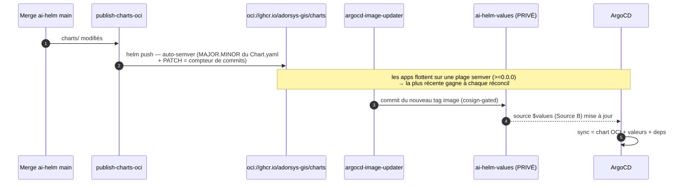

- **Rollback** = `git revert` dans `ai-helm-values` (tags/valeurs) et/ou épingler
  un `chartVersionRange` sur une version connue-bonne. **Pas de snapshot immuable.**
- Les sources **non-OCI externes** (lightbridge-repo-auth, upstream charts, agents)
  épinglent leurs propres SHA/versions — à bumper délibérément.

### 4.5 Sync waves — l'ordre est un contrat

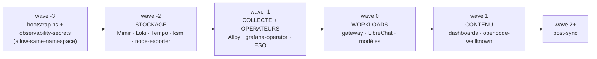

**Principe** : *les dépendances se déploient avant les dépendants*. Violer
« infrastructure → stockage → collecte → visualisation » a déjà coûté une journée
d'incident (`MONITORING_FIX.md` : Alloy avant Mimir → quota 512Mi posé par erreur
au lieu de 8Gi).

---

## 5. Couche ② — Réseau & TLS : comment le trafic entre et se restreint

### 5.1 Chemins d'entrée

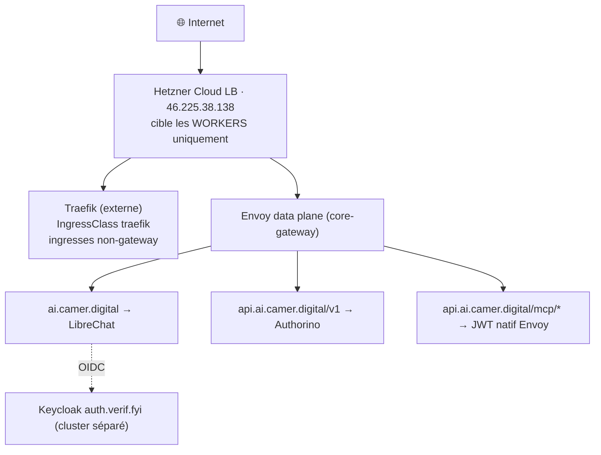

### 5.2 TLS — deux modèles de confiance

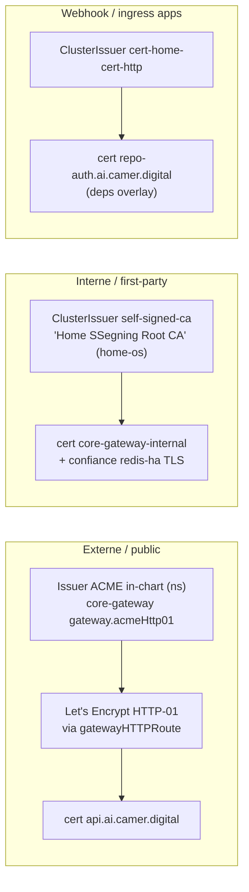

⚠️ L'issuer `cert-home-cert-envoy` est **retiré** ; le TLS externe du gateway
passe par l'Issuer ACME in-chart (pas de token DNS). `cert-cloudflare` (DNS-01)
existe mais sans `cloudflare-secret` — seulement pour d'éventuels wildcards.

### 5.3 Cilium deny-egress — la règle n°1 du cluster

Chaque namespace applicatif porte une policy `allow-dns` de base (externe) :
**tout pod est egress-deny par défaut**.

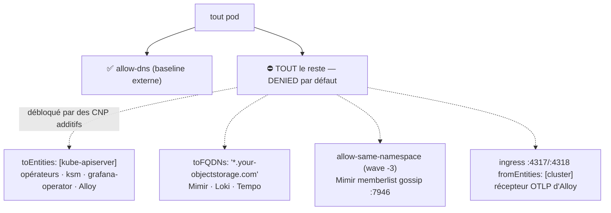

- ⚠️ Un `NetworkPolicy` k8s `ipBlock` **ne matche pas sur Cilium** — toujours des
  `CiliumNetworkPolicy` avec `toEntities` / `toFQDNs`.
- Piège classique : pod qui se bloque ~32 s puis est tué par une probe liveness
  sans `initialDelay` → crashloop silencieux (ressemble à un exit-2).

### 5.4 redis-ha — TLS-only

Consommateurs (LibreChat, rate-limit Envoy) → **HAProxy master-router**
(`redis-ha-haproxy.redis-system:6379`), pas le Service round-robin `redis-ha-redis`
(qui tomberait 50 % du temps sur la réplica read-only → `READONLY`). TLS obligatoire
(port 0 / tls-port 6379, `tls-auth-clients no`) + confiance dans `self-signed-ca`.

---

## 6. Couche ③ — Auth & identité : comment tout est sécurisé et paramétré

**La frontière en une ligne** : un **JWT Keycloak valide = « vous êtes dans notre
système, vous pouvez utiliser la gateway »**. OPA a été retiré (2026-06-04) — pas
de hop de policy par requête. La différenciation se fait par *quel hôte* + *quels
claims*.

### 6.1 Double plan, AuthConfig par hôte (ADR-0021)

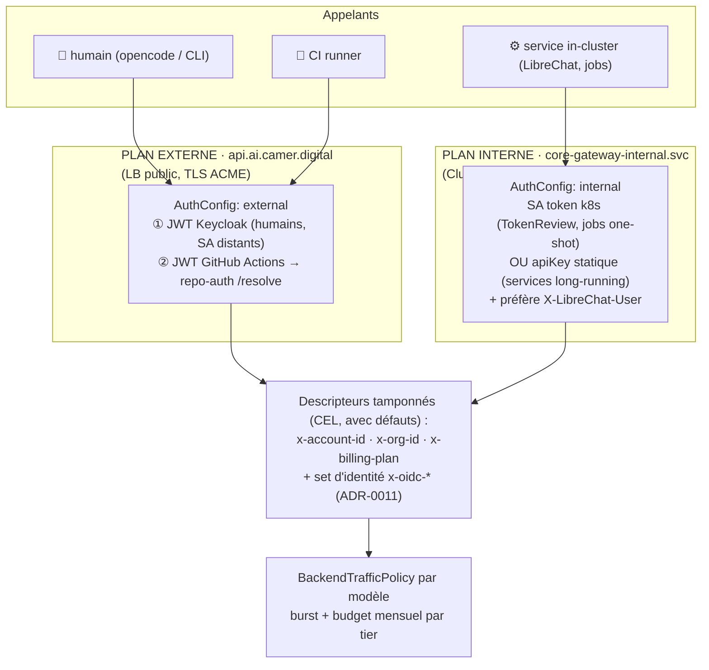

### 6.2 Attribution per-user (le cas LibreChat)

LibreChat s'authentifie *en tant que lui-même* (apiKey) mais **forwarde le `sub`
Keycloak de l'utilisateur final** via `X-LibreChat-User` → Authorino préfère ce
header → la dépense est attribuée à la **vraie personne**. Confiance : le plan
interne est first-party-only + Authorino écrase les descripteurs.

### 6.3 Le binding CI sans clé partagée (ADR-0047/49)

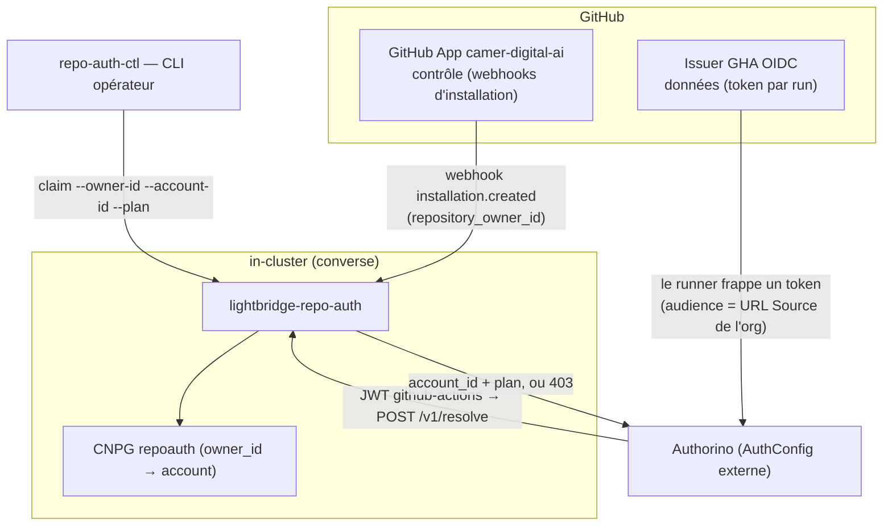

- **Clé de liaison** = `repository_owner_id` (numérique GitHub, immuable, posé par
  le serveur — jamais tapé par un humain).
- Onboarding **par opérateur** (`repo-auth-ctl claim`), pas en self-service.

### 6.4 Tiers de rate-limit (ADR-0021/0033/0035)

Keyés sur `x-account-id` (burst **et** budget mensuel en µ$, **par personne**)
+ `x-billing-plan`. Statiques via Helm — **pas d'OPA dynamique** :

| Plan | Budget mensuel | Req/min | Tokens/min |
|---|---|---|---|
| `free` | $50 | 200 | 1 000 000 |
| `pro` | $200 | 400 | 2 000 000 |
| `service` | uncapped | 600 | 2 000 000 |
| `internal` | uncapped | 600 | 2 000 000 |

> ⚠️ **ADR-0084** : la liste `rateLimitBudgeting.plans` est **append-only**. La
> position d'un plan = son index dans la clé Redis (`rule/N`) — trier/insérer
> orphelinerait tous les compteurs en cours de fenêtre.

### 6.5 Le carve-out `/mcp/*` (ADR-0038)

Seul endroit où Authorino est contourné : un `SecurityPolicy` au niveau route
**déplace** la politique attachée à la gateway (pas de merge). Vérif = `jwt_authn`
natif Envoy (même issuer Keycloak), découverte RFC 9728 sans auth, `claimToHeaders`
re-tamponne `x-oidc-*`. **Pas de rate-limit sur `/mcp/*`.**

---

## 7. Couche ④ — Gateway & routing : le cœur de la machine

### 7.1 Composants

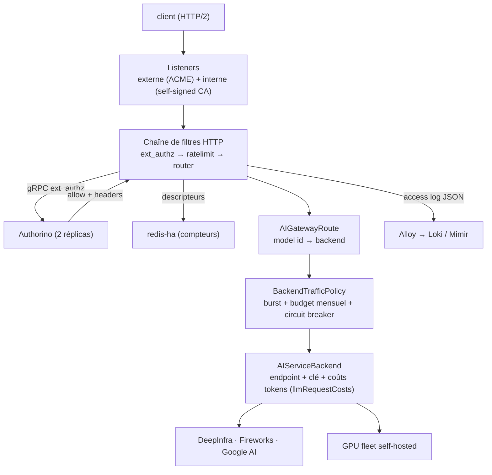

### 7.2 Les 4 chemins canoniques

**A · Dev via opencode (plan externe, attribution complète)**

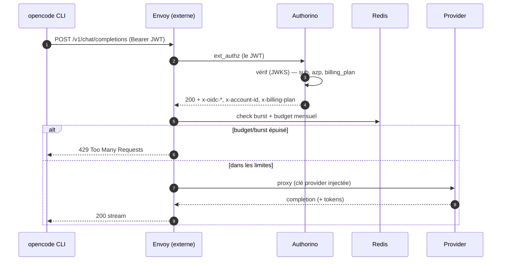

**B · Humain via LibreChat (plan interne)** — apiKey + `X-LibreChat-User` →
Authorino attribue à l'utilisateur final, plan `internal` (uncapped, burst only).

**C · CI via GHA OIDC** — vérif issuer GitHub → `/v1/resolve` →
`{account_id, billing_plan}` ou **403**.

**D · MCP** — JWT natif Envoy, pas de rate-limit (voir couche ⑥).

### 7.3 Pourquoi la gateway scale

| Besoin | Mécanisme |
|---|---|
| Débit | HTTP/2 + HPA data-plane 3→5, LeastRequest LB |
| Équité | burst + budget mensuel par utilisateur (Redis) |
| Résilience | circuit breaker + outlier detection (éjection ≤ 30 s) |
| Rollout zéro-coupure | drain 60 s + PDB maxUnavailable 1 |
| Coût | metering natif `llmRequestCosts` (pas de hop Python/Lua) |

---

## 8. Couche ⑤ — Application : ce que la plateforme *fait*

| Surface | Composants (ns) | Notes |
|---|---|---|
| **Chat** | LibreChat + MongoDB + Meilisearch (`converse`) | orchestrateur `librechart` ; UI à `ai.camer.digital` |
| **Découverte opencode** | `librechat-opencode-wellknown` | JSON `.well-known` : catalogue modèles + MCP + plugins ; les users font juste `opencode auth login <url>` |
| **Code intelligence** | `lightbridge` (api+mcp) + `lightbridge-code-intelligence` (Rust/Axum + Neo4j + CNPG pgvector) | revue de PR automatisée, GitHub App |
| **CI binding** | `lightbridge-repo-auth` (`converse`) | org GitHub → compte billing |
| **MLOps** | LakeFS (+ shim `lakefs-proxy`) · Argo Workflows · MLflow (`mlops`) | auth mixte : OIDC natif / oauth2-proxy / plugin mlflow-oidc-auth |
| **Hub central** | Homepage + oauth2-proxy (`homepage`) | portail, découverte k8s par annotations |
| **Agents** | `opencode-k8s-agent` + `apprise-api` (`monitoring`) | CronJob 12h → rapport cluster ; auth plan interne (SA token) |
| **Entraînement** | `webank-training` (`mlops`) | WorkflowTemplate Argo, GPU gouverné |
| **MCP** | `mcps` + `mcp` (`converse-mcp`) | 5 serveurs (voir ci-dessous) |

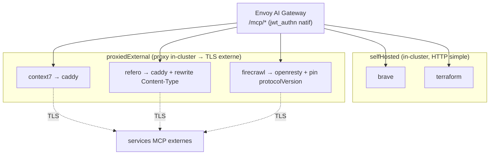

> **Pourquoi des proxies** (ADR-0040/41) : AIEG tamponne un `transport_socket`
> vide (SNI) sur les backends externes, BoringSSL refuse le cert ECDSA de context7,
> refero malsert le type MIME, firecrawl préfixe un événement SSE vide. Caddy
> (Go TLS) et openresty (Lua) normalisent tout ça en backends HTTP simples.

---

## 9. Couche ⑥ — Inference : comment un `model id` devient des tokens

### 9.1 Fan-out cloud (ADR-0012)

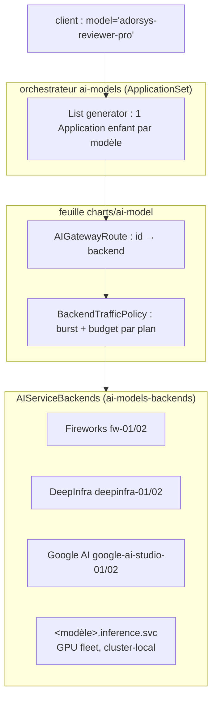

- ~30 modèles en production : **alias de marque** sur backends providers
  (`adorsys-reviewer-pro` → GLM-5.2, etc.).
- **Ajouter un modèle = une ligne de liste** dans `charts/ai-models/values.yaml`.
- Catalogue exposé : `ai-models-info` (endpoint statique `/v1/models/info`
  type OpenRouter, ADR-0015).

### 9.2 GPU fleet self-hosté (ADR-0094/95/107)

Les GPU sont **dans le même cluster que la gateway** → un modèle auto-hébergé est
un workload ordinaire : **pas d'Ingress, pas de DNS, pas de cert, pas de clé
statique, pas de sidecar auth**. Le `CiliumNetworkPolicy` est le contrôle d'accès.

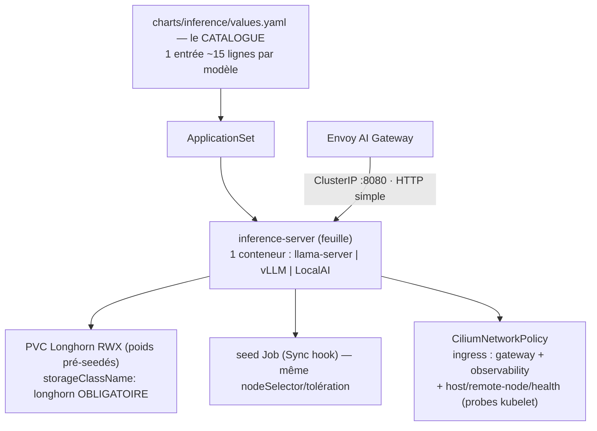

**3 engines, 1 conteneur chacun** :

| | `llamacpp` | `vllm` | `localai` |
|---|---|---|---|
| Sert | texte | texte | **images** (`/v1/images/generations`) |
| Image | `ghcr.io/ggml-org/llama.cpp:server-cuda` | `lmcache/vllm-openai` | `quay.io/go-skynet/local-ai:v4.7.1-gpu-nvidia-cuda-12` |
| Poids | GGUF | safetensors (AWQ/GPTQ/FP8/BF16) | GGUF, téléchargés par l'engine lui-même |
| Seed Job | oui | oui | **non** |
| Clé optionnelle | native `--api-key-file` | native `VLLM_API_KEY` | native `API_KEY` |

- **2 GPU = 2 modèles** ; le 3ᵉ reste `Pending` (la file qui travaille, pas un bug).
- ⚠️ Tag **CUDA 12** obligatoire pour LocalAI (driver 550 ; `latest` = CUDA 13).
- Tarification = coût-récupération (€/heure TCO, ADR-0028/0104).
- La génération `model-serving-*` (7 charts, `homeCluster: true`, autre cluster) :
  **tous `enabled: false`**, surface de rollback seulement — ne pas copier.

---

## 10. Couche ⑦ — Données & secrets : où vit l'état

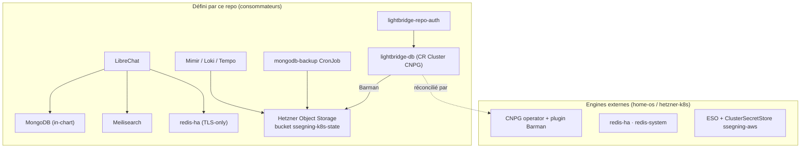

### 10.1 Le flux des secrets (ESO)

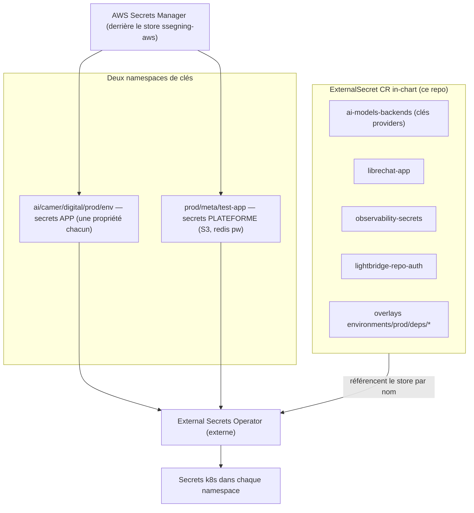

⚠️ **Leçon dure** : ré-héberger un secret in-chart **avant** de retirer son
provisionneur — le prune de l'app `secrets` a cascade-supprimé
`lightbridge-opa-auth` → outage de la gateway.

### 10.2 Ce que ce repo ne possède PAS (référencé par nom seulement)

Traefik · CNPG+Barman · cert-manager + ClusterIssuers · redis-ha · ESO +
`ssegning-aws` · OpenTelemetry Operator · metrics-server k3s (ADR-0054). Ne pas
ré-ajouter de chart pour l'un d'eux — le repo ne déclare que les CR qu'ils
réconcilient.

---

## 11. Couche ⑧ — Observabilité : qui consomme combien

### 11.1 La pipeline LGTM

```mermaid
flowchart BT
    SRC["workloads /metrics (Service/PodMonitor)<br/>kube-state-metrics (honorLabels: true)<br/>node-exporter · logs pods · access log Envoy (OTLP) · traces"]
    ALLOY["Alloy (DaemonSet, wave -1)<br/>scrape + tail /var/log + récepteur OTLP :4317/4318<br/>stage ai_gateway_user_attribution"]
    STORE["Mimir (métriques) · Loki (logs) · Tempo (traces :3200)<br/>blocks → S3 (wave -2)"]
    GRAF["Grafana stateless (emptyDir, ADR-0023)<br/>+ grafana-operator (external mode)<br/>wave 0 / dashboards wave 1"]
    SRC --> ALLOY --> STORE --> GRAF
```

### 11.2 Attribution per-user (ADR-0005/46)

```mermaid
flowchart LR
    JWT["JWT Keycloak"] --> AUTH["Authorino<br/>stamp x-oidc-user-id · x-oidc-azp"] --> ENV["Envoy access log (OTLP)<br/>champs format.json → attributs OTLP"]
    ENV --> AL["Alloy — stage ai_gateway_user_attribution<br/>aplanit l'enveloppe attributes<br/>promote labels user_id/azp/model<br/>épingle service_name=envoy-ai-gateway"]
    AL --> LOKI["Loki {user_id, azp, model}"] --> DASH["dashboards per-user"]
```

- ⚠️ Le sink OTLP d'Envoy émet les champs en **attributs**, pas dans le corps du
  log — Alloy doit aplanir l'enveloppe (d'où le stage).
- ⚠️ Labels des logs de pods = **découverte de services k8s**, jamais regex sur la
  ligne (une ligne mentionnant `/var/log/pods/...` écraserait les labels).

### 11.3 Dashboards = code

```mermaid
flowchart LR
    PY["tools/dashboards/*.py<br/>(grafana-foundation-sdk, uv + ruff)"] -->|"uv run dashboards build"| JSON["JSON généré (commité, CI anti-dérive)"] --> CR["CR GrafanaFolder/GrafanaDashboard<br/>(observability-dashboards)"] --> OP["grafana-operator (external mode)"] --> G["Grafana"]
```

- Grafana est **stateless** → chaque folder a besoin d'un `resyncPeriod`, sinon un
  roll de pod efface les folders (`folderRef` 400 jusqu'au restart de l'opérateur).
- **Scrape-first (ADR-0045)** : pas de dashboard sans métriques vérifiées.
- **Coûts pré-calculés (ADR-0058)** : Alloy émet `gen_ai_usage_cost_micro_usd` /
  `gen_ai_usage_tokens` / `gen_ai_requests` à l'ingestion → Mimir (fini le scan de
  30 j de logs Loki qui throttlait S3).

### 11.4 Résolution d'identité & alerting

- **user_id → personne** : datasource Postgres **read-only** `uid: keycloak` sur la
  réplica CNPG `-ro` de Keycloak (rôle `grafana_ro` least-privilege — jamais les
  credentials) ; realm filtré par id littéral (ADR-0063/64).
- **sessions-grants** : grants offline (`offline_flag='1'`) par user/client.
- **jwt-tokens** : per-JWT via Loki — extraire `oidc_jti` dans le **même** `| json`
  que le `sum by` (sinon tout s'effondre sur `-`).
- **Alerting (ADR-0059)** : Grafana unified alerting → **Discord**, provisionné en
  CR (contact point, policy, 9 règles : no-traffic, 5xx, p95, garde-fous coût,
  composant down, crashloop, nœud).

---

## 12. Configuration & paramétrage — où tout se règle

### 12.1 La carte des knobs

| Ce qu'on veut changer | Où | Fichier |
|---|---|---|
| Ajouter/retirer un **workload** (app ArgoCD) | la liste `applications[]` | `charts/apps/values.yaml` |
| Destination, projet, préfixe, env, registre OCI | le bloc `argocd:` | `charts/apps/values.yaml` |
| Pod Security Standards par namespace | `global.namespacePodSecurity` | `charts/apps/values.yaml` |
| Ajouter/retirer un **modèle GPU** | le catalogue | `charts/inference/values.yaml` |
| Ajouter un **modèle cloud** / backend / budgets | `rateLimitBudgeting.plans` (append-only !) + backends | `charts/ai-models/values.yaml` |
| Valeurs de workload (grands `valuesObject`) | ⚠️ **ai-helm-values** (privé) | `environments/<env>/values/<app>.yaml` |
| Tags d'images | ⚠️ **ai-helm-values** (écrits par image-updater) | mêmes fichiers |
| Overlays par env (certs, secrets, CNP) | ⚠️ **ai-helm-values** | `environments/<env>/deps/<app>/` |
| Env defaults du cluster (issuer, storageClass…) | ⚠️ **ai-helm-values** | `environments/<env>/cluster.yaml` |
| Image-updater (quelles apps, quelles images) | `imageUpdaters[]` | `charts/imageupdater/values.yaml` |
| Sync waves | annotations `argocd.argoproj.io/sync-wave` sur les enfants | valeurs des orchestrateurs |
| Config AuthConfigs / Authorino | ⚠️ ai-helm-values (sécurité) | `values/security-policies.yaml` |
| Réalm Keycloak | chart **non déployé** — console admin puis miroir | `charts/keycloak-baseline/values.yaml` |

> **Règle de coupure `values-repo-first`** : le fichier doit exister sur
> `ai-helm-values@main` **avant** que le changement `charts/apps` ne merge —
> sinon `ignoreMissingValueFiles` retombe silencieusement sur les défauts du chart
> (pour `security-policies`, ça DROPPE l'AuthConfig → gateway sans auth).

### 12.2 Paramétrage par app — le formulaire d'entrée

Un app entry dans `charts/apps/values.yaml` accepte :

```yaml
- name: <app>
  enabled: true                    # false = stage sans rendu
  controlPlane: true               # rend des CR ArgoCD → in-cluster/argocd
  homeCluster: true                # ⚠️ HÉRITAGE — ne plus utiliser (ADR-0100)
  chart: <oci-chart>               # mode OCI + source $values (ADR-0055)
  releaseName: <app>               # défaut = .name
  valuesFromRepo: true             # valeurs depuis ai-helm-values (ADR-0056)
  depsOverlay: environments/prod/deps/<app>
  source: { repoURL, chart, targetRevision, helm: { releaseName, valuesObject } }
  sources: [ ... ]                 # multi-source explicite (umbrellas)
  destination: { namespace: <ns> }
  syncPolicy: { syncOptions, automated: { prune, selfHeal } }
  additionalAnnotations:           # image-updater, notifications, compare-options
  finalizers: [resources-finalizer.argocd.argoproj.io]
```

---

## 13. Planification — comment tout est planifié et orchestré

### 13.1 Les 9 workflows CI

| Workflow | Déclencheur | Rôle |
|---|---|---|
| `helm-lint.yaml` | push + PR | `helm lint` (strict si templates propres ; feuilles via fixtures `ci/*-values.yaml`) + `helm template --dry-run` + `check-model-catalogs.sh` |
| `dashboards-drift.yml` | changements `tools/dashboards/` / JSON | régénère et échoue si le JSON committé dérive |
| `publish-charts-oci.yml` | merge `main` sur `charts/**` | publie les charts modifiés en OCI (auto-semver, libs vendored) |
| `release-please.yml` | push `main` | changelog + PR de plancher MAJOR.MINOR (ADR-0082) |
| `release-helm-charts.yml` | manuel + push | lint non-strict + scan Trivy + package sur tag |
| `security.yml` | push | Trivy + scan deps (reusable workflow ai-ops) |
| `commit-lint.yml` | PR | valide le titre + chaque commit (Conventional Commits) |
| `governance.yml` | PR | AI Governance (déclaration, source of truth, preuves) |
| `opencode.yml` | PR + `/oc` | revue IA — **advisory, jamais un gate de merge** |

```mermaid
flowchart LR
    PR["PR"] --> LINT["helm-lint ✅"] & DRIFT["dashboards-drift ✅"] & SEC["security ✅"] & GOV["governance ✅"]
    LINT & DRIFT & SEC & GOV --> M["merge main (squash, titre = Conventional Commit)"]
    M --> PUB["publish-charts-oci → OCI (déploiement live)"]
    M --> RP["release-please → PR changelog/plancher"]
    M --> REL["release-helm-charts (optionnel)"]
```

### 13.2 Le pipeline de déploiement complet

```mermaid
sequenceDiagram
    autonumber
    participant Dev as Développeur
    participant CI as CI GitHub Actions
    participant O as OCI ghcr.io/adorsys-gis/charts
    participant IU as argocd-image-updater
    participant V as ai-helm-values (privé)
    participant A as ArgoCD (admin@homeos)
    participant K as Cluster home-remote
    Dev->>CI: merge main (ai-helm)
    CI->>O: charts → OCI (auto-semver, dérivé au publish)
    CI->>V: tags d'images (via IU, direct-commit cosign-gated)
    O->>A: apps qui flottent sur semver-range → nouvelle version au réconcil
    V->>A: sources $values + deps mises à jour
    A->>K: sync (chart + valeurs + deps) dans l'ordre des sync waves
```

### 13.3 Versioning (ADR-0055/82)

- **MAJOR.MINOR** ← plancher dans `Chart.yaml` `version:` (bump délibéré en PR).
- **PATCH** ← `git rev-list --count` des commits touchant le chart (auto-incrément,
  monotone). Le PATCH écrit par release-please est cosmétique.
- `bjw-common`/`bjw-template` **exclus** de release-please (dépendants en
  exact-pin) ; `common` + `apps` restent trackés.

### 13.4 Planification humaine (issues)

Templates d'issues structurés (`.github/ISSUE_TEMPLATE/`) : **Epic / User Story /
Dev Ticket**, chacun avec source of truth + preuves de vérification + owner.

---

## 14. Règles & conventions — le contrat du repo

| Règle | Détail |
|---|---|
| **ADR immutables** | 101 décisions. Changer = nouveau ADR qui supersede ; l'ancien corps reste (statut `Superseded by ADR-NNNN`). |
| **Conventional Commits forcés** | type = scope = répertoire du chart ; `feat`→minor, `fix`→patch, `!`→major. Valide par hook local `.githooks/commit-msg` + CI (`tools/commit-lint.sh`). Titre de PR squash-merge = message sur main. |
| **Pinning** | pas de `:latest`, pas de `'*'` — semver explicite ou SHA. |
| **Secrets** | jamais en clair dans `values.yaml` — ESO `secretKeyRef`, store `ssegning-aws`. |
| **Python** | `uv` uniquement, `ruff` pour lint/format, Python 3.12+, SDK `grafana-foundation-sdk`. |
| **Shell** | zsh par défaut local, POSIX-portable ; CI en bash (intentionnel). |
| **AI Governance** | issues/PRs structurés, AI Usage Declaration, source of truth + preuve de vérification. La revue IA est advisory — seuls les checks déterministes peuvent bloquer un merge. |
| **Docs** | « update the docs » = toute la surface : doc thématique + ADR + arc42 + architecture.md + docs/README + CLAUDE.md. |

---

## 15. Résumé en 60 secondes

```mermaid
flowchart TB
    subgraph CD["Continuous Delivery"]
        M["merge ai-helm main"] --> P["publish-charts-oci"] --> O["OCI ghcr.io"]
        O --> F["apps flottent (semver-range)"]
        IU["image-updater"] --> V["ai-helm-values (privé)"] --> F
    end
    subgraph STACK["La pile déployée sur home-remote"]
        GW["Envoy AI Gateway<br/>+ Authorino (JWT Keycloak) + budgets Redis"]
        APPS["LibreChat · lightbridge · MCP · MLOps · homepage"]
        MODELS["Cloud (DeepInfra/Fireworks/Google) + GPU fleet (llamacpp/vLLM/LocalAI)"]
        OBS["Alloy → Mimir/Loki/Tempo → Grafana (per-user)"]
    end
    F --> STACK
```

1. **Structuré** : un repo de 57 charts Helm + 101 ADR + 208 docs ; l'umbrella
   `charts/apps` est l'entrée ; `ai-helm-values` (privé) détient ce qui est déployé.
2. **Couches** : GitOps (2 clusters, 3 patrons, sync waves) → Réseau (Cilium
   deny-egress, 2 modèles TLS) → Auth (JWT Keycloak, double plan, budgets par
   personne) → Gateway (routes + rate-limit + metering natif) → Apps → Inference
   (fan-out cloud + GPU) → Données/secrets (ESO) → Observabilité (attribution
   per-user, dashboards-as-code).
3. **Configuré** : knobs centralisés dans `charts/apps/values.yaml` +
   `charts/{inference,ai-models,...}/values.yaml` + `ai-helm-values`
   (values-repo-first, tags d'images par image-updater).
4. **Planifié** : 9 workflows CI, sync waves contractuels, continuous delivery
   (merge = deploy), release-please pour les planchers de version, issues
   structurées.

---

*Généré à partir de l'état `main` (2026-07-31). Pour le détail, voir
[`CLAUDE.md`](./CLAUDE.md), [`docs/architecture.md`](./docs/architecture.md) et
les [ADR](./docs/adr/README.md).*
